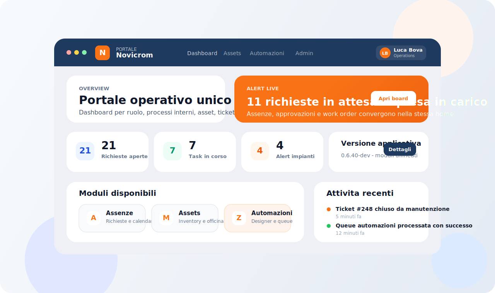
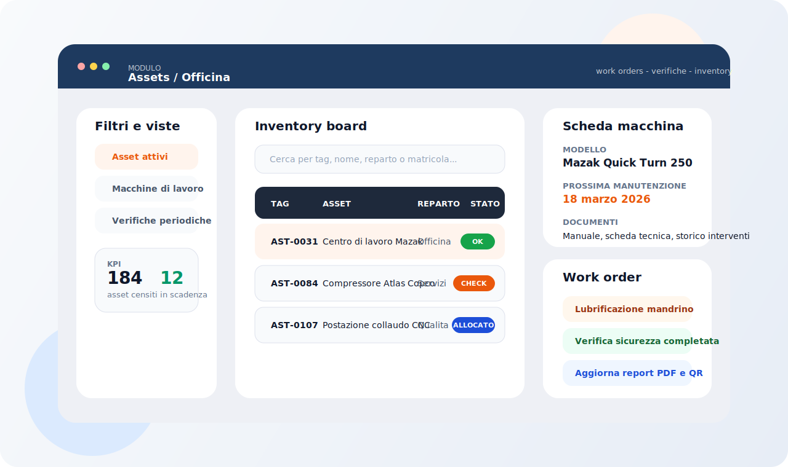
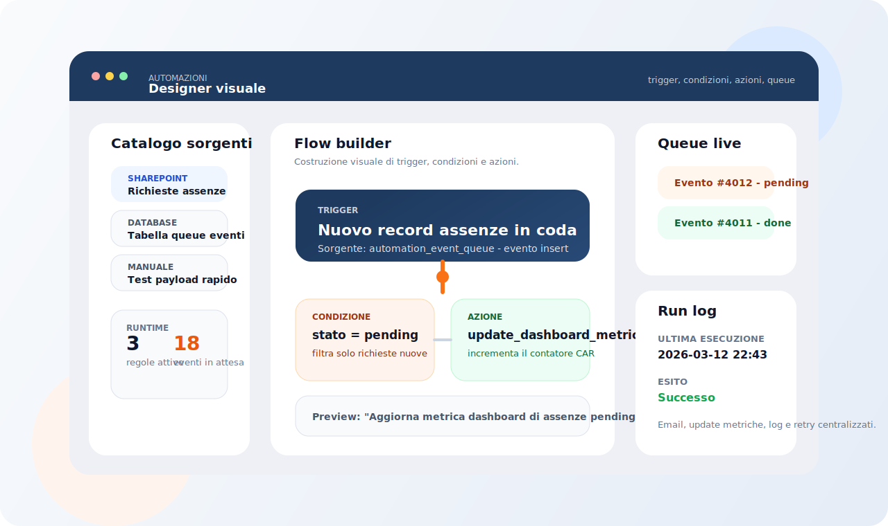

<h1 align="center">BoluHUB</h1>


Repository pubblico del software **BrizioHUB**. Il nome istanza è configurabile per deployment
(es. "Portale Novicrom") tramite il wizard di configurazione al primo avvio.



## Panoramica

Il codice applicativo vive in `django_app/` ed espone un portale aziendale costruito su Django 5.2,
con moduli separati per operativita quotidiana, amministrazione, anagrafiche, asset, workflow e automazioni.

L'entrypoint corretto per lo sviluppo locale e `django_app/manage.py`.

## Cosa include

| Area | Descrizione |
| --- | --- |
| Dashboard e UX | home modulare, viste per ruolo, scorciatoie operative, navigazione dinamica |
| Workflow | assenze, anomalie, tickets, timbri, notizie e richieste interne |
| Operations | inventory asset, work order, macchine di lavoro, planimetrie e verifiche periodiche |
| Governance | gestione utenti, ACL legacy, pulsanti UI, audit, diagnostica LDAP e configurazione accessi |
| Automazioni | designer visuale, sorgenti, queue processor, test regole e import package |
| Compatibilita legacy | route storiche, tabelle unmanaged e fallback di navigazione/permessi |

## Preview

Anteprime visuali GitHub-friendly dei flussi principali del portale.

| Assets / Officina | Automazioni |
| --- | --- |
|  |  |

## Stack tecnico

| Area | Tecnologia |
| --- | --- |
| Runtime | Python 3.12+ |
| Framework | Django 5.2.11 |
| Database dev | SQLite |
| Database full environment | SQL Server via `mssql-django` e `pyodbc` |
| Auth | Django auth, ACL legacy, LDAP opzionale |
| Integrazioni opzionali | Microsoft Graph / SharePoint, SMTP, Active Directory |

Dipendenze principali: `django_app/requirements.txt`

## Moduli principali

| Gruppo | Moduli |
| --- | --- |
| Core platform | `core`, `dashboard` |
| HR e workflow | `assenze`, `anomalie`, `tickets`, `timbri`, `notizie` |
| Operations | `assets`, `tasks`, `planimetria` |
| Backoffice | `admin_portale`, `anagrafica` |
| Automation | `automazioni` |

## Quick start

### 1. Crea l'ambiente

```powershell
python -m venv .venv
.venv\Scripts\Activate.ps1
pip install -r django_app\requirements.txt
```

### 2. Prepara la configurazione

```powershell
Copy-Item django_app\.env.example django_app\.env
```

Configurazione minima consigliata per sviluppo locale:

```env
DJANGO_SECRET_KEY=CHANGE_ME
DJANGO_DEBUG=1
DJANGO_ALLOWED_HOSTS=127.0.0.1,localhost
DB_ENGINE=sqlite
```

`django_app/.env` e il file principale di runtime.
`config.ini.example` resta utile solo per integrazioni legacy o configurazioni opzionali.

### 3. Avvia il progetto

```powershell
python django_app\manage.py migrate
python django_app\manage.py runserver
```

Endpoint tipici in locale:

- `http://127.0.0.1:8000/`
- `http://127.0.0.1:8000/assets/`
- `http://127.0.0.1:8000/admin-portale/`
- `http://127.0.0.1:8000/tickets/`

## Configurazione ambienti

- `config.settings.dev` usa SQLite di default ed e il profilo caricato da `django_app/manage.py`.
- `config.settings.prod` usa SQL Server di default, `ALLOWED_HOSTS` vuoto e impostazioni HTTP/HTTPS piu restrittive.
- Per SQL Server serve `ODBC Driver 18 for SQL Server`.
- LDAP, Graph e SMTP sono attivabili da variabili ambiente o da `config.ini` dove previsto.

Check rapido del profilo produzione:

```powershell
$env:DJANGO_SETTINGS_MODULE="config.settings.prod"
python django_app\manage.py check
```

## Comandi utili

```powershell
python django_app\manage.py test
python django_app\manage.py process_automation_queue
python django_app\manage.py show_urls
```

## Struttura repository

```text
repo-root/
|-- django_app/
|   |-- manage.py
|   |-- config/
|   |-- core/
|   |-- assets/
|   |-- automazioni/
|   `-- ...
|-- doc/
|-- sql/
|-- .github/assets/
|-- .env.example
`-- config.ini.example
```

## Documentazione collegata

- [Indice documentazione tecnica](doc/README.md)
- [Struttura attuale del portale](doc/STRUTTURA_ATTUALE_PORTALE.md)
- [Guida moduli applicativi](doc/GUIDA_MODULI_PROGRAMMA.html)
- [Guida automazioni designer](doc/GUIDA_AUTOMAZIONI_DESIGNER.html)
- [Note del modulo assets](django_app/assets/README.md)

## Nota sul repository pubblico

Questo repository e stato ripulito per una pubblicazione sicura:

- credenziali reali e configurazioni sensibili non sono incluse
- i file `.example` rappresentano solo template o placeholder
- la documentazione mantenuta nel repository e limitata a cio che serve per orientarsi nel codice
