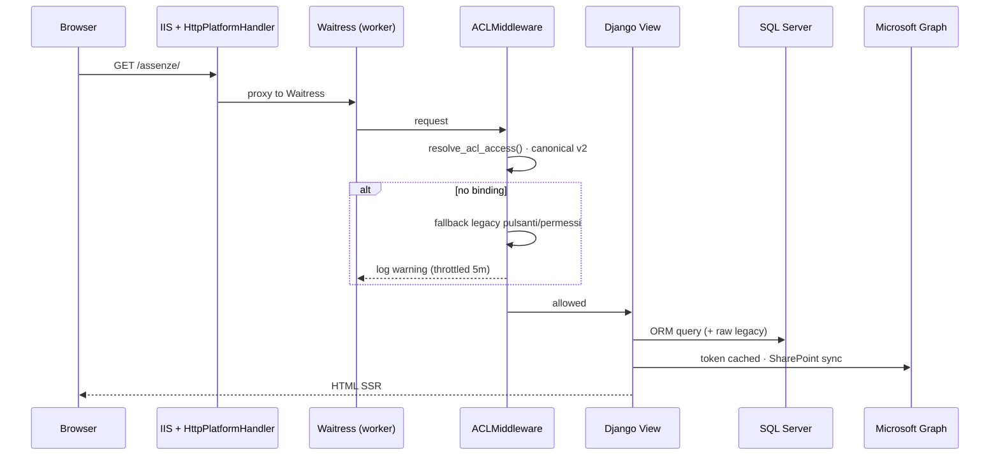
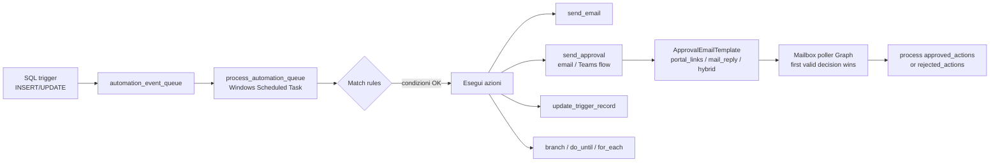
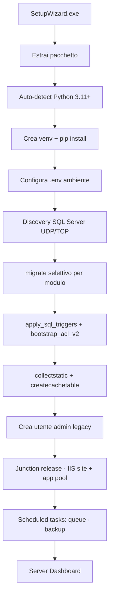

<div align="center">


# NOVICROM HUB

**Il portale interno unificato di Costruzioni Novicrom SRL**
*Workflow · Operations · Sicurezza · Automazioni · Governance*


[Start here](doc/START_HERE.md) · [Architettura](doc/ARCHITETTURA_TARGET_E_DISMISSIONE_LEGACY.md) · [Testing](doc/TESTING.md) · [Deploy IIS](deployment/README_DEPLOY_IIS_WINDOWS.md) · [ACL v2](doc/ACL_V2_PERMISSION_GUIDE.md)

</div>

---

## 📖 Indice

1. [Cos'è NOVICROM HUB](#-cosè-novicrom-hub)
2. [Anteprima UI](#-anteprima-ui)
3. [Architettura](#-architettura)
4. [Catalogo moduli](#-catalogo-moduli)
5. [Governance & sicurezza (ACL v2)](#-governance--sicurezza-acl-v2)
6. [Automazioni](#-automazioni)
7. [Integrazioni Microsoft 365](#-integrazioni-microsoft-365)
8. [Stack tecnico](#-stack-tecnico)
9. [Quick start](#-quick-start)
10. [Deployment](#-deployment-su-windows-server--iis)
11. [Comandi utili](#-comandi-utili)
12. [Documentazione](#-documentazione-collegata)

---

## 🎯 Cos'è NOVICROM HUB

NOVICROM HUB è il **portale intranet aziendale** di Costruzioni Novicrom SRL: una
piattaforma Django 5.2 che consolida in un unico ambiente **workflow HR**,
**gestione asset**, **compliance sicurezza**, **automazioni aziendali** e
**governance ACL granulare**.

> 💡 I nomi storici (`Portale Novicrom`) restano nel repo solo come esempio di
> istanza o percorso di deploy. La baseline documentale corrente è **NOVICROM HUB**.

### Numeri chiave

| | |
|---|---|
| 🧩 **25+ moduli Django** | raggruppati per area funzionale |
| 🔐 **ACL canonico v2** + fallback legacy | migrazione incrementale route-per-route |
| 🤖 **Designer automazioni visuale** | trigger SQL · approvazioni · queue processor |
| 📊 **Dashboard KPI personalizzabile** | widget drag&drop per utente |
| 🔌 **Integrazioni native** | Microsoft Graph · SharePoint · Outlook · LDAP/AD |
| ⚙️ **Setup wizard 14 step** | PyInstaller exe · discovery SQL · IIS config |

---

## 🖼️ Anteprima UI

<div align="center">


</div>

| Assets / Officina | Automazioni |
|:---:|:---:|
|  |  |

> Le anteprime sono SVG GitHub-friendly renderizzate direttamente nel browser.
> Per screenshot reali del portale in produzione vedi `/admin-portale/hub/guide/`
> una volta installato.

---

## 🏗️ Architettura


### Principi chiave

- **SSR puro** con Django templates — nessun framework JavaScript lato client
- **Layer ACL doppio**: canonico v2 (policy-as-data) + fallback legacy per migrazione incrementale
- **Storage dual-mode**: SQLite in dev, SQL Server in test/prod con driver ODBC 18/17/13 auto-rilevato
- **Deploy Windows-first**: Waitress + HttpPlatformHandler + IIS, installer PyInstaller
- **Cache condivisa multi-worker**: `DatabaseCache` su SQL Server (token Graph, ACL, sessioni)
- **Audit trail fire-and-forget** su ogni operazione CRUD rilevante

### Flusso request tipico


```mermaid
sequenceDiagram
    participant U as Browser
    participant IIS as IIS + HttpPlatformHandler
    participant W as Waitress (worker)
    participant M as ACLMiddleware
    participant V as Django View
    participant DB as SQL Server
    participant G as Microsoft Graph

    U->>IIS: GET /assenze/
    IIS->>W: proxy to Waitress
    W->>M: request
    M->>M: resolve_acl_access() · canonical v2
    alt no binding
        M->>M: fallback legacy pulsanti/permessi
        M-->>W: log warning (throttled 5m)
    end
    M->>V: allowed
    V->>DB: ORM query (+ raw legacy)
    V->>G: token cached · SharePoint sync
    V-->>U: HTML SSR
```

---

## 🧩 Catalogo moduli


### Dettaglio per area funzionale

<details>
<summary><b>🧭 Core Platform</b> — fondamenta comuni a tutti i moduli</summary>

| Modulo | Responsabilità |
|---|---|
| `core` | ACL middleware, navigation registry, legacy models, auth backends, context processors, audit trail |
| `dashboard` | Home KPI modulare per utente, widget drag&drop, layout personale, template admin |
| `admin_portale` | Pannello admin custom (non Django admin nativo) con tutti i tool di governance |
| `hub_tools` | Module Manager, DB Manager, Schema infografica, Homepage builder, Setup wizard hub, Guide |
| `setup_wizard` | Wizard guidato 14 step per primo setup e release (SQL discovery, IIS config, ACL bootstrap) |

</details>

<details>
<summary><b>🗓️ HR & Workflow</b> — vita quotidiana dipendenti</summary>

| Modulo | Funzionalità |
|---|---|
| `assenze` | Richieste, gestione, calendario, certificazione presenza, sync SharePoint. Il capo reparto è risolto via `capi_reparto.id` per coerenza FK |
| `anomalie` | Segnalazione e gestione anomalie produzione con launcher `/anomalie-menu` |
| `tickets` | Ticket interni con interventi tecnici, fermo macchina, ticket ricorrenti, categorie configurabili |
| `timbri` | Report timbrature da DB legacy, registro + immagini badge, import issues tracking |
| `notizie` | Bacheca con audience per ruolo, allegati, tracking letture per KPI engagement |

</details>

<details>
<summary><b>🏭 Operations</b> — asset, progetti, anagrafica</summary>

| Modulo | Funzionalità |
|---|---|
| `assets` | Inventario (macchinari, IT, licenze SW), work order, manutenzioni periodiche, planimetrie con marker, sync scadenze su Outlook Calendar via Graph, dashboard KPI personalizzabile con 12 widget |
| `tasks` | Branding "**KICK-OFF**". Portfolio progetti, attività, subtask, commenti, allegati. Upload MOD.073 **VRF** (Excel) con parsing celle fisse, blocco progressivo dopo N giorni, riuso kickoff su identità `P/N + revisione + versione` |
| `anagrafica` | Dipendenti (AD sync), fornitori, documenti ordini/valutazioni, ruoli operativi, stats dashboard |
| `planimetria` | Wrapper leggero di assets per discoverability layout impianti |

</details>

<details>
<summary><b>🦺 Sicurezza & Compliance</b> — tracciabilità obblighi normativi</summary>

| Modulo | Funzionalità |
|---|---|
| `dpi` | Gestione Dispositivi Protezione Individuale: richieste con card-picker immagini, approvazione, consegna, storico, KPI. Numerazione `DPI-YYYY-NNNN` |
| `diario_preposto` | Diario del preposto sicurezza con segnalazioni + allegati + follow-up |
| `rilevazione_incidenti` | Unsafe conditions e incidenti, CRUD via Graph con SharePoint come fonte di verità, cache locale |
| `procedure_refresh` | Presa visione procedure MT/MTSI: campagne, assegnazioni, tracking aperture/conferme, reminder automatici, export CSV |
| `rentri` | Tracciabilità rifiuti secondo normativa RENTRI |

</details>

<details>
<summary><b>🤖 Automazioni & Governance</b> — il cuore programmabile del portale</summary>

| Modulo | Funzionalità |
|---|---|
| `automazioni` | **Designer visuale** regole trigger/condizioni/azioni · trigger SQL Server auto-generati · queue processor · approvazioni email + Teams webhook + Teams chat Flow · import/convert Power Automate · test inline con record reali |
| ACL v2 | Permission code (`modulo.risorsa.azione`), route binding, role grant, user override, resolver unificato, strict mode opzionale, route coverage report |
| Navigation Registry | Voci menu configurabili per sezione (`topbar`, `subnav`, `admin_subnav`, `sidebar`, `page`), deny-by-default per ruolo, override per utente, editor drag&drop orizzontale |

</details>

---

## 🔐 Governance & sicurezza (ACL v2)


### I 4 pilastri dell'ACL canonico

| Tabella | Scopo |
|---|---|
| `PermissionDefinition` | Catalogo permessi leggibili (`code`, `label`, `module`) |
| `RoutePermissionBinding` | Mappa `route_name` o `path_pattern` → `permission_code` |
| `RolePermissionGrant` | Grant per ruolo legacy → `permission_code` |
| `UserPermissionGrant` | Override positivo/negativo per singolo utente |

### Migrazione incrementale legacy → canonico

Il resolver decide route-per-route: se esiste un `RoutePermissionBinding` usa il
layer canonico, altrimenti scivola sul **fallback legacy** (`pulsanti` +
`permessi`). Questo consente di migrare modulo-per-modulo senza big-bang.

```bash
# Audit delle route ancora in fallback
python django_app/manage.py acl_fallback_report --only-unbound --app assenze

# Bootstrap canonico di un'app (dry-run poi apply)
python django_app/manage.py bootstrap_acl_v2 --apps assenze --dry-run
python django_app/manage.py bootstrap_acl_v2 --apps assenze --import-legacy --apply

# Seed UAT completo (6 utenti, 3 ruoli, binding + grant + override)
python django_app/manage.py seed_acl_uat --reset
```

### Setting di governance

| Variabile `.env` | Effetto |
|---|---|
| `ACL_LOG_LEGACY_FALLBACK=1` | Warning throttled (5m/route) quando il resolver usa il fallback — utile per audit |
| `ACL_STRICT_CANONICAL=1` | Nega le route senza binding canonico anche se il legacy le consentirebbe — da attivare prima in test/UAT |

### Strumenti admin

- `/admin-portale/accessi/` — toggle unificato per modulo (legacy + v2 + nav)
- `/admin-portale/acl-canonico/` — gestione permission code, binding, grant, override, nav override
- `/admin-portale/acl-route-coverage/` — stato di ogni route (`CANONICAL_BOUND` / `LEGACY_FALLBACK` / `UNBOUND` / `REDIRECT_ONLY`) + export CSV
- `/admin-portale/acl-diagnostica/` — diagnostica combinata con trace di ogni decisione
- `/admin-portale/mappa-permessi-navigazione/` — workflow visuale cliccabile route/menu/ruoli

---

## 🤖 Automazioni

Il modulo `automazioni` offre un **designer visuale** completo per creare
workflow event-driven senza scrivere codice:


```mermaid
graph LR
    A[SQL trigger<br/>INSERT/UPDATE] --> B[automation_event_queue]
    B --> C[process_automation_queue<br/>Windows Scheduled Task]
    C --> D{Match rules}
    D -->|condizioni OK| E[Esegui azioni]
    E --> F[send_email]
    E --> G[send_approval<br/>email / Teams flow]
    E --> H[update_trigger_record]
    E --> I[branch / do_until / for_each]
    G --> J[ApprovalEmailTemplate<br/>portal_links / mail_reply / hybrid]
    J --> K[Mailbox poller Graph<br/>first valid decision wins]
    K --> L[process approved_actions<br/>or rejected_actions]
```

### Capabilities

- 🎨 **Designer SSR visuale**: trigger, condizioni, azioni con editor inline
- 🔀 **Controllo flusso**: `branch`, `do_until`, `for_each`, `run_if` con pannelli guidati
- ✉️ **Approvazioni umane**: recapito via email · webhook Teams legacy · Teams chat Flow (Power Automate) · Entra Application Proxy
- 🔄 **Import Power Automate**: converter integrato `.zip`/`.json` con remediation e handoff a draft
- 🧪 **Test inline**: esegui regola con record reale o dati campione, visualizzando output per azione
- 📊 **Diagramma Power Automate-style**: visualizzazione verticale con rami approval/branch/loop
- 📮 **Mailbox poller via Graph**: autenticazione moderna compatibile Microsoft 365 con bloccato Basic Auth
- 📋 **Template email approvazioni** riutilizzabili con `portal_links`, `mail_reply`, `hybrid`
- 💚 **Queue health card**: stato task Windows, alert missing/stuck, timezone-aware

### Endpoint rapidi

- `/automazioni/regole/` — regole e designer
- `/automazioni/regole/converti-power-automate/` — converter Power Automate
- `/automazioni/canali-teams/` — webhook + flow endpoints
- `/automazioni/template-approvazioni/` — template email
- `/admin-portale/automazioni/impostazioni/` — mailbox tecnica, polling, quick links
- `/admin-portale/automazioni/queue/` — queue admin con azioni `Stoppa`/`Elimina`

---

## 🔌 Integrazioni Microsoft 365

| Integrazione | Uso | File chiave |
|---|---|---|
| **Microsoft Graph** | SharePoint sync (assenze, incidenti), Outlook Calendar (scadenze assets), Teams chat flow (approvazioni), mailbox polling | `core/graph_utils.py` (cache cross-process) |
| **LDAP / Active Directory** | Auth utenti con `LDAPBackend`, sync anagrafica, SSO SPNEGO opzionale | `core/accounts/backends.py`, `core/accounts/windows_sso.py` |
| **Entra Application Proxy** | Pubblicazione selettiva di `/approval-actions/*` per approvazioni one-click fuori rete | `automazioni/approval_proxy_urls.py` |
| **SMTP** | Notifiche utente, approvazioni email, reminder procedure | `EMAIL_*` in `.env` |

### Sicurezza credenziali

Le credenziali sensibili (Graph secret, SMTP password, LDAP bind) vivono **solo**
in `django_app/.env`, mai committato. Un pre-commit hook in `tools/git-hooks/`
blocca commit accidentali di `.env*`, chiavi private e pattern secret.

```powershell
# Installa il pre-commit hook (una-tantum per sviluppatore)
powershell tools\install-git-hooks.ps1
```

---

## 🛠️ Stack tecnico

| Area | Tecnologia |
|---|---|
| Runtime | **Python 3.11+** |
| Framework | **Django 5.2.11** |
| WSGI produzione | **Waitress** via `HttpPlatformHandler` (IIS) |
| Database dev | **SQLite** |
| Database prod | **SQL Server** via `mssql-django` + `pyodbc 5.2` (driver 18/17/13) |
| Auth cascata | `AxesStandaloneBackend` → `SQLServerLegacyBackend` → `LDAPBackend` → `ModelBackend` |
| Frontend | **SSR** con Django templates, CSS custom, nessun framework JS |
| Cache | `DatabaseCache` su SQL Server (prod), `LocMemCache` (dev) |
| Background | Windows Scheduled Tasks (queue processor, mailbox poll, backup) |
| Osservabilità | `SafeTimedRotatingFileHandler` multi-process, SQL logging, audit DB |
| Hardening | `django-axes` rate-limit login, `axes` lockout template, upload MIME validation, CSRF, allowlist SQL |

Dipendenze: [`django_app/requirements.txt`](django_app/requirements.txt)

---

## 🚀 Quick start

### 1. Clona e prepara l'ambiente

```powershell
git clone <repo-url> novicrom-hub
cd novicrom-hub
python -m venv .venv
.\.venv\Scripts\Activate.ps1
pip install -r django_app\requirements.txt

# Installa pre-commit hook anti-leak (raccomandato)
powershell tools\install-git-hooks.ps1
```

### 2. Configura `.env`

```powershell
Copy-Item django_app\.env.example django_app\.env
```

Configurazione minima per sviluppo locale:

```env
DJANGO_SECRET_KEY=CHANGE_ME_use_secrets.token_urlsafe
DJANGO_DEBUG=1
DJANGO_ALLOWED_HOSTS=127.0.0.1,localhost
DB_ENGINE=sqlite
ACL_LOG_LEGACY_FALLBACK=1
```

### 3. Migra e avvia

```powershell
python django_app\manage.py migrate --settings=config.settings.dev
python django_app\manage.py createsuperuser --settings=config.settings.dev
python django_app\manage.py runserver --settings=config.settings.dev
```

In alternativa: `django_app\avvia_server.bat` (libera la porta 8000 e avvia).

### 4. URL principali in locale

| URL | Descrizione |
|---|---|
| http://127.0.0.1:8000/ | Dashboard personale |
| http://127.0.0.1:8000/assenze/ | Modulo assenze unificato |
| http://127.0.0.1:8000/assets/ | Inventario e manutenzioni |
| http://127.0.0.1:8000/tickets/ | Ticket interni |
| http://127.0.0.1:8000/dpi/ | Dispositivi protezione individuale |
| http://127.0.0.1:8000/automazioni/regole/ | Designer automazioni |
| http://127.0.0.1:8000/admin-portale/ | Pannello admin custom |
| http://127.0.0.1:8000/admin-portale/hub/ | Hub strumenti (moduli, DB, schema, guide) |
| http://127.0.0.1:8000/admin-portale/acl-canonico/ | Gestione ACL v2 |

---

## 📦 Deployment su Windows Server + IIS

Il metodo **raccomandato** è [`SetupWizard.exe`](deployment/dist/SetupWizard.exe),
un installer PyInstaller che automatizza:


```mermaid
graph TD
    A[SetupWizard.exe] --> B[Estrai pacchetto]
    B --> C[Auto-detect Python 3.11+]
    C --> D[Crea venv + pip install]
    D --> E[Configura .env ambiente]
    E --> F[Discovery SQL Server UDP/TCP]
    F --> G[migrate selettivo per modulo]
    G --> H[apply_sql_triggers + bootstrap_acl_v2]
    H --> I[collectstatic + createcachetable]
    I --> J[Crea utente admin legacy]
    J --> K[Junction release · IIS site + app pool]
    K --> L[Scheduled tasks: queue · backup]
    L --> M[Server Dashboard]
```

**Governance fail-fast**: se venv, pip, migrate o collectstatic falliscono,
`FinishPage` mostra banner rosso "Installazione Incompleta" e la release
**non viene attivata** — IIS non punta a un ambiente rotto.

### Prerequisiti server

- **IIS** con modulo `HttpPlatformHandler`
- **SQL Server** (Express/Standard/Enterprise)
- **ODBC driver** SQL Server 18/17/13
- **Python 3.11+** (rilevato automaticamente)
- **Privilegi Administrator** (per configurare IIS)

### Deploy manuale (senza wizard)

```powershell
# Dalla release directory
python manage.py migrate --settings=config.settings.prod
python manage.py apply_sql_triggers --settings=config.settings.prod
python manage.py collectstatic --noinput --settings=config.settings.prod
python manage.py createcachetable --settings=config.settings.prod
```

Guida completa: [`deployment/README_DEPLOY_IIS_WINDOWS.md`](deployment/README_DEPLOY_IIS_WINDOWS.md)

---

## ⚡ Comandi utili

```powershell
# Test (usa config.settings.test automaticamente)
python django_app\manage.py test

# Queue processor (one-shot, tipicamente via Task Scheduler)
python django_app\manage.py process_automation_queue

# Mailbox poller approvazioni (Graph)
python django_app\manage.py process_approval_mailbox

# ACL v2 governance
python django_app\manage.py bootstrap_acl_v2 --dry-run
python django_app\manage.py acl_fallback_report --only-unbound
python django_app\manage.py seed_acl_uat --reset

# Backup
python django_app\manage.py backup_portale --include-media --retention 10

# Allineamento tipo_assenza legacy → canonico (idempotente)
python django_app\manage.py allinea_tipo_assenza_flessibilita

# Audit URL esposti
python django_app\manage.py show_urls
```

---

## 📚 Documentazione collegata

La raccolta interna in [`/admin-portale/hub/guide/`](django_app/hub_tools/) indicizza
automaticamente tutti i documenti supportati. Per consultazione da repo:

- 📘 [Start here per persona](doc/START_HERE.md) — sviluppatore, admin, deployer, tester
- 🏛️ [Architettura target e dismissione legacy](doc/ARCHITETTURA_TARGET_E_DISMISSIONE_LEGACY.md)
- 🧪 [Testing, smoke e UAT](doc/TESTING.md)
- 🔐 [Guida ACL v2 (permission-code based)](doc/ACL_V2_PERMISSION_GUIDE.md)
- 📋 [Convenzione permission code](doc/ACL_V2_PERMISSION_CODE_CONVENTION.md)
- ✅ [Checklist UAT ACL v2](doc/ACL_V2_UAT_CHECKLIST.md)
- 🛠️ [Manuale admin navigazione e permessi](tools/MANUALE_ADMIN_NAVIGAZIONE_PERMESSI.md)
- 🚀 [Guida deployment IIS (manuale + troubleshooting)](deployment/README_DEPLOY_IIS_WINDOWS.md)
- 🎨 [Guida designer automazioni (HTML)](doc/GUIDA_AUTOMAZIONI_DESIGNER.html)
- 👥 [Guida gestione permessi (HTML/PDF)](doc/GUIDA_GESTIONE_PERMESSI.html)
- 🤝 [Guida Teams approvazioni (HTML)](doc/GUIDA_TEAMS_APPROVAZIONI.html)
- 🏭 [Note modulo assets](django_app/assets/README.md)

---

<div align="center">

**NOVICROM HUB** · Costruzioni Novicrom SRL · `v1.0.0`

*Repository ripulito per pubblicazione sicura: nessuna credenziale reale è inclusa.
I file `.example` sono template. Il pre-commit hook in `tools/git-hooks/` blocca
commit accidentali di `.env` e secret.*

</div>
