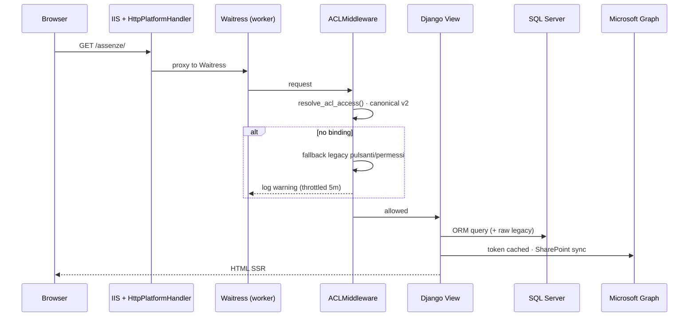
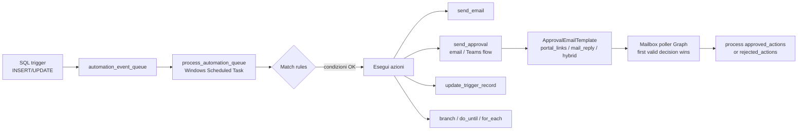
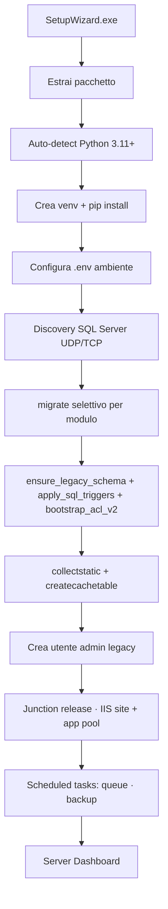

<div align="center">


# NOVICROM HUB

**Il portale interno unificato di Costruzioni Novicrom SRL**
*Workflow · Operations · Sicurezza · Automazioni · Governance*


[Start here](doc/START_HERE.md) · [Manuale tecnico GitHub](doc/README.md) · [Architettura](doc/ARCHITETTURA_TARGET_E_DISMISSIONE_LEGACY.md) · [Testing](doc/TESTING.md) · [Deploy IIS](deployment/README_DEPLOY_IIS_WINDOWS.md) · [ACL v2](doc/ACL_V2_PERMISSION_GUIDE.md)

</div>

---

## 📖 Indice

1. [Cos'è NOVICROM HUB](#-cosè-novicrom-hub)
2. [Anteprima UI](#-anteprima-ui)
3. [Architettura](#-architettura)
4. [Catalogo moduli](#-catalogo-moduli)
5. [Governance & sicurezza (ACL v2)](#-governance--sicurezza-acl-v2)
6. [Automazioni](#-automazioni)
7. [Integrazioni Microsoft 365](#-integrazioni-microsoft-365)
8. [Stack tecnico](#-stack-tecnico)
9. [Quick start](#-quick-start)
10. [Deployment](#-deployment-su-windows-server--iis)
11. [Comandi utili](#-comandi-utili)
12. [Documentazione](#-documentazione-collegata)

---

## 🎯 Cos'è NOVICROM HUB

NOVICROM HUB è il **portale intranet aziendale** di Costruzioni Novicrom SRL: una
piattaforma Django 5.2 che consolida in un unico ambiente **workflow HR**,
**gestione asset**, **compliance sicurezza**, **automazioni aziendali** e
**governance ACL granulare**.

> 💡 I nomi storici (`Portale Novicrom`) restano nel repo solo come esempio di
> istanza o percorso di deploy. La baseline documentale corrente è **NOVICROM HUB**.

### Numeri chiave

| | |
|---|---|
| 🧩 **22 app Django custom** | raggruppate per area funzionale |
| 🔐 **ACL canonico v2** + fallback legacy | migrazione incrementale route-per-route |
| 🤖 **Designer automazioni visuale** | trigger SQL · approvazioni · queue processor |
| 📊 **Dashboard KPI personalizzabile** | widget drag&drop per utente |
| 🔌 **Integrazioni native** | Microsoft Graph · SharePoint · Outlook · LDAP/AD |
| ⚙️ **Setup wizard 14 step** | PyInstaller exe · discovery SQL · IIS config |

---

## 🖼️ Anteprima UI

<div align="center">


</div>

| Assets / Officina | Automazioni |
|:---:|:---:|
|  |  |

> Le anteprime sono SVG GitHub-friendly renderizzate direttamente nel browser.
> Per screenshot reali del portale in produzione vedi `/admin-portale/hub/guide/`
> una volta installato.

---

## 🏗️ Architettura


### Principi chiave

- **SSR puro** con Django templates — nessun framework JavaScript lato client
- **Layer ACL doppio**: canonico v2 (policy-as-data) + fallback legacy per migrazione incrementale
- **Storage dual-mode**: SQLite in dev, SQL Server in test/prod con driver ODBC 18/17/13 auto-rilevato
- **Deploy Windows-first**: Waitress + HttpPlatformHandler + IIS, installer PyInstaller
- **Cache condivisa multi-worker**: `DatabaseCache` su SQL Server (token Graph, ACL, sessioni)
- **Audit trail fire-and-forget** su ogni operazione CRUD rilevante

### Flusso request tipico


```mermaid
sequenceDiagram
    participant U as Browser
    participant IIS as IIS + HttpPlatformHandler
    participant W as Waitress (worker)
    participant M as ACLMiddleware
    participant V as Django View
    participant DB as SQL Server
    participant G as Microsoft Graph

    U->>IIS: GET /assenze/
    IIS->>W: proxy to Waitress
    W->>M: request
    M->>M: resolve_acl_access() · canonical v2
    alt no binding
        M->>M: fallback legacy pulsanti/permessi
        M-->>W: log warning (throttled 5m)
    end
    M->>V: allowed
    V->>DB: ORM query (+ raw legacy)
    V->>G: token cached · SharePoint sync
    V-->>U: HTML SSR
```

---

## 🧩 Catalogo moduli


### Tutti i 22 moduli custom a colpo d'occhio

| # | App Django | Area | URL prefisso | Sintesi |
|---|---|---|---|---|
| 1 | [`core`](django_app/core/) | Core | — | Middleware ACL, navigation registry, auth backends, audit, legacy models |
| 2 | [`dashboard`](django_app/dashboard/) | Core | `/` | Home KPI personalizzabile per utente, widget, layout salvato |
| 3 | [`admin_portale`](django_app/admin_portale/) | Core | `/admin-portale/` | Pannello admin custom: ACL canonico, diagnostica, mappa permessi, branding |
| 4 | [`hub_tools`](django_app/hub_tools/) | Core | `/admin-portale/hub/` | Module Manager, DB Manager, Schema infografica, Homepage builder, Guide |
| 5 | [`setup_wizard`](django_app/setup_wizard/) | Core | `/setup/` | Wizard primo setup (anche via `SetupWizard.exe`) |
| 6 | [`monitoring`](django_app/monitoring/) | Core | `/monitoring/` | Monitoring interno, issue tracking, alert email, segnalazioni utente, monitor automazioni |
| 7 | [`anagrafica`](django_app/anagrafica/) | Operations | `/anagrafica/` | Dipendenti + fornitori + documenti ordini/valutazioni, stats dashboard |
| 8 | [`assets`](django_app/assets/) | Operations | `/assets/` | Inventario IT e produzione (card grid), work order, manutenzioni periodiche, calendario asset, planimetrie, licenze SW, export Excel, Outlook sync |
| 9 | [`attrezzature`](django_app/attrezzature/) | Operations | `/attrezzature/` | Gestione Attrezzatura: workflow attrezzi/P-N, import Excel legacy, azioni avanzamento/pronta produzione, link strutturato KICK-OFF |
| 10 | [`tasks`](django_app/tasks/) | Operations | `/tasks/` | Portfolio **KICK-OFF** progetti, attività, incontri avanzamento, VRF (MOD.073), blocco progressivo |
| 11 | [`planimetria`](django_app/planimetria/) | Operations | `/planimetria/` | Wrapper compat di assets per discoverability layout |
| 12 | [`assenze`](django_app/assenze/) | HR & Workflow | `/assenze/` | Richieste, gestione, calendario, certificazione presenza, sync SharePoint |
| 13 | [`anomalie`](django_app/anomalie/) | HR & Workflow | `/anomalie/` `/anomalie-menu` | Segnalazione e gestione anomalie produzione |
| 14 | [`tickets`](django_app/tickets/) | HR & Workflow | `/tickets/` | Ticket interni con interventi, fermo macchina, ticket ricorrenti |
| 15 | [`timbri`](django_app/timbri/) | HR & Workflow | `/timbri/` | Report timbrature da DB legacy, registro, immagini badge |
| 16 | [`notizie`](django_app/notizie/) | HR & Workflow | `/notizie/` | Bacheca con audience, allegati, letture tracked |
| 17 | [`dpi`](django_app/dpi/) | Sicurezza | `/dpi/` | Dispositivi Protezione Individuale: richieste, approvazione, consegna, KPI |
| 18 | [`diario_preposto`](django_app/diario_preposto/) | Sicurezza | `/diario-preposto/` | Diario preposto sicurezza con segnalazioni e follow-up |
| 19 | [`rilevazione_incidenti`](django_app/rilevazione_incidenti/) | Sicurezza | `/rilevazione-incidenti/` | Unsafe conditions e incidenti (SharePoint source of truth) |
| 20 | [`procedure_refresh`](django_app/procedure_refresh/) | Sicurezza | `/procedure-refresh/` | Presa visione procedure MT/MTSI, campagne, tracking, export CSV |
| 21 | [`rentri`](django_app/rentri/) | Sicurezza | `/rentri/` | Tracciabilità rifiuti (normativa RENTRI) |
| 22 | [`automazioni`](django_app/automazioni/) | Automation | `/automazioni/` | Designer visuale, trigger SQL, queue processor, approvazioni email/Teams, import Power Automate |

> Tutte le app sono disabilitabili dal **Module Manager** in `/admin-portale/hub/moduli/` e selezionabili in fase di setup dal wizard (step 11/14).
> Il tier di selezione è: **system** (obbligatori: core, anagrafica, dashboard, hub_tools), **standard** (pre-selezionati), **optional** (disattivati di default, per futuro licensing).

### Dettaglio per area funzionale

#### 🧭 Core Platform

<details open>
<summary><b>1. <code>core</code> — fondamenta del portale</b></summary>

L'app trasversale che fa funzionare tutto il resto. Contiene middleware, resolver ACL, legacy models, auth backends, audit trail e context processors.

- **ACL middleware** con resolver canonico v2 + fallback legacy, logging throttled delle decisioni
- **Navigation registry** (`NavigationItem`, `NavigationRoleAccess`, `UserNavigationOverride`) con visibilita derivata dai permission code canonici e fallback legacy solo per voci ancora non mappate
- **Fallback navigazione legacy** con deduplica visuale per modulo, cosi i restore/import non duplicano in sidebar le azioni `pulsanti` dello stesso modulo
- **4 auth backend in cascata**: `AxesStandaloneBackend` → `SQLServerLegacyBackend` → `LDAPBackend` → `ModelBackend`
- **Audit trail** fire-and-forget via `core.audit.log_action()` su tabella `AuditLog`
- **Legacy models managed** su SQL Server: `Ruolo`, `UtenteLegacy`, `AnagraficaDipendente`, `Pulsante`, `Permesso`
- **Impersonation** admin → utente con middleware dedicato e session key
- **23 modelli Django** (Profile, AuditLog, SiteConfig, Notifica, Checklist*, OptioneConfig, ecc.)
- **Ricerca globale** Ctrl+K su 6 sorgenti (dipendenti, asset, ticket, progetti, task, procedure)
</details>

<details open>
<summary><b>2. <code>dashboard</code> — home KPI personalizzabile</b></summary>

Workspace personale dell'utente autenticato. Widget multi-modulo con layout salvato per utente.

- **Widget KPI cross-modulo** (assenze in attesa, ticket aperti, scadenze asset, anomalie…)
- **Drag & drop** dei widget con persistenza `UserDashboardConfig`
- **Template iniziale globale** definibile dagli admin + ripristino rapido
- **Shell viewport-aware** a tutta altezza, no bande vuote in fondo al viewport
- Route legacy `/scheda-dipendente` mantenuto come alias compat
</details>

<details open>
<summary><b>3. <code>admin_portale</code> — pannello admin custom</b></summary>

Sostituisce il Django admin nativo con un pannello ritagliato sulle operazioni reali del portale.

- **Gestione accessi** semplici canonico-first con toggle per modulo su `RolePermissionGrant`
- **ACL canonico** con 5 tab (Permission, Binding, Role grant, User override, Nav override)
- **ACL route coverage** report con stati e export CSV
- **ACL diagnostica** combinata legacy + canonical con una sola decisione finale chiara e trace completo
- **Mappa permessi/navigazione** visuale con drill-down cliccabile e toggle live dei grant
- **Navigation Builder** con vista tabellare + **vista drag&drop orizzontale** per sezione
- **LDAP settings** + sync/import utenti AD con service account effettivo; nei deploy TEST/PROD salva sul `config/.env` persistente, non sul `.env` della release attiva
- **Branding portale** (favicon, logo, login banner, pagina login personalizzabile)
- **Module Manager** integrato per abilitazione moduli runtime
- **Automazioni admin**: impostazioni runtime, queue list, log mailbox, convertitore Power Automate
- **Crea Release** (`/admin-portale/crea-release/`) con package zip, riavvio IIS TEST/PROD automatico via task schedulato elevato `\PortaleNovicrom\IISRestart_TEST/PROD` e terminale web con preset Django/ACL sull'ambiente selezionato
</details>

<details open>
<summary><b>4. <code>hub_tools</code> — hub strumenti interni admin</b></summary>

Collezione di tool sotto `/admin-portale/hub/` protetti da `@legacy_admin_required`.

- **Module Manager** — abilita/disabilita moduli visibili, configura redirect post-login
- **Database Manager** — statistiche tabelle, backup, pulizia log/sessioni, ottimizzazione, ripristino. Engine rilevato automaticamente (SQLite dev / SQL Server prod)
- **DB Schema infografica** — mappa visuale di tutti i modelli Django con campi, tipi, relazioni FK/1:1/M:M
- **Homepage Builder** — editor visuale layout home per ruolo
- **Setup Wizard Hub** — rilancia il wizard di configurazione (14 step) sul `.env` corrente, normalizzando i booleani `True`/`False` e `1`/`0`
- **Guide** — catalogo auto-indicizzato di documenti (HTML/PDF/MD) da `tools/`, `doc/`, `deployment/`, con dedup per formato
- **Categorie moduli / branding portale** — raggruppa la navigazione e personalizza nome, loghi upload/URL, favicon e colori globali della shell
</details>

<details open>
<summary><b>5. <code>setup_wizard</code> — wizard primo setup</b></summary>

Wizard Django 12 step raggiungibile su `/setup/`, usato quando `SETUP_COMPLETED=0`. Esiste anche come **installer standalone `SetupWizard.exe`** (14 step) per deploy Windows Server.

- Configurazione `SiteConfig`, `.env`, credenziali admin
- Wizard exe: discovery SQL Server (UDP broadcast + TCP scan + SSRP)
- Selezione moduli **tier-based** (system/standard/optional)
- Migrate selettivo per modulo scelto, con copertura di tutte le app dotate di migration (`anomalie`, `monitoring`, `planimetria` incluse)
- Runtime Python 3.11+ rilevato e validato prima della creazione del virtualenv
- `collectstatic` isolato dai bootstrap ACL runtime, così non apre cache/DB prima di copiare gli asset
- Preflight SQL Server: il database configurato viene creato/verificato prima delle migration; con `DB_TRUST_CERT=True` anche `sqlcmd` usa `-C` e, se serve, fallback ODBC con `TrustServerCertificate=yes`
- Il wizard web interno preserva `DB_TRUST_CERT` quando si modifica solo LDAP/SMTP, evitando che ODBC Driver 18 perda `TrustServerCertificate=yes` su ambienti con certificato SQL non trusted
- Trigger automazioni SQL idempotenti: `apply_sql_triggers` crea la queue e salta i trigger la cui tabella sorgente legacy/opzionale non esiste nel DB corrente; gli script assenze sono self-guarded anche se lanciati direttamente
- Fail-fast: se venv/pip/migrate/collectstatic falliscono, release **non** attivata
- FinishPage mostra banner rosso "Installazione Incompleta" con countdown 60s
- Server Dashboard integrato con start/stop/restart IIS, reset password live e terminale TEST/PROD con preset Django/ACL
</details>

<details open>
<summary><b>6. <code>monitoring</code> — osservabilità interna</b></summary>

Superficie di monitoring del portale, issue tracking interno e segnalazioni utenti.

- **Issue tracking** interno per bug segnalati dagli utenti
- **Alert email** su eventi di sistema configurabili
- **Monitor automazioni** con health card della queue
- **Segnalazioni utente** dirette all'admin
- **Liveness/readiness probe** runtime (`/healthz`, `/readyz`) con check su DB, cache, Graph, LDAP, SMTP e queue automazioni; risultato memoizzato in cache, IP allowlist via `HEALTHZ_ALLOWED_IPS`. Riusabili da `validate_deployment --with-integration` per coerenza tra deploy validation e runtime
- CSS dedicato in `static/monitoring/css/monitoring.css` verificato in `collectstatic`
</details>

---

#### 🏭 Operations

<details open>
<summary><b>7. <code>anagrafica</code> — dipendenti e fornitori</b></summary>

Anagrafica master del portale, integrata con Active Directory e tabelle legacy.

- **9 modelli**: Fornitore, FornitoreDocumento, FornitoreOrdine, FornitoreValutazione, FornitoreAsset, RuoloOperativo, DipendenteRuoloOperativo, DipendenteStatLayout, AnagraficaStatPermission
- **Fallback email** automatico `email_notifica` → `email` quando il legacy non popola il primo campo
- **Sync LDAP/AD** con `sync_ldap_users`, paging configurabile e credenziali service account preservate dal pannello admin su `config/.env` persistente nei deploy
- **Stats dashboard dipendente** con layout salvato per utente
- **Generazione PDF** anagrafica tramite `tools/gen_anagrafica_pdf.py`
- **Ruoli operativi** aggiuntivi (non i ruoli ACL)
</details>

<details open>
<summary><b>8. <code>assets</code> — inventario e manutenzioni</b></summary>

Modulo più ricco del portale per gestione patrimonio aziendale: macchinari, IT, infrastruttura, software.

- **27+ modelli**: Asset, AssetCategory, AssetITDetails, WorkMachine, WorkOrder, WorkOrderAttachment/Log, PeriodicVerification, SoftwareLicense, AssetEndpoint, PlantLayout/Area/Marker, AssetDocument, AssetLabelTemplate…
- **Tipi asset**: PC, Portatile, Server, VM, Firewall, Stampante, Dispositivo, Fonia, CNC, Macchina di lavoro, Carroponte, Videosorveglianza, Altro
- **Inventario IT** su `/assets/dispositivi/` — card grid con filtri per tipo (Server, PC, Rete, TVCC, Fonia), stato, reparto
- **Inventario produzione** su `/assets/work-machines/` — card grid con foto, badge disponibilità (Libera/Occupata/Manutenzione), filtro per tipo (CNC/Carroponti/Macchine Utensili), export Excel
- **Inventario** canonico su `/assets/lista/` con ripristino automatico link filtrati legacy
- **Categorie asset** e **campi dinamici** configurabili dalla tab `Categorie asset` di `/assets/impostazioni/`
- **Work Order** (ordini di lavoro) con allegati, log cronologico, fornitori associati
- **Manutenzione periodica** come categoria della manutenzione (`/assets/manutenzione/verifiche/`), redirect legacy preservato. Per ogni piano (es. "Cambio olio") la pagina mostra lo **storico esecuzioni** filtrato per asset selezionato e finestra temporale (12/24 mesi/tutto), con pulsante inline **+ Registra esecuzione** che crea un OdL preventivo chiuso e aggiorna last/next date del piano. Lo stesso storico (ultimi 12 mesi) compare nella card *Manutenzione periodica* del dettaglio asset
- **Pattern unificato esecuzioni** (manutenzione periodica, regole giorni-base, scadenze amministrative): ogni superficie espone un form inline (data, durata, costo €, note/risoluzione) per registrare il completamento. Verifiche e regole creano un `WorkOrder` chiuso con costo per le estrazioni KPI; le scadenze creano un record `AssetAdministrativeDeadlineCompletion` e — opzionalmente — rinnovano la `due_date`. I widget dashboard "Scadenze scadute"/"Scadenze 30gg" linkano direttamente alla pagina scadenze con il form di completamento già aperto sulla riga (`?focus_deadline=<id>`)
- **Planimetrie** con marker posizionabili, aree, officine, TVCC
- **Calendario asset** su `/assets/calendario/` — vista mensile (FullCalendar) + Gantt (frappe-gantt) con filtri macchina/reparto
- **Licenze software** (software, antivirus, Office) assegnabili ad asset o dipendenti su `/assets/licenze/`
- **Sync Outlook** via Graph per scadenze manutenzioni/contratti/verifiche (tracking anti-duplicati)
- **Dashboard KPI personalizzabile** con 12 widget (scadenze, OdL, verifiche, ripartizioni) e drag&drop
- **Logo modulo** personalizzabile dalla tab Configurazione
- **Etichette asset** con template stampabili
</details>

<details open>
<summary><b>9. <code>tasks</code> — branding KICK-OFF</b></summary>

Portfolio gestione progetti con workflow documento **VRF** (MOD.073). Presentato agli utenti come "KICK-OFF".

- **Modelli operativi KICK-OFF**: Project, Task/SubTask, commenti, allegati, VRF, ruoli/accessi, `KickoffMeeting`, `MeetingIssue`, `MeetingRoom` + singleton `TaskImpostazioni`
- **Kickoff = progetto** con numerazione automatica `KICK-OFF <progressivo>`
- **Identità univoca** su `part_number + revisione + versione` — riuso automatico, niente duplicati
- **VRF upload workflow**: dopo creazione kickoff, redirect a `/tasks/projects/<id>/vrf/` per caricare il MOD.073 Excel
- **Parsing automatico** celle fisse del .xlsx (B3=P/N, I3=Descrizione, P3=Esp, O2=Preventivo, P2=Versione, B4=Cliente) con anteprima
- **Blocco progressivo VRF**: warning dopo `vrf_reminder_days` (default 7g), **bloccante** dopo `vrf_blocking_days` (default 30g) — guardati da `task_create` e `task_edit`
- **Stati VRF**: `PENDING` / `UPLOADED` / `NOT_REQUIRED` con badge colorato nel portfolio
- **Copia kickoff** con due varianti: "Copia kickoff e VRF" e "Copia kickoff e VRF tranne P/N" (svuota cella B3 del workbook)
- **Incontri di avanzamento**: ogni kickoff ha incontri numerati con agenda strutturata, partecipanti portale/esterni, sale riunioni configurabili, sync Outlook e tracker problemi. I problemi non risolti vengono riportati automaticamente nell'ordine del giorno dell'incontro successivo e possono essere chiusi/riaperti dal verbale.
- **Impostazioni** tab `Configurazione`, `Riepilogo`, `Ruoli operativi`, `Accessi`, `Promemoria`, `Record`, `Log attivita`; legacy `/tasks/gestione/` → redirect a `Riepilogo`
- **Ruoli e accessi kickoff configurabili**: catalogo ruoli estendibile, matrice utenti x ruolo, regole accesso per ruolo e override singolo utente decidono chi vede tutto, chi modifica solo i task assegnati e chi modifica tutto
- **Tipi attivita con ruolo dedicato**: ogni tipo task puo essere associato a un singolo ruolo operativo custom, usato dalle regole accesso per mostrare/modificare solo i task di quel tipo
- **Import Excel** massivo per bulk creation
</details>

<details open>
<summary><b>10. <code>planimetria</code> — wrapper compatibile</b></summary>

App "ponte" con `models.py` vuoto. Mantenuta solo per **discoverability** e retrocompat delle URL storiche — tutta la logica vive in `assets`.

- Nessuna tabella propria
- Reindirizza a `/assets/` con filtri appropriati
</details>

---

#### 🗓️ HR & Workflow

<details open>
<summary><b>11. <code>assenze</code> — ferie, permessi, malattie</b></summary>

Modulo unificato per richieste di assenza su tabella legacy SQL Server `assenze`.

- **1 modello Django**: `CertificazionePresenza` (+ tabelle legacy managed)
- **Workflow completo**: richiesta → approvazione capo reparto → notifica → calendario
- **Calendario** con vista mensile/settimanale e colori per tipo
- **Certificazione presenza** come tipo applicativo dedicato (persistita come `Altro` con metadato interno)
- **Sync bidirezionale** con lista SharePoint via Graph API (intervallo configurabile `ASSENZE_SP_PULL_INTERVAL_SECONDS`)
- **Capo reparto** risolto verso FK `capi_reparto.id` leggendo `indirizzo_email` (email_notifica/email fallback)
- **Tipo assenza canonico** `Flessibilità` (allineamento da legacy `Infortunio` via management command idempotente)
- **Export CSV** tracciato in AuditLog (`export_csv`)
- **URL canonico**: menu, nuova richiesta, gestione personale, calendario, certificazione, impostazioni
</details>

<details open>
<summary><b>12. <code>anomalie</code> — segnalazioni produzione</b></summary>

Segnalazione e gestione anomalie rilevate in produzione dagli operatori.

- **Segnalazione rapida** con launcher dedicato `/anomalie-menu` (compat ACL con permessi operativi)
- **Gestione** su `/gestione-anomalie` con workflow di presa in carico e chiusura
- **Impostazioni** su `/gestione-anomalie/configurazione` con tab `Ruoli operativi` e `Accessi`
- **Accessi granulari**: ACL pagina come prima barriera, poi regole modulo per Capocommessa/CAR, ruoli operativi custom, ruoli aziendali legacy (`ruoli.id`/`utenti.ruolo_id`) e override singolo utente
- **Modifica in carico**: `EDIT_ASSIGNED` permette di modificare solo gli OP dove l'utente compare come Capocommessa o CAR/Incaricato; `EDIT_ALL` abilita la modifica globale
- **API gate** `/api/anomalie/` protetta da ACL canonico
- **Export CSV** tracciato in AuditLog
- **ACL**: il launcher resta accessibile ai ruoli con almeno un permesso operativo (`anomalie_aperte` o `inserimento_anomalie`) anche senza grant del contenitore
</details>

<details open>
<summary><b>13. <code>tickets</code> — ticket interni IT/manutenzione</b></summary>

Sistema ticket per richieste interne con capabilities analitiche avanzate.

- **7 modelli**: Ticket, TicketCommento, TicketAllegato, TicketImpostazioni, CategoriaTicket, TicketStatoLog, TicketIntervento
- **Campi analitici**: componente guasto, causa radice, tipo fermo, ore fermo macchina, data presa in carico, data primo intervento, risolto_da
- **Ticket ricorrenti** con FK `ticket_origine` per tracciare serie di problemi correlati
- **Interventi tecnici** come sessioni di lavoro multiple sullo stesso ticket
- **Log cambio stato** completo con timestamp, autore, motivazione
- **Categorie ticket** configurabili con SLA
- **Upload allegati hardening** con validazione MIME reale (non solo estensione)
- **Download autenticato** via view Django (non da `/media/tickets/` diretto)
</details>

<details open>
<summary><b>14. <code>timbri</code> — report timbrature</b></summary>

Lettura e reporting timbrature dal sistema di rilevazione presenze esterno.

- **4 modelli**: OperatoreTimbri, RegistroTimbro, RegistroTimbroImmagine, TimbriImportIssue
- **Report** per periodo, operatore, reparto
- **Import timbrature** da file esterno con tracking issue
- **Immagini badge** associate a ogni timbratura per verifica
- **Registro** con correzione manuale auditata
</details>

<details open>
<summary><b>15. <code>notizie</code> — bacheca comunicazioni aziendali</b></summary>

Sistema di comunicazione top-down con target per ruolo/reparto.

- **4 modelli**: Notizia, NotiziaAudience, NotiziaAllegato, NotiziaLettura
- **Audience targeting** per ruolo/reparto/utente specifico
- **Allegati** multipli
- **Tracking letture** per misurare engagement
- **KPI dashboard** apertura per notizia
- **ACL bootstrap automatico** degli endpoint API all'avvio
</details>

---

#### 🦺 Sicurezza & Compliance

<details open>
<summary><b>16. <code>dpi</code> — Dispositivi Protezione Individuale</b></summary>

Ciclo completo DPI dal magazzino alla consegna firmata al dipendente.

- **5 modelli**: CategoriaDPI (con immagine e vita utile), DPIImpostazioni (singleton), RichiestaDPI, ConsegnaDPI (1:1), RichiestaDPICommento
- **Richieste** con **card-picker grafico** (selezione DPI da immagini, non testo)
- **Numerazione univoca** `DPI-YYYY-NNNN`
- **Stati workflow**: creata → approvata → consegnata → rifiutata/annullata
- **Approvazione** da parte del responsabile sicurezza con commenti
- **Consegna** con firma dipendente e data
- **Vita utile** DPI tracciata per categoria (scadenza e sostituzione)
- **Storico** completo per dipendente con export PDF
- **KPI dashboard** su consumi, costi, scadenze imminenti
</details>

<details open>
<summary><b>17. <code>diario_preposto</code> — diario sicurezza</b></summary>

Registro obbligatorio delle verifiche del preposto sicurezza.

- **3 modelli**: SegnalazionePreposto, SegnalazioneAllegato, DiarioPrepostoImpostazioni
- **Segnalazioni** con categorizzazione (comportamento, infrastruttura, DPI, procedura)
- **Allegati multipli** (foto, documenti) con upload hardening
- **Follow-up** con azioni correttive e verifica efficacia
- **Firma** preposto e controfirma responsabile
- **Report** per audit ispettivo esterno
- **ACL bootstrap automatico** all'avvio app
</details>

<details open>
<summary><b>18. <code>rilevazione_incidenti</code> — incidenti e unsafe conditions</b></summary>

Segnalazione e tracciamento incidenti/mancati incidenti con **SharePoint** come fonte di verità.

- **2 modelli**: RilevazioneIncidente (cache locale), SicurezzaImpostazioni
- **CRUD via Graph API** sulla lista SharePoint configurata
- **Cache locale** Django per performance e query offline
- **Tipi**: incidente, mancato incidente, condizione non sicura, comportamento non sicuro
- **Workflow** apertura → analisi → azioni correttive → verifica → chiusura
- **Allegati** salvati su SharePoint (foto scena, medicazioni, referti)
- **Statistiche** per reparto, causa, gravità
</details>

<details open>
<summary><b>19. <code>procedure_refresh</code> — presa visione procedure</b></summary>

Campagne di aggiornamento procedure MT/MTSI con tracking letture obbligatorio.

- **6 modelli**: ProcedureDocument, ProcedureRevision, ProcedureCampaign, ProcedureCampaignDocument, ProcedureAssignment, ProcedureReadEvent
- **Anagrafica procedure** con codice univoco, tipo MT/MTSI/ALTRO
- **Revisioni** con sorgente SharePoint o file server, validazione URL/path
- **Campagne** con stati draft → published → closed → archived
- **Assegnazioni** per utente Django con stati assigned → opened → read_confirmed (o overdue/cancelled)
- **Tracking aperture**: `open_count`, `first_opened_at`, `last_opened_at`, IP, user agent
- **Log eventi**: opened, confirmed, reminder_sent, reassigned, exported
- **Reminder automatici** via mail configurabili
- **Export CSV** per audit
- **Report** copertura per reparto/procedura
</details>

<details open>
<summary><b>20. <code>rentri</code> — tracciabilità rifiuti</b></summary>

Gestione registro rifiuti secondo normativa **RENTRI** (Registro Elettronico Nazionale Tracciabilità Rifiuti).

- **1 modello**: RegistroRifiuti
- **Movimenti** con codice CER, quantità, destinazione, formulario
- **Formulari** di identificazione rifiuto
- **Report periodico** per MUD e adempimenti
</details>

---

#### 🤖 Automazione

<details open>
<summary><b>21. <code>automazioni</code> — workflow engine visuale</b></summary>

Il modulo più complesso del portale: motore di automazione event-driven con designer visuale, approvazioni multi-canale e integrazione Power Automate.

- **9 modelli**: AutomationRule, AutomationCondition, AutomationAction, AutomationRunLog, AutomationActionLog, DashboardMetricValue, AutomationApproval, TeamsWebhookPreset, AutomationDeliveryEndpoint
- **Designer visuale** con builder classico + diagramma Power Automate-style
- **Trigger SQL Server** auto-generati (CREATE OR ALTER TRIGGER) con applicazione one-click dal portale
- **Queue** `automation_event_queue` persistente con processor command
- **Azioni disponibili**: `send_email`, `write_log`, `update_trigger_record`, `send_approval`, `do_until`, `for_each`, `branch`, `run_if`
- **Controllo flusso visuale**: pannelli guidati Se Vero/Se Falso, Corpo loop/Timeout, Azioni per ogni record
- **Approvazioni multi-canale**: email classica, webhook Teams legacy, **Teams chat Flow** (Power Automate), Entra Application Proxy one-click
- **Template email approvazioni** riutilizzabili con `portal_links` / `mail_reply` / `hybrid`
- **Mailbox poller Graph** (Microsoft 365 compatible, no Basic Auth): policy "first valid decision wins", dedup persistente, fail-closed sui mittenti
- **Import Power Automate** (`.zip`/`.json`) con analisi, remediation, preview, handoff a draft nel designer
- **Converter integrato** con selettore target table dal catalogo del portale
- **Test inline**: esegui regola con record reale (ultimi 20) o dati campione, output per azione
- **Picker valori smart** per condizioni: `allowed_values` registry + valori distinti DB
- **Queue admin** con azioni `Stoppa` / `Elimina`, card salute poller, timezone-aware
- **Schema drift difensivo**: UI resta funzionante anche se migration non ancora applicate (warning leggibili)
</details>

---

## 🔐 Governance & sicurezza (ACL v2)


### I 4 pilastri dell'ACL canonico

| Tabella | Scopo |
|---|---|
| `PermissionDefinition` | Catalogo permessi leggibili (`code`, `label`, `module`) |
| `RoutePermissionBinding` | Mappa `route_name` o `path_pattern` → `permission_code` |
| `RolePermissionGrant` | Grant per ruolo legacy → `permission_code` |
| `UserPermissionGrant` | Override positivo/negativo per singolo utente |

### Migrazione incrementale legacy → canonico

Il resolver decide route-per-route: se esiste un `RoutePermissionBinding` usa il
layer canonico, altrimenti scivola sul **fallback legacy** (`pulsanti` +
`permessi`). Questo consente di migrare modulo-per-modulo senza big-bang.

La navigazione segue la stessa logica: se una `NavigationItem` espone
`required_permission_code` oppure e' riconducibile a un binding canonico tramite
`route_name` / `url_path`, la visibilita viene derivata dai grant canonici.
`NavigationRoleAccess` resta solo come fallback compat per le voci ancora
unmapped. Gli override `UserNavigationOverride` sono hide-only: possono
nascondere una voce gia consentita, non mostrarne una negata.

Il report `/admin-portale/acl-route-coverage/` usa il binding canonico effettivo
(route o path piu specifico) e distingue le route protette da
`@legacy_admin_required` con il flag `Admin bypass`, senza contarle come
`missing_grant` del layer canonico.

```bash
# Audit delle route ancora in fallback
python django_app/manage.py acl_fallback_report --only-unbound --app assenze

# Bootstrap canonico di un'app (dry-run poi apply)
python django_app/manage.py bootstrap_acl_v2 --apps assenze --dry-run
python django_app/manage.py bootstrap_acl_v2 --apps assenze --import-legacy --apply

# Seed UAT completo (6 utenti, 3 ruoli, binding + grant + override)
python django_app/manage.py seed_acl_uat --reset
```

### Setting di governance

| Variabile `.env` | Effetto |
|---|---|
| `ACL_LOG_LEGACY_FALLBACK=1` | Warning throttled (5m/route) quando il resolver usa il fallback — utile per audit |
| `ACL_STRICT_CANONICAL=1` | Nega le route senza binding canonico anche se il legacy le consentirebbe — da attivare prima in test/UAT |

### Strumenti admin

- `/admin-portale/accessi/` — toggle modulo canonico-first (scrive `RolePermissionGrant`; legacy/nav restano diagnostici)
- `/admin-portale/acl-canonico/` — gestione permission code, binding, grant, override, nav override
- `/admin-portale/acl-route-coverage/` — stato di ogni route (`CANONICAL_BOUND` / `LEGACY_FALLBACK` / `UNBOUND` / `REDIRECT_ONLY`) + export CSV
- `/admin-portale/acl-diagnostica/` — diagnostica combinata con trace di ogni decisione
- `/admin-portale/mappa-permessi-navigazione/` — workflow visuale cliccabile route/menu/ruoli

---

## 🤖 Automazioni

Il modulo `automazioni` offre un **designer visuale** completo per creare
workflow event-driven senza scrivere codice:


```mermaid
graph LR
    A[SQL trigger<br/>INSERT/UPDATE] --> B[automation_event_queue]
    B --> C[process_automation_queue<br/>Windows Scheduled Task]
    C --> D{Match rules}
    D -->|condizioni OK| E[Esegui azioni]
    E --> F[send_email]
    E --> G[send_approval<br/>email / Teams flow]
    E --> H[update_trigger_record]
    E --> I[branch / do_until / for_each]
    G --> J[ApprovalEmailTemplate<br/>portal_links / mail_reply / hybrid]
    J --> K[Mailbox poller Graph<br/>first valid decision wins]
    K --> L[process approved_actions<br/>or rejected_actions]
```

### Capabilities

- 🎨 **Designer SSR visuale**: trigger, condizioni, azioni con editor inline
- 🔀 **Controllo flusso**: `branch`, `do_until`, `for_each`, `run_if` con pannelli guidati
- ✉️ **Approvazioni umane**: recapito via email · webhook Teams legacy · Teams chat Flow (Power Automate) · Entra Application Proxy
- 🔄 **Import Power Automate**: converter integrato `.zip`/`.json` con remediation e handoff a draft
- 🧪 **Test inline**: esegui regola con record reale o dati campione, visualizzando output per azione
- 📊 **Diagramma Power Automate-style**: visualizzazione verticale con rami approval/branch/loop
- 📮 **Mailbox poller via Graph**: autenticazione moderna compatibile Microsoft 365 con bloccato Basic Auth
- 📋 **Template email approvazioni** riutilizzabili con `portal_links`, `mail_reply`, `hybrid`
- 💚 **Queue health card**: stato task Windows, alert missing/stuck, timezone-aware

### Endpoint rapidi

- `/automazioni/regole/` — regole e designer
- `/automazioni/regole/converti-power-automate/` — converter Power Automate
- `/automazioni/canali-teams/` — webhook + flow endpoints
- `/automazioni/template-approvazioni/` — template email
- `/admin-portale/automazioni/impostazioni/` — mailbox tecnica, polling, quick links
- `/admin-portale/automazioni/queue/` — queue admin con azioni `Stoppa`/`Elimina`

---

## 🔌 Integrazioni Microsoft 365

| Integrazione | Uso | File chiave |
|---|---|---|
| **Microsoft Graph** | SharePoint sync (assenze, incidenti), Outlook Calendar (scadenze assets), Teams chat flow (approvazioni), mailbox polling | `core/graph_utils.py` (cache cross-process) |
| **LDAP / Active Directory** | Auth utenti con `LDAPBackend`, sync anagrafica, SSO SPNEGO opzionale | `core/accounts/backends.py`, `core/accounts/windows_sso.py` |
| **Entra Application Proxy** | Pubblicazione selettiva di `/approval-actions/*` per approvazioni one-click fuori rete | `automazioni/approval_proxy_urls.py` |
| **SMTP** | Notifiche utente, approvazioni email, reminder procedure | `EMAIL_*` in `.env` |

### Sicurezza credenziali

Le credenziali sensibili (Graph secret, SMTP password, LDAP bind) vivono **solo**
in `django_app/.env` in sviluppo e in `ENV/config/.env` nei deploy TEST/PROD;
questi file non vanno mai committati. In deploy Django carica `config/.env`
prima del `.env` copiato nella release attiva, cosi un riavvio IIS applica i
salvataggi del pannello admin. Un pre-commit hook in `tools/git-hooks/` blocca
commit accidentali di `.env*`, chiavi private e pattern secret.

```powershell
# Installa il pre-commit hook (una-tantum per sviluppatore)
powershell tools\install-git-hooks.ps1
```

---

## 🛠️ Stack tecnico

| Area | Tecnologia |
|---|---|
| Runtime | **Python 3.11+** |
| Framework | **Django 5.2.11** |
| WSGI produzione | **Waitress** via `HttpPlatformHandler` (IIS) |
| Database dev | **SQLite** |
| Database prod | **SQL Server** via `mssql-django` + `pyodbc 5.2` (driver 18/17/13) |
| Auth cascata | `AxesStandaloneBackend` → `SQLServerLegacyBackend` → `LDAPBackend` → `ModelBackend` |
| Frontend | **SSR** con Django templates, CSS custom, nessun framework JS |
| Cache | `DatabaseCache` su SQL Server (prod), `LocMemCache` (dev) |
| Background | Windows Scheduled Tasks (queue processor, mailbox poll, backup) |
| Osservabilità | `SafeTimedRotatingFileHandler` multi-process, SQL logging, audit DB |
| Hardening | `django-axes` rate-limit login, `axes` lockout template, upload MIME validation, CSRF, allowlist SQL |

Dipendenze: [`django_app/requirements.in`](django_app/requirements.in) (sorgente) → [`django_app/requirements.txt`](django_app/requirements.txt) (generato da pip-compile)

---

## 🚀 Quick start

### 1. Clona e prepara l'ambiente

```powershell
git clone <repo-url> novicrom-hub
cd novicrom-hub
python -m venv .venv
.\.venv\Scripts\Activate.ps1

# Installa dipendenze (pip-sync allinea l'env esattamente ai .txt compilati)
pip install pip-tools
pip-sync django_app\requirements.txt django_app\requirements-dev.txt

# Installa pre-commit hook anti-leak (raccomandato)
powershell tools\install-git-hooks.ps1
```

> **Workflow dipendenze (pip-tools):** non modificare mai `requirements.txt` a mano.
> Edita `django_app/requirements.in` (dirette) o `django_app/requirements-dev.in` (dev),
> poi rigenera con `.\tools\update-deps.ps1 compile` e committa entrambi i file.
>
> | Comando | Effetto |
> | --- | --- |
> | `.\tools\update-deps.ps1 compile` | Rigenera entrambi i `.txt` dai `.in` |
> | `.\tools\update-deps.ps1 sync` | Installa/rimuove pacchetti per allinearsi ai `.txt` |
> | `.\tools\update-deps.ps1 upgrade` | Aggiorna tutto il possibile e rigenera i `.txt` |

### 2. Configura `.env`

```powershell
Copy-Item django_app\.env.example django_app\.env
```

Configurazione minima per sviluppo locale:

```env
DJANGO_SECRET_KEY=CHANGE_ME_use_secrets.token_urlsafe
DJANGO_DEBUG=1
DJANGO_ALLOWED_HOSTS=127.0.0.1,localhost
DB_ENGINE=sqlite
ACL_LOG_LEGACY_FALLBACK=1
```

### 3. Migra e avvia

```powershell
python django_app\manage.py migrate --settings=config.settings.dev
python django_app\manage.py createsuperuser --settings=config.settings.dev
python django_app\manage.py runserver --settings=config.settings.dev
```

In alternativa: `django_app\avvia_server.bat` (libera la porta 8000 e avvia).

### 4. URL principali in locale

| URL | Descrizione |
|---|---|
| http://127.0.0.1:8000/ | Dashboard personale |
| http://127.0.0.1:8000/assenze/ | Modulo assenze unificato |
| http://127.0.0.1:8000/assets/ | Inventario e manutenzioni |
| http://127.0.0.1:8000/tickets/ | Ticket interni |
| http://127.0.0.1:8000/dpi/ | Dispositivi protezione individuale |
| http://127.0.0.1:8000/automazioni/regole/ | Designer automazioni |
| http://127.0.0.1:8000/admin-portale/ | Pannello admin custom |
| http://127.0.0.1:8000/admin-portale/hub/ | Hub strumenti (moduli, DB, schema, guide) |
| http://127.0.0.1:8000/admin-portale/acl-canonico/ | Gestione ACL v2 |

---

## 📦 Deployment su Windows Server + IIS

Il metodo **raccomandato** è [`SetupWizard.exe`](deployment/dist/SetupWizard.exe),
un installer PyInstaller che automatizza:


```mermaid
graph TD
    A[SetupWizard.exe] --> B[Estrai pacchetto]
    B --> C[Auto-detect Python 3.11+]
    C --> D[Crea venv + pip install]
    D --> E[Configura .env ambiente]
    E --> F[Discovery SQL Server UDP/TCP]
    F --> G[migrate selettivo per modulo]
    G --> H[ensure_legacy_schema + apply_sql_triggers + bootstrap_acl_v2]
    H --> I[collectstatic + createcachetable]
    I --> J[Crea utente admin legacy]
    J --> K[Junction release · IIS site + app pool]
    K --> L[Scheduled tasks: queue · backup]
    L --> M[Server Dashboard]
```

**Governance fail-fast**: se venv, pip, migrate, `ensure_legacy_schema` o collectstatic falliscono,
`FinishPage` mostra banner rosso "Installazione Incompleta" e la release
**non viene attivata** — IIS non punta a un ambiente rotto.

### Prerequisiti server

- **IIS** con modulo `HttpPlatformHandler`
- **SQL Server** (Express/Standard/Enterprise)
- **ODBC driver** SQL Server 18/17/13
- **Python 3.11+** (rilevato automaticamente)
- **Privilegi Administrator** (per configurare IIS)

### Deploy manuale (senza wizard)

```powershell
# Dalla release directory
python manage.py migrate --settings=config.settings.prod
python manage.py ensure_legacy_schema --settings=config.settings.prod
python manage.py apply_sql_triggers --settings=config.settings.prod
python manage.py collectstatic --noinput --settings=config.settings.prod
python manage.py createcachetable --settings=config.settings.prod
```

Guida completa: [`deployment/README_DEPLOY_IIS_WINDOWS.md`](deployment/README_DEPLOY_IIS_WINDOWS.md)

---

## ⚡ Comandi utili

```powershell
# Test (usa config.settings.test automaticamente)
python django_app\manage.py test

# Queue processor (one-shot, tipicamente via Task Scheduler)
python django_app\manage.py process_automation_queue

# Mailbox poller approvazioni (Graph)
python django_app\manage.py process_approval_mailbox

# ACL v2 governance
python django_app\manage.py bootstrap_acl_v2 --dry-run
python django_app\manage.py acl_fallback_report --only-unbound
python django_app\manage.py acl_coverage_report --max-missing 216
python django_app\manage.py seed_acl_uat --reset

# Release guard progressivo
python django_app\manage.py secret_hygiene_check
python django_app\manage.py validate_deployment --format json --settings=config.settings.test

# Liveness/readiness (HTTP)
curl http://127.0.0.1:8000/healthz   # liveness — sempre 200 se Django risponde
curl http://127.0.0.1:8000/readyz    # readiness — JSON con status check, 503 se critical fail

# Backup
python django_app\manage.py backup_portale --include-media --retention 10

# Allineamento tipo_assenza legacy → canonico (idempotente)
python django_app\manage.py allinea_tipo_assenza_flessibilita

# Audit URL esposti
python django_app\manage.py show_urls
```

---

## 📚 Documentazione collegata

La raccolta interna in [`/admin-portale/hub/guide/`](django_app/hub_tools/) indicizza
automaticamente tutti i documenti supportati. Per consultazione da repo:

- 📚 [Manuale tecnico GitHub](doc/README.md) — indice canonico Markdown pensato per la lettura diretta su GitHub, con link relativi a governance, setup, deploy, test e ACL
- 📘 [Start here per persona](doc/START_HERE.md) — sviluppatore, admin, deployer, tester
- 🏛️ [Architettura target e dismissione legacy](doc/ARCHITETTURA_TARGET_E_DISMISSIONE_LEGACY.md)
- 🧪 [Testing, smoke e UAT](doc/TESTING.md)
- 🔐 [Guida ACL v2 (permission-code based)](doc/ACL_V2_PERMISSION_GUIDE.md)
- 📋 [Convenzione permission code](doc/ACL_V2_PERMISSION_CODE_CONVENTION.md)
- ✅ [Checklist UAT ACL v2](doc/ACL_V2_UAT_CHECKLIST.md)
- 🛠️ [Manuale admin navigazione e permessi](tools/MANUALE_ADMIN_NAVIGAZIONE_PERMESSI.md)
- 🚀 [Guida deployment IIS (manuale + troubleshooting)](deployment/README_DEPLOY_IIS_WINDOWS.md)
- 🎨 [Guida designer automazioni (HTML)](doc/GUIDA_AUTOMAZIONI_DESIGNER.html)
- 👥 [Guida gestione permessi (HTML/PDF)](doc/GUIDA_GESTIONE_PERMESSI.html)
- 🤝 [Guida Teams approvazioni (HTML)](doc/GUIDA_TEAMS_APPROVAZIONI.html)
- 🏭 [Note modulo assets](django_app/assets/README.md)

---

<div align="center">

**NOVICROM HUB** · Costruzioni Novicrom SRL · `v1.0.1`

*Repository ripulito per pubblicazione sicura: nessuna credenziale reale è inclusa.
I file `.example` sono template. Il pre-commit hook in `tools/git-hooks/` blocca
commit accidentali di `.env` e secret.*

</div>
