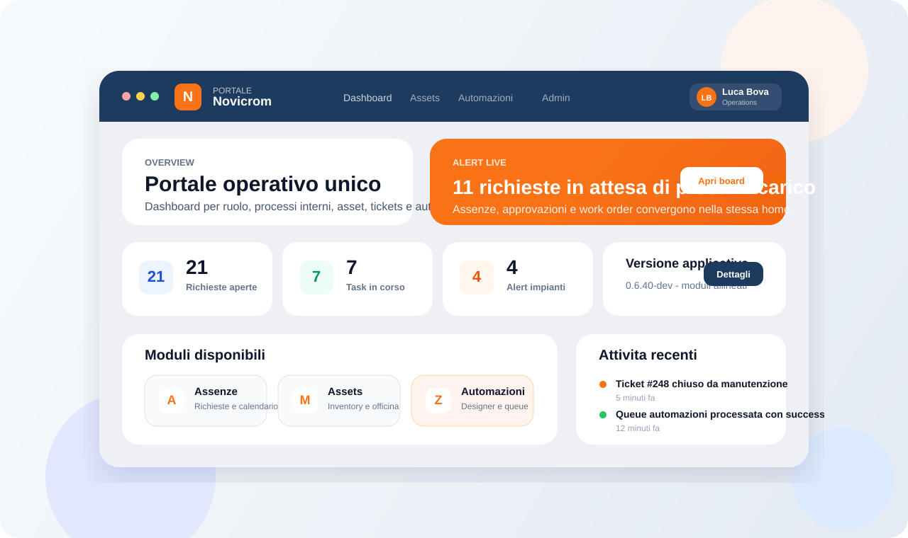
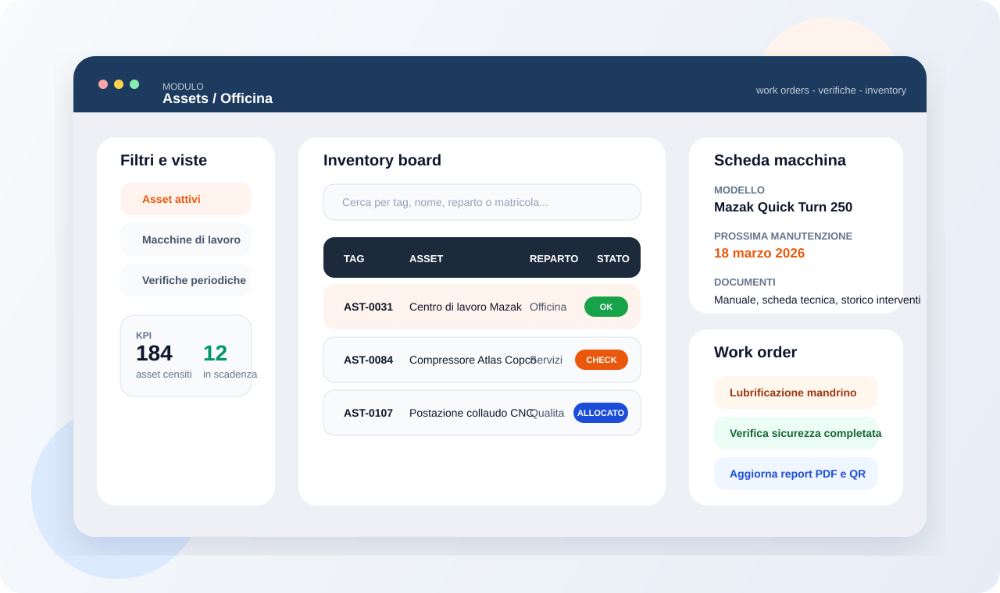
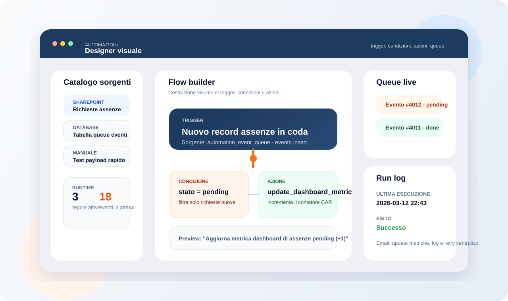
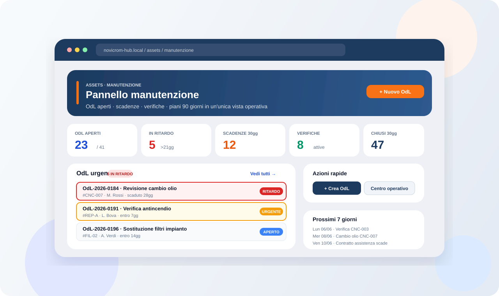
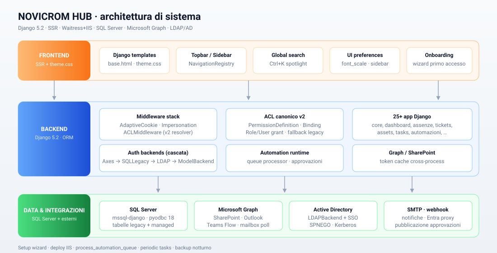
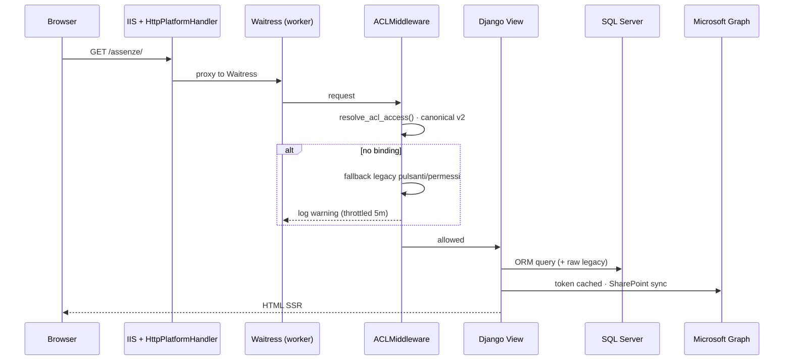
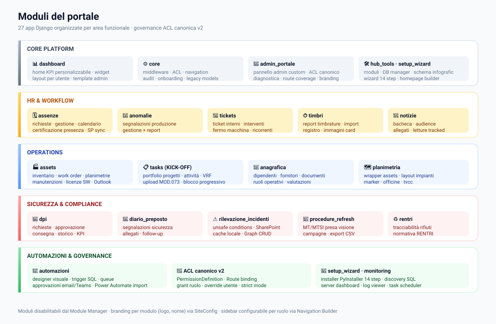
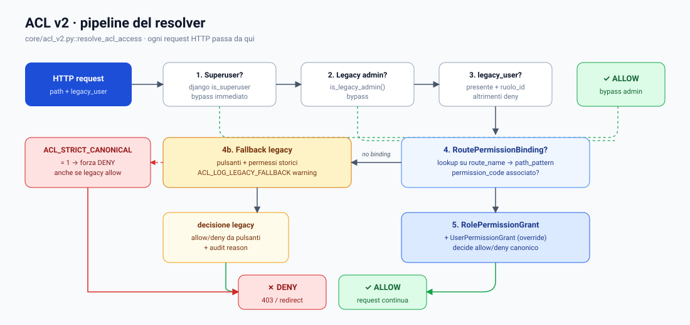
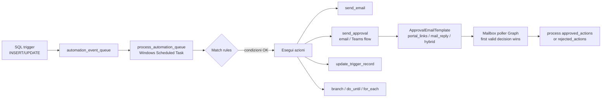
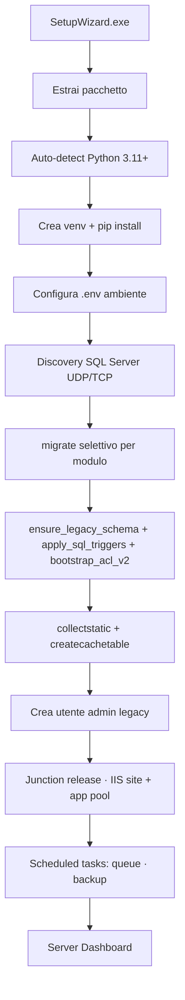

<div align="center">


# NOVICROM HUB

**Il portale interno unificato di Costruzioni Novicrom SRL**
*Workflow · Operations · Sicurezza · Automazioni · Governance*


[Start here](doc/START_HERE.md) · [Manuale tecnico GitHub](doc/README.md) · [Architettura](doc/ARCHITETTURA_TARGET_E_DISMISSIONE_LEGACY.md) · [Testing](doc/TESTING.md) · [Deploy IIS](deployment/README_DEPLOY_IIS_WINDOWS.md) · [ACL v2](doc/ACL_V2_PERMISSION_GUIDE.md)

</div>

---

## 📖 Indice

1. [Cos'è NOVICROM HUB](#-cosè-novicrom-hub)
2. [Anteprima UI](#-anteprima-ui)
3. [Architettura](#-architettura)
4. [Catalogo moduli](#-catalogo-moduli)
5. [Governance & sicurezza (ACL v2)](#-governance--sicurezza-acl-v2)
6. [Automazioni](#-automazioni)
7. [Integrazioni Microsoft 365](#-integrazioni-microsoft-365)
8. [Stack tecnico](#-stack-tecnico)
9. [Quick start](#-quick-start)
10. [Deployment](#-deployment-su-windows-server--iis)
11. [Comandi utili](#-comandi-utili)
12. [Documentazione](#-documentazione-collegata)

---

## 🎯 Cos'è NOVICROM HUB

NOVICROM HUB è il **portale intranet aziendale** di Costruzioni Novicrom SRL: una
piattaforma Django 5.2 che consolida in un unico ambiente **workflow HR**,
**gestione asset**, **compliance sicurezza**, **automazioni aziendali** e
**governance ACL granulare**.

> 💡 I nomi storici (`Portale Novicrom`) restano nel repo solo come esempio di
> istanza o percorso di deploy. La baseline documentale corrente è **NOVICROM HUB**.

### Numeri chiave

| | |
|---|---|
| 🧩 **28 app Django custom** | raggruppate per area funzionale |
| 🔐 **ACL canonico v2** + fallback legacy | migrazione incrementale route-per-route |
| 🤖 **Designer automazioni visuale** | trigger SQL · approvazioni · queue processor |
| 📊 **Dashboard KPI personalizzabile** | widget drag&drop per utente |
| 🔌 **Integrazioni native** | Microsoft Graph · SharePoint · Outlook · LDAP/AD |
| ⚙️ **Setup wizard 14 step** | PyInstaller exe · discovery SQL · IIS config |

---

## 🖼️ Anteprima UI

<div align="center">



</div>

| Assets / Officina | Automazioni |
|:---:|:---:|
|  |  |

<div align="center">



*Pannello manutenzione `/assets/manutenzione/` — priorita operative, OdL da gestire e agenda dei prossimi 7 giorni.*

</div>

> Le anteprime sono SVG GitHub-friendly renderizzate direttamente nel browser.
> Per screenshot reali del portale in produzione vedi `/admin-portale/hub/guide/`
> una volta installato.

---

## 🏗️ Architettura



### Principi chiave

- **SSR puro** con Django templates — nessun framework JavaScript lato client
- **Tabelle operative potenziate globalmente**: sort, filtri per colonna, ricerca e preferenze utente sono applicati dal componente `fm-table-enhanced` alle tabelle dati del portale; `data-table-id` resta disponibile per configurazioni esplicite, le tabelle semplici vengono riconosciute automaticamente
- **Layer ACL doppio**: canonico v2 (policy-as-data) + fallback legacy per migrazione incrementale
- **Storage dual-mode**: SQLite in dev, SQL Server in test/prod con driver ODBC 18/17/13 auto-rilevato
- **Deploy Windows-first**: Waitress + HttpPlatformHandler + IIS, installer PyInstaller
- **Cache condivisa multi-worker**: `DatabaseCache` su SQL Server (token Graph, ACL, sessioni)
- **Audit trail fire-and-forget** su ogni operazione CRUD rilevante

### Flusso request tipico


```mermaid
sequenceDiagram
    participant U as Browser
    participant IIS as IIS + HttpPlatformHandler
    participant W as Waitress (worker)
    participant M as ACLMiddleware
    participant V as Django View
    participant DB as SQL Server
    participant G as Microsoft Graph

    U->>IIS: GET /assenze/
    IIS->>W: proxy to Waitress
    W->>M: request
    M->>M: resolve_acl_access() · canonical v2
    alt no binding
        M->>M: fallback legacy pulsanti/permessi
        M-->>W: log warning (throttled 5m)
    end
    M->>V: allowed
    V->>DB: ORM query (+ raw legacy)
    V->>G: token cached · SharePoint sync
    V-->>U: HTML SSR
```

---

## 🧩 Catalogo moduli



### Tutti i 28 moduli custom a colpo d'occhio

| # | App Django | Area | URL prefisso | Sintesi |
|---|---|---|---|---|
| 1 | [`core`](django_app/core/) | Core | — (`/capa/`) | Middleware ACL, navigation registry, auth backends, audit, notifiche, export, ricerca globale, legacy models, **azioni CAPA** correttive/preventive trasversali |
| 1b | [`twofa`](django_app/twofa/) | Core | `/2fa/` | **2FA**: TOTP app authenticator e OTP email, policy per ruolo/rete interna, setup self-service con QR code, reset/toggle admin, pannello `/admin-portale/2fa/` |
| 2 | [`dashboard`](django_app/dashboard/) | Core | `/` | Home "Bacheca" info-hub: News + **Documenti & Collegamenti** (gestibili da admin), KPI, "Cose da fare", launcher moduli |
| 2b | [`ai_assistant`](django_app/ai_assistant/) | Core | `/assistente-ai/` | Chatbot interno autenticato con console admin AI e backend Ollama/Open WebUI configurabile |
| 3 | [`admin_portale`](django_app/admin_portale/) | Core | `/admin-portale/` | Pannello admin custom: ACL canonico, diagnostica, mappa permessi, attivita utente, log notifiche, branding e template PDF |
| 4 | [`hub_tools`](django_app/hub_tools/) | Core | `/admin-portale/hub/` | Module Manager, DB Manager, Schema infografica, Homepage builder, Guide |
| 5 | [`setup_wizard`](django_app/setup_wizard/) | Core | `/setup/` | Wizard primo setup (anche via `SetupWizard.exe`) |
| 6 | [`monitoring`](django_app/monitoring/) | Core | `/monitoring/` | Monitoring interno, issue tracking, alert email, segnalazioni utente, monitor automazioni |
| 7 | [`anagrafica`](django_app/anagrafica/) | Operations | `/anagrafica/` | **Anagrafica HR**: dipendenti (elenco con **ruoli ricoperti sotto il nome**, riga cliccabile e ricerca live — come tutte le tabelle del modulo), anagrafica civile/aziendale con permesso dedicato, storico contrattuale + cambiamenti organizzativi, voci retributive, creazione dipendente come flusso onboarding, offboarding con pratica task/restituzioni e chiusura rapporto dalla scheda dipendente, rimessa in forza inversa, **pannello impostazioni unificato** (`/anagrafica/impostazioni/`) per cataloghi (incluso il **catalogo ruoli unico** — ex «ruoli aziendali» + «operativi» — con gerarchia «riporta a» tra ruoli e certificazione di competenza), permessi HR e associazione campi onboarding/offboarding, report/export, **Skill Matrix MOD.187** (`/anagrafica/skill-matrix/`): matrice abilitazioni persone×macchine (livelli I/L/U/O), KPI prontezza/macchine scoperte/uomo-solo, **disponibilità del giorno** per una data (incrocio con le assenze ferie/malattia/permesso) **Scadenzario abilitazioni** (`/anagrafica/skill-matrix/scadenzario/`, gated `skillmatrix.manage`) con stato refresh per reparto e **avvio refresh da parte di HR** (apre la campagna, avvisa il CAR con notifica in-app + email e voce in «Cose da gestire»; la rivalutazione resta al CAR) e pagina **Impostazioni** della config (`/anagrafica/skill-matrix/impostazioni/`, gated `skillmatrix.manage`), **Verifica copertura minima** (`/anagrafica/skill-matrix/copertura/`, gated `skillmatrix.view`): soglie configurabili «min. N abilitati ≥ livello X» su asset/processo/ambito, attribuibili a una certificazione (AS/EN 9100, NADCAP), confrontate con gli abilitati operativi con evidenza dei gap; **gate qualificante I→L** (una macchina può richiedere un corso qualificante: il livello ≥ Intermedio è consentito solo col corso completato/valido, override tracciato su storico) e **contatore abilitati operativi** per colonna macchina, **Recruiting MOD. 05-01** (`/anagrafica/recruiting/`): schede candidato con valutazione a criteri pesati configurabili, secondo colloquio, transizione «Assunto → Onboarding» o archiviazione in database, cruscotto KPI di processo |
| 7b | [`fornitori`](django_app/fornitori/) | Operations | `/fornitori/` | **Anagrafica Fornitori** (modulo e permessi ACL separati da Anagrafica HR): dashboard KPI spesa/ordini/asset, lista filtrabile, scheda fornitore con documenti / ordini / valutazioni qualità / asset assegnati. I modelli restano in `anagrafica.models` per compatibilità con le FK storiche di assets |
| 8 | [`assets`](django_app/assets/) | Operations | `/assets/` | Inventario IT e produzione con tabelle operative comuni, work order, manutenzioni periodiche con subnav condivisa (scadenzario unico ordinato per urgenza, distinzione interventi interni/esterni con fornitore, pagina dedicata «Fornitori manutenzione» collegata al modulo `/fornitori/`), checklist operativa e scheda intervento stampabile, reminder proattivi (regole scadute via email/notifiche), QR macchina → scheda mobile con manutenzioni in scadenza e documenti), **foto della targhetta** identificativa in cima alla scheda asset (riquadro a dimensione fissa, nascosto se assente), KPI collegati a liste filtrate, azioni rapide OdL, calendario asset (manutenzioni esterne evidenziate), planimetrie, licenze SW, export Excel, Outlook sync, **asset «Prodotto chimico»** collegato 1:1 alle Schede di sicurezza (schermata dedicata pittogrammi/SDS/DPI, doppio ingresso), **numero interno opt-in** (bottone «Assegna progressivo», nessuna auto-assegnazione), **timeline di vita con voci inserite a mano** (pulsante «+ Inserisci» per fermi, traslochi, collaudi esterni, con modifica ed eliminazione in scheda; eliminabili anche gli eventi generati dal portale) |

Gli interventi Assets supportano una coda operativa distinta tra aperti, assegnati all'utente, non assegnati e chiusi, la presa in carico dalla lista e sia la creazione ordinaria sia il passaggio immediato alla chiusura formale, con data/ora editabile, piu giornate di esecuzione opzionali e consuntivo indicativo in ore/minuti.
| 9 | [`attrezzature`](django_app/attrezzature/) | Operations | `/attrezzature/` | Gestione Attrezzatura: workflow attrezzi/P-N, import Excel legacy, azioni avanzamento/pronta produzione, link strutturato KICK-OFF |
| 9b | [`gestione_carichi_macchina`](django_app/gestione_carichi_macchina/) | Operations | `/carichi-macchina/` | **Gestione Carichi Macchina**: pianificazione carichi che sostituisce il foglio Excel; vista **Excel** (matrice macchine×giorni, edit inline HTMX) + **Gantt ridisegnato a tutta pagina** (header navy, colonna macchine sticky/ridimensionabile, stepper live largh. colonna/alt. riga, colore per **commessa/famiglia/stato**, **milestone** KICK-OFF/consegna, avanzamento, banda settimane + giorni, **drag-to-reschedule** (tra date e tra macchine, **in giorni lavorativi** — conta le colonne visibili, mai sabato/domenica) con **slittamento intelligente su conflitto** — spinge in avanti solo i lavori realmente sovrapposti, del minimo necessario e in giorni lavorativi, mostrando un **popup di riepilogo** (cosa si sposta, da→a, con avviso ⚠ per gli eventuali conflitti non risolvibili entro l'orizzonte di ricerca) prima di applicare, con protezione anti-conflitto se lo stato cambia tra la preview e la conferma; opzione **«Sposta anche la coda»** (anch'essa in giorni lavorativi) per spingere tutti i successivi dello stesso delta — undo che salta i lavori modificati da altri nel frattempo, **pannelli laterali** lavoro/macchina con macchine consigliate, **Duplica/Elimina** dal pannello lavoro). **Turni di lavoro a 5 opzioni** (1°/2°/**Entrambi 6-22**/Notturno/**H24**) resi a **corsie per fascia oraria** (1°/2°/Notte; i lavori multi-fascia sono barre alte), con **rilevazione conflitti di capacità cross-fascia** (es. 1°+Entrambi, qualunque+H24) marcati in rosso, **avviso live** di sovrapposizione nel modale d'inserimento e **suggerimento del primo slot libero** («usa questo slot»); con **capability per-macchina**: i flag turni (2°/notte) limitano cosa è selezionabile e definiscono la **capacità = ore/giorno × n° turni abilitati**; configurabili dalla pagina **Impostazioni macchine** (`/carichi-macchina/impostazioni/`) o dai toggle rapidi nel pannello macchina del Gantt. **Tipo lavorazione** (Finitura/Sgrossatura/Assieme/Ripristino) nell'inserimento, che assieme al turno **indirizza i suggerimenti macchina**. **ACL canonica** sulle scritture (`piano.edit`: aggiungi/sposta/duplica/elimina/config; chi ha solo `piano.view` non vede i comandi di modifica) e **«Registro azioni»** (`/carichi-macchina/registro/`): audit di chi crea/modifica/sposta/elimina/configura, filtrabile. **importer** del foglio reale (mappatura asset, backlog, CICLI); **AI predittiva** (durata, macchina probabile con **scoring pesato load-aware** e **fase/turno-aware** mostrato nel form cella — pesi personalizzabili per categoria macchina, finestra di saturazione adattata alla durata tipica del lavoro, **fallback "generico"** per famiglie mai lavorate prima basato sulla fase — rischio ritardo, carico/colli di bottiglia) con spiegazione LLM via gateway `ai_assistant`. **Overlay "abilitati assenti"** sul Gantt: incrocia la **Skill Matrix MOD.187** (chi sa operare ogni macchina) con le **assenze programmate** e segnala in modo non bloccante i giorni con manodopera ridotta (striscia discreta sulla cella, colore per n. assenti, riepilogo a hover; additivo, si accende dopo l'import baseline Skill Matrix). ACL v2 canonica (`gestione_carichi_macchina.piano.view/edit`). Guida d'uso: [docs/gestione_carichi_macchina/GUIDA_UTILIZZO.md](docs/gestione_carichi_macchina/GUIDA_UTILIZZO.md) |
| 9c | [`gestione_specifiche`](django_app/gestione_specifiche/) | Operations | `/gestione-specifiche/` | **Gestione Specifiche** (vedi `docs/specs/gestione_specifiche/`): digitalizza il **Flusso Specifiche + MOD.133** (ciclo di vita specifiche tecniche/comunicazioni/piani di qualità, flow-down requisiti, OFI→MOD.174, verifica periodica, distribuzione tracciata) per audit **ISO 9001 §7.5 / EN 9100**. Macchina a stati **django-fsm-2** (S1 bozza→S9 errore), **audit immutabile** con snapshot per ricostruzione punto-nel-tempo, storico consultabile con **export PDF/CSV**, allegati su storage privato cifrato. Reminder/escalation/verifica periodica via django-q2 (email + notifica in-app). **API django-ninja** (`/gestione-specifiche/api/`: elenco/ricerca/dettaglio/eventi/transizioni). **Copilota AI locale** (Ollama on-premise): pre-compilazione MOD.133 da PDF, classificazione TAG, ricerca semantica — l'AI propone, l'umano firma. **UI ridisegnata sul design Claude Design** (handoff): **Cruscotto** con KPI e ciclo di vita, **Scheda+MOD.133** a tab con Copilota AI e modale OFI (una **riga può impattare più documenti CN** — documento primario `rif_doc_cn` + documenti ulteriori `RigaMOD133Documento` — e la generazione OFI crea **una azione per documento impattato**, stesso numero OFI), **Approvazione** con guardia separazione ruoli, **Distribuzione** canali/copie/deroga, **Storico** con timeline revisioni, e **Dashboard direzionale KPI** (`/gestione-specifiche/kpi/`: distribuzione per stato, OFI per cliente, tempo medio flow-down, verifiche in scadenza). **Registro OFI — modulo standalone** (top-level **`/ofi-registro/`**, namespace `registro_ofi`, gated `specifica.view`; **inserimento/modifica utente** gated `registroofi.add`; allineato **MOD.174**): strumento **trasversale/universale** delle Opportunità di Miglioramento / Non Conformità con ciclo **PLAN-DO-CHECK-ACT**, normative (ISO 27001/45001/EN 9100), priorità, proprietario e owner di processo, scadenza con **reminder** (`send_ofi_reminders`, schedulabile). La lista è **a tutta larghezza** (override del cap `.content` per far entrare le 21 colonne) e **replica esattamente il MOD.174 SGI** (intestazione, colonne REF·DATA·OFI/NC·Normative·REF NORMA·PROCESSO·OPPORTUNITY·PLAN·Allegato/Link·DO·CHECK·ACT·DATA REQUIRED·DATA CLOSED·OWNER·**P·D·C·A·TOT**), con contatori **cumulativi** P/D/C/A e **KPI ≥90%** (A/P) come la riga 2 del foglio; filtri fase/priorità/scaduti. **Stato PDCA come l'Excel**: colonna **«STATO PDCA»** compatta **in testa** (subito dopo «OFI/NC», sempre visibile) con indicatore a **4 segmenti P·D·C·A** — tutte le tappe a colpo d'occhio, con i **colori del MOD.174** (**P azzurro · D rosso · C giallo · A verde**): tappa raggiunta a colore pieno (corrente cerchiata d'arancio), da fare in tinta chiara; in fondo restano le colonne MOD.174 P/D/C/A con le **X cumulative** e la colonna **TOT** con la lettera di fase; nel **dettaglio** un pannello **«Stato PDCA»** con **stepper P→D→C→A** (completata/in corso/da fare, dalla property `pdca_steps`). Badge tipo a colori semantici: **OFI = giallo/ambra**, **NC = rosso** (in lista e dettaglio). **Inserimento/modifica in-app** dal bottone **«Nuovo inserimento»** (form con tutti i campi MOD.174, **scelta OFI/NC come primo campo**) per gli utenti con il permesso — incluso un campo **«Modulo di competenza»** a testo libero con **datalist** dei moduli già presenti, così anche le OFI inserite a mano sono attribuibili a un modulo e filtrabili; scheda di dettaglio in sola lettura. **Import di un MOD.174 già compilato**: `import_mod174 <file.xlsx>` (dry-run di default → `--apply`, `--modulo <chiave>`, `--sheet <nome>`) carica l'Excel storico delle OFI nel registro — legge il layout canonico (intestazione «REF» auto-rilevata, colonna TOT ignorata perché formula), **deriva la fase PDCA dalle X** di P/D/C/A (CHIUSO se «DATA CLOSED» valorizzata) ed è **idempotente** (upsert sul numero di registro). Raggiungibile da una **voce topbar dedicata** («Registro OFI», categoria «Qualità / SGI»); Gestione Specifiche lo **richiama con filtro** (non lo possiede) e il parametro `?modulo=` distingue **registro unico** (tutti i moduli) e **registro del singolo modulo** (con colonna «Modulo» nel registro unico). Le righe MOD.133 con impatto vi confluiscono automaticamente (la generazione OFI crea la voce di registro e collega le azioni via FK), ed è agganciabile da altri moduli via riferimento generico; gestione dei campi PDCA da admin. **Import storico** (solo "In validità"): `import_specifiche_storico <csv>` (dry-run → `--apply`) + adattatore `converti_export_gestionale` che trasforma i **listoni Excel del gestionale** (SPTE `.xls` / Registro Specifiche Cliente `.xlsx`) nei CSV template (richiede `xlrd`). **Allegati**: **collegamento** (default, `collega_pdf_da_share`) — la `Specifica` punta al PDF sulla **share master** (`percorso_esterno`, single source of truth, servito on-demand dalla view con **allowlist** `GESTIONE_SPECIFICHE_SHARE_ROOTS` + anti-traversal; all'app-pool serve sola lettura) — oppure **copia cifrata** (`allega_pdf_da_share`); script guidato `tools/import_specifiche_prod.ps1`. **Inventario PDF**: `analizza_pdf_specifiche` (READ-ONLY) apre i PDF collegati e li classifica in **ha-MOD.133 / cover-in-attesa / senza / incerto / irraggiungibile** (report CSV, path sempre via allowlist, fallback OCR opzionale). **Toolkit workflow PDF/MOD.133** (moduli offline, in costruzione verso ingestion+aggancio): `pdf_compose` (componi cover/MOD.133 sul PDF base + **protezione** owner-password `GESTIONE_SPECIFICHE_PDF_OWNER_PASSWORD` no-stampa/no-modifica + filigrana) e `mod133_render` (rende in PDF il modulo MOD.133 «Flow Down Requisiti» dai dati del portale). **Deposito revisioni sulla share** (`deposita_revisione_share`, `share_write`): scrive la nuova revisione col naming canonico `<codice> REV.<rev>.pdf`, **archivia la precedente in `_SUPERATO`** (move mai delete) e aggiorna il collegamento — con **allowlist** sulle scritture, **dry-run** di default (`--apply` per eseguire), **rollback** su errore, **audit** immutabile e selezione della cartella tra quelle **reali** (`--lista-cartelle`). Piano vivo in [docs/specs/gestione_specifiche/PIANO_PDF_MOD133.md](docs/specs/gestione_specifiche/PIANO_PDF_MOD133.md). **Sezione Amministrazione** (`/gestione-specifiche/admin/`, ACL `gestione_specifiche.admin`): **mappatura cliente→cartella**, **auto-approvazione MOD.133** (config + delega a nome MSO; per l'utente appare come una **normale approvazione dell'MSO** con data ~1 giorno lavorativo dopo la compilazione — festivi IT inclusi — mentre il **marcatore automatico** `auto=true` resta visibile **solo** in Amministrazione, con l'audit `EventoSpecifica` immutabile e i timestamp reali intatti; il timbro RICEVUTO del composito porta la **data reale di ingresso**), **notifiche/assegnazione** delle nuove specifiche (incaricato o **gruppo IN1** dal reparto anagrafica + nomi aggiuntivi, notifica in-app + email HTML in stile HUB), **Log/Audit** eventi (filtri + paginazione), **Gestione specifiche** (elenco completo di ogni stato + ricerca/filtro + riassegna incaricato). Compila MOD.133 con **«Procedi con l'approvazione»** in un click e **righe già inserite compresse**; filigrana della forma «in attesa» = «SOLO PER CONSULTAZIONE». ACL v2 canonica (`gestione_specifiche.*`). Modulo isolato (hook nullable `commessa_ref`/`famiglia_ref`) |
| 10 | [`tasks`](django_app/tasks/) | Operations | `/tasks/` | Portfolio **KICK-OFF** progetti, attività, Gantt con drag spostamento/resize, timeline eventi leggibile, incontri avanzamento **in due tempi** (convocazione → esito, con stato Pianificato/Svolto/Annullato), **convocazione (ordine del giorno) e minuta ai partecipanti** inviabili con un pulsante dal dettaglio incontro oltre che via automazione (AU53/AU52: mail con link, CC a PM/capo commessa, **PDF** della minuta scaricabile, `.ics`, **task automatici** dai next-step) e **reminder sui «problemi aperti» scaduti**, VRF (MOD.073), **form come «percorso» guidato** (rail a tappe con completamento live su Nuovo kickoff/Incontro, stepper del ciclo di vita Anagrafica→VRF→Attività; componente `kp-` riusabile su token del tema), **indicatore di prontezza all'avvio** (gate 4 criteri), **Centro «Da gestire»** (`/tasks/da-gestire/`), blocco progressivo, flag impatto sicurezza |
| 11 | [`planimetria`](django_app/planimetria/) | Operations | `/planimetria/` | Wrapper compat di assets per discoverability layout |
| 12 | [`assenze`](django_app/assenze/) | HR & Workflow | `/assenze/` | Richieste, gestione, calendario, certificazione presenza, **riconciliazione presenze↔assenze**, sync SharePoint |
| 13 | [`anomalie`](django_app/anomalie/) | HR & Workflow | `/anomalie/` `/anomalie-menu` | Segnalazione e gestione anomalie produzione |
| 14 | [`tickets`](django_app/tickets/) | HR & Workflow | `/tickets/` | Ticket interni con interventi, fermo macchina, ticket ricorrenti |
| 15 | [`timbri`](django_app/timbri/) | HR & Workflow | `/timbri/` | Report timbrature da DB legacy, registro, immagini badge |
| 16 | [`notizie`](django_app/notizie/) | HR & Workflow | `/notizie/` | Bacheca con audience, allegati, letture tracked |
| 17 | [`dpi`](django_app/dpi/) | Sicurezza | `/dpi/` | Dispositivi Protezione Individuale: catalogo gerarchico, richieste, approvazione, consegna firmata, report conformita, reminder scadenze |
| 18 | [`diario_preposto`](django_app/diario_preposto/) | Sicurezza | `/diario-preposto/` | Diario preposto sicurezza con segnalazioni, allegati privati e ispezioni periodiche |
| 19 | [`rilevazione_incidenti`](django_app/rilevazione_incidenti/) | Sicurezza | `/rilevazione-incidenti/` | Unsafe conditions, near miss, incidenti, KPI sicurezza e heatmap planimetria |
| 20 | [`procedure_refresh`](django_app/procedure_refresh/) | Sicurezza | `/procedure-refresh/` | Presa visione procedure MT/MTSI (lista unica), campagne, motore scadenze/solleciti, sync SGI con log e segnalazione nuove revisioni, segnalazioni di modifica, consultazione in Bacheca, matrice formazione ISO |
| 21 | [`rentri`](django_app/rentri/) | Sicurezza | `/rentri/` | Tracciabilità rifiuti (normativa RENTRI): registro C/O/M/R, scadenzario adempimenti, **giacenze per CER** con semaforo deposito temporaneo |
| 22 | [`automazioni`](django_app/automazioni/) | Automation | `/automazioni/` | Designer visuale, trigger SQL, queue processor, approvazioni email/Teams, import Power Automate, **regole KICK-OFF: «Minuta incontro» (AU52) e «Convocazione incontro» (AU53)** — invio email di verbale/ordine del giorno ai partecipanti (source `tasks_kickoff` + azioni custom `send_meeting_minute`/`send_meeting_invite`, CC + PDF + task dai next-step + `.ics`, anti-doppioni `cooldown_group`), **alert progetto KICK-OFF: «Impatto sicurezza» (AU54) e «VRF non caricato» (AU55)** (source `tasks_project` + azione `send_project_alert` a PM/capo commessa) |
| 23 | [`suggestion_corner`](django_app/suggestion_corner/) | Operations | `/suggestion-corner/` (+ `/suggestion-corner/nuova/` pubblico, `/suggestion-corner/gestione/` console SMS_TEAM, `/suggestion-corner/<id>/modifica/` gestione) | **Suggestion Corner** (SMS — Sistema Miglioramento/Segnalazione, sostituisce Microsoft Forms/PowerApps): ciclo **PDCA** su macchina a stati **django-fsm-2** (INSERITA→…→CHIUSA), UI in stile HUB (card, badge di stato, stepper PDCA). **Provenienza/destinazione = Reparto o Area Aziendale** (selettore a cascata). **Form pubblico anonimo** senza login (route esente ACL, rate-limit per IP + honeypot). Doppia autorizzazione: **ACL v2** per l'accesso al modulo + Django Group **SMS_TEAM** per lo scope dati (il team vede tutto, gli altri le proprie + gli incarichi). **Notifiche email** (mail al team all'invio + solleciti/escalation DO/CHECK via django-q2) e **in-app** (assegnazione incaricato/controllore, riuso `core.Notifica`). **Import storico SharePoint** (`import_suggestion_corner_legacy`, dry-run/idempotente + `--reparto-map` per rimappare i reparti). **Pagina di gestione interna** (`/suggestion-corner/<id>/modifica/`, riservata SMS_TEAM) per correggere reparti/persone/esiti/testi PDCA con traccia nello storico (lo stato resta gestito solo dal workflow). **Comunicazione al cliente per gli «SMS Sì»**: destinatario per-segnalazione, invio manuale via bottone, con tracciamento data/stato «comunicato» e voce di storico. **Copilota AI locale** (Ollama on-premise): classificazione SMS Sì/No, bozza PLAN e dedup segnalazioni simili — l'AI propone, l'operatore firma |
| 24 | [`schede_sicurezza`](django_app/schede_sicurezza/) | Sicurezza | `/schede-sicurezza/` | Archivio schede dati di sicurezza (SDS) prodotti chimici: prodotto↔reparto, scheda versionata con ingestion PyMuPDF section-aware (pittogrammi/frasi H-P/primo soccorso/DPI/incompatibilità), M2M DPI obbligatori, QR verso vista mobile sintetica **pubblica senza login** (`uuid` non PK, contatore visite), download PDF pubblico da storage privato cifrato, presa visione HTMX idempotente per versione (solo utenti autenticati), lista a card per reparto con pittogrammi CLP disegnati (sprite SVG) e filtro per pericolo (Fase 1 — AI/alert scadenze/verifica consegna DPI fuori scope) |
| 25 | [`contatori`](django_app/contatori/) | SOC IT - CN | `/contatori/` | Contatori Canon iR-ADV: letture (SNMP/manuale), riconciliazione fatture BASE in pool, analisi volumi (consumo/trimestre, classifica reparti, ripartizione BN-colore e A4-A3), stato consumabili SNMP, export Excel; FK opzionale all'Asset HUB (comando `collega_asset`) |
| 26 | [`security`](django_app/security/) | SOC IT - CN | `/soc/` | Security Center (Security Center AI innestato): dashboard, alert/ticket/KPI, pipeline parser+regole+KPI sincrona, Configuration Studio (sorgenti/parser/regole/soppressioni/backup/notifiche/ticketing/audit), **autoconfigurazione** (`/soc/admin/autoconfig/`), diagnostica; task via django-q2; tool AI aggregati (`soc_summary`); FK SecurityAsset↔Asset HUB (`collega_asset_security`). **Notifiche in uscita** email/Teams su alert e ticket, con audit (`SecurityNotificationLog`), cooldown per dedup e consegna fail-safe (`send_security_test_notification` per provare un canale). **Heartbeat sorgenti**: l'assenza di un report oltre la cadenza attesa (`expected_every_hours`) genera un alert, distinguendo "nessun dato" da "scheduler fermo" (`check_security_source_heartbeat`, da schedulare accanto all'ingestione). Provenienza delle mail stabilita **solo dal mittente** (dominio ancorato) con gate opt-in DKIM/SPF; ingestione Graph **incrementale e paginata** (nessun backlog perso); dedup di alert/ticket garantita da indici unici parziali. UI allineata ai token del tema del portale (light/dark, niente tema dark proprietario). L'accesso alla **configurazione** è governato dall'ACL v2 (permesso canonico `security.config.view`, lo stesso applicato dal middleware alle rotte `/soc/admin/config/`); restano validi per compatibilità `is_staff` e il permesso Django `security.manage_security_configuration`. **Autoconfigurazione in UI** (`/soc/admin/autoconfig/`): mostra il piano di configurazione (mancante / difforme dai default / allineato) e semina la base senza shell, in modo **additivo** (il riallineamento ai default è un'azione separata ed esplicita); espone come pulsante le correzioni che la diagnostica sa risolvere da sola (riattivare sorgenti o parser, creare canale notifiche/ticketing, ticket automatici sulle regole critiche, soppressioni scadute), nessuna delle quali cancella dati. I default vivono in un solo posto (`security/services/autoconfig.py`), di cui `manage.py seed_security_center_config` è il wrapper CLI; ogni scrittura è tracciata nel registro audit con l'utente. **Guida operativa integrata e renderizzata in-app**: 13 documenti Markdown (con la *guida di configurazione* al centro) in `django_app/security/guide/`, resi da un renderer interno zero-dipendenze e consultabili da `/soc/security/admin/docs/` → doc singoli (`/soc/docs/<slug>/`, gated); ogni sezione della Configuration Studio ha un help contestuale con link alla guida e alla diagnostica. API DRF/mailbox-admin/AI provider esclusi in questa fase |

| 27 | [`checklist_operativa`](django_app/checklist_operativa/) | Sicurezza | `/checklist-operativa/` | **Checklist Operativa**: digitalizza la checklist di chiusura aziendale (ferie/Natale...), ex file Excel. **Configurazione** (ACL `checklist_operativa.configurazione.manage`) per mansioni template + responsabile, **vice responsabili** (anche più di uno, coprono il titolare assente) e **reparto scelto dal catalogo anagrafica**, con il form che si apre in **popup** sulla pagina stessa (HTMX, stessa view e stessa validazione della pagina intera), e per creare **eventi di chiusura** storicizzati (generano subito le voci dai template attivi, vice compresi); **Gestione**, aperta a chiunque sia loggato, dove responsabile **e suoi vice** confermano i task assegnati (la voce di cui si è vice è marcata come tale, e `confermato_da` registra chi ha agito davvero) e si possono proporre nuove voci (coda di revisione); **Riepilogo** storico con % completamento e dettaglio conferme. Promemoria automatico (soglie 7/3/1/0 giorni) via django-q su **due canali**: notifica in-app per voce + **una sola email per responsabile** con l'elenco delle sue voci mancanti (a `email_notifica`; `--solo-notifiche` per il comportamento storico). Riepilogo di ogni chiusura **esportabile in PDF** per l'archiviazione. Un evento **chiuso è archiviato**: non riceve voci nuove e le sue conferme non si annullano più (il registro diventa storico), ma è **riapribile** dalla scheda evento, dietro lo stesso ACL e con traccia in audit; una proposta si decide una volta sola |
> Tutte le app sono disabilitabili dal **Module Manager** in `/admin-portale/hub/moduli/` e selezionabili in fase di setup dal wizard (step 11/14).
> `anagrafica` e `fornitori` sono separati anche nel catalogo permessi: HR usa il modulo `anagrafica`, Fornitori usa il modulo ACL `fornitori` con route `fornitori:*`.
> Il tier di selezione è: **system** (obbligatori: core, anagrafica, dashboard, hub_tools), **standard** (pre-selezionati), **optional** (disattivati di default, per futuro licensing).

### Dettaglio per area funzionale

#### 🧭 Core Platform

<details open>
<summary><b>1. <code>core</code> — fondamenta del portale</b></summary>

L'app trasversale che fa funzionare tutto il resto. Contiene middleware, resolver ACL, legacy models, auth backends, audit trail e context processors.

- **ACL middleware** con resolver canonico v2 + fallback legacy, logging throttled delle decisioni
- **Navigation registry** (`NavigationItem`, `NavigationRoleAccess`, `UserNavigationOverride`) con visibilita derivata dai permission code canonici e fallback legacy solo per voci ancora non mappate
- **Sidebar a 3° livello (sotto-moduli)**: un modulo della sidebar (es. Anagrafica) si espande in accordion mostrando i propri sotto-moduli. Le voci figlie sono `NavigationItem section='subnav'` con `parent_code` = `code` del modulo topbar, con ACL ereditata dalla stessa compilazione delle subnav; gestibili dal NavBuilder (section subnav + modulo padre). Il click sul nome naviga alla home del modulo, la freccia espande; lo stato attivo si propaga al padre
- **Fallback navigazione legacy** con deduplica visuale per modulo, cosi i restore/import non duplicano in sidebar le azioni `pulsanti` dello stesso modulo
- **Restore navigazione controllato** con `restore_navigation_registry`: dry-run di default, backup snapshot in apply e ripristino solo di categorie/menu/fallback ruoli da `fixtures/nav_acl_snapshot.json`
- **4 auth backend in cascata**: `AxesStandaloneBackend` → `SQLServerLegacyBackend` → `LDAPBackend` → `ModelBackend`
- **Header delle superfici pubbliche** (`core.public_headers`): le rotte fuori dal perimetro autenticato (`MIDDLEWARE_EXEMPT_PREFIXES`) si decorano con `@risposta_pubblica`, che aggiunge `X-Robots-Tag: noindex, nofollow, noarchive`, `Referrer-Policy: no-referrer`, `X-Content-Type-Options: nosniff` e `Cache-Control: no-store`. Sulle tre rotte **a token** (approvazioni automazioni, proxy Entra, azioni via mail sulle anomalie) `no-referrer` evita che il token nell'URL viaggi nell'header `Referer`
- **Audit trail** fire-and-forget via `core.audit.log_action()` su tabella `AuditLog`, con **aggancio opzionale al record** (`oggetto=<istanza>`, oppure `oggetto_tipo`/`oggetto_id` per le tabelle legacy senza modello Django): `core.audit.storico_oggetto()` ne ricava lo **storico modifiche del singolo record**, reso dal partial `core/components/_storico_modifiche.html`. Agganciarlo a una scheda costa due righe (kwarg nella `log_action` + include nel template); già attivo sulle scadenze amministrative degli asset, visibile in fondo a `/assets/<id>/`
- **Centro notifiche** unificato con campanella, badge, pannello HTMX, popup live in-app via polling leggero e sorgenti scadenze asset/DPI/SLA ticket
- **CAPA — Azioni Correttive/Preventive** (`/capa/`): modello trasversale `ActionItem` collegato a un evento di origine (incidente/anomalia/audit, schema `source_code`+`source_pk`), workflow **APERTA → IN_CORSO → CHIUSA (con evidenza) → VERIFICATA** con chiusura ed efficacia separate (quattro occhi). Lista filtrabile + export CSV/XLSX, gating fail-closed (gestore `core.capa_manage` vs responsabile assegnato), pannello "Azioni collegate" embeddabile nei detail (già nel dettaglio incidente), alimenta lo Scadenzario Globale e il Centro notifiche; sorgente automazioni `core_actionitem` con trigger SQL
- **Export riusabile CSV/XLSX** con `core.exporting.ExportMixin` e helper per liste filtrate
- **Legacy models managed** su SQL Server: `Ruolo`, `UtenteLegacy`, `AnagraficaDipendente`, `Pulsante`, `Permesso`
- **Impersonation** admin → utente con middleware dedicato e session key
- **23 modelli Django** (Profile, AuditLog, SiteConfig, Notifica, Checklist*, OptioneConfig, ecc.)
- **Ricerca globale** Ctrl+K su 7 sorgenti (dipendenti, asset, ticket, progetti, task, procedure, DPI), con modulo e preview risultato
</details>

<details open>
<summary><b>2. <code>dashboard</code> — home KPI personalizzabile</b></summary>

Workspace personale dell'utente autenticato. Widget multi-modulo con layout salvato per utente.

- **Home "Bacheca" (info-hub)** — redesign 2026-07: saluto + 4 KPI prioritari, poi la **Bacheca a 2 colonne** (News aziendali · **Documenti & Collegamenti**), "Cose da fare", Brief AI e un launcher moduli piatto. La sezione **Documenti & Collegamenti** (pagina `/dashboard/bacheca/`, gestione admin in `/admin-portale/bacheca/`) raccoglie **documenti caricati** (storage privato cifrato fuori webroot, download con ACL + audit), **collegamenti esterni** e **scorciatoie interne**, organizzati per **categoria** e con **visibilità per ruolo** (nessun ruolo assegnato = visibile a tutti). Modelli `HubLinkCategory`/`HubLink`/`HubLinkRoleAccess` in `core`
- **Widget KPI cross-modulo** (assenze in attesa, ticket aperti, scadenze asset, anomalie…)
- **Cockpit "Le mie attività"** — blocco principale **in cima alla home, sopra i pulsanti dei moduli**: aggregato cross-modulo di tutto ciò che richiede un'azione dall'utente loggato (approvazioni assenze, ticket aperti correlati, anomalie dei propri OP, procedure da leggere, richieste DPI in corso), con conteggio e link al modulo. Sostituisce i vecchi pannelli d'azione separati (ticket/anomalie/approvazioni); con il redesign "Bacheca" le news vivono nella sezione Documenti & Collegamenti e i pannelli *presenze* / *KPI sicurezza* / *stato sistema* sono stati rimossi dalla home. Logica condivisa `build_cose_da_gestire()` (riusata anche dalla pagina dedicata `/mie-attivita`). Versione attuale: solo elenco + link (no azioni bulk dalla home)
- **Moduli del portale**: la griglia della home mostra solo i moduli disponibili per il ruolo/utente corrente; i moduli non accessibili non vengono renderizzati nella pagina.
- **Scadenzario Globale Unificato** (`/scadenze`): vista cross-modulo di tutte le scadenze entro 60 giorni — personale (qualifiche/visite/formazione/contratti), asset (scadenze amministrative), DPI (vita utile), RENTRI (FIR mancanti), **azioni CAPA** aperte — con filtri sorgente/stato/reparto, KPI ed export CSV. Architettura a **provider condivisi** (`dashboard/scadenze_providers.py`): ogni sorgente rispetta l'ACL del proprio modulo e l'aggregatore isola i provider in errore. Pagina ACL-shared (link "Scadenzario" in cima alla home)
- **Drag & drop** dei widget con persistenza `UserDashboardConfig`
- **Template iniziale globale** definibile dagli admin + ripristino rapido
- **Shell viewport-aware** a tutta altezza, no bande vuote in fondo al viewport
- Route legacy `/scheda-dipendente` mantenuto come alias compat
</details>

<details open>
<summary><b>2b. <code>ai_assistant</code> — chatbot interno via Ollama</b></summary>

Superficie minima ed estendibile per chat AI locale, servita da Django e protetta da autenticazione.

- Endpoint `/assistente-ai/` con UI chat ridisegnata: bubble con avatar, indicatore di caricamento animato, **risposte in streaming token-per-token** e **rendering Markdown sicuro** (titoli, liste, grassetto/corsivo, code inline e blocchi, con escape HTML applicato prima dell'iniezione: nessun rischio XSS dall'output del modello), fonti RAG/live come chip colorati (verdi = dati live `tool:*`, blu = documentazione), domande suggerite contestuali dopo ogni risposta, pannello di personalizzazione stile risposta (operativo/sintetico/dettagliato) con limiti espliciti su cosa l'AI puo' o non puo' fare, contatore caratteri con avviso visivo e scorciatoia `Ctrl+Enter` per inviare.
- Lo streaming usa l'endpoint NDJSON `POST /assistente-ai/api/chat/stream/` (`api_chat_stream`): il browser renderizza i `delta` man mano che arrivano e ripiega automaticamente sull'API JSON classica `/assistente-ai/api/chat/` se lo streaming non è disponibile (proxy/browser). L'API JSON restituisce `suggested_questions` e accetta preferenze sanificate che non modificano ACL, privacy o tool abilitati.
- Throttle per-utente su entrambe le API chat (finestra fissa via cache, `429 + Retry-After`, fail-open se la cache non è raggiungibile) per proteggere l'istanza Ollama e i thread del runtime: configurabile con `OLLAMA_CHAT_RATE_LIMIT` (default 20) e `OLLAMA_CHAT_RATE_WINDOW_SECONDS` (default 60); `0` disabilita.
- Console **Admin Portale -> Gestione AI** (`/admin-portale/ai/`) per provider, runtime, stato componenti, knowledge base RAG e FAQ curate; la Config SRV (`/admin-portale/ldap/`) mantiene la card rapida di configurazione
- Backend Ollama/Open WebUI configurabile dalla console admin oppure via `.env`: `OLLAMA_BASE_URL`, `OLLAMA_CHAT_MODEL`, timeout, temperatura e limiti prompt/storico
- Provider selezionabile: Ollama diretto (`OLLAMA_API_PROVIDER=ollama`, URL tipico `http://host:11434`) oppure Open WebUI (`OLLAMA_API_PROVIDER=openwebui`, URL tipico `http://host:3000`, `OPENWEBUI_API_KEY` da Settings -> Account)
- Se il test Open WebUI restituisce HTTP 401/403, rigenerare la API key in Open WebUI e incollarla nella console: la key salvata non viene mostrata e un nuovo valore la sostituisce.
- La console admin include test connessione a `/api/version` + `/api/tags` per Ollama diretto oppure `/api/models` per Open WebUI
- Se `/api/version` risponde ma `/api/tags` non restituisce JSON valido, la connessione Ollama resta considerata riuscita: il portale avvisa solo che non ha potuto verificare automaticamente il catalogo modelli.
- Per modelli grandi o non gia' caricati in memoria, usare un timeout chat piu' ampio (`OLLAMA_REQUEST_TIMEOUT_SECONDS=180` o fino a 300 dalla console admin) per evitare 502 durante il primo avvio del modello.
- **Warmup anti cold-start** (solo Ollama nativo): il modello chat viene mantenuto caldo da un **job django-q schedulato** (`ai_warmup_ollama`, ogni 25 min < keep_alive 30m), registrato automaticamente dal deploy (`setup_q_schedules`) e girato dal cluster `QCluster_PROD`: ogni run fa un load-only (`/api/generate` a prompt vuoto, nessun token generato) che rinnova il timer `OLLAMA_KEEP_ALIVE`, così la **prima** richiesta utente non paga il caricamento del modello (causa principale dei timeout). Disponibile anche come management command `python django_app\manage.py warmup_ollama` per lancio manuale/diagnostica o dopo un restart di Ollama/IIS — opzioni `--json` (esito per log/monitoraggio), `--timeout` (default `max(OLLAMA_REQUEST_TIMEOUT_SECONDS, 300)`), `--fail-on-error`. Con provider Open WebUI il warmup è saltato (keep_alive/preload sono primitive Ollama).
- RAG documentale locale configurabile dalla console admin (`OLLAMA_RAG_ENABLED=1`) sui percorsi allowlist `OLLAMA_RAG_SOURCE_PATHS` (default `README.md,django_app/ai_assistant/knowledge`; `docs/` è escluso dal pacchetto di deploy e fuori default per non soffocare la KB curata — reimpostabile via `.env` per un assistente interno): il portale recupera i passaggi rilevanti con scoring **Okapi BM25** (IDF + normalizzazione lunghezza, indice precalcolato/cache-ato) e li passa a Ollama con fonti citabili. Tokenizzazione con accent-folding (qualità↔qualita) e stopword italiane; chunk con overlap configurabile (`OLLAMA_RAG_CHUNK_OVERLAP_CHARS`, default 150). Parametri BM25 tarabili `OLLAMA_RAG_BM25_K1` (1.5) e `OLLAMA_RAG_BM25_B` (0.75); contesto `OLLAMA_RAG_MAX_CHUNKS` (4) e `OLLAMA_RAG_MAX_CONTEXT_CHARS` (5000)
- **Knowledge base curata** in `django_app/ai_assistant/knowledge/` (10 documenti Markdown sintetici, **nessun dato personale**): orientamento al portale, ferie/permessi/ratei, ticket/asset/DPI, sicurezza/procedure/notizie, anagrafica/qualifiche/formazione, anomalie di produzione, tasks/automazioni, un **glossario** (ratei, ROL, ex festività, OdL, OP, RDC, DPI, near miss, preposto, ACL, SLA) e una FAQ accesso/account. Viaggia nel pacchetto di deploy (a differenza di `docs/`, esclusa) ed è quindi la fonte RAG su file in produzione; ampliabile aggiungendo file `.md` o voci dalla console **Gestione AI → FAQ**. Titoli «a forma di domanda» per migliorare la pertinenza BM25
- **Corpus documentale SGI citabile (`OLLAMA_RAG_SGI_ENABLED`, default on)**: oltre alla KB curata, il RAG indicizza i documenti del Sistema di Gestione già presenti nel portale — **specifiche in vigore** (`gestione_specifiche.Specifica` stato S3) e **revisioni procedura correnti** (`procedure_refresh.ProcedureRevision.is_current` su documento attivo) — così l'assistente risponde con **citazione** a domande tipo *«in che MT si fa riferimento ai timbri?»* → *«MT CN 06 Rev.7 §4.2»*. Le fonti escono come handle stabili `spec:{codice}#rev{rev}` / `proc:{code}#rev{rev}` con titolo `codice Rev.x — §sezione` (chunking **sezione-aware** sui paragrafi numerati); quando una fonte è SGI il prompt **obbliga** a citare codice + revisione + sezione e a dichiarare «Non disponibile nei documenti indicizzati» se il contesto non basta. Estrazione PDF (pymupdf) **cachata per `file_hash`**; on-premise si legge solo il **file server locale**, mentre SharePoint/PDF illeggibili **ripiegano sui metadati** restando citabili. Tutto **fail-safe** (un documento problematico viene saltato, mai un blocco in chat). Cap dedicati `OLLAMA_RAG_SGI_MAX_SPECS`/`OLLAMA_RAG_SGI_MAX_PROCS` (300), `OLLAMA_RAG_SGI_MAX_PDF_CHARS` (200000), `OLLAMA_RAG_SGI_TEXT_CACHE_TTL`. **Governance HR — roster operatori fuori dal corpus**: gli elenchi di persone abilitate/licenziate a una macchina (skill matrix / *licensed operators* / MOD.187) **non** vengono indicizzati (sarebbero fonte di allucinazioni HR e un bypass del tool Skill Matrix governato, che ha ACL + revisione privacy): una **deny-list keyword** `OLLAMA_RAG_SGI_EXCLUDE` (default su titolo/codice: *licensed operator, operatori abilitati, skill matrix, matrice abilit…, abilitazioni macchina, MOD.187*; estendibile via `.env`) più un **flag per-documento** `ProcedureDocument.escludi_dal_rag` (toggle in admin) li escludono dal caricamento del corpus; i documenti scartati sono loggati a INFO (nessun drop silenzioso). **Caricamento dei documenti dal file server**: le procedure/MT che vivono su una share di rete si registrano in blocco con `python django_app\manage.py import_sgi_da_share --root "\\server\share"` (dry-run di default, `--apply` per scrivere; esclude `SUPERATO`, riconosce la convenzione `MT CN nn Rev.x_Titolo` + modulistica `MOD.xxx`, importa anche i nomi non standard via fallback, `--solo-procedure` per le sole procedure). Path di default in `PROCEDURE_REFRESH_SGI_SHARE_ROOT`; richiede path **UNC** e permesso Read del service account (app pool IIS + QCluster). **Warm/indicizzazione**: `python django_app\manage.py index_sgi_documents` (`--json`, `--fail-on-error`) forza la build dell'indice + il caching degli embeddings SGI (prima build più costosa, poi in cache). Warm notturno via schedule django-q2 **`ai_index_sgi_documents`** (CRON 03:30, fail-safe), registrata in `automazioni/schedules.py` e attivata al prossimo `setup_q_schedules`. Runbook completo di rollout in [docs/ai/RAG_SGI_ROLLOUT.md](docs/ai/RAG_SGI_ROLLOUT.md)
- **Valutazione qualità retrieval**: `python django_app\manage.py ai_eval --rag` misura **recall@k, MRR e rank-1** del RAG su un golden set `domanda → fonte attesa` più la copertura KB (opzioni `--top-k`, `--sources` per misurare *come in produzione* con `README.md,django_app/ai_assistant/knowledge`, `--json`); `ai_eval --rag-live` valuta invece la copertura della KB sulle **domande reali** memorizzate (feedback chat / FAQ) e segnala i *gap* da colmare, mostrando lo score BM25 del match KB e con `--min-score` per declassare i match deboli a *gap deboli* (da eseguire dove ci sono feedback, es. produzione; non committa testo utente); `ai_eval` senza flag valuta il routing semantico dei tool. Per il corpus SGI c'è la modalità **`ai_eval --rag-sgi`** che misura recall@k / MRR / rank-1 su un golden set dedicato (`django_app/ai_assistant/eval/golden_sgi.jsonl`, *domanda → frammento documento atteso*, es. timbri → `MT CN 06`), riportando nel summary lo stato dello `stemming` e il numero di chunk SGI indicizzati — da eseguire dove il corpus SGI è presente, dopo aver curato il golden sull'ambiente reale. Tutte le modalità sono offline-friendly (BM25) e con output ASCII-safe per console Windows
- **Stemming italiano (opt-in, `OLLAMA_RAG_STEMMING_ENABLED`, default off)**: con il flag attivo `_tokenize` applica uno stemmer **Snowball italiano** (`snowballstemmer`, pure-python) in modo identico a query e chunk, così le flessioni collassano sulla stessa radice (timbri/timbro/timbrare → `timbr`) e una domanda flessa recupera il documento giusto anche senza match esatto. **Fail-safe** se la dipendenza manca (tokenizzazione invariata, nessun crash). È una leva **da misurare prima di attivare** (`ai_eval --rag`/`--rag-sgi` con e senza flag): sulla KB curata non introduce regressioni (26/26), sul corpus SGI con query flesse migliora il recall (misurato 3/4 → 4/4 su golden seminato)
- **Retrieval semantico ibrido (opt-in)**: con `OLLAMA_EMBED_ENABLED=1` e un modello di embedding scaricato in Ollama (`ollama pull nomic-embed-text` **oppure** `ollama pull bge-m3`, selezionabile con `OLLAMA_EMBED_MODEL`), il portale calcola gli embeddings di chunk e query e li **fonde con BM25 via Reciprocal Rank Fusion** (`OLLAMA_RAG_HYBRID_RRF_K`), recuperando risposte pertinenti anche senza overlap lessicale. Il modello è **parametrizzabile e confrontabile** (`bge-m3` 1024d vs `nomic-embed-text`): la cache vettori è per `(modello, content-hash)` e il coseno è **dimension-safe**, quindi cambiare modello non riusa vettori di dimensione diversa (basta rigenerare l'indice, es. `index_sgi_documents`). Fail-safe: se gli embeddings non sono disponibili (modello assente/endpoint giù/provider Open WebUI) il retrieval ripiega su BM25 senza bloccare la risposta. Gli embeddings dei chunk sono cache-ati per content-hash in `DatabaseCache` (`OLLAMA_EMBED_PERSIST`, TTL `OLLAMA_EMBED_CACHE_TTL`) e sopravvivono ai restart. **Backend embeddings configurabile** (`RAG_EMBED_BACKEND`): `ollama` (default), `openai` (endpoint HTTP **OpenAI-compatibile** — TEI / Infinity / vLLM / LM Studio: `RAG_EMBED_OPENAI_BASE_URL`/`_MODEL`) o `fastembed` (in-process, CPU/ONNX, dipendenza opt-in). Per **corpora grandi** (es. l'intero corpus SGI) **Ollama si satura** sul batch massiccio: usa un server dedicato — **TEI in Docker su GPU** è la scelta consigliata (`docker run --gpus all -p 8081:80 ghcr.io/huggingface/text-embeddings-inference:<arch> --model-id BAAI/bge-m3 --auto-truncate`), che vettorializza migliaia di chunk in pochi minuti senza piantarsi. Lo splitter spezza i blocchi PDF troppo lunghi (niente chunk che sfondano il limite di token del modello). **Latenza del routing**: il routing semantico embedda la query a *ogni* messaggio, quindi usa un **timeout breve** dedicato (`AI_TOOL_ROUTING_EMBED_TIMEOUT_SECONDS`, default 6s) con fail-safe a keyword-only — se l'endpoint embeddings è lento/giù la chat non paga il timeout pieno. Le soglie di routing (`AI_TOOL_ROUTING_THRESHOLD`/`_MARGIN`) sono tarate per `nomic-embed-text`: con `bge-m3` vanno **rimisurate** con `ai_eval` (procedura in [docs/ai/RAG_SGI_ROLLOUT.md](docs/ai/RAG_SGI_ROLLOUT.md))
- **Tuning runtime del modello** (solo Ollama nativo): `OLLAMA_KEEP_ALIVE` (default `30m`) tiene il modello caldo in memoria riducendo la latenza al primo token dopo inattività; `OLLAMA_NUM_CTX` (default 16384) dimensiona la finestra di contesto perché contesto live + RAG non vengano troncati in silenzio; `OLLAMA_NUM_PREDICT` (default **1536**, `0` = nessun cap dal portale) cappa la lunghezza della risposta per evitare generazioni runaway che occupano il worker e la KV-cache. **Ottimizzazione GPU/modelli** (env server-side: `OLLAMA_MAX_LOADED_MODELS=1` dato che gli embeddings sono su TEI, `OLLAMA_FLASH_ATTENTION=1`, `OLLAMA_KV_CACHE_TYPE=q8_0`, `OLLAMA_NUM_PARALLEL=1`): runbook completo con applicazione via NSSM e verifica in [docs/ai/OLLAMA_GPU_TUNING.md](docs/ai/OLLAMA_GPU_TUNING.md)
- **Nota sui tag modello**: `OLLAMA_CHAT_MODEL` deve combaciare **esattamente** con un tag installato in Ollama (`ollama list`). Un nome senza tag (es. `llama3.1`) viene risolto come `:latest` e fallisce se sul server c'è solo `llama3.1:8b`. Default consigliato `qwen2.5:14b-instruct`
- Tool runtime autorizzati tramite registry estendibile: la chat puo' agganciare piccoli provider server-side per ogni dominio, sempre filtrati dai permessi dell'utente. Gia' disponibili: catalogo moduli visibili in navigazione, Assenze per domande come "chi e' assente domani/oggi?", Ticket per riepiloghi personali o di gestione IT/MAN (aperti, urgenti, risolti), KICK-OFF/Tasks per progetti, attivita' aperte, scadenze, assegnazioni e ritardi visibili, Assets per asset assegnati/visibili, scadenze, OdL, verifiche e stato operativo, Carichi macchina per la saturazione settimanale per macchina/reparto (% carico, ore carico/capacita', n. lavori; nessun dettaglio commessa/cliente), DPI per richieste/consegne/scadenze con separazione utente/gestore, Anomalie per riepiloghi autorizzati di segnalazioni aperte/in carico, Skill Matrix MOD.187 per chi e' abilitato/operativo su una macchina e chi e' realmente **disponibile** in una data (incrocio con le assenze: **causale-categoria** ferie/malattia/permesso, senza dettagli sanitari ulteriori — vale anche per i **sostituti**), **dove può lavorare un operatore** (reverse persona→macchine: dato il nominativo, elenca le sue macchine con livello/stato/operatività; persona non riconosciuta o senza abilitazioni → risposta onesta, mai inventata), macchine scoperte, prontezza squadra e rischio uomo-solo (gated `anagrafica.skillmatrix.view` + revisione privacy; **barriera di dominio anti-allucinazione**: le domande di abilitazione/idoneità *persona↔macchina* — anche senza «chi», es. «Tizio può lavorare alla DM11?» — passano solo dal tool governato e non vengono mai dedotte dai documenti RAG; le **entità** della domanda — codice-macchina, nominativo — si leggono dal **turno corrente**, così un codice citato in un messaggio precedente non dirotta la domanda successiva), Procedure Refresh per campagne/prese visione/quiz autorizzati, Notizie pubblicate visibili all'utente, Sicurezza per soli KPI aggregati di Diario Preposto/Rilevazione Incidenti e Anagrafica HR read-only per superuser/admin legacy o ruoli autorizzati (`AnagraficaHRPermission`) con campi aziendali minimi, consenso privacy e ratei ferie/permessi residui in forma sintetica: classifiche o ricerca nominativa, solo ore/periodo e conversione giorni su base 7.5 ore quando richiesta. Il router cross-dominio riconosce domande operative come "cosa devo fare oggi?", consulta i tool pertinenti in ordine di priorita' (sicurezza/compliance, scadenze, ticket urgenti, task in ritardo), applica limiti globali di righe/caratteri e registra audit metadata-only per ogni tool eseguito, autorizzato, negato o non disponibile. I tool passano all'LLM solo campi sintetici consentiti e mai motivazioni, descrizioni complete, note interne, seriali, firme, allegati, path file, URL SharePoint, hash, risposte quiz, dati HR riservati (CF/IBAN/dati sanitari/retributivi/privati/documenti), dettagli cedolino o budget.
- La console **Gestione AI -> Tool live** mostra il catalogo runtime per dominio, stato abilitato/disabilitato, indicatori di chiamate/errori/latenza/contesto, audit filtrabile per tool/esito/periodo, test admin metadata-only con utente simulato e pulsante per svuotare la cache RAG/runtime. Il test non mostra il contenuto live del contesto, solo fonti, tool attivati, scope e conteggi.
- La console **Gestione AI -> Governance** (Fase 5) permette di revisionare la privacy di ogni tool runtime: stato (Da revisionare / Approvato / Uso limitato / Bloccato), campi ammessi/vietati, retention personalizzata, note interne non trasmesse al modello e tracciatura revisore/data. La policy di retention default e' 90 giorni per l'audit AI metadata-only. Il documento [docs/ai/13_AI_GOVERNANCE.md](docs/ai/13_AI_GOVERNANCE.md) contiene la matrice campi per modulo, le policy di retention e il runbook operativo (API key Open WebUI, diagnostica Ollama, ciclo di vita tool).
- Piano di estensione tool live in [docs/ai/12_AI_RUNTIME_TOOLS_TODOLIST.md](docs/ai/12_AI_RUNTIME_TOOLS_TODOLIST.md): checklist per aggiungere nuovi domini con ACL e audit metadata-only; Timbri/Presenze resta rimandato a revisione privacy HR dedicata. Roadmap di espansione a ondate in [docs/ai/14_AI_EXPANSION_ROADMAP.md](docs/ai/14_AI_EXPANSION_ROADMAP.md).
- **Copiloti per-modulo** (l'AI propone, l'umano firma): oltre ai tool che leggono i dati, alcuni moduli hanno un copilota che **propone** contenuti da rivedere e firmare (nessun salvataggio automatico). Disponibili: **Ticket** (triage dal testo → categoria/priorità/incide-sicurezza/assegnatario dal team gestori + bozza di risoluzione; pulsante «Copilota AI» nel dettaglio gestione, endpoint `tickets/api/copilota/` gated gestori, valori validati e fail-safe, audit metadata-only), **DPI** (dalla mansione propone il set DPI scelto dal catalogo reale — categorie/tipi validati, obbligatorie da mansionario sempre incluse; pulsante «Proponi DPI» nel report conformità, endpoint `dpi/api/copilota-dpi/` gated gestori, read-only/fail-safe) e **Gestione Specifiche/MOD.133** (pre-compilazione righe flow-down + TAG dal PDF; **diff revisione precedente↔nuova** che pre-compila il MOD.133 sui soli cambiamenti — `difflib` deterministico + LLM, endpoint `ai_diff_mod133`).
- **Generazione report PDF** (pulsante «📄 Report PDF» in chat → endpoint `POST /assistente-ai/api/report/`): genera un report scaricabile su un argomento libero, **ancorato allo stesso contesto autorizzato della chat** (tool live ACL-gated + RAG/SGI) — il modello scrive solo la prosa, **cita le fonti** e non inventa. PDF in **stile NOVICROM HUB** (header navy + accento arancio, sezioni cyan, blocco Fonti) marcato come **bozza** («l'AI propone, l'umano firma»); output del modello **escapato** prima del rendering, audit solo-metadati, fail-safe se l'AI è giù. Timeout dedicato `OLLAMA_REPORT_TIMEOUT_SECONDS` (120).
- **Guida HTML al funzionamento dell'AI** (per utenti, autoconsistente): [docs/ai/GUIDA_AI.html](docs/ai/GUIDA_AI.html) — architettura on-premise (Ollama+TEI), RAG SGI citabile, tabella dei tool runtime, copiloti per-modulo, generazione report PDF, esempi di domande, limiti/privacy/governance e roadmap. Va mantenuta aggiornata a ogni nuova capacità AI.
- Apprendimento controllato: gli admin possono salvare dalla chat o dalla console admin una coppia domanda/risposta nella FAQ AI, poi indicizzata dal RAG senza salvare automaticamente le conversazioni
- Le richieste partono dal server Django verso Ollama; il browser non parla direttamente con la workstation
- Audit trail solo su metadati tecnici (modello, lunghezze, latenza, errori), senza salvare prompt o risposte
</details>

<details open>
<summary><b>3. <code>admin_portale</code> — pannello admin custom</b></summary>

Sostituisce il Django admin nativo con un pannello ritagliato sulle operazioni reali del portale.

- **Gestione accessi** semplici canonico-first con toggle per modulo su `RolePermissionGrant`
- **ACL canonico** con 5 tab (Permission, Binding, Role grant, User override, Nav override)
- **ACL route coverage** report con stati e export CSV
- **ACL diagnostica** combinata legacy + canonical con una sola decisione finale chiara e trace completo (CLI equivalente: `python manage.py acl_diagnose --user <email|alias|id> --path </route/>`)
- **Avviso "ACL canonico"** nella pagina permessi legacy: i moduli con binding canonico attivo sono marcati e segnalano che i permessi legacy lì sono ignorati a runtime (linkano ad ACL canonico/diagnostica)
- **Mappa permessi/navigazione** visuale con drill-down cliccabile e toggle live dei grant
- **Navigation Builder** con vista tabellare + **vista drag&drop orizzontale** per sezione
- **Vista attività utente** (`/admin-portale/attivita-utenti/`) sugli ultimi 30 giorni da `AuditLog`, con filtri utente/modulo/testo e export CSV/XLSX
- **Log notifiche** (`/admin-portale/notifiche-log/`): elenco **cross-utente** di tutte le notifiche in-app con destinatario risolto, etichetta/icona dal registro tipi, filtri (tipo/utente/stato/giorni), **conteggi per tipo** ed export CSV/XLSX — per verificare cosa parte e a chi (`Notifica` registrata anche nel Django admin)
- **Gestione notifiche** (`/admin-portale/notifiche-config/`): interruttore admin **globale** per accendere/spegnere ciascuna categoria di notifica (assenze/comunicazioni/scadenzari/ticket/operatività) per tutti; enforcement reale via `core.notifiche_prefs.should_notify` in `invia_notifica`. L'utente gestisce le proprie preferenze da **`/notifiche/impostazioni/`** (l'admin ha la precedenza)
- **Export audit/notifiche**: audit log, attività utente e centro notifiche mantengono i filtri GET negli export CSV/XLSX
- **LDAP settings** + sync/import utenti AD con service account effettivo; nei deploy TEST/PROD salva sul `config/.env` persistente, non sul `.env` della release attiva
- **Branding portale** (favicon, logo, login banner, pagina login personalizzabile)
- **Module Manager** integrato per abilitazione moduli runtime
- **Automazioni admin**: impostazioni runtime, queue list, log mailbox, convertitore Power Automate
- **Eliminazione massiva utenti** (`/admin-portale/utenti/`): pulsante "Elimina selezionati" nella toolbar con confirm JS sul numero righe; per ciascun ID chiama `_delegate_legacy_user_with_dependencies` (release asset, pulizia override/dashboard/profilo Django, unlink anagrafica), salta l'utente corrente, aggrega contatori `deleted`/`errors`/`skipped_self` e registra nell'audit log
- **Crea Release** (`/admin-portale/crea-release/`) con package zip, riavvio IIS TEST/PROD automatico via task schedulato elevato `\PortaleNovicrom\IISRestart_TEST/PROD` e terminale web con preset Django/ACL sull'ambiente selezionato
</details>

<details open>
<summary><b>4. <code>hub_tools</code> — hub strumenti interni admin</b></summary>

Collezione di tool sotto `/admin-portale/hub/` protetti da `@legacy_admin_required`.

- **Module Manager** — abilita/disabilita moduli visibili, configura redirect post-login
- **Database Manager** — statistiche tabelle, backup, pulizia log/sessioni, ottimizzazione, ripristino. Engine rilevato automaticamente (SQLite dev / SQL Server prod)
- **DB Schema infografica** — mappa visuale di tutti i modelli Django con campi, tipi, relazioni FK/1:1/M:M
- **Homepage Builder** — editor visuale layout home per ruolo
- **Setup Wizard Hub** — rilancia il wizard di configurazione (14 step) sul `.env` corrente, normalizzando i booleani `True`/`False` e `1`/`0`; la sezione Microsoft Graph / SharePoint centralizza credenziali e ID delle liste usate da assenze, incidenti e automazioni.
- **Guide** — catalogo auto-indicizzato di documenti (HTML/PDF/MD) da `tools/`, `doc/`, `deployment/`, con dedup per formato
- **Categorie moduli / branding portale** — raggruppa la navigazione e personalizza nome, loghi upload/URL, favicon e colori globali della shell
</details>

<details open>
<summary><b>5. <code>setup_wizard</code> — wizard primo setup</b></summary>

Wizard Django 12 step raggiungibile su `/setup/`, usato quando `SETUP_COMPLETED=0`. Esiste anche come **installer standalone `SetupWizard.exe`** (14 step) per deploy Windows Server.

- Configurazione `SiteConfig`, `.env`, credenziali admin
- Wizard exe: discovery SQL Server (UDP broadcast + TCP scan + SSRP)
- Selezione moduli **tier-based** (system/standard/optional)
- Migrate selettivo per modulo scelto, con copertura di tutte le app dotate di migration (`anomalie`, `monitoring`, `planimetria` incluse)
- Runtime Python 3.11+ rilevato e validato prima della creazione del virtualenv
- `collectstatic` isolato dai bootstrap ACL runtime, così non apre cache/DB prima di copiare gli asset
- Preflight SQL Server: il database configurato viene creato/verificato prima delle migration; con `DB_TRUST_CERT=True` anche `sqlcmd` usa `-C` e, se serve, fallback ODBC con `TrustServerCertificate=yes`. In sviluppo locale, `DB_ENCRYPT=0` consente di disattivare `Encrypt` per istanze SQLEXPRESS legacy/non compatibili TLS, lasciandolo vuoto nei deploy normali.
- Il wizard web interno preserva `DB_TRUST_CERT` quando si modifica solo LDAP/SMTP, evitando che ODBC Driver 18 perda `TrustServerCertificate=yes` su ambienti con certificato SQL non trusted
- Trigger automazioni SQL idempotenti: `apply_sql_triggers` crea la queue e salta i trigger la cui tabella sorgente legacy/opzionale non esiste nel DB corrente; gli script assenze sono self-guarded anche se lanciati direttamente
- Fail-fast: se venv/pip/migrate/collectstatic falliscono, release **non** attivata
- FinishPage mostra banner rosso "Installazione Incompleta" con countdown 60s
- Server Dashboard integrato con start/stop/restart IIS, reset password live e terminale TEST/PROD con ~33 preset comandi curati dal Runbook (Test, ACL, AI/RAG, SGI, MPQ, Skill Matrix, Reminder, Import dati con «📎 Sfoglia file…» contestuale, Manutenzione, Sync), etichetta rischio 🟢/🟡/🔴 e descrizione breve per preset
- Menu di scelta (`SetupWizard.exe` senza argomenti): chiudere Installa/Gestisci server/Gestione Release/Disinstalla (X, Annulla o fine flusso) **ripresenta il menu** invece di uscire dal programma — si esce chiudendo il menu stesso
- Server Dashboard — pannello **Servizi Windows**: elenca i servizi rilevanti per l'hosting (IIS `W3SVC`/`WAS`/`AppHostSvc`, SQL Server `MSSQL*`/`SQLAgent*`/`SQLBrowser`/`SQLWriter`) con stato (in servizio / arrestato / avvio / arresto / in pausa) e tipo di avvio (automatico / manuale / disattivato); gestione inline Avvia/Ferma/Riavvia e cambio tipo di avvio, attiva solo se il setup gira come Amministratore
- Server Dashboard — **pagina scrollabile** (mouse + scrollbar) con in cima un **«Pannello di controllo»** a blocchi cliccabili (Stato servizi IIS · Servizi Windows · Controlli IIS · Automazioni django-q · Assistente AI · Log waitress · Terminale): ogni card porta direttamente alla sezione corrispondente, così le funzioni «sotto la piega» restano sempre raggiungibili
- **Release Manager** (`--mode release`) con quattro operazioni: **Crea Release** (`.zip` completo da DEV), **Promuovi Release** (deploy `.zip` su TEST/PROD) e il flusso **Hotfix** a due fasi — **Crea Hotfix** (`--mode hotfix-create`, rileva i file modificati via git e li impacchetta in un `hotfix-*.zip` leggero) e **Applica Hotfix** (`--mode hotfix-apply`, estrae il pacchetto hotfix sul release attivo `current\`, esegue eventuali management command e ricicla IIS, senza nuova release)
</details>

<details open>
<summary><b>6. <code>monitoring</code> — osservabilità interna</b></summary>

Superficie di monitoring del portale, issue tracking interno e segnalazioni utenti.

- **Issue tracking** interno per bug segnalati dagli utenti
- **Alert email** su eventi di sistema configurabili
- **Monitor automazioni** con health card della queue
- **Segnalazioni utente** dirette all'admin
- **Liveness/readiness probe** runtime (`/healthz`, `/readyz`) con check su DB, cache, Graph, LDAP, SMTP e queue automazioni; risultato memoizzato in cache, IP allowlist via `HEALTHZ_ALLOWED_IPS`. Riusabili da `validate_deployment --with-integration` per coerenza tra deploy validation e runtime
- **Provenienza della build** nella Centrale di comando (`/admin-portale/monitoring/status/`): commit, branch, autore e data letti dal `BUILD_INFO.json` scritto nel pacchetto da `package-release.ps1`, con banner rosso se il codice in esecuzione non corrisponde a un commit pulito del branch di release. Manifest assente = "sviluppo — nessun pacchetto"
- CSS dedicato in `static/monitoring/css/monitoring.css` verificato in `collectstatic`
</details>

---

#### 🏭 Operations

<details open>
<summary><b>7. <code>anagrafica</code> — dipendenti e HR</b></summary>

Anagrafica master HR del portale, integrata con Active Directory e tabelle legacy SQL Server. Gestione strutturata HR con livelli di visibilità differenziati. **L'anagrafica fornitori è ora un modulo dedicato — vedere `fornitori` qui sotto.**

- **Topbar a «pilastri» (Proposta A)** (subnav DB-driven, migration `0069`/`0070`, gestibile da Impostazioni → Navigazione): **Dashboard · Scadenzario · Persone ▾ · Competenze ▾ · Compliance ▾ · Amministrazione ▾ · ⚙ Impostazioni**. Due meccanismi nuovi: (1) **pilastro = link + sottomenu** — la categoria ha una *landing* (`landing_url_type`/`landing_url_value`): cliccando il testo si va alla dashboard del sotto-modulo, il caret/hover apre il dropdown; (2) **mega-menu a colonne** — il campo `gruppo` sui link crea sezioni (Competenze fonde Formazione + Qualifiche + Trasversale). **Scadenzario unico** verso `/anagrafica/scadenzario/` (già filtrabile via `?tipo=`); doppioni e cataloghi struttura nascosti dalla topbar (restano in Impostazioni). Dettaglio in `docs/anagrafica/LINKS_ANAGRAFICA.md`. **Toggle di vista** (`?layout=`) **Gruppi · Calendario · Affiancata**: «Calendario» è una griglia mensile delle scadenze, «Affiancata» due colonne Visite│Formazione; le **visite mediche restano collassate di default** (dato sanitario) e ogni visita ha un pulsante **«↻ Rinnovo» per singola voce** (deep-link alla Giornata visite `visite_mediche_nuova_sessione?tipo=`). La **formazione è ora inline** (tabella per corso con checkbox dipendenti) invece del solo link alla pagina dedicata.

- **Dashboard HR** (`/anagrafica/`): hero con organico e qualifiche in scadenza, KPI dei cataloghi, e due blocchi personalizzabili (nascondibili/riordinabili con «Personalizza», preferenze in `localStorage`). **Cose da gestire**: righe azionabili — visite mediche, qualifiche, corsi obbligatori, contratti e periodi di prova — separate tra *scadute* e *in scadenza entro 60 giorni*; ogni riga apre lo scadenzario già filtrato (`?tipo=…&stato=…`) su ciò che ha contato, perché conteggio e lista vengono dalla **stessa** funzione (`_build_scadenzario_voci`) e non possono divergere. Il gating per sorgente è quello dello scadenzario: chi non può vedere le visite mediche non ne vede nemmeno il numero. **Vai a**: collegamenti diretti ai sottomoduli (Scadenzario, Organigramma, Cruscotto qualifiche, Formazione, Visite mediche, Onboarding, Documenti, Ex dipendenti), che altrimenti vivono solo nei dropdown della topbar; le voci gated non compaiono a chi vedrebbe solo un rifiuto.
- **Export PDF + Excel su tutte le liste** (29 viste): ogni elenco del modulo ha in toolbar il menu **«Esporta ▾»** con quattro voci — Excel/PDF × *risultati filtrati* o *tutto*. L'export **replica i filtri attivi della pagina** (esporta quello che vedi, righe di tutte le pagine e non solo di quella corrente) e le **sole colonne già visibili in lista**. Endpoint unico parametrico `/anagrafica/esporta/<key>/?format=xlsx|pdf&scope=filtered|full`; ogni lista dichiara una `ExportSpec` nel registry (`anagrafica/exports.py` + i moduli d'area `exports_persone/formazione/qualifiche/hr.py`), il PDF usa il template grafico condiviso `core/table_pdf.py` e l'Excel il blocco intestazione di `core/excel_export.py`. **Autorizzazione fail-closed**: l'export riusa il gate ACL della lista di origine (chi non può aprirla non può scaricarla, strict-mode incluso) più il permesso HR dove la pagina lo impone (documenti, onboarding, conformità, ratei, retribuzioni, visite mediche); ogni download è tracciato nell'audit trail. Copertura: Persone (dipendenti, ex dipendenti, documenti, onboarding, scadenzario, conformità, organigramma), Formazione (corsi, sessioni, piani, istruttori, scadenzario, fattori di rischio, categorie, esposizioni), Competenze (qualifiche, scadenzario qualifiche, sessioni, matrice competenze, clienti MOD.128), Cataloghi/HR (reparti, aree, ruoli aziendali, ruoli operativi, ratei, retribuzioni globale, visite mediche). Gli export XLSX/CSV storici delle singole pagine restano disponibili.
- **Elenchi: riga cliccabile e ricerca live** (tutte le tabelle del modulo e dei sotto-moduli — formazione, qualifiche, sicurezza, MPQ, visite mediche): si clicca **ovunque sulla riga** per aprire il dettaglio (lo stesso link del pulsante d'azione, che resta al suo posto per la tastiera); Ctrl/Cmd+click e click centrale aprono in una nuova scheda, la riga sotto il puntatore si scurisce e **la riga aperta resta segnata** al ritorno sull'elenco. La casella di ricerca sopra la tabella filtra **mentre si scrive**, con contatore `12 / 148` accanto e nota esplicita quando non resta niente; il tasto «Filtra» continua a fare la ricerca server-side, che resta quella autorevole. Un unico file (`anagrafica/static/anagrafica/js/ana_table_ux.js` + `css/ana_table_ux.css`) caricato da `components/subnav.html`, che riconosce le tabelle dalla struttura e non dal namespace CSS: nessuna pagina va adattata. Dove la ricerca è già live (caselle HTMX di formazione/sicurezza) non se ne aggiunge una seconda; il filtro delega a `fmTableEnhanced.setSearch()` quando la tabella è gestita dal sistema tabelle globale, così copre anche gli elenchi paginati server-side. Opt-out: `data-ana-row-click="0"` sulla tabella, `data-ana-live-skip="1"` sull'input.
- **Ruoli ricoperti nell'elenco dipendenti**: sotto il nominativo compaiono **tutti i ruoli in essere** della persona (gli ambiti si sovrappongono: produttivo, ISO 45001, ISO 27001), con il **principale** in testa e in ciano; le assegnazioni concluse (`data_fine` passata) e i ruoli disattivati restano nella scheda e non compaiono in lista.
- **Bridge pattern**: `DipendenteAnagraficaCivile` e `DipendenteAnagraficaAziendale` referenziano la tabella legacy `anagrafica_dipendenti` tramite `legacy_anagrafica_id` — nessuna modifica alle tabelle legacy
- **Anagrafica civile** (admin): dati nascita/genere, **provincia di nascita** (sigla), **nazionalità**, residenza completa, domicilio, titolo di studio, contatti privati, patente — inline editabile dalla scheda dipendente
- **Figli a carico** (`FiglioACarico`): flag "Figli a carico" + elenco figli con data di nascita (età calcolata automaticamente); la quantità (`numero_figli`) è derivata dai record registrati e il flag si riallinea al salvataggio. Sia nella scheda dipendente sia nel wizard di creazione la sezione figli ha un pulsante **"+ Aggiungi figlio"** per aggiungere righe dinamicamente ed è **abilitata solo quando il flag "Figli a carico" è spuntato**
- **Anagrafica aziendale** (admin): area, ruolo aziendale, **badge** (indicizzato), **data assunzione corrente** e **data cessazione**, taglie DPI, contatti aziendali, consenso privacy — inline editabile. La card vive nella **tab "Anagrafica"** della scheda dipendente (insieme all'anagrafica civile). Il contratto/livello CCNL è ora gestito dallo storico contrattuale.
- **Scheda dipendente — tab "Riepilogo" come dashboard di sintesi**: card **"🧭 In sintesi"** in cima con i dati chiave d'impiego (stato rapporto, matricola, reparto, mansione, caporeparto, area, data assunzione, email notifica, username) e una striscia di KPI — **Anzianità** di servizio (calcolata dalla prima assunzione), **Documenti** in fascicolo, **Asset in carico**, **Assenze** dell'anno in giorni — più il pulsante "🖨 Stampa scheda" (HR/admin). Completano la tab la conformità alla mansione e le statistiche attività personalizzabili. L'**Onboarding** ha una **tab dedicata** ("🚀 Onboarding", gated HR): la procedura è pensata per i **nuovi ingressi**, mentre per i dipendenti già in forza i dati verranno completati in seguito senza segnalazioni di scadenza.
- **Import massivo da Excel HR** via `python manage.py import_dipendenti_xlsx <file.xlsx>` con flag `--dry-run`, `--update-existing`, `--limit N`, `--sheet <nome>`, `--verbose-errors`. Matching idempotente prioritizzato su codice fiscale → email aziendale → nome+cognome; normalizzazione automatica di IBAN, telefoni, date, taglie, genere, rapporto di lavoro (Dipendente→`INDETERMINATO`, Somministrato→`SOMMINISTRAZIONE`), titolo di studio. Ogni riga in transazione atomica isolata → un singolo errore non blocca l'import. Report finale con conteggi e primi 50 errori per riga.
- **Import storico retributivo da Excel** via `python manage.py import_retribuzioni <file.xlsx>` con flag `--dry-run`, `--foglio <nome>`, `--user-id N`, `--verbose`. File con colonne `tax_code | nome | pay_item | value | date`: crea una `ImportazioneRetributiva` per mese di competenza, popola le `VoceRetributiva` classificate, risolve `legacy_anagrafica_id` per codice fiscale con fallback nome, e rileva le variazioni di importo rispetto all'ultima importazione precedente.
- **Dati riservati HR** (permesso `AnagraficaHRPermission` singleton): codice fiscale, IBAN (display mascherato), dati bancari, categorie protette/disabilità con percentuale — visibili solo agli utenti autorizzati
- **Foto dipendente** (dato personale, storage privato): caricabile dall'anagrafica civile in creazione o dalla scheda dipendente; usata come avatar nella lista `/anagrafica/dipendenti/` e nella testata scheda, con fallback grigio neutro se assente. Il file è salvato in `ANAGRAFICA_PRIVATE_ROOT=media_private/` (`PrivateAnagraficaStorage`, fuori webroot, cifrabile at-rest) e **non** è esposto su URL pubblico `/media/`: viene servito inline dalla view protetta `anagrafica:foto_dipendente` (`/anagrafica/dipendenti/<legacy_id>/foto`, richiede autenticazione).
- **Username unico dipendente/account**: lo username del dipendente (`aliasusername`) è l'unica fonte di verità e si modifica solo dalla scheda dipendente (campo Username). Il salvataggio normalizza il valore e lo propaga automaticamente, in transazione, anche all'account portale Django collegato; nell'admin utenti il campo username è di sola lettura. Riallineamento degli account esistenti via `python manage.py reconcile_usernames` (dry-run di default, `--apply` per applicare, `--legacy-id N` per un singolo dipendente).
- **Matricola modificabile su dipendente esistente** (campo legacy, card «Anagrafica aziendale», admin-only): oltre all'assegnazione in fase di creazione, un mini-form «✏» (`dipendente_matricola_set`) copre i **preinserimenti** (dipendente creato prima dell'assegnazione della matricola aziendale) e i **candidati recruiting** già presenti come dipendente prima dell'assunzione formale, senza matricola.
- **`AnagraficaHRPermission`** configurabile dal pannello impostazioni o da admin Django: TUTTI / ADMIN / RUOLI ACL specifici
- **Permessi per singolo utente (allow-list additiva)**: i tre gate «di dato» singleton (`AnagraficaStatPermission` statistiche, `AnagraficaHRPermission` dati riservati, `AnagraficaVisiteMedichePermission` visite mediche) supportano una lista **`utente_ids`** (chiave = `UtenteLegacy.id`): gli utenti nominati vedono **sempre** la sezione, **in aggiunta** ad admin/ruoli (concessione additiva, non nega mai). Gestibile dal tab **Permessi** con picker utenti + filtro-ricerca in ciascuna card.
- **Gestione inline dei permessi canonici ACL v2** (tab Permessi, card «Permessi avanzati (ACL v2 canonico)», admin-only): matrice **ruoli × permessi** del modulo (Skill Matrix MOD.187, MOD.128 MPQ, export) e **override per singolo utente** (eredita/consenti/nega) che **scrivono direttamente sulle stesse tabelle** di `/admin-portale/acl-canonico/` (`core.PermissionDefinition`/`RolePermissionGrant`/`UserPermissionGrant`) — nessuna copia, stessa fonte di verità; deep-link «Apri in ACL v2 canonico ↗». Route `POST` `/anagrafica/impostazioni/permessi/acl/ruoli/salva` e `/anagrafica/impostazioni/permessi/acl/utente/salva`; logica di scrittura condivisa in `core/acl_v2.py` (`apply_role_grants`, `apply_user_overrides`).
- **Spostamenti organizzativi** (`DipendenteAssegnazione`, gated admin, card «Spostamenti organizzativi» in scheda dipendente): reparto, area aziendale, mansione e ruolo aziendale si assegnano **insieme** per lo stesso periodo, perché uno spostamento reale è un atto solo. Stato derivato dalle date — **Programmata** / **In corso** / **Conclusa** — con la card programmata visivamente staccata. **Attivazione differita**: uno spostamento datato al futuro non tocca i campi vivi del dipendente (il portale continua a vedere l'assetto attuale) finché il task `anagrafica.tasks.run_attiva_assegnazioni_programmate` non lo applica alla decorrenza (schedule giornaliero 00:05); se la data è già passata l'attivazione è immediata. **Verifica di idoneità**: alla scelta della mansione il form dice subito se la persona è *Abilitato* / *Abilitazione parziale* / *Non abilitato*, con il dettaglio di cosa manca diviso in **Competenze · DPI · Visite mediche** (fonte `services.conformita`, anteprima via `/anagrafica/api/dipendenti/<id>/assegnazione-verifica`); l'esito è consultivo, viene fotografato sull'assegnazione e resta sulla card. Uno spostamento programmato è annullabile finché non è attivo. **Default = assetto attuale**: il form parte dai valori vivi (anche se mansione/ruolo non sono più a catalogo) e i campi lasciati com'erano vengono ereditati sull'assegnazione invece di essere azzerati — un cambio di solo reparto non cancella più mansione, area e ruolo. **Ruolo «in parallelo»**: la spunta accanto alla tendina del ruolo lo fa *aggiungere* a quello in essere invece di sostituirlo (due incarichi dello stesso ambito che convivono) — il campo «Ruolo aziendale» resta quello di prima, il ruolo scelto diventa un'assegnazione in più e la card lo marca «Ruolo aggiunto · in parallelo»; senza spunta vale la sostituzione. Se l'unica cosa che cambia è il ruolo aggiunto (stesso reparto/area/mansione, decorrenza già arrivata) non si registra un nuovo spostamento: la card aperta resta «In corso» invece di passare a «Conclusa» per un ruolo che in realtà resta valido. I ruoli di un altro organigramma (45001, 27001, …) si sommano comunque, e la tendina è raggruppata per ambito. Senza un'assegnazione in vigore la card mostra comunque l'**assetto attuale** (card neutra tratteggiata, dati vivi non ancora storicizzati); sulla card in corso i campi ereditati sono marcati «invariato». Sostituisce i vecchi mini-form «cambia reparto»/«cambia mansione»: reparto, area e ruolo non sono più editabili dal form «Modifica dati aziendali», per non avere due scrittori che desincronizzano l'assetto dall'assegnazione in corso. **Modifica di una card già registrata**: ogni card ha un pulsante «Modifica» che corregge la registrazione esistente (reparto/area/mansione/ruolo/decorrenza/note) invece di richiederne una nuova — su una card programmata i campi si correggono e basta, su quella aperta e già attiva la correzione si propaga ai campi vivi con lo stesso log per-campo di un'attivazione, su una conclusa resta solo storia corretta
- **Storico cambiamenti organizzativi a periodi** (`DipendenteCambiamentoOrganizzativo`, gated admin, audit trail sotto agli spostamenti): i cambi di **mansione**, **reparto**, **area aziendale**, **ruolo aziendale** e matricola sono registrati come **periodi di assegnazione** con `data_effetto` (inizio) e `data_fine` (`NULL` = in corso). Aprendo un nuovo periodo si chiude automaticamente il precedente dello stesso tipo al giorno prima della nuova decorrenza (`chiudi_periodo_aperto`), così resta una sola assegnazione aperta per tipo. Gli hook stanno nelle view di modifica (`dipendente_mansione_set`, `dipendente_reparto_set`, `dipendente_anagrafica_aziendale_save`, `dipendente_matricola_set`); reparto e area aziendale sono storicizzati dentro `_sync_aziendale_from_reparto`, unico punto che scrive i due campi. Tutti i form stanno nella card **Anagrafica aziendale** della scheda dipendente ed espongono la **data di decorrenza** (default oggi), così HR può registrare il cambiamento con la data reale anche a posteriori. Card timeline con colonne **Dal**/**Al**, badge «In corso», filtro per tipo e autore+timestamp. Admin Django read-only
- **Storico contrattuale CCNL** (`StoricoContratto`, gated HR): periodi `data_inizio`/`data_fine` con tipologia contratto, livello (cataloghi `TipologiaContratto` e `LivelloContrattuale`), qualifica professionale, CCNL. Import CSV massivo `/anagrafica/contratti/` (formato `Codice fiscale;Data Inizio;Data Fine;Tipo di contratto;Qualifica;Livello;CCNL;Descrizione livello`, encoding auto-detect) + CRUD manuale con auto-chiusura del record "in corso" quando ne inizia uno nuovo
- **Voci retributive** (`VoceRetributiva`, gated HR): card "💰 Voci retributive" nella scheda dipendente con classificazione automatica fissi/variabili/totali/altri. **Import CSV mensile** dallo studio paghe (`/anagrafica/retribuzioni/`, admin-only) con rilevamento automatico variazioni rispetto al mese precedente. **Storico retributivo a pivot** su `/anagrafica/dipendenti/<id>/retribuzioni/`: tabella mesi × voci in stile Excel, righe raggruppate per anno (collassabili — anno corrente e precedente espansi di default), colonne ordinate per categoria (Fissi → Variabili → Altri → Totali), celle con variazione rispetto al mese precedente evidenziate in azzurro/verde, header e prima colonna sticky. **Export Excel** del pivot via pulsante "↓ Esporta Excel" (`/anagrafica/dipendenti/<id>/retribuzioni/export.xlsx`) — `.xlsx` con stesso layout, freeze su prima riga/colonna, formato valuta italiano e highlight delle variazioni. **Data-entry manuale** (HR/admin): pulsante "+ Voce manuale" per inserire singole voci; modifica/eliminazione via click sulla cella manuale (bordo viola, icona ✎) che apre una modale di edit. Le voci manuali (flag `manuale=True`) fanno override delle voci CSV con stesso `pay_item_key` nello stesso mese
- **Pannello impostazioni unico** su `/anagrafica/impostazioni/` con tab verticali per gestire cataloghi, permessi e workflow del modulo: Mansioni, **Reparti** (catalogo con caporeparto assegnato dalla lista dipendenti — modello legacy `AreaAziendale` mantenuto per compatibilità schema/URL), **Ruoli** (catalogo unico gestito **inline** nel pannello — griglia ruoli, «+ Nuovo ruolo», gerarchia «riporta a» e modale di modifica — via il partial riusabile `_ruoli_operativi_body.html`, non più un link alla pagina esterna; la pagina autonoma `/anagrafica/ruoli-operativi/` resta valida per i link diretti), Qualifiche professionali, **Livelli contrattuali CCNL** (A1, B3...DIR - `LivelloContrattuale`), **Tipologie contratto** (`TipologiaContratto`), documenti/navigazione, Permessi e **Onboarding / Offboarding**. Quest'ultimo tab associa i campi reali del form `+ Nuovo dipendente` alla lista operativa onboarding/offboarding; le voci Offboarding attive generano task automatici nelle pratiche di uscita. Le URL standalone (`/anagrafica/mansioni/`, `/anagrafica/aree/`, ...) restano funzionanti come scorciatoie dirette.
- **Creazione dipendente / onboarding** su `/anagrafica/dipendenti/nuovo/` con form a 4 sezioni collassabili e macro-aree titolate; cascade create legacy → civile → aziendale in transazione. Il campo **Reparto** è un dropdown sul catalogo `Reparto` (non più testo libero): alla creazione **area aziendale e caporeparto vengono assegnati automaticamente** dal reparto scelto (`_sync_aziendale_from_reparto`), e la sezione "Anagrafica civile" include la gestione dei **figli a carico** (flag + righe con "+ Aggiungi figlio"). La sezione "Contratto e inquadramento" alla creazione crea contestualmente il primo `StoricoContratto` (tipologia, livello CCNL, ccnl, qualifica, date inizio/fine) se compilata; eventuali passaggi di altri reparti verranno agganciati a questo flusso, non a una sezione onboarding separata.
- **Onboarding strutturato** (pratica + checklist, speculare a offboarding): avviabile dalla scheda dipendente (card "🚀 Onboarding") o in automatico dal form `+ Nuovo dipendente` (checkbox dedicato). Genera una checklist di inserimento — account AD/email, badge e accessi, DPI da mansionario, iscrizione ai corsi obbligatori (da `TrainingRequirementRule`), visita preassuntiva, postazione/affiancamento — più i task derivati dai campi configurati in `OnboardingOffboardingCampo` (`fase=ONBOARDING`). Gestione su `/anagrafica/onboarding/` (elenco con KPI/filtro stato) e `/anagrafica/onboarding/<id>/` (dettaglio con toggle stato/nota per task). Chiusura non bloccante: `Chiusa` se tutti i task completati, altrimenti `Chiusa con eccezioni`; non modifica il record legacy/aziendale. Gating HR (`_check_hr_permission`); sorgente automazioni `anagrafica_onboarding`.
- **Recruiting MOD. 05-01** (`/anagrafica/recruiting/`, a monte dell'onboarding): digitalizza il modulo «Valutazione Selezione Risorse». Scheda candidato unica per l'intero iter — anagrafica/provenienza CV, esito C.V., primo colloquio con **valutazione a criteri pesati**, secondo colloquio (data, note, comunicazione esito, data assunzione) sulla stessa entità. I **criteri sono configurabili a DB** (`/anagrafica/recruiting/criteri/`): peso, rubrica dei livelli 1-5 e flag attivo, seedati coi 5 originali (Sintonia 20% · Vicinanza 15% · Esperienze pregresse 25% · Capacità relazionali 20% · Competenze tecniche 20%) — ripesare o disattivare un criterio non richiede migrazione. Ogni criterio ha **azioni per riga**: Modifica (precompila il form), Attiva/Disattiva rapido, riordino ↑/↓, Elimina (solo se mai usato — altrimenti la FK `PROTECT` lo impedisce, per non falsare lo storico). La colonna **«Peso effettivo»** mostra quanto il criterio pesa davvero una volta normalizzato sui soli attivi. **Import storico** via `python manage.py import_recruiting_xlsx <file.xlsx> --dry-run`: riconosce le colonne del Mod. 05-01 per sinonimi (intestazioni non standardizzate), aggancia le colonne di punteggio ai criteri a DB, e con `--dry-run` mostra la mappatura e le colonne non riconosciute prima di scrivere. Se il file arriva **senza nominativi** (rimossi alla fonte per privacy) l'import procede comunque creando schede **«Da completare»**, riconciliabili con la fonte tramite `codice_riferimento` (colonna «N»/progressivo o numero riga); nome e cognome si aggiungono poi dal portale. La **riga delle intestazioni** è rilevata **automaticamente** (il Mod. 05-01 ha una testata sopra le colonne, quindi non sono sulla riga 1); `--scan` mostra la struttura per individuarla e `--header-row N` la forza a mano. **Ciclo di vita**: una scheda a iter chiuso (Assunto/Non idoneo/Rinuncia/Annullato) è in sola lettura e va **riaperta** esplicitamente per modificarla (riapertura tracciata, l'onboarding collegato resta); **«Annulla scheda»** la archivia togliendola dalle liste operative senza cancellarla (dati e log preservati per l'audit); la cancellazione fisica resta riservata a Django admin. Il **punteggio medio ponderato è calcolato solo lato server** e normalizzato sulla somma dei pesi effettivamente valorizzati, così resta sulla scala 1-5 anche con criteri disattivati o valutazione parziale. A fine iter due azioni esplicite: **«Assunto → invia a Onboarding»** (crea il dipendente in anagrafica dai dati già raccolti e avvia la pratica di onboarding, idempotente) oppure **«Mantieni in database Recruiting»** (profilo consultabile, filtrabile per mansione, canale, punteggio, esito e data). **Cruscotto KPI** (`/anagrafica/recruiting/cruscotto/`): volumi per periodo/canale/mansione, punteggio medio, % esiti positivi/negativi, giorni medi tra 1° e 2° colloquio, tasso di trasformazione in assunzione. **Conformità UNI/PdR 125**: età e cittadinanza restano informativi e non possono entrare nel punteggio nemmeno indirettamente (i voti esistono solo in relazione a un criterio), ogni cambio di punteggio/giudizio/stato è tracciato con autore, istante e valore precedente, e la pagina Criteri elenca i punti da validare con HR (soggettività di «Sintonia»/«Vicinanza», «Vicinanza» come possibile proxy indiretto di caratteristiche protette). **Gating a due strati**: permessi canonici ACL v2 `anagrafica.recruiting.view`/`.manage` (binding su tutte le route) più il singleton di sezione `RecruitingPermission`, configurabile da **Impostazioni → Permessi** (quarta card, accanto a statistiche / dati HR / visite mediche), default solo amministratori come per le visite mediche. Il singleton **restringe e non concede**: portarlo a «Tutti» non fa entrare chi non ha il grant canonico. La voce di menu vive nel pilastro **Persone** della topbar di Anagrafica, appena prima di «Onboarding». UI sul pattern canonico delle pagine HR: guscio `fmd-` (`formazione_design.css`) + form-kit `hub-` (`core/components/_hub_formkit.html`).
- **Offboarding / Rimetti in forza** dalla scheda dipendente (`/anagrafica/dipendenti/<id>/`): gli admin avviano una pratica con motivo, un'unica data uscita e task di restituzione/chiusura (HR, IT, responsabile, DPI, amministrazione). Il dipendente resta in forza finche la pratica non viene chiusa; la chiusura e consentita solo quando tutti i task sono completati o marcati come eccezione e, solo allora, valorizza `data_cessazione`, disattiva il record legacy e scollega l'account portale. Il tasto "Rimetti in forza" rimuove la data cessazione, riattiva il record legacy e ricollega automaticamente l'account portale quando e disponibile l'ID pre-offboarding o viene trovato un account univoco tramite email, alias o nome/cognome.
- **Report dipendenti** `/anagrafica/dipendenti/report/` con filtri avanzati (Reparto **canonico** dal catalogo, **Area aziendale** dal catalogo, contratto, consenso privacy, categoria protetta) e export CSV (esclusi campi HR sensibili per sicurezza). Il report mostra **un solo Reparto canonico** (`dipendente → area_aziendale → reparto`, fallback al testo legacy per i non ancora mappati) + **Area aziendale**: la vecchia colonna «Reparto (legacy)» testo libero è stata rimossa.
- **Ordinamento e avatar lista dipendenti**: `/anagrafica/dipendenti/` viene ordinata all'accesso per dipendente A-Z (`cognome nome`) prima della paginazione; ogni riga mostra la foto caricata oppure un avatar grigio neutro se assente.
- **Lista dipendenti** `/anagrafica/dipendenti/` con filtri server-side (nome, reparto, area, **tipo contratto popolato dal catalogo `TipologiaContratto`** non piu hardcoded) e tabella potenziata da `fm-table-enhanced`: sort, filtri per colonna, ricerca globale, gestione colonne e preferenze utente persistite.
- **Ordinamento/filtro per colonna** disponibile globalmente sulle tabelle dati del portale: le tabelle con `data-table-id` usano la configurazione esplicita, quelle semplici vengono riconosciute automaticamente; colonne data e numeriche sono inferite quando possibile, mentre colonne azioni, tabelle tecniche, stampe e matrici vengono escluse.
- **Ratei Ferie / ROL / Ex-Festivita** (`SaldoCedolino`, gated HR): vista aggregata `/anagrafica/ratei/` con filtri per mensilita, dipendenti e reparti; export XLSX `/anagrafica/ratei/export/` che conserva i filtri correnti e genera header a gruppi Ferie/ROL/Ex-Festivita con freeze pane. **Semaforo/alert residuo ferie** (solo HR): KPI ferie negative / oltre soglia / in allerta, toggle "Solo in allerta", dot colorato per dipendente e cella residue evidenziata; soglie configurabili via `SiteConfig` (`ratei_ferie_alert_ore_max` 200h, `ratei_ferie_alert_ore_warn` 160h), filtro propagato all'export.
- **Retribuzioni — Vista globale** (`VoceRetributiva`, gated HR): pagina pivot `/anagrafica/retribuzioni/globale/` con una riga per ogni combinazione dipendente+mese e una colonna per ogni `pay_item` raggruppata per categoria (Fissi/Variabili/Totali/Altro). Filtri per dipendente (multi-select con ricerca), reparto (multi), livello contrattuale (multi), sesso e mensilita; le voci manuali HR fanno override sul CSV con badge "M". Export XLSX `/anagrafica/retribuzioni/globale/export.xlsx` che conserva i filtri correnti, con header a due righe categoria/voce e colonne fisse Dipendente/Periodo/Reparto/Livello/Sesso.
- **Ambiti dei ruoli** (`AmbitoRuolo`): ogni ruolo del catalogo dichiara **in quale organigramma vive** — Produttivo, Esecutivo, Sicurezza ISO 45001, Sicurezza informazioni ISO 27001, e altri creabili dal pannello. Sono ruoli che **si sovrappongono, non si sostituiscono**: la stessa persona è *Operatore CNC* nell'assetto produttivo e *Preposto* nell'organigramma 45001, e nessuno dei due scalza l'altro. Un solo ambito porta la ⭐ **«alimenta il Ruolo aziendale della scheda»**: solo i suoi ruoli (più quelli non classificati) diventano il ruolo *principale* del dipendente; gli altri restano assegnazioni. Nel catalogo Ruoli i chip filtrano per ambito e ogni card porta il badge colorato; nella scheda dipendente i badge sono raggruppati per ambito; gli organigrammi ad albero e a diagramma hanno il selettore **Organigramma** (`?ambito=<id>` o `?ambito=senza`) che disegna un solo ambito per volta — un ruolo il cui sovraordinato sta fuori dal filtro diventa radice. Gli ambiti si creano/modificano/eliminano dal catalogo Ruoli (un ambito con ruoli, o quello con la ⭐, non è eliminabile). L'import dal gestionale accetta `--ambito «Produttivo»` per far nascere i ruoli già classificati.
- **Ruoli operativi** aggiuntivi assegnabili dalla scheda dipendente (preposto, RSPP, squadra antincendio, ecc.). **Catalogo unico** (`/anagrafica/ruoli-operativi/`, anche in Impostazioni → tab Ruoli): è la stessa fonte che alimenta la tendina **Ruolo aziendale** del form «Nuovo spostamento» nella scheda dipendente — un ruolo creato nel catalogo compare subito lì (le rotte legacy `/anagrafica/ruoli-aziendali/*` rimandano al catalogo unificato e non creano più un secondo elenco). Una persona può avere **più ruoli**: quello scritto nel campo «Ruolo aziendale» della scheda è il **principale** (⭐ tra i badge della card «Ruoli operativi») e resta allineato alle assegnazioni — assegnare il primo ruolo lo rende principale, sceglierlo nello spostamento crea l'assegnazione, rimuoverlo promuove il ruolo rimasto. Comando `manage.py report_ruoli_disallineati [--apply]` per il report/riparazione dei dati storici. Ogni ruolo dichiara le **qualifiche richieste** (`RuoloQualifica`: livello, obbligatoria o preferenziale), gestite dalla card del ruolo. Import dal gestionale storico: `manage.py import_ruoli_gestionale --roles roles.xlsx --people people-roles-summary.xlsx [--apply]` (match per codice fiscale, date e tipologia Principale/Secondario/Ad interim sulle assegnazioni, gerarchia «riporta a» dedotta dove univoca). Ogni card ha il pulsante **«👥 Chi lo ricopre»**: elenco delle persone col ruolo — sia per assegnazione dal catalogo sia per «Ruolo aziendale» indicato in scheda — con reparto, mansione e link alla scheda; il conteggio in card affianca alle assegnazioni un «+N da scheda»
- **Qualifiche / Abilitazioni** con scadenze, stato in-scadenza (60gg) e storico per dipendente. **Catalogo unico** (`TipoQualifica`) con viste filtrate per categoria: pagina `/anagrafica/qualifiche/` a workspace con tab **Tutte · 🦺 Sicurezza · 🎓 Professionale · 📊 Gestionale · 📌 Altro · Processi qualificati** e parametro `?categoria=` per aprirla già filtrata. La chip **Processi qualificati** è una **pseudo-categoria virtuale** (non una choice del modello, nessuna migrazione) che filtra i **processi MOD.128** — `?categoria=PROCESSI` — e isola la relativa sezione, che prima restava visibile in fondo anche filtrando per un'altra categoria. È la "casa" delle qualifiche nel modulo **Formazione** (tile dedicata, catalogo completo suddiviso per categoria); nel modulo **Salute e Sicurezza** compare filtrata su Sicurezza (pill in sotto-nav Safety + card nel cruscotto → `?categoria=SICUREZZA`); resta gestibile anche da **Impostazioni → tab Qualifiche**. Dalla topbar a pilastri (Proposta A) il catalogo vive nel pilastro **Competenze** (gruppo *Qualifiche*) con highlight proprio, mai su Impostazioni. **Rinnovi**: il "+ aggiungi" dalla scheda dipendente fa update-or-create (un rinnovo aggiorna la scadenza, niente duplicati); **sessioni di rinnovo collettive** (`QualificaSessione`, `/anagrafica/qualifiche/sessioni/`) per rilasciare/rinnovare una stessa abilitazione a più dipendenti in un'unica data+ente — creazione a **pagina unica reattiva**: scelto il tipo, la tabella candidati (con scaduti/in scadenza già pre-selezionati) si carica in tempo reale via HTMX (endpoint partial `qualifica_sessione_candidati`), con scorciatoie Tutti/Nessuno/Solo da rinnovare, picker per i nuovi rilasci e barra azioni sticky con contatore live; scadenza calcolata dal tipo; deep-link `?tipo=<id>` (da scadenzario/dettaglio) con candidati renderizzati subito lato server; lista e dettaglio sessione consultabili (rimozione/eliminazione conservano la qualifica del dipendente). **Modello "qualifica àncora"** (competency management): la qualifica è la fonte, corso/sessione/completamento le sono collegati via FK (`TrainingCourse.qualifica`, `QualificaSessione.training_session`, `DipendenteQualifica.record_formazione`) invece di vivere in parallelo; `import_asr` collega già alla fonte (corso→qualifica, completamento→qualifica dipendente) i nuovi import; comando `python manage.py link_qualifiche_corsi [--commit]` (dry-run di default) per ricostruire i legami sui dati già importati. Il legame è visibile in UI: il catalogo mostra il "📚 Corso collegato" per ogni qualifica e la scheda dipendente mostra l'evidenza formativa ("📚 Evidenza: corso … del …") o la sessione di rinnovo; matrice/conformità restano l'unica fonte dello stato competenza. **Dettaglio singola qualifica** `/anagrafica/qualifiche/<id>/` (click sul nome nel catalogo): KPI + dipendenti che la possiedono, corsi collegati, sessioni di rinnovo, sessioni corso/lezioni e attestati in un'unica pagina. Nella **scheda dipendente** le qualifiche sono raggruppate per categoria con pulsante «↻ Rinnova» per riga (rinnovo rapido senza duplicati)
- **Cruscotto Qualifiche & Certificazioni** (`/anagrafica/qualifiche/cruscotto/`, view `qualifiche_dashboard`, login) + **Scadenzario qualifiche dedicato** (`/anagrafica/qualifiche/scadenzario/`, `qualifiche_scadenzario`): mini-modulo «Qualifiche» (dropdown subnav dedicato, migration dati `0064`) come punto unico di raccolta/controllo. È una vista **trasversale di sola lettura che aggrega — senza duplicare** — gli stessi `TipoQualifica`/`DipendenteQualifica`/`QualificaSessione` usati da Formazione, matrice competenze, conformità e scheda dipendente (ciò che cambia altrove si riflette qui). **Cruscotto**: KPI semaforo valide/in-scadenza ≤60gg/scadute/tipi cliccabili → scadenzario filtrato, distribuzione per categoria, timeline scadenze 12 mesi, top 15 urgenti, prossime sessioni di rinnovo, link alle pagine esistenti (catalogo, matrice, sessioni, conformità) e alla **config promemoria scadenze** in automazioni. **Scadenzario dedicato**: tabella con stato RAG (scaduta/≤30/≤60/valida/permanente), filtri stato/categoria/tipo/reparto ed **export CSV**. Le **scadenze (promemoria email)** non sono reimplementate: restano gestite dal modulo `automazioni` (report settimanale `report_scadenze_settimanale` con categoria qualifiche + pacchetto `au12`). **Fase 2a (fatto)**: estremi certificato su `DipendenteQualifica` — `numero`, `livello`, `ente` rilasciante, **evidenza documentale** (`documento`, PDF/immagine su storage privato fuori webroot, download protetto ACL admin/HR + audit) e **verifica HR** (`verificata`/`verificata_da`/`verificata_il`, toggle dalla scheda; caricare una nuova evidenza azzera la verifica). Compilabili dal form «Aggiungi qualifica» (scheda dipendente, multipart); visibili come estremi + chip evidenza + badge verifica, nel cruscotto come KPI «Da verificare» e nello scadenzario/CSV come colonne Ente/Evidenza/Verifica. **Fase 2b (fatto)**: «↻ Rinnova» precompila il form con gli estremi correnti + data oggi. **Fase 2c (fatto)**: storico rinnovi *append-only* (`DipendenteQualificaStorico`, scritto dall'upsert con dedup; `origine` manuale/sessione/import) — la `DipendenteQualifica` resta fonte unica dello stato corrente (matrice/conformità invariate), timeline nella scheda dipendente. Roadmap/registro del modulo: `docs/anagrafica/ROADMAP_QUALIFICHE.md`.
- **Processi qualificati — MOD.128 MPQ** (`/anagrafica/mod128/`, view `mpq_cruscotto`, login; dettaglio `/anagrafica/mod128/<id>/`, `mpq_processo_detail`): digitalizzazione del **Mansionario Processi Qualificati** (requisito ISO/EN 9100), **agganciata al gruppo esistente Competenze → Qualifiche** (voce subnav «Processi qualificati (MOD.128)», migration dati `0077`; cross-link reciproco dal cruscotto Qualifiche). Modelli **additivi** in `models_mpq.py` (nessuna nuova app, riuso via FK opzionali di `Reparto`/`TipoQualifica`/`DipendenteQualifica`). **Cruscotto** (sola lettura): KPI processi attivi/sospesi/dismessi, scadenze RAG a livello processo (scaduti/≤30/≤60gg) e certificati individuali in scadenza (**doppia scadenza** azienda+persona), distribuzione per **regime** (PART145/NADCAP/cliente-specifico/speciale), timeline scadenze 12 mesi, processi urgenti e **registro processi** completo. **Dettaglio processo**: cliente/ente + certificatore, stato con motivo/riferimento (dismissione tracciata), personale nominale/organizzativo, **distribuzione a reparto**, riconoscimento condiviso, riferimenti/codici, **personale abilitato per ruolo** (Qualificato/Addetto/Controllore/Part145) con certificazioni individuali, e **storico** append-only; nomi persona risolti fail-safe dall'anagrafica legacy. **Vista MOD.128 / export** (`/anagrafica/mod128/vista/`, `mpq_vista`): replica del modulo cartaceo — tabella **8 colonne** (processo · personale qualificato/addetto/controllore/part145 · scadenze · distribuzione a reparto) **raggruppata per cliente/ente**, print-friendly, con filtri (cliente, includi sospesi/dismessi) e **download `.docx`** fedele (`?format=docx`, replica-Word via python-docx, tabella per cliente); il personale organizzativo mostra il rimando alla dichiarazione. **ACL v2 canonica**: permessi `anagrafica.mpq.view` (route lettura bindate) e `anagrafica.mpq.manage` (data-entry, F5), governabili da `/admin-portale/acl-canonico/` con gate in-view (bypass superuser/admin legacy; default: admin/amministrazione/qualità view+manage, caporeparto view). Data-entry oggi dall'area amministrativa (Django admin). **Integrazione timbri (F5)**: `timbri.RegistroTimbro` può essere collegato a un'abilitazione persona×processo (`abilitazione_processo`); quando l'abilitazione non è più operativa (revocata/sospesa/dismessa o processo scaduto) il servizio `anagrafica.services.mpq_timbri.propaga_sospensioni` **sospende automaticamente** il timbro (nuovo stato «Sospeso» con `sospeso_dal`, MT CN 06 §10.3) e **notifica MSM/Qualità** via email (riusa `send_hub_mail`/`get_reminder_recipients`, `SiteConfig.mpq_msm_reminder_emails`); al ritorno operativo l'auto-sospensione viene revocata. Comando schedulabile `manage.py mpq_propaga_timbri` (`--dry-run`/`--no-notify`/`--emails`), idempotente. **Collegamento dal modulo timbri**: nel form di gestione di un `RegistroTimbro` si sceglie l'abilitazione MOD.128 da collegare (il menu offre solo le abilitazioni della persona del timbro); al salvataggio scatta la propagazione immediata (`propaga_timbro`), così il timbro si sospende subito se l'abilitazione collegata non è operativa. **Import dal PDF**: `manage.py import_mod128 --pdf <file> [--apply] [--esterni "Cognome Nome"]` estrae il MOD.128 reale (PyMuPDF), interpreta scadenze/certificati inline/ruoli SI-NO/celle organizzative/multi-cliente/multi-reparto (parser puro `services.mod128_import`, testato) e risolve le persone per «Cognome Nome» sull'anagrafica; dry-run di default, `--apply` idempotente. Supporta i **qualificatori esterni** (persona non a organico, es. Livello 3 NDT esterno, con propri certificati) via `AbilitazioneProcesso.nominativo_esterno` (`--esterni`). Il PDF con PII resta fuori dal repo. **Gestione in-app (CRUD)** gated `anagrafica.mpq.manage` (default admin/amministrazione/qualità; caporeparto in sola lettura): nuovo/modifica/elimina processo, anagrafica clienti/enti (`/anagrafica/mod128/clienti/`), abilitazioni persona×processo (interni via picker + esterni) con ruoli, certificazioni individuali e riferimenti/codici — dal cruscotto e dal dettaglio processo; i pulsanti compaiono solo a chi ha il permesso, ogni scrittura è tracciata su `MpqStorico`. Raggiungibile sia dal modulo MOD.128 sia dalla sezione **Qualifiche** (cross-link + riquadro riassuntivo nel Cruscotto Qualifiche + sezione dedicata nel **Catalogo Qualifiche** `/anagrafica/qualifiche/` che elenca i processi accanto ai `TipoQualifica`). Dal **form corso** (`/anagrafica/formazione/corsi/nuovo/`) il dropdown della qualifica àncora è raggruppato per tipologia (optgroup) e un campo «Processi qualificati che lo richiedono» gestisce dal lato corso il legame `corsi_richiesti` (reverse-M2M). Nel **form processo** (`/anagrafica/mod128/<id>/modifica/`) i tre campi requisito (corsi/visite/DPI) hanno filtro di ricerca e un pulsante «+ nuovo» che apre un popup per **creare al volo** un corso/tipo-visita/categoria-DPI mancante (endpoint `mpq_quickadd_*`, gated `mpq.manage`) e selezionarlo senza ricaricare. **Requisiti di processo**: un processo può dichiarare corsi di formazione (`TrainingCourse`), DPI (`dpi.CategoriaDPI`) e visite mediche (`TipoVisitaMedica`) necessari all'idoneità (come una mansione di rischio); il servizio `mpq_conformita.verifica_requisiti` calcola per ogni persona abilitata l'idoneità (Idoneo/In scadenza/Incompleto/Non idoneo) riusando `TrainingDeadline`/`VisitaMedica`/`ConsegnaDPI`, mostrata come colonna nel dettaglio processo. **Requisiti di qualifica tipizzati** (ampliamento 1-N): oltre ai tre requisiti fissi, un processo può dichiarare N **requisiti generici tipizzati** (`RequisitoQualifica`: audit, corso, certificato, esame, esperienza, test visivo, DPI, riferimento normativo, altro) con **stato e scadenza propri**, periodicità, riferimento normativo ed **evidenza allegabile** (link) — requisiti a livello processo (attestazione unica per tutti gli abilitati), valutati dalla conformità insieme a quelli per-persona (l'esito degrada solo sui requisiti **obbligatori**); CRUD in-app gated `mpq.manage` nel dettaglio processo, storico append-only. **Bidirezionalità**: i requisiti diventano **obblighi reali** nei moduli d'origine — un corso richiesto da un processo fa comparire gli abilitati nella copertura/gap formativa e nella cache scadenze (`training_eligibility`/`training_deadline_service` con sorgente processi), e una visita richiesta entra nello scadenzario visite della persona (`services.visite.tipi_visita_richiesti_per_dipendente`), oltre a quelle da ruolo. Per i **DPI**, i requisiti-processo si sommano a quelli della mansione nel resolver di idoneità (`conformita._idoneita_batch` via `mpq_idoneita.requisiti_processo_per_legacy`): un DPI richiesto da un processo e non posseduto fa comparire l'avviso nel semaforo idoneità (scheda dipendente + report conformità).
- **Mansione di rischio — requisiti DPI/Formazione/Visite** (`Mansione.dpi_richiesti`/`visite_richieste`, `FattoreRischio.categorie_dpi`/`tipi_visita`): ogni mansione dichiara i requisiti necessari all'idoneità (**flusso mansione-diretto**, decisione RSPP): DPI, visite e livello di rischio si assegnano **direttamente sulla mansione**; il rischio si deduce dalla mansione e dai DPI associati. I fattori di rischio restano nel modello (resolver fa ancora l'unione) ma sono fuori dal flusso operativo. Pagina **Requisiti mansione** `/anagrafica/mansioni/<id>/requisiti` (gate formazione) per assegnare DPI/visite e livello rischio; la lista **Mansioni di rischio** mostra per ogni mansione i **contatori DPI/visite** e il badge livello, con pulsante primario «⚙️ Requisiti · DPI · visite». Resolver unico `services/mansionario.py` (`requisiti_mansione`/`requisiti_per_nome`, match per nome, import `dpi` difensivo). Completa la base "PATCH-RISK-03". **Livello di rischio** (`Mansione.livello_rischio` A=alto/16h · B=basso/8h · M=medio/12h, ASR): determina le ore della formazione lavoratori e il rinnovo quinquennale; editabile dai form crea/modifica mansione e dalla pagina Requisiti. **Accesso**: area dedicata **Salute e Sicurezza** (voce subnav anagrafica → `/anagrafica/sicurezza/`) con **cruscotto** (KPI + collegamenti alle sezioni), **configurazione guidata** (`/anagrafica/sicurezza/guida/`, 3 passi con stato fatto/da fare) e sotto-nav verso Cruscotto/Guida/Mansioni di rischio/Conformità/Matrice competenze; da **Impostazioni → tab Mansioni** (link «🎯 Requisiti di rischio» su ogni mansione); il catalogo è raggiungibile anche dalla scheda dipendente ("Gestisci il catalogo"). **Strumenti collegati**: **matrice competenze** dipendenti × abilitazioni per audit ISO 45001 (`/anagrafica/sicurezza/matrice/`, **tab per categoria** + filtro reparto + legenda + nominativo→scheda + CSV); **verbale consegna DPI MOD.155** precompilato dai requisiti della mansione (stampabile, dalla scheda dipendente); digest **idoneità** per RSPP/medico competente (`manage.py send_idoneita_digest`, **schedulato** via django-q2 ogni lunedì 07:00 — `anagrafica.tasks.run_idoneita_digest`, fail-safe se nessun destinatario configurato); al **cambio mansione** notifica automatica dei requisiti mancanti a caporeparto/RSPP. Le **scadenze qualifiche** compaiono anche nella home "Cose da gestire" (sezione Salute e Sicurezza, gated formazione/HR).
- **Import matrice ASR** (`python manage.py import_asr <file.xlsx> [--commit] [--no-qualifiche] [--no-corsi] [--user-id N]`, **dry-run di default**): importa la matrice formazione/abilitazioni "Programmazione ASR" incrociando i fogli per nominativo e risalendo al `legacy_anagrafica_id` via codice fiscale. Popola **due punti di gestione** della stessa competenza (nessun doppione): (1) **Qualifiche** — `DipendenteQualifica` per ogni abilitazione + "Formazione lavoratori (ASR)" con scadenza, e `Mansione.livello_rischio` della mansione del dipendente; (2) **Formazione** — `TrainingCourse` creato/**riusato** per titolo (alias-match, nuovi nel piano "Sicurezza"/categoria "Sicurezza ASR") + le **sessioni partecipate** (`TrainingSession`/`TrainingEnrollment`/`TrainingEmployeeRecord` con scadenza, ore per livello rischio). Idempotente; il file ASR **non contiene visite mediche** (gestite a mano).
- **Visite mediche** (`TipoVisitaMedica`, `VisitaMedica`, gated `AnagraficaVisiteMedichePermission`): catalogo tipologie con `durata_mesi` e M2M verso `RuoloOperativo` (la visita è obbligatoria per il dipendente se ha almeno un ruolo collegato). Registrazione visita con esito (idoneo/idoneo con prescrizioni/non idoneo) e referto allegato opzionale (storage privato). La `data_scadenza` è calcolata in `save()` come `data_svolgimento + durata_mesi` (helper Python-only `_add_months`, nessuna dipendenza esterna). Servizio `services/visite.stato_visite(legacy_id)` produce gli stati `mancante`/`valida`/`in_scadenza`/`scaduta`. Management command `send_visite_expiry_reminders --days 60` per il digest email + notifica al dipendente. Default permesso: solo superuser + admin legacy (dato sanitario). **«Giornata visite» reattiva e multi-tipo** (`/anagrafica/visite-mediche/nuova-sessione/`, modello `VisitaSessione`): data + medico + un elenco di persone ciascuna con la propria visita dovuta (tipi misti), coi candidati caricati live via HTMX (filtro tipo senza reload, scorciatoie, barra sticky); riusa la proposta «consona» (ruoli + MOD.128, cessati esclusi, storico) e i guardrail (anti-doppione, no date future, prescrizioni/note separate, referto per riga). Le giornate sono **salvate**: **hub «Sessioni & proposte»** (`/anagrafica/visite-mediche/sessioni/`) con proposte di rinnovo per tipo e «Giornata completa», più lista e dettaglio consultabili con aggiunta partecipanti a posteriori. Punti d'ingresso anche dallo **scadenzario** (pulsante «↻ Rinnovo» per gruppo, deep-link `?tipo=`). **Scadenze "confermate"**: helper unico `services/visite.ultime_visite_correnti_ids()` — tutte le viste (dashboard, scadenzario, export scadenze/copertura, digest AU45) contano solo l'ultima visita per dipendente+tipo, così registrata la nuova visita la vecchia scadenza sparisce ovunque. **Acquisizione automatica dei referti scansionati** (`/anagrafica/visite-mediche/referti/`, stesso permesso della sezione): i certificati di idoneità sono firmati dal lavoratore e arrivano quindi come PDF di sola immagine; il portale li prende da una cartella di rete (job `intake_referti_sanitari` ogni 10 min, opt-in) o da un caricamento multiplo, li legge con **PyMuPDF + Tesseract** (`-l ita`, parametri in configurazione: 200 dpi / `--psm 6`, misurati — i default 300/psm3 corrompevano la data del giudizio) e **propone**; registrare resta una decisione umana e la conferma automatica è spenta di default. Il nominativo si legge dal **blocco anagrafico** e non dalla riga di firma (coperta dalla firma autografa, restituisce nomi verosimili e falsi), la data del giudizio si decide **per consenso** fra le tre occorrenze del documento, e il dipendente si riconosce con fuzzy `difflib` **confermato dalla data di nascita** (`DipendenteAnagraficaCivile`): data discordante, dipendente cessato, candidati multipli o nominativo di ripiego vanno sempre in coda. Un certificato porta l'intero **protocollo sanitario**, quindi genera **N visite** con scadenze diverse, calcolate dal **catalogo** (`durata_mesi`) e non dalla periodicità stampata — la divergenza viene segnalata, non sovrascritta. Esami e giudizi si traducono con **tabelle di alias modificabili in pagina** (`AliasEsameProtocollo`, `AliasEsitoIdoneita`): un nome mai visto costa una riga, non un rilascio, e ciò che non si riconosce va in revisione invece di essere indovinato. L'alias dell'esame ha come chiave **testo + periodicità**, perché a catalogo la stessa visita esiste in versioni che si distinguono solo per cadenza (Annuale/Biennale/Quinquennale) e il certificato la dichiara nella colonna accanto: si cerca prima la riga per la cadenza esatta, poi quella generica (periodicità vuota = ripiego), infine il nome a catalogo — senza, un referto quinquennale avrebbe creato una visita annuale. La coda di revisione si lavora **in blocco** (`POST /anagrafica/visite-mediche/referti/azioni/`): selezione per riga con scorciatoie «Tutti» / «Solo quelli con data confermata», conferma o scarto dei selezionati da una barra sticky, con la stessa validazione e lo stesso audit per riga della conferma singola — un referto guasto non ferma gli altri e viene riportato per nome. **Privacy**: il testo grezzo dell'OCR non viene mai salvato (contiene materiale diagnostico estraneo agli obblighi del datore di lavoro), sopravvivono solo i campi riconosciuti; il PDF resta nell'archivio privato cifrato fuori webroot e ogni conferma registra chi e quando. Pagine: coda di revisione, registro acquisizioni, impostazioni (cartella, parametri OCR, soglie, alias). **Richiede Tesseract 5.x + lingua `ita` installati sul server** (unica dipendenza binaria di sistema del portale; `TESSERACT_CMD`/`TESSDATA_PREFIX` nel `.env` persistente) — senza, i referti si archiviano ma non si leggono. Installazione con `tools\install_tesseract_prod.ps1` (da eseguire sull'host come amministratore): copia portable o installer, verifica della lingua **prima** di scrivere, configurazione del `.env` con backup, ACL per l'identità dell'app-pool, riavvio e prova del motore; idempotente, `-DryRun` per l'anteprima.
- **Scadenzario HR unificato** (`/anagrafica/scadenzario/`): un'unica vista che aggrega scadute/in-scadenza (60gg) di **qualifiche**, **visite mediche** (gated), **formazione obbligatoria** (`TrainingDeadline` con `is_required`, gated `AnagraficaFormazionePermission`) e **contratti a termine / periodi di prova** (ultimo `StoricoContratto` + `prova_data_fine`, gated HR). Filtri tipo/stato/reparto, KPI, paginazione ed export CSV. Ogni sorgente entra solo se il rispettivo permesso lo consente (gating server-side, mai a template).
- **Conformità alla mansione** ("è in regola?"): semaforo aggregato che unisce formazione obbligatoria + visite mediche + qualifiche + DPI in un unico esito `In regola`/`In scadenza`/`Non conforme`/`Nessun requisito`. Visibile come **pannello** (lazy-load HTMX) nella scheda dipendente (tab Riepilogo) e come **report trasversale** `/anagrafica/conformita/` su tutti i dipendenti attivi con filtri reparto/esito, KPI ed export CSV (gated `_check_hr_permission`). **Dato mancante ≠ scaduto**: un requisito mai registrato (visita/DPI/corso assente) vale `N/D` (neutro), non `Non conforme` — così i dipendenti già in forza senza dati non risultano "scaduti"; per i nuovi ingressi l'adempimento è guidato dall'onboarding. Solo i record realmente scaduti (esistenti e con scadenza passata) restano `Non conforme`. Privacy: il semaforo visite mostra solo valido/scaduto, mai esiti clinici/prescrizioni; i nomi tipologia compaiono solo con il permesso visite. Servizio batch `services/conformita.py` (numero di query costante). **Idoneità alla mansione** (lente `idoneita`): oltre al semaforo, il servizio confronta i requisiti della **mansione di rischio** del dipendente con quelli posseduti → `Idoneo` / `Idoneo con riserve` (requisito mancante = avviso) / `Non idoneo` (requisito scaduto) / `Non valutabile`, con l'elenco dei requisiti da soddisfare. **Avviso + tracciamento, nessun blocco operativo.** Visibile come riga dedicata nel pannello scheda dipendente e come colonna + filtro + voci CSV nel report `/anagrafica/conformita/`.
- **Libretto formativo stampabile** (`/anagrafica/dipendenti/<id>/libretto-formativo/`, gated `AnagraficaFormazionePermission`): curriculum corsi/attestati del dipendente per audit ISO, basato sui campi snapshot di `TrainingEmployeeRecord` (integrità storica) + obblighi correnti. Print-friendly (`window.print()`); disponibile anche come **PDF lato server** via `?formato=pdf` (reportlab) e **archiviabile nel box** del dipendente con **💾 Salva nel box** (`libretto_salva_box`, una copia per dipendente sostituita ad ogni salvataggio). **Filtro di periodo** `?dal=`/`?al=` (campi data sopra il foglio): restringe lo **storico** alla data di completamento, ricalcola ore e contatori e dichiara il periodo sul foglio e nel PDF («Estratto parziale»); gli **obblighi correnti restano fuori dal filtro** (sono lo stato di oggi) e la copia archiviata nel box resta il libretto completo. Data illeggibile = filtro assente, intervallo invertito raddrizzato. Generazione tracciata in `TrainingExportLog` (il periodo finisce in `filtri_json`).
- **Attestato di formazione autogenerato** (`/anagrafica/formazione/attestato/<record_id>/`, gated `AnagraficaFormazionePermission`): foglio A4 stampabile per il singolo completamento, nello stile delle email NOVICROM HUB (header navy + logo, banda arancio). Si autogenera dai campi snapshot di `TrainingEmployeeRecord`; il tipo (qualifica/frequenza/partecipazione) deriva dall'àncora qualifica del corso → copre corsi, qualifiche e formazione interna ("altro"). Due blocchi firma (Responsabile del corso + Dipendente), tracciato in `TrainingExportLog` (tipo `ATTESTATO`). Disponibile anche in **variante stampa sobria** (`?stile=stampa`): stessa attestazione in bianco/nero (serif, logo in grigio) per la copia cartacea, con link incrociati colori⇄stampa. Accessibile da libretto, storico del tab Formazione e dashboard. **Template gestibile** da `/anagrafica/formazione/attestato-impostazioni/` (`AttestatoFormazioneConfig` singleton: testi, etichette firma, nota legale, logo, toggle privacy C.F./nascita), gated dal permesso di modifica formazione.
- **Docenti e aziende formative** (`/anagrafica/formazione/istruttori/`, scheda docente `/anagrafica/formazione/istruttori/<id>/`, gated `AnagraficaFormazionePermission`): il catalogo docenti interni/esterni si appoggia a un catalogo di **enti di formazione** (`TrainingProvider`: ragione sociale, P.IVA, **estremi di accreditamento**, contatti, indirizzo, attivo/non attivo) invece che alla ragione sociale scritta a mano su ogni docente. La migration `0114` **promuove le ragioni sociali esistenti** raggruppandole per nome normalizzato e riaggancia i docenti; il testo libero resta sul docente come dato storico e come ripiego (l'elenco lo marca *fuori catalogo*). La pagina mostra le aziende con il **numero di docenti**, una riga di chip che filtra l'elenco per azienda o «senza azienda», e il CRUD degli enti in popup (eliminare un ente con docenti **lo disattiva**). La **scheda dell'ente** (`/anagrafica/formazione/aziende-formative/<id>/`) è dove porta la ricerca: dati e accreditamento, **documenti**, docenti e i **corsi erogati** — tabella **ad albero corso → edizioni** (riga padre coi totali, edizioni a comparsa, nessun round-trip: i dati sono già tutti in pagina) — con KPI di edizioni/corsi/ore/iscritti, ritagliabili per periodo (`?dal=`/`?al=`). Le **ore** sono attribuite per giornata al docente che l'ha tenuta (`services/formazione_enti.py`), così un'edizione con formatori di enti diversi non fa il regalo al titolare. Report **«Chi ci ha formato»** (`/anagrafica/formazione/aziende-formative/report/`): una riga per ente nel periodo — docenti, edizioni, corsi, ore, iscritti, ultima erogazione — con KPI ed export Excel/PDF (`formazione_enti`); chi non ha erogato resta in elenco a zero. **Documenti di ente e docente** (`TrainingProviderDocument`: accreditamento, contratto, CV, attestato di qualifica, polizza) con **scadenza** e badge scaduto/≤60gg, in archivio privato fuori webroot, scaricabili solo dalla view protetta con ACL e audit. La **scheda docente** riporta anagrafica, ente con accreditamento, documenti e i **corsi svolti** — sessioni in cui è titolare **o** in cui ha tenuto almeno una lezione — con i contatori di sessioni erogate, corsi distinti, **ore erogate** (al netto delle pause) e iscritti formati. Export docenti con colonna «Azienda formativa» e filtro riportato in intestazione. **Ente come docente**: quando il docente nominativo non è noto (es. webinar erogato direttamente dall'ente), il form di sessione e quello di lezione accettano in alternativa un **ente di formazione** al posto del docente (`TrainingSession`/`TrainingLesson.docente_ente`, vincolo DB: non entrambi) — l'ente compare ovunque il docente compariva (registro, PDF, export) tramite lo stesso snapshot testuale.
- **Catalogo corsi espandibile in riga** (`/anagrafica/formazione/corsi/`): ogni riga del catalogo si apre sul suo storico di erogazione senza cambiare pagina — primo livello le **edizioni** (date, giornate, iscritti, docente con il suo ente, stato), secondo livello le **giornate** di ciascuna edizione (numero, data, orario con la pausa scalata, ore nette, argomento, docente). I due livelli arrivano via **HTMX alla prima apertura** (`formazione_corso_espansione` / `formazione_sessione_espansione`) e restano in pagina. La riga di dettaglio è marcata `fm-detail-row`: resta fuori da ordinamento e filtri di `fm-table-enhanced` e dal click-riga di `ana_table_ux`, che continua ad aprire la scheda del corso. La colonna **«Ente / Formatore»** riepiloga gli enti (o il docente libero) delle sessioni del corso, deduplicati.
- **Ente formativo del corso** (`TrainingCourse.ente_formativo`, editabile dal form di modifica corso): il corso a catalogo ha ora un riferimento diretto al `TrainingProvider` che tipicamente lo eroga, mostrato in scheda corso e cercabile da `formazione_ricerca`. Il livello **sessione** continua a mostrare il proprio docente quando è valorizzato (`TrainingSession.erogatore_display`) e ripiega su questo ente solo quando la sessione non ha un docente specifico; la **lezione** mostra sempre e solo il proprio docente — nessun cambiamento lì.
- **Monte ore CCNL — diritto soggettivo alla formazione** (`/anagrafica/formazione/monte-ore-ccnl/`, migration `0116`): il CCNL riconosce **24 ore ogni 3 anni** di formazione **facoltativa** — la formazione sicurezza dovuta per legge o Accordo Stato-Regioni resta un obbligo distinto e non vi concorre. Il corso guadagna la spunta **«Formazione obbligatoria (CCNL)»** (`TrainingCourse.obbligatoria_ccnl`), indipendente dal campo `obbligatorio`/`fonte_obbligo` già in uso per filtri/idoneità/export. Il cruscotto mostra, per ogni dipendente attivo, una **barra di completamento** verso le 24h facoltative (finestra scorrevole degli ultimi 3 anni, o istantanea `?al=`) e le ore sicurezza dello stesso periodo a fianco; filtrabile per reparto/stato/nome, ordinabile, con riga espandibile via HTMX sui corsi del periodo (facoltativi/obbligatori separati) ed export Excel/PDF (`formazione_ccnl`).
- **Lettura della scansione del foglio firme**: dalla pagina presenze si carica la scansione (PDF o immagine) e basta — il **QR viene decodificato** e il foglio si riconosce da sé (il codice resta digitabile, facoltativo, per quando il QR è strappato o macchiato). Il portale rasterizza, trova i **marcatori d'angolo**, **raddrizza** il foglio se storto, e misura quanto inchiostro c'è in ogni cella firma usando la geometria registrata all'emissione — **non serve leggere le firme, serve vedere se ci sono**, quindi nessun riconoscimento del testo. Le celle con segno debole sono marcate «dubbie» ed evidenziate. L'esito è una **proposta**: la pagina di conferma pre-spunta le caselle e le invia all'autocompilazione già esistente, così la presenza — che è un atto con valore legale — resta confermata da una persona. Il foglio deve appartenere a **quella** giornata, altrimenti è rifiutato. Lettura tracciata in `AuditLog`.
- **Acquisizione da cartella — la fotocopiatrice deposita, il portale raccoglie** (`/anagrafica/formazione/scansioni/impostazioni/`, migration `0104`, schedule django-q2 `intake_scansioni_formazione` ogni 2 minuti): si imposta il tasto «Scansione» della fotocopiatrice verso una cartella di rete e non si tocca più un computer. Nessuna convenzione sul nome del file: il **QR dice a quale giornata appartiene il foglio**. A ogni passaggio il portale legge il QR, riconosce foglio e giornata, archivia il file, misura le firme e scrive la riga nel registro letture; poi sposta il file in `elaborati\` o `errori\`, così la cartella d'ingresso resta pulita e niente viene letto due volte. Un file ancora in scrittura viene ripreso al giro dopo, un limite per passaggio evita che un arretrato blocchi il lavoro periodico, e una share irraggiungibile è un contrattempo annotato, non un guasto. **Spento finché non lo si accende**; pulsante **«Prova adesso»** per verificare subito che la share si raggiunga. **La conferma resta umana per default**: la lettura misura se una cella contiene inchiostro, *non riconosce chi ha firmato*, e la presenza a un corso è un atto con valore legale. L'automatismo esiste come interruttore esplicito e anche acceso si ferma davanti alle celle dubbie e, a richiesta, davanti ai fogli in cui non tutti gli attesi risultano firmati; il conteggio di ciò che ha registrato il portale resta distinto sulla riga di registro. Comando `manage.py intake_scansioni_formazione [--limite N] [--forza]`.
- **Registro delle letture — dov'è finito il file** (`/anagrafica/formazione/scansioni/registro/`, migration `0103`): ogni scansione caricata viene **archiviata prima ancora di essere letta**, riuscita o fallita che sia, e il registro dice dove. Nasce dal caso in cui la lettura fallisce: prima restava solo un messaggio d'errore a schermo, senza niente da guardare né da mostrare. La pagina elenca esito, motivo dell'errore nelle stesse parole viste dall'utente, **percorso di archiviazione**, dimensione, codice del foglio (distinguendo *letto dal QR* da *digitato*), giornata, righe firmate/dubbie e inclinazione rilevata; filtri per esito e ricerca per file, codice o corso. I file stanno nell'**archivio privato dell'anagrafica** (fuori webroot, cifrato a riposo) perché contengono nomi e firme autografe: si riscaricano dalla pagina, dove il download applica i permessi e lascia traccia in `AuditLog`.
- **Foglio firme tracciato con QR** (`/anagrafica/formazione/sessioni/<id>/lezioni/<id>/registro-qr/`, migration `0102`): accanto al foglio firme classico (invariato) il pulsante **«▣ Foglio con QR»** emette un A4 con **QR contenente il token**, **quattro marcatori d'angolo** e il token in chiaro (alfabeto senza `0/O` e `1/I`, ribattibile a mano se il codice si rovina). Ogni emissione registra un `TrainingSignatureSheet` che **congela l'elenco degli attesi**: se dopo si aggiunge un iscritto la riga 7 della scansione resta la persona di allora, e una ristampa emette un foglio nuovo. Viene salvata la **geometria delle celle firma** in millimetri dall'angolo in alto a sinistra, con l'identificativo della persona su ogni cella. Serve alla seconda metà del lavoro — la lettura della scansione, che non dovrà *leggere* le firme ma misurare se un rettangolo di posizione nota contiene inchiostro. Emissione tracciata in `TrainingExportLog`; nessuna dipendenza nuova.
- **Evidenza della verifica e valutazione di efficacia** (migration `0101`): la **verifica di apprendimento** dell'aula era un solo segno di spunta (l'e-learning conservava invece punteggio e risposte del quiz). L'iscrizione porta ora **modalità** (test · orale · prova pratica · osservazione sul campo), **punteggio** e **soglia applicata** — la soglia si scrive sulla riga, così l'esito resta rileggibile con il criterio di allora; l'esito viene **dedotto** quando ci sono punteggio e soglia. La **valutazione di efficacia** (ISO 45001 §7.2, ISO 9001 §7.2) prima non esisteva: il corso dichiara dopo quanti mesi va verificato sul campo se la formazione ha prodotto competenza (`TrainingCompletionRule.valutazione_efficacia_mesi`, `0` = non richiesta), il completamento apre una pendenza datata (`TrainingEfficacia`) e il preposto la compila con esito, **azione conseguente** e note; dopo un esito non pieno si può **rivalutare** e le due valutazioni restano entrambe. Servizio `services/formazione_efficacia.py` (`pianifica_valutazione_efficacia` idempotente, `valutazioni_da_fare` che mostra solo ciò che è già dovuto); l'aggancio è in `_post_completamento`, il punto unico attraversato da aula, e-learning e registrazione diretta.
- **Programma didattico su due livelli — corso e edizione** (migration `0100`): i contenuti minimi della formazione dei lavoratori sono normati, ma l'unico campo disponibile era una riga di testo per giornata. Il **corso** dichiara ora il programma previsto (`TrainingCourseArgomento`: ordine · argomento · ore previste · riferimento alla fonte, es. «Allegato A, punto 3») e l'**edizione** ne riceve una **copia modificabile** (`TrainingSessionArgomento`), non un collegamento: se il corso cambia programma mesi dopo, l'edizione già erogata continua a documentare com'era allora. L'edizione può **integrare** argomenti non previsti, e le integrazioni non vengono mai perse da una ricopiatura; i **gruppi** ereditano il programma della sessione sorgente, integrazioni comprese. Ogni giornata registra **quali voci del programma ha svolto** (`TrainingLesson.argomenti_svolti`), così il fascicolo confronta previsto ed erogato e segnala gli argomenti `NON svolto`. **Si gestisce dal portale**: card «📚 Programma didattico» sulla scheda corso (ordine progressivo automatico, rimozione che non tocca le edizioni già erogate) e card «📚 Programma dell'edizione» sulla scheda sessione, con badge dei *non svolti*, pulsante **«↻ Riprendi dal corso»** e integrazione di argomenti non previsti; la copertura si segna spuntando le giornate sulla riga dell'argomento.
- **Fascicolo dell'edizione — dal piano alla firma** (`/anagrafica/formazione/sessioni/<id>/fascicolo.pdf`): il fascicolo copre ora l'intera catena che un auditor percorre. La testata parte dal **piano formativo** e dichiara l'**origine dell'obbligo** (fonte + estremi + articolo) e la **qualifica rilasciata**; una sezione **«Evidenza delle presenze»** mostra giornata per giornata attesi, presenti, quante firme risultano e se il **registro firmato è allegato** (per giornata, a livello edizione o `NON allegato`, detto esplicitamente); una sezione **«Completezza del fascicolo»** dichiara **cosa manca** — origine dell'obbligo, argomento su ogni giornata, registro firmato, docente, esito per iscritto, verifica finale se il corso la richiede — col conteggio (`Mancante su 2 di 5`), così i buchi si scoprono prima che li chieda un ispettore. Stessa URL, nessuna migrazione.
- **Origine dell'obbligo sul corso + registro audit dei gesti irreversibili** (migration `0099`): la **fonte da cui discende un corso** era testo libero dentro il titolo (`"… Rif. 9070Q"`, `"… AWPS004Q rev. B"`), quindi non interrogabile — in verifica ispettiva «mostrami tutti i corsi che nascono dall'Accordo Stato-Regioni» non aveva risposta. Il form corso ha ora tre campi nella stazione **Classificazione**: `fonte_obbligo` (**Norma di legge · Accordo Stato-Regioni · Specifica cliente · Norma di sistema · Decisione interna**, indicizzato e filtrabile), `riferimento_fonte` (estremi, es. «D.Lgs 81/08») e `articolo_fonte` (es. «art. 37 c. 2»). **Non bloccanti**: i corsi già in catalogo restano validi senza compilarli. In parallelo, i **gesti irreversibili** della formazione finiscono nel registro audit del portale (`core.AuditLog`, modulo `anagrafica.formazione`): eliminazione di corso, sessione (con le lezioni travolte) e lezione (con le presenze), più la **modifica di una presenza già registrata** quando ne cambia lo stato o quando la riga risultava già firmata — le registrazioni ordinarie no, di proposito, per non rendere il registro illeggibile.
- **Registro presenze lezione (foglio firme)** (`/anagrafica/formazione/sessioni/<id>/lezioni/<id>/registro/`, gated `AnagraficaFormazionePermission`): foglio firme della singola lezione **in PDF** nella **veste unica del portale** (reportlab via `core/pdf`, `build_registro_lezione_pdf_bytes` → `_foglio_firme_lezione_story`) — la *stessa* identica dei fogli firme di corso e del fascicolo: meta lezione, tabella N°/Cognome e Nome/Firma ingresso/Firma uscita pre-compilata con gli iscritti **attesi alla lezione** (turno-aware, fallback tutti) + righe vuote di scorta + firma docente. Raggiungibile dalla pagina presenze; tracciato in `TrainingExportLog` (tipo `REPORT_FIRMA`).
- **Rinnovo "a sessione" per i corsi** (specchio delle sessioni di rinnovo qualifica): nella pagina **Iscritti** di un'edizione il pulsante **«↻ Iscrivi da rinnovare»** elenca i dipendenti con quel corso **scaduto / in scadenza / mai frequentato** (dalla cache `TrainingDeadline`), non ancora iscritti, con scaduti+in scadenza pre-selezionati, e li **iscrive in blocco** (`formazione_iscrizione_bulk`, idempotente). Chiusura del cerchio scadenza→edizione: dallo **scadenzario formazione** filtrato per corso la CTA **«↻ Pianifica edizione di rinnovo»** crea l'edizione di quel corso; il **Plan calendario** (`/anagrafica/formazione/plan/`, già aggregatore mese-per-mese di sessioni e scadenze) espone le CTA **«↻ Pianifica rinnovi»** e **«+ Nuova edizione»**. **«Seleziona dipendenti → sessione di rinnovo»**: sia dallo scadenzario HR (sezione formazione inline) sia dallo scadenzario formazione filtrato per corso si spuntano i dipendenti e si entra nel **flusso standard** di creazione sessione (`formazione_sessione_create`), che al salvataggio li **iscrive in blocco** (`get_or_create`, idempotente) e apre gli iscritti; lo scadenzario formazione offre anche il **toggle vista «Calendario (plan)»** (`formazione_plan?view=calendario`).
- **Creazione corso in un passaggio, ore al netto della pausa, corso senza sessione** (`services/formazione_pianificazione.py`, migration `0096`): il flusso corso → sessione → lezioni non è più obbligato in tre tappe. **(1) Pausa**: `TrainingLesson.pausa_minuti` scala il tempo non formativo dal monte ore — una giornata **08:00–17:00 con 60′ di pausa vale 8 ore, non 9** — e poiché `durata_ore` era già la fonte unica del calcolo, la correzione arriva da sola a percentuale di presenza, registro firme, attestato ed export; il dettaglio sessione confronta le ore pianificate con la **durata teorica del corso** e segnala lo scostamento. **(2) Sessione unica**: il wizard `/anagrafica/formazione/corsi/nuovo/` ha la tappa facoltativa **«Programmazione»** (data, orario, pausa, sede, docente) che crea corso + sessione + giornate in un'unica POST, con riepilogo live `N giornate × Xh = totale` che preimposta la durata teorica; il **codice sessione** è automatico (`<CORSO>-E<N>`) e la data di fine vuota vale «un giorno solo». Nel dettaglio sessione **«Genera giornate»** crea una lezione per giorno dell'intervallo che cade nei **giorni della settimana** scelti (o per ogni **data puntuale** indicata) con lo stesso orario-tipo, ed è rilanciabile: salta i giorni già coperti. **(3) Corso senza sessione**: per un corso frequentato presso un ente esterno o recuperato dallo storico, la scheda del corso offre **«Registra completamento senza sessione»** — il `TrainingEmployeeRecord` nasce con `sessione=NULL`, è idempotente su corso × dipendente × data e passa dagli stessi effetti (scadenzario, qualifica àncora, archiviazione attestato) del completamento d'aula.
- **Giorni della settimana ricorrenti e date puntuali nella pianificazione lezioni** (`services/formazione_pianificazione.giorni_pianificabili`/`genera_lezioni`): la generazione automatica creava una lezione per **ogni giorno feriale** dell'intervallo — un corso dal 6 giugno al 6 agosto ne generava 60, anche se in realtà si teneva un solo giorno a settimana. Il campo «Salta sabato e domenica» è sostituito da checkbox **«Giorni della settimana»** (default Lun-Ven, invariato per chi non lo tocca): solo quei giorni, dentro l'intervallo, generano una lezione (es. solo Mar e Gio per un corso settimanale). Per calendari non regolari, il campo **«Date puntuali»** — un calendario Flatpickr a selezione multipla (locale IT, con riepilogo testuale sotto come fallback) — sostituisce del tutto intervallo e giorni della settimana; su una sessione esistente può anche allargarne l'intervallo. Le date vengono normalizzate, ordinate e deduplicate lato server (il calendario è solo un miglioramento progressivo: le stesse regole valgono per una POST senza JavaScript), con un tetto di 200 date per sessione. Disponibile sia nel wizard «Nuovo corso» sia in «Genera giornate» nel dettaglio sessione; la generazione è idempotente, non cancella mai una lezione esistente e dichiara quante giornate erano già a calendario. Tutti gli altri campi data del modulo Formazione (sessione, iscritti, lezioni, corsi, regole di validità...) usano ora lo stesso calendario Flatpickr al posto del selettore nativo del browser.
- **Gruppi logistici (edizione) e denominatore corretto della presenza** (`services/formazione_pianificazione.dividi_in_gruppi`, migration `0097`, campo `TrainingSession.edizione`): un corso con 10 iscritti che per motivi logistici va erogato a **2 gruppi da 5** non forza più a usare i "turni" sulla stessa sessione — che rompevano silenziosamente il calcolo (`_calcola_percentuale_presenza` divide sempre per **tutte** le lezioni della sessione: chi frequentava le sue 4 lezioni su 4 risultava al 50%). **Ogni gruppo è una sessione**, non un'entità nuova: il denominatore torna corretto per costruzione. Il pulsante **«Dividi in gruppi»** nel dettaglio sessione prende gli iscritti già presenti, clona il programma di lezioni in N-1 sessioni gemelle (stesso orario/pausa/docente; sfasamento in giorni opzionale fra un gruppo e il successivo) e li sposta a rotazione; blocca se ci sono già presenze registrate. `edizione` è solo l'etichetta opzionale che collega i gruppi in UI (`sessioni_gemelle()`, colonna Edizione nella tabella sessioni del corso) — nessuna migrazione dati, nessun impatto su chi non la usa. Il wizard corso può crearli già paralleli con il campo **numero di gruppi** nella tappa Programmazione.
- **Ciclo formazione corso→assegnazione→sessione→turno + regole logiche in iscrizione** (`services/training_eligibility.py`, `services/training_turni.py`, modello `TrainingEnrollmentLesson`, migration `0054`): l'iscrizione non propone più tutto l'organico ma i candidati **pertinenti**. **Motore di idoneità** (`candidati_corso`): propone chi è *tenuto* al corso per `TrainingRequirementRule` (regola diretta / ruolo / area / **mansione**, anche ereditata dai fattori di rischio via `mansionario`), con stato scadenza da `TrainingDeadline`, escludendo cessati / chi è già valido / chi è già iscritto all'edizione e segnalando chi è iscritto ad altra edizione aperta (degrada al pool storico scaduti/in-scadenza/mai se il corso non ha regole). **Prerequisiti soft**: chi non ha completato i prerequisiti `obbligatorio=True` (`TrainingCourseDependency`) è elencato come «non idoneo» con il motivo e iscrivibile solo **forzando** (deroga tracciata in audit); l'add manuale è bloccato senza forzatura. **Assegnazione a livello corso**: pannello «➕ Assegna dipendenti al corso» nel dettaglio (`formazione_corso_assegna` → `TrainingAssignment`); le iscrizioni si collegano all'assegnazione. **Turni lezione**: per lo stesso contenuto erogato in più lezioni-turno (es. mattina/pomeriggio), colonna **Turno** e assegnazione per-iscritto (`formazione_iscrizione_turni`); registro firme e foglio presenze filtrano sugli iscritti attesi a quella lezione (nessun turno = tutte le lezioni, backward-compatible). **Allineamento qualifica**: al completamento, se il corso rilascia una `TipoQualifica`, la `DipendenteQualifica` corrente viene allineata/creata e collegata alla prova formativa.
- **Micro-corsi e-learning interni (slide + quiz finale, tracciamento per audit)** (`/anagrafica/formazione/corsi-online/`; autoring in `/anagrafica/formazione/corsi/<id>/elearning/`): modalità **self-service** sopra `TrainingCourse` (flag `is_elearning` + `quiz_punteggio_minimo`%), senza nuova app e senza duplicare i modelli. Un autore (anche da admin) crea **slide-dato** in **Markdown** (`TrainingSlide`, reso lato server con renderer stdlib *escape-first*, XSS-safe) e un **quiz** a risposta multipla (`TrainingQuizQuestion`/`TrainingQuizOption`). Il discente sfoglia le slide con **navigazione HTMX** (avanti/indietro + progress bar, partial swap) e invia il quiz: correzione, confronto col punteggio minimo, feedback immediato; al superamento si scrive il **completamento storicizzato** riusando `TrainingEmployeeRecord` (snapshot, scadenze, allineamento qualifica come il flusso d'aula). Tracciamento via `TrainingElearningEnrollment` (iscrizione self-service + avanzamento) e `TrainingQuizAttempt` (ogni invio, snapshot risposte). **ACL**: autoring gated `_can_edit_formazione` (route sotto il prefisso `corsi/` già canonicamente bindato); area discente **shared path** (gating fail-closed nelle view, fruibile da ogni dipendente autenticato). Notifiche «nuovo corso assegnato»/promemoria predisposte come **hook** + command stub `send_elearning_reminders` (nessun invio, D7). **Sezione «Gestione e-learning»** (`/anagrafica/formazione/elearning/`, voce di subnav dedicata): hub per autori/HR con KPI (corsi/pubblicati/iscritti/completati/da sistemare) e tabella dei micro-corsi con stato di salute (Pronto / Quiz incompleto / Senza quiz / Senza slide). Da qui si entra nella **cabina di regia per corso** (`/elearning/<id>/gestione`) che centralizza tutto: **Pubblica/Ritira** con controllo qualità (no slide o quiz incompleto = pubblicazione bloccata), riepilogo contenuti con scorciatoia all'autoring, tabella **«Iscritti & esiti»** (stato, avanzamento, miglior punteggio, tentativi, data completamento) con **export CSV** (audit `TrainingExportLog`). Nuovo corso con preset e-learning. **Assegnazione obbligatoria**: dalla cabina HR assegna il corso a uno o più dipendenti (riuso `TrainingAssignment`, scadenza opzionale, picker filtrabile); l'assegnato lo trova in cima a «Corsi online» con badge «Da fare» e tra le **«Cose da gestire» della home**; al superamento del quiz l'assegnazione si chiude da sola. Hook notifica `notify_corso_assegnato` predisposto (invio non ancora attivo). **Impostazioni e-learning** (`ElearningConfig` singleton, pagina `/elearning/impostazioni/`, voce «E-learning» nel menu Impostazioni HR): default punteggio minimo quiz e validità (precompilati nei nuovi corsi), **max tentativi quiz** per dipendente, e **percorso LibreOffice** per l'import PowerPoint (con badge diagnostico rilevato/non rilevato). **Import slide da PowerPoint/PDF**: l'autore può caricare un `.pptx`/`.ppt`/`.odp`/`.pdf` e ottenere **una slide-immagine per pagina** (`TrainingSlide.immagine`, storage privato, servita inline da `formazione_slide_image`); conversione `pptx→pdf` con **LibreOffice headless** e `pdf→png` con **PyMuPDF**. Il **PDF funziona ovunque** (solo PyMuPDF); il **PowerPoint richiede LibreOffice installato sul server** (path da `LIBREOFFICE_PATH` o auto-detect), altrimenti l'app suggerisce di caricare un PDF.
- **Promemoria sessioni imminenti (T-7/T-1) + invito calendario** (command `send_formazione_session_reminders`, schedule django-q2 giornaliero 07:30): per ogni edizione pianificata in arrivo, email a ciascun iscritto con allegato `.ics` + notifica in-app (usa `email_notifica`), per ridurre i no-show. Fail-safe; `send_hub_mail` supporta allegati.
- **Form corso — assist**: il codice corso viene **suggerito** (univoco, anti-collisione) dal titolo se lasciato vuoto, e la **validità** è preimpostata dalla `durata_mesi` della qualifica àncora selezionata (es. preposto 24 / lavoratori 60); endpoint `formazione_corso_codice_suggest` / `formazione_qualifica_durata`. Non sovrascrivono valori già digitati.
- **Crea-al-volo (inline) delle entità nei form** (`partials/_quick_add.html`, endpoint `formazione_quickadd_*`): dai form di creazione corso/sessione, accanto ai select piano/categoria/qualifica/docente un **«+ nuovo»** apre una modale che crea la voce al volo (fetch→JSON) e la seleziona senza ricaricare, riducendo i salti tra pagine.
- **Tasto «cerca» sulle tendine lunghe** (`components/_select_search.html`): nei form **«+ nuovo corso»** e **«+ nuova sessione»**, accanto a «+ nuovo», un pulsante **«cerca»** apre un pannello con filtro live (tollerante agli accenti, navigabile da tastiera ↑↓/Invio/Esc) sulle voci di corso/piano/categoria/qualifica/docente — la stessa comodità del picker delle select multiple, per le tendine a scelta singola che crescono col catalogo. Progressive enhancement: la `<select>` nativa resta la fonte di verità e senza JS il form è invariato.
- **Creazione corso — categoria di rischio + qualifica àncora**: il form crea/modifica corso (`TrainingCourseForm`) espone `categoria` (`CategoriaCorso`, deriva i fattori di rischio → pertinenza) e `qualifica` (`TipoQualifica`, competency management → tipo attestato e allineamento qualifica), entrambi opzionali. Prima erano settabili solo via import/admin.
- **Report «Copertura / gap formativo»** (`/anagrafica/formazione/copertura/`, view `formazione_copertura`, allineata al design `fmd` delle altre pagine formazione): per i corsi obbligatori elenca i dipendenti non in regola (scaduto / in scadenza / mai frequentato) con reparto e mansione, riusando il motore di idoneità (`candidati_corso`, ora dietro `services.training_eligibility.righe_gap_formativo` condiviso con l'export); KPI + filtri reparto/corso/stato, **paginata** (50/pagina) ed **esportabile** (Excel/PDF, `formazione_copertura`) + link a scheda e dettaglio corso. Risponde a «chi manca quali corsi obbligatori».
- **Fascicolo formativo dell'edizione (PDF tracciabilità Accordo SR 2025)** (`services/attestato_pdf.build_fascicolo_sessione_pdf_bytes` via `core/pdf`): dalla pagina Iscritti, **«📁 Fascicolo formativo»** genera un PDF unico d'edizione con progettazione del corso, programma/lezioni, partecipanti ed esiti (stato, % presenza, verifica finale, idoneità, completamento) e spazio relazione/firma — per conservazione decennale ed esibizione in ispezione; tracciato in `TrainingExportLog`.
- **Compliance Accordo Stato-Regioni 2025 + chiusura corso da attestato esterno + registro→presenze** (`services/attestato_pdf.archivia_attestato_caricato`, migration `0055`): adeguamento al nuovo Accordo (obbligo dal 24/05/2026). **Verifica finale + frequenza minima**: al passaggio a «Completato», se la `TrainingCompletionRule` del corso richiede l'esame finale (`verifica_superata`) e/o una frequenza minima (`presenza_minima_percentuale`, ≥90% per la sicurezza), il completamento è **bloccato** finché non soddisfatti (forzabile con conferma, deroga in audit; helper `_motivi_blocco_completamento`). **Chiusura da attestato esterno**: dalla pagina Iscritti, **«📎 Attestato»** carica l'attestato dell'organizzatore → l'iscrizione passa a Completato, si crea il `TrainingEmployeeRecord`, il file è archiviato nel box (`CERTIFICATO_FORMAZIONE`, retention 10 anni) e registrato come `TrainingCertificate` (ente/numero/file). **Registro firmato → presenze**: nella pagina Presenze, **«✍ Autocompila dal registro»** imposta — per gli iscritti attesi alla lezione — firma ingresso/uscita dai campi spuntati, stato presenza (PRESENTE/PARZIALE), `signature_status=FIRMATO`, e ricalcola ore/percentuale (`_ricalcola_presenza_enrollment`); nessuna firma = nessuna modifica (autocompilazione guidata, niente OCR). **Attestato esterno vs interno**: l'attestato dell'organizzatore **affianca la copia interna** NOVICROM (slot separati `RIFERIMENTO_TIPO_EXT` / `RIFERIMENTO_TIPO`) e ne è il **principale** (collegato al `TrainingCertificate`); entrambi restano nel box, preservando lo storico completo dei corsi.
- **Archiviazione attestati nel box documenti + gestione report**: l'attestato si genera anche come **PDF lato server** (`anagrafica/services/attestato_pdf.py`, reportlab via `core/pdf`) e si archivia nel **box documenti** del dipendente come `DocumentoDipendente` tipo `CERTIFICATO_FORMAZIONE` (storage privato fuori webroot, ACL+audit, retention GDPR 10 anni), in una cartella dedicata **«Attestati formazione» uguale per tutti** (`CartellaDocumentoDipendente`, on-demand). **Salvataggio automatico a fine corso** (opt-in, agganciato a `_crea_employee_record`, fail-safe) + **archiviazione notturna schedulata** (`anagrafica.tasks.run_archivia_attestati_mancanti`, cron 02:15, no-op se l'auto-save è spento), oltre al pulsante manuale **💾 Salva nel box** sull'attestato e a **🏅 Attestati completati** (`formazione_sessione_attestati`) che archivia in blocco tutti i completati di una sessione. Quando esiste una copia, l'attestato/libretto mostra **👁 Copia archiviata** verso il PDF salvato. La pagina **Impostazioni → Template attestato** (`/anagrafica/formazione/attestato-impostazioni/`) include la sezione **«Gestione report salvati»**: KPI, stato **retention GDPR**, **backfill** attestati mancanti, **svuota archivio** ed **export CSV** (`/anagrafica/formazione/attestato-report-export/`). Numero di protocollo **`ATT-AAAA-NNNN` progressivo per anno** (`TrainingEmployeeRecord.numero_protocollo` + `AttestatoProtocolloCounter`). Config in `AttestatoFormazioneConfig` (`auto_salva_attestato`, `cartella_attestati`, `rigenera_se_esiste`).
- **Ricerca globale formazione** (`/anagrafica/formazione/ricerca/`, gated `AnagraficaFormazionePermission`): casella di ricerca nella dashboard Formazione che cerca in un colpo solo **corsi, sessioni, piani, qualifiche/abilitazioni, docenti, aziende formative, dipendenti** (→ libretto) e **attestati** (per titolo corso o nominativo, su campi snapshot), con pagina risultati (design `.fm2`) raggruppata per categoria in tile cliccabili. I **docenti** si trovano per nome, ente (a catalogo o testo libero) ed email e portano con sé l'elenco espandibile dei **corsi svolti**; le **sessioni** si trovano anche per nome del docente; gli **argomenti del programma** si cercano per contenuto e riferimento normativo, distinguendo l'**erogato** (programma dell'edizione) dal **previsto** (programma del corso) — «spazi confinati» si trova anche se nessun corso si chiama così. Stessa casella anche nell'area **Sicurezza & Idoneità** (`/anagrafica/sicurezza/ricerca/`, `sicurezza_ricerca`): cerca **mansioni di rischio, dipendenti** (scheda/idoneità), **qualifiche di sicurezza** e **fattori di rischio**.
- **Registro firme firmato (sessione/lezione)** (`TrainingAttachment`, storage privato fuori webroot, ACL formazione + audit): dalla pagina **sessione** (link «👥 Iscritti & presenze», pulsanti per-lezione **📋 Presenze**/**🖨 Foglio firme**) e dalla pagina **Presenze** della lezione si può **ricaricare la scansione del foglio firme** firmato — a livello di **singola lezione** o di **intera sessione**. Upload con validazione estensione/MIME/dimensione (PDF e immagini), download/elimina protetti (`formazione_allegato_upload`/`_download`/`_delete`).
- **Report rapidi del corso** (dettaglio corso, gated `AnagraficaFormazionePermission`): card «📥 Report del corso» con **elenco iscritti/completati (CSV)**, **attestati completati (ZIP)** di tutti i completamenti idonei, **fogli firme di tutte le lezioni (PDF)** vuoti da firmare (`build_registri_corso_pdf_bytes` via `core/pdf`) e **report conformità** (scadenzario filtrato sul corso). La **sessione di qualifica** (`/anagrafica/qualifiche/sessioni/<id>/`) ha analogamente **«📃 Elenco (CSV)»** (`qualifica_sessione_report_csv`) e **«🖨 Stampa»**.
- **Organigramma visuale** (`/anagrafica/organigramma/`, login): albero Reparto → Aree aziendali (badge) → caporeparto → membri da `Reparto`/`AreaAziendale` + dati legacy. Il reparto è il contenitore di primo livello (es. "UT"), le aree aziendali (es. "IN1") ne sono la sotto-articolazione. I disallineamenti emergono di proposito (dipendenti con reparto non a catalogo in "Non mappati"); cessati esclusi; filtro per reparto. Ogni area aziendale con un **responsabile proprio diverso dal caporeparto** ne mostra il **responsabile effettivo** nell'area chip (dominio: «caporeparto dall'area aziendale se differisce»).
- **Organigramma ad albero** (`/anagrafica/organigramma/albero/`, login, toggle **🌳 Vista albero** dalla griglia): organigramma **ad albero sulla gerarchia dei RUOLI** (`RuoloOperativo.riporta_a`) — radici = ruoli senza `riporta_a`, le persone che ricoprono un ruolo sono **foglie titolari** (la gerarchia è **sempre tra ruoli, mai tra persone**). Con `?certificazione=<TipoQualifica.pk>` sovrappone la **copertura di una singola certificazione**: badge per titolare (posseduta valida / scaduta / mancante) e `n_copertura/n_totale` per nodo. Con `?ambito=<AmbitoRuolo.pk>` (o `?ambito=senza`) disegna **un organigramma per ambito** — produttivo, ISO 45001, ISO 27001 — restringendo l'albero ai ruoli di quell'ambito. Builder in `anagrafica/services/organigramma_albero.py` (`build_ruolo_albero`, `build_certificazione_copertura`).
- **Organigramma a diagramma** (`/anagrafica/organigramma/diagramma/`, login, toggle **🗺 Vista diagramma**): la stessa gerarchia dei ruoli disegnata a **tessere**, una per **posizione** (persona + ruolo) con avatar, contatore dei riporti diretti e collasso del ramo, su una **tela pan/zoom a tutta pagina**: la si trascina come una mappa, `Ctrl`+rotella zooma, **⤢ Adatta** fa entrare tutto l'albero (larghezza e altezza), **⛶ Schermo intero** porta barra e tela in fullscreen, **🖨 Stampa / PDF** scala il disegno su A4 orizzontale; ogni radice è un'isola col proprio bordo. Gli **ex dipendenti** (rapporto cessato) non compaiono: la loro assegnazione resta a storico e la posizione torna scoperta. Un click sulla tessera apre il **popup** con la scheda sintetica della persona (ruoli con ambito, reparto, recapiti aziendali, link alla scheda completa), servito da `/anagrafica/dipendenti/<id>/scheda-popup/` e gated **come la scheda dipendente**. Il disegno è quello dell'**albero genealogico**: il riquadro genitore sta **al centro** e i riporti si **affiancano sotto**, collegati da un tronco verticale e da una traversa orizzontale; i rami larghi si scorrono in orizzontale nel pannello, si comprimono dal pulsante sul riquadro o si rimpiccioliscono con lo **zoom** in toolbar (`−`/`+`, **«⇔ Adatta»** alla larghezza del pannello, **«100%»**). Ogni radice è un albero a sé, impilato sotto il precedente. I ruoli con più titolari si espandono in riquadri fratelli; un ruolo con più titolari **e** riporti resta un riquadro unico (la gerarchia è tra ruoli, mai tra persone); i ruoli senza titolari restano in pianta come *posizione scoperta*. Toolbar «Espandi/Comprimi tutto». Rendering SSR senza librerie, sui token del tema (chiaro e scuro); gli avatar passano dalla view protetta `anagrafica:foto_dipendente`. Selettore **Organigramma** in toolbar per disegnare un solo **ambito** per volta (`?ambito=`). Builder `build_posizioni_albero()` in `anagrafica/services/organigramma_albero.py`.
- **Reminder contratti a termine / periodi di prova** (management command `send_contratti_expiry_reminders --days 60 --prova-days 15 [--dry-run]`): digest email HR (destinatari `SiteConfig` `contratti_reminder_emails` → ADMINS → superuser) con contratti scaduti/in-scadenza, fine prova imminente e censimento contratti a termine senza storico. Helper destinatari condiviso in `anagrafica/services/reminders.py`.
- **DPI consegnati all'ingresso**: nel form di creazione dipendente, dopo la scelta dei ruoli operativi, HTMX propone le categorie DPI `obbligatoria_mansionario=True`; HR conferma e il salvataggio crea `RichiestaDPI`+`ConsegnaDPI` (firma differita) e archivia un PDF cumulativo nello spazio documenti del dipendente. Servizi: `services/dpi_ingresso.crea_consegne_iniziali`, `archivia_pdf_cumulativo`. Endpoint HTMX: `anagrafica:htmx_dpi_iniziali`.
- **Onboarding guidato dalla mansione di rischio**: i task DPI/formazione/visite della pratica di onboarding sono derivati dai requisiti della mansione (resolver `services/mansionario.py`, con fallback al flag globale DPI e alle regole formative). All'avvio dell'onboarding, se la mansione richiede DPI, partono notifiche email (fail-open) ad **AMM** ("DPI da distribuire", `SiteConfig.dpi_amm_emails`) e al **caporeparto/CAR** ("controllo uso effettivo DPI", via `Reparto.caporeparto_legacy_id` → `email_notifica`, fallback `SiteConfig.dpi_car_emails`).
- **Formazione sicurezza pregressa in preinserimento**: il form `/anagrafica/dipendenti/nuovo/` consente di dichiarare i corsi di sicurezza già frequentati dal nuovo assunto (con data); vengono registrati come `TrainingEmployeeRecord` con snapshot storici (`services/onboarding.registra_formazione_pregressa`), alimentando idoneità e scadenzario dal primo giorno.
- **Spazio documenti dipendente** (`DocumentoDipendente`, storage privato `PrivateAnagraficaStorage` in `ANAGRAFICA_PRIVATE_ROOT=media_private/`): card "📄 Documenti" con tipi `DPI_CONSEGNA`/`VISITA_MEDICA_REFERTO`/`ALTRO`; il caricamento manuale accetta PDF, documenti Office, immagini, messaggi Outlook `.msg` e file `.html` (max 50 MB). Download solo via view protetta `anagrafica:documento_download` con ACL e audit; i referti visite mediche richiedono il permesso visite. **Nessun documento dipendente è esposto su URL pubblico.**
- **PDF modulo consegna DPI** (`dpi/pdf.py::render_modulo_consegna_dpi`): generato automaticamente alla registrazione di una consegna in `dpi/views.py::consegna_richiesta` e archiviato come `DocumentoDipendente`. Idempotente: una nuova consegna re-genera/sovrascrive. Firma `data:image/png;base64,…` decodificata e incorporata nel PDF.
- **Stats dashboard dipendente** con layout drag&drop salvato per utente
- **Sync LDAP/AD** con `sync_ldap_users`, paging configurabile, credenziali service account su `config/.env`
- **Fallback email** automatico `email_notifica` → `email` per notifiche legacy
</details>

<details open>
<summary><b>7b. <code>fornitori</code> — anagrafica fornitori (modulo dedicato)</b></summary>

Modulo dedicato all'anagrafica fornitori, scorporato da `anagrafica` per separare nettamente la gestione HR da quella commerciale/operativa. URL prefix `/fornitori/` con namespace `fornitori:*`; nel catalogo permessi admin usa il modulo `fornitori` separato da `anagrafica` e binding ACL v2 compatibili con i permessi legacy `legacy.fornitori.*`.

- **Dashboard** `/fornitori/` con hero verde, KPI (attivi/inattivi/spesa totale/ordini/asset assegnati), ultimi fornitori e top 5 spesa per categoria con barre orizzontali
- **Lista filtrabile** `/fornitori/elenco/` con ricerca per ragione sociale/P.IVA/città, filtro categoria, filtro stato attivo, paginazione
- **Scheda fornitore** `/fornitori/<id>/` con anagrafica completa, **documenti** allegati (PDF/Office/immagini, validazione MIME+estensione, 15MB max), **ordini** con stato e importo (somma in spesa totale), **valutazioni qualità** (qualità/puntualità/comunicazione su 5 stelle, media calcolata), **asset assegnati** (collegamento al modulo `assets`)
- **CRUD** completo `+nuovo` / modifica / toggle attivo, con form Django `FornitoreForm` (ragione sociale, P.IVA, codice fiscale, indirizzo, contatti, PEC, website, categoria)
- **Compatibilità DB**: i modelli `Fornitore`, `FornitoreDocumento`, `FornitoreOrdine`, `FornitoreValutazione`, `FornitoreAsset` restano fisicamente in `anagrafica.models` (tabelle `anagrafica_fornitore*` invariate) perché referenziati da ForeignKey storiche in `assets.models` (`PeriodicVerification.supplier`, `WorkOrder.supplier`, `AssistanceContract.supplier`). La separazione è quindi a livello di app Django (URL/views/forms/templates/ACL), non di schema database
</details>

<details open>
<summary><b>8. <code>assets</code> — inventario e manutenzioni</b></summary>

Modulo più ricco del portale per gestione patrimonio aziendale: macchinari, IT, infrastruttura, software.

- **Template PDF condiviso**: export tabellari, scheda PDF asset e report mensile manutenzioni macchine usano `core.pdf` per branding, logo/monogramma, palette, header/footer e paginazione, allineandosi ai PDF server-side gia' centralizzati. La grafica comune si gestisce da **Admin Portale -> Template PDF** (`/admin-portale/pdf-template/`): logo PDF, colori, testo footer, visibilita di data/ora o numero pagina e pulsante **Anteprima PDF** (`/admin-portale/pdf-template/preview/`) per aprire un documento dimostrativo reale.
- **35+ modelli**: Asset, AssetCategory, AssetITDetails, WorkMachine, WorkOrder, WorkOrderAttachment/Log/Checklist, WorkOrderChecklist, MaintenanceChecklistStep, PeriodicVerification, MaintenanceRule, MaintenanceRuleAssetOverride, MaintenanceInterventionTemplate, AssetMeter, AssetMeterHistory, AssetMaintenanceRuleState, SoftwareLicense, AssetEndpoint, PlantLayout/Area/Marker, AssetDocument, AssetLabelTemplate…
- **Tipi asset**: PC, Portatile, Server, VM, Firewall, Stampante, Dispositivo, Fonia, CNC, Macchina di lavoro, Carroponte, Videosorveglianza, **Prodotto chimico**, Altro
- **Timeline di vita con inserimento manuale**: il gruppo «Timeline ciclo di vita» della scheda asset unisce agli eventi automatici (registrazione, assegnazione, messa in servizio) le voci inserite a mano con il pulsante **«+ Inserisci»** (`AssetTimelineEntry`: data evento, titolo, etichetta, descrizione, riferimento, colore), pensate per i fatti che non passano dal portale — fermi macchina, traslochi di reparto, collaudi del costruttore, modifiche strutturali. Ogni voce porta le azioni **«Modifica»** (form prefillato) e **«Elimina»** (con conferma), disponibili a chi ha il permesso di gestione anche quando l'inserimento manuale e stato spento per la categoria — gli errori restano correggibili. Inserimento, modifica e rimozione sono tracciati in audit con l'autore. **Visibilita opzionabile**: di serie amministratori/gestori asset, estendibile ai manutentori concedendo dal pannello Accessi l'azione `assets/asset_timeline_entry`; il flag di categoria **«Inserimento manuale in timeline»** (Impostazioni Assets → Categorie, attivo di default) consente di spegnere la funzione dove non serve. **Anche gli eventi automatici si eliminano**: registrazione a inventario, assegnazione, acquisto/provisioning e messa in servizio portano lo stesso pulsante «Elimina», che li rimuove dalla timeline **di quel solo asset** senza toccare i dati (`AssetTimelineHiddenEvent`: asset × chiave evento, con autore, timestamp e voce di audit `hide_asset_timeline_event`). Serve lo stesso permesso delle voci manuali; l'operazione e idempotente e la card «Timeline ciclo di vita» resta raggiungibile anche a timeline vuota
- **Numero interno asset** (`internal_number`): campo dedicato al codice fisico/matricola in uso in azienda, visibile come sottotitolo nelle liste (`#TAG · N.xxx`) e nell'header dettaglio. Include la ricerca rapida in lista asset, dispositivi, scadenzario e autocomplete ticket. **Opt-in**: alla creazione il campo resta vuoto se non compilato (nessuna auto-assegnazione); un bottone **«Assegna progressivo»** riempie col prossimo numero libero (editabile) via endpoint `assets:internal_number_next`
- **Asset «Prodotto chimico»** collegato 1:1 all'anagrafica di [`schede_sicurezza`](django_app/schede_sicurezza/) (`Asset.prodotto_chimico → ProdottoChimico`, fonte unica dei dati chimici/SDS): i contenitori chimici diventano asset di prima classe (asset_tag, QR, inventario, filtro per tipo, export) senza duplicare i dati. **Schermata dedicata** (`_chemical_detail.html`): pittogrammi CLP **disegnati** (stesso sprite SVG di `schede_sicurezza`, rombi a 52px) in evidenza, pericolosità (frasi H/P, classificazione CLP, scadenza scheda), sicurezza operativa (DPI obbligatori, primo soccorso, incompatibilità) e logistica (ubicazione/quantità/codice/fornitore/produttore/famiglia); i blocchi non pertinenti (produttore/modello/seriale IT, PART 145, macchina/CNC, manutenzioni, SharePoint/responsabile, contratti di assistenza) sono nascosti. **Doppio ingresso**: da `/assets/chimici/new/` (aggancia un prodotto esistente o ne crea uno inline, 1:1 anti-doppione) e da Schede di sicurezza col toggle «Crea anche l'asset in inventario». Il ramo «Nuovo prodotto» **non è più un sottoinsieme**: monta con prefisso `pc-` lo stesso form/partial di `schede_sicurezza` (identificazione, classificazione interna, logistica, DPI obbligatori, flag attivo e **selettore dei nove pittogrammi CLP**), quindi i due ingressi chiedono esattamente gli stessi dati
- **Motore manutenzioni Piano → Applicazione → Occorrenza → OdL** (backend; la UI arriva nella fase successiva): la scadenza non vive più dentro l'ordine di lavoro ma in un'**occorrenza** (`MaintenanceOccurrence`), cioè «il piano X va eseguito sull'asset Y entro la data Z». Togliere un asset da un OdL massivo non cancella più la manutenzione: l'occorrenza torna «da pianificare» e continua a comparire fra le manutenzioni dovute. Il **Piano di manutenzione** dice *cosa* fare (checklist, interna/esterna, allegato obbligatorio, tipo — inclusa la **scadenza amministrativa**, che smette di essere un sistema a parte); l'**applicazione** (`MaintenancePlanAssignment`) dice *dove* e *con che tempi*, quindi lo stesso piano vale su gruppi diversi con periodicità diverse (TORNI ogni 30 giorni, FRESE ogni 90, DMG-04 ogni 45). La precedenza è **asset > gruppo > categoria**; se due gruppi impongono periodicità diverse allo stesso asset il sistema **dichiara il conflitto** invece di sceglierne una in silenzio. I **gruppi asset** (`AssetGroup`) danno la famiglia operativa che la categoria non può dare, perché un asset ne appartiene a più d'una. Periodicità **solo di calendario** — giorni, settimane, mesi, anni, trimestre, semestre, «primo lunedì del mese», «ultimo giorno del mese», annuale a data fissa — con due ancoraggi: la manutenzione ordinaria riparte dalla **data di esecuzione**, la scadenza amministrativa resta ancorata alla **scadenza teorica** (rinnovare una polizza in ritardo non sposta in avanti tutti gli anni successivi). Comandi: `generate_maintenance_occurrences` (scheduler idempotente, `--dry-run`) e `migrate_maintenance_to_plans` (conversione di regole, override, ultima esecuzione e scadenze amministrative, `--dry-run` e conteggi). Le manutenzioni a **contatore** (ore/km/cicli) escono dal flusso: senza letture attendibili producevano scadenze false presentate come verdi. Avanzamento e passi rimanenti in [`docs/ai/CHECKLIST_REFACTORING_MANUTENZIONI.md`](docs/ai/CHECKLIST_REFACTORING_MANUTENZIONI.md)
- **Centro manutenzione aziendale** su `/assets/manutenzione/`: e' l'hub unico per priorita operative e accesso a interventi, piani ordinari, catalogo attivita e storico. `+ Nuovo intervento` apre il selettore asset della lista OdL (`/assets/workorders/?create=1`) e, dopo la scelta, il form guidato di registrazione; il flusso dei ticket MAN resta quello esistente e viene richiamato nell'hub senza duplicarne gestione o stati. Lo scadenzario canonico vive in `/assets/manutenzione/prossime/`; le vecchie URL e `?tab=scadenzario` vi convergono tramite redirect compatibile.
- **Stato "In attesa"**: un intervento aperto puo essere segnalato in attesa (ricambio, fornitore, produzione, autorizzazione, altro) con motivo obbligatorio e nota facoltativa, senza cambiare `status` (resta `OPEN`); ogni passaggio e tracciato in cronologia.
- **Esito di chiusura e follow-up automatico**: chiudere un OdL come eseguito richiede l'esito — **Risolto**, **Risolto temporaneamente** (genera in automatico un intervento di follow-up collegato, con data di verifica) o **Non risolto** (l'OdL non si chiude: torna aperto). La catena padre/figlio del follow-up e visibile in scheda.
- **Riassegnazione tracciata**: un OdL aperto si puo riassegnare esplicitamente ad altro manutentore (o de-assegnare) con motivo facoltativo; ogni cambio di assegnatario — anche quello impostato in chiusura — e registrato in cronologia e notificato a precedente e nuovo assegnatario.
- **Sotto-navigazione manutenzione condivisa**: le pagine operative mostrano breadcrumb e tab coerenti **Oggi · Scadenzario · Interventi · Storico · Catalogo e piani · Report**. Lo storico aziendale autenticato su `/assets/manutenzione/storico/` combina OdL conclusi e ticket MAN inclusi nel registro, senza cambiare il flusso ticket.
- **Tabelle collassabili + righe linkabili** su tutte le pagine del pacchetto manutenzione: la tabella principale di ogni pagina resta aperta ma con altezza cappata (scroll interno) ed è comunque collassabile, mentre le tabelle secondarie (scadenze amministrative, look-ahead, sezioni verifiche/macchine/ticket) partono collassate via `<details>/<summary>` nativi. Ogni riga è cliccabile e porta alla sua destinazione naturale — dettaglio asset, edit regola, registro verifiche, OdL o ticket — con supporto Ctrl/Cmd/middle-click (nuova scheda) e Invio da tastiera. Meccanismo riusabile centralizzato nello shell `base_shell.html`. L'hub/cockpit resta volutamente non collassato (lettura a colpo d'occhio)
- **Hub manutenzione operativo**: nell'area **Lavoro operativo** compaiono anche le **Regole manutenzione critiche** calcolate dallo scadenzario effettivo (regole scadute, in warning o con prima esecuzione mancante), con azione diretta per creare l'OdL o impostare la baseline dell'asset. La fascia superiore resta una sintesi di priorita e non replica i dettagli gia presenti sotto.
- **Cruscotto operativo «Cose da fare» + «Segnalazioni arrivate»**: il pannello a due colonne resta nel **cruscotto Assets** (`/assets/`) come vista trasversale su OdL, scadenze e ticket MAN. Il Centro Manutenzione non lo duplica piu: espone la propria gerarchia operativa focalizzata su manutentori e scadenze. I servizi `get_cose_da_fare_overview()` / `get_segnalazioni_overview()` restano in `assets/services/dashboard_kpi.py`.
- **Catalogo e piani manutenzione** su `/assets/manutenzione/impostazioni/`: tre viste separate — **Catalogo attivita**, **Piani ordinari**, **Copertura**. Un'attivita descrive cosa fare (famiglia, istruzioni, durata, materiali e checklist); un piano decide dove e quando applicarla (categoria intera o asset selezionati, prima scadenza, giorni/ore/km/cicli, manutentore o fornitore, generazione automatica OdL). I vecchi piani periodici convertibili vengono inglobati preservando asset e storico; le eccezioni restano visibili come pendenti nell'archivio.
- **Assegnazione manutentore preventiva** (`WorkOrder.assigned_to`): campo dedicato al tecnico preassegnato; la todo list filtra per utente, non-admin vede solo i propri
- **Nuovo intervento guidato**: il form OdL funziona per guasti e manutenzioni pianificate senza mostrare la sotto-navigazione del modulo durante la compilazione. Tipo, titolo, descrizione, risoluzione opzionale e impatto operativo seguono una sequenza leggibile; regola, piano periodico, fornitore e contratto sono raccolti nel pannello espandibile **Pianificazione e copertura**, aperto automaticamente quando necessario.
- **Checklist da template** (`MaintenanceChecklistStep`): step pre-compilati per ogni `MaintenanceInterventionTemplate`, **editabili dal form template** in Impostazioni manutenzione (formset inline, numerazione auto 10/20/30…) senza passare da Django admin, e copiati automaticamente come `WorkOrderChecklist` alla creazione di un OdL da regola — sia per gli OdL creati manualmente sia per quelli generati in automatico da `generate_scheduled_workorders` (helper condiviso `maintenance.copy_template_checklist_to_workorder`, idempotente)
- **Inventari asset** su `/assets/lista/` e `/assets/dispositivi/` con tabelle operative allineate sulle colonne comuni **Asset, Stato, Categoria, Responsabile, Collocazione, Produttore, Modello, Seriale, Aggiornato**. I dati specialistici (IP/VLAN, capability macchina, foto, manutenzioni, campi dinamici e note tecniche) restano nella scheda del singolo asset, così le liste rimangono confrontabili e leggere
- **Inventario IT** su `/assets/dispositivi/` — tabella filtrabile per tipo (Server, PC, Rete, TVCC, Fonia), stato, reparto
- **Inventario produzione** come **vista filtrata dell'inventario unico** su `/assets/lista/?group=production` (CNC, macchine di lavoro, carroponti): stessa lista, colonne, ricerca (N. interno incluso) e scheda degli altri asset, con filtri rapidi **CNC / 5 assi / TCR** e link a Dashboard officina e Planimetrie. La vecchia rotta `/assets/work-machines/` reindirizza qui preservando la ricerca
- **Inventario** canonico su `/assets/lista/` con ripristino automatico link filtrati legacy
- **Dashboard e categorie**: i chip categoria della dashboard aprono l'inventario canonico con filtro `asset_category=<id>`; eventuali link storici `category=<id>` vengono reindirizzati al filtro corretto.
- **Categorie asset gerarchiche** e **campi dinamici** configurabili dalla tab `Categorie asset` di `/assets/impostazioni/`; la tab mostra impatto operativo, contatori, preview degli asset collegati in popup e azione rapida per pubblicare la categoria nel menu laterale come lista filtrata. Il catalogo CSV/XLSX puo creare categorie padre (`famiglia`) e sottocategorie (`sottocategoria`) con `import_assets_catalog` (per i file XLSX vengono elaborati tutti i fogli; `produttore`/`modello` finiscono nei campi dedicati, le altre colonne non standard in `extra_columns`)
- **Scheda asset unificata**: nel dettaglio asset la card **Anagrafica e assegnazione** raccoglie in un'unica scheda i gruppi *Anagrafica* (identità: tag/produttore/modello/seriale/reparto), *Specifiche tecniche*, *Assegnazione* (responsabile attuale) e *Storico ciclo di vita*. Il gruppo Specifiche mostra solo i campi valorizzati, incluse le caratteristiche della categoria, nascondendo righe vuote/placeholder (`N/D`, `-`); i booleani reali `False` restano visibili come `No`.
- **Status band**: sotto l'header, una sola fascia a due colonne unisce **Copertura assistenza** e **Scadenze amministrative** (lo stato asset resta nella pill dell'header, la prossima manutenzione è dentro il Registro manutenzione).
- **Registro manutenzione unico**: nel dettaglio asset la sezione manutenzione apre con il riquadro **Prossima manutenzione**, poi "Manutenzione pianificata" e "Storico interventi" sempre visibili; le analitiche secondarie (scadenze amministrative eseguite, analisi costi, budget categoria, storico tecnico) e la **Manutenzione periodica** sono in accordion comprimibili. Le azioni secondarie dell'header (Report PDF / XLSX / Configura layout) sono raggruppate nel menu "Esporta / Altro". L'ordine e la visibilità delle card del dettaglio restano configurabili da "Configura layout".
- **Rapporto pianificato dalla scheda asset**: nel `Registro manutenzione`, sia il riquadro **Prossima manutenzione** sia ogni riga di **Manutenzione pianificata** aprono direttamente l'OdL gia generato dal piano con `Compila e chiudi rapporto`. Se il job non lo ha ancora predisposto, `Genera rapporto` crea un unico OdL periodico dal template e porta subito alla chiusura, senza ripassare dal form generico di creazione.
- **Interventi / OdL**: la lista `/assets/workorders/` ha un pulsante **+ Nuovo intervento**; il dialog centrale permette di cercare l'asset per tag/nome/reparto e apre il form OdL esistente sull'asset selezionato, mantenendo il vincolo tecnico che ogni intervento sia collegato a un bene. La pagina apre sulla coda **Aperti** e separa `Assegnati a me`, `Non assegnati` e archivio `Chiusi`; consente la presa in carico dalla riga, mantiene la ricerca in primo piano e raccoglie tipo, origine, copertura, reparto, categoria, responsabile e anzianita in **Altri filtri**. La tabella operativa mostra intervento, asset, gestione, tempistiche e azioni; costi e contratto restano nel dettaglio e negli export XLSX/PDF.
- **Completezza scheda** (`Asset.completeness()` / `completeness_pct`): badge percentuale nell'header dettaglio (verde ≥90 / giallo ≥60 / rosso sotto) con tooltip dei dati mancanti. Conta i campi core (nome, seriale, produttore, modello, reparto, data acquisto, assegnatario) e i campi categoria `is_required` (esclusi i Sì/No). Aiuta a individuare schede da completare.
- **Categoria Antincendio** seedabile con management command `seed_assets_antincendio`: crea/aggiorna `AssetCategory(code="antincendio")`, campi dinamici e preset "Prova antincendio", senza introdurre nuovi tipi asset o file migration dedicati
- **Assegnazione asset guidata**: nei form asset/macchine l'assegnatario puo essere scelto da anagrafica dipendenti con ricerca oppure come reparto intero; reparto e collocazione vengono precompilati e restano modificabili.
- **Etichette QR asset**: il PDF `/assets/view/<id>/qr-label/` genera un QR verso la landing pubblica tokenizzata `/assets/qr/pub/<token>/` (sola lettura, senza login), mentre `?target=detail` forza la scheda autenticata. Se `SITE_URL` e configurato (es. `https://hub.cnovicrom.local`), le route QR usano questa base canonica anche dietro IIS/Waitress, evitando link `http` generati da request interne.
- **Documenti asset (archivio locale)**: le macchine di lavoro supportano upload multipli per Specifiche/Manuali/Interventi anche dalla card Documenti del dettaglio asset. I file vengono validati (estensione + MIME), salvati come `AssetDocument` in `ASSETS_PRIVATE_ROOT` **cifrati at-rest** e serviti solo tramite download autenticato `/assets/documenti/<id>/download/` (o la view a token per il QR pubblico): mai da `/media/`. Oltre alle tre cartelle di base, admin/gestori asset possono aggiungere **cartelle documento extra per `AssetCategory`** dalla card Documenti della scheda asset (modello `AssetCategoryDocumentFolder`): una cartella vale per tutti gli asset della categoria, non e rinominabile (slug stabile) e si puo disattivare con soft-delete solo se non contiene documenti. Dalla card Documenti ogni file ha un pulsante **cestino** che ne elimina record e copia su disco. Sono supportati anche i file `.msg` (messaggi Outlook) e l'**upload di un'intera cartella** (pulsante "Carica cartella", input `webkitdirectory`): i file caricati da cartella conservano il **nome originale** e nella card Documenti vengono mostrati **raggruppati per cartella di origine** (campo `AssetDocument.relative_folder`); i file di sistema vengono ignorati. **L'integrazione SharePoint del modulo assets e stata rimossa** (v1.3.0): l'archivio e interamente locale, quindi l'upload non attende piu la sincronizzazione Graph.
- **Work Order** (ordini di lavoro) con origin (PERIODIC/MANUAL/TICKET), executed_by, reference_batch, notes, allegati, log cronologico, fornitori associati
- **Manutenzione periodica** come lista operativa (`/assets/manutenzione/verifiche/`), redirect legacy preservato. Apre sui piani attivi ordinati per urgenza e separa le viste con contatori **Attive · Da gestire · Pianificate · Archivio / regole**; ricerca piano/fornitore/asset e contesto asset filtrano realmente le righe. Creazione e modifica aprono il form solo quando richiesto. Per ogni piano (es. "Cambio olio") l'azione primaria **Registra esecuzione** apre il form multi-asset e crea un OdL preventivo chiuso per ogni asset selezionato in un'unica transazione, aggiornando last/next date; storico (12/24 mesi/tutto), Outlook, conversione e cancellazione restano in **Dettagli e storico**. Il form supporta **upload allegati** salvati come `WorkOrderAttachment`. Lo stesso storico (ultimi 12 mesi) compare nella card *Manutenzione periodica* del dettaglio asset
- **Pattern unificato esecuzioni** (manutenzione periodica, regole giorni-base, scadenze amministrative): ogni superficie espone un form inline (data, durata, costo €, note/risoluzione, **allegati multipli**) per registrare il completamento. Verifiche e regole creano un `WorkOrder` chiuso con costo per le estrazioni KPI e gli allegati salvati come `WorkOrderAttachment` (visibili dal workorder e dall'asset); le scadenze creano un record `AssetAdministrativeDeadlineCompletion` con allegati propri salvati come `AssetAdministrativeDeadlineCompletionAttachment` (campo file `completion_files`, stessi limiti MIME/estensioni dei documenti asset, path logico `assets_admin_deadlines/<asset_tag>/<completion_id>/`, storage privato `ASSETS_PRIVATE_ROOT` e download autenticato da `/assets/scadenze/allegati/<id>/download/`; migrazione operativa file legacy: `manage.py migrate_admin_deadline_attachments_private --apply --delete-source`) e — opzionalmente — rinnovano la `due_date`. I widget dashboard "Scadenze scadute"/"Scadenze 30gg" linkano direttamente alla pagina scadenze con il form di completamento già aperto sulla riga (`?focus_deadline=<id>`)
- **Audit log download** allegati sensibili (non loggati path fisici, contenuto file, token o segreti)
- **I file dei documenti asset e degli allegati OdL non sono mai serviti direttamente da IIS**: `media/assets_documents` e `media/assets_workorders` sono negati nel `web.config` (stesso modello di `media/tickets`), perche' `MEDIA_ROOT` e' servita in **anonimo** e l'`asset_tag` nel path e' **prevedibile** — senza il deny quei file sarebbero pubblici anche senza QR. L'accesso passa solo da view Django, tutte con audit: `/assets/documenti/<id>/download/` (**qualsiasi utente autenticato** — i documenti tecnici sono per scelta leggibili da chiunque abbia il QR sulla macchina, quindi il QR e' il *pavimento* dell'accessibilita': un autenticato non puo' vedere meno di un anonimo col QR; il tetto resta l'ACL di modulo, che gatea comunque la rotta sotto `/assets/`), `/assets/qr/pub/<token>/documenti/<id>/` (**token QR**, senza login: serve solo i documenti dell'asset di quel token, e solo se il QR pubblico e' abilitato) e `/assets/workorders/allegati/<id>/download/` (sessione autenticata). Restano invece **admin-only** gli allegati delle **scadenze amministrative** (`/assets/scadenze/allegati/<id>/download/`): documenti amministrativi, senza QR, la view e' la loro unica superficie. **Deploy:** il `web.config` e' scritto da `configure-iis-site.ps1`, **non** da `deploy-release.ps1` → su un sito gia' in esercizio il deny va applicato al `web.config` attivo (o ri-eseguendo `configure-iis-site.ps1`)
- **Scadenzario unificato** su `/assets/manutenzione/prossime/`: elenca le regole manutenzione sia **a giorni** (dalla data dell'ultima esecuzione) sia **a contatore** — ore/km/cicli valutati sui `AssetMeter` correnti, con etichetta "Restano N h/km/cicli" o "Contatore mancante" se l'asset non ha il contatore (helper condiviso `meter_schedule_payload`, allineato al generatore di OdL così che ciò che si vede coincida con ciò che viene generato). Elenca anche le **verifiche periodiche pianificate** (sezione dedicata) con stato `Scaduta / In scadenza / Pianificata`, filtri condivisi (asset, status, ricerca) e link diretti al piano. I KPI di sintesi sommano regole + verifiche periodiche
- **Creazione OdL dalla scadenza**: nella sezione **Manutenzioni periodiche pianificate** dello scadenzario, `Crea intervento` apre direttamente il form sull'asset della riga e precompila piano periodico, tipo preventiva, titolo, note e fornitore; il record salvato resta collegato al piano e alimenta lo storico periodico.
- **Righe non valutabili in cima, contatori fermi segnalati**: le manutenzioni senza contatore o mai eseguite (stato `missing`) sono in testa allo scadenzario con badge rosso — non sapere *se* una manutenzione è scaduta è più grave che saperla scaduta. Un contatore non aggiornato da oltre `assets_meter_stale_days` giorni (SiteConfig, default 30) mostra il badge **"Contatore fermo da N gg"**: senza letture il calcolo "Restano N h" è verde ma falso
- **Reminder manutenzione** (`send_maintenance_reminders`, cron 07:00): le scadenze **superate** restano nella mail — in una sezione **SCADUTE** in cima — finché non sono risolte (prima sparivano il giorno dopo la scadenza); include manutenzioni non valutabili e contatori fermi; esclude le verifiche `is_legacy` già coperte dalle regole (niente doppio conteggio); **notifica il manutentore assegnato** (`WorkOrder.assigned_to`) alla creazione dell'OdL, quando qualcun altro glielo porta via e quando il suo intervento è in ritardo. **Cadenza anti-rumore**: scadute tutti i giorni, in scadenza il primo giorno di preavviso, poi settimanale, poi il giorno stesso (`--no-throttle` per mandare tutto). Soglie da SiteConfig: `assets_reminder_days` (30), `assets_wo_overdue_days` (21), `assets_meter_stale_days` (30)
- **Reportistica manutenzione** su `/assets/reports/`: KPI PM compliance, budget usato nell'anno corrente e tabella Budget vs actual per categoria, alimentati dal servizio read-only `assets/services/maintenance_kpi.py` che aggrega scadenzario e costi degli OdL chiusi senza creare dati.
- **Planimetrie** con marker posizionabili, aree, officine, TVCC; dai form asset/macchine e' disponibile una spunta per creare subito il marker sulla planimetria attiva. Il marker "posizione in officina" viene collocato sulla **planimetria coerente col reparto dell'asset** (helper `_resolve_asset_plant_layout`: category del layout → `reparto_code` di un'area → fallback al primo layout attivo), spostando un eventuale marker preesistente sul layout corretto.
- **Foto targhetta apribile in lightbox**: l'immagine della targhetta nell'header di `/assets/view/<id>` si apre in un **popup leggero** (overlay inline, chiusura su click/Esc, nessuna libreria esterna).
- **Flag «PART 145»** (`Asset.part_145`): booleano opzionale che marca gli asset rientranti nel regolamento aeronautico PART 145. Si imposta dai form asset/macchine, compare come **badge «PART 145»** nell'header della scheda quando attivo, e alimenta la **sezione dedicata** `/assets/part-145/` (voce sidebar «Strumenti e gestione», data-driven via `AssetSidebarButton`) che elenca i soli asset PART 145 con le colonne dell'inventario.
- **Calendario asset** su `/assets/calendario/` — vista mensile (FullCalendar) + Gantt (frappe-gantt) con filtri macchina/reparto. Il calendario per-asset (scheda dettaglio) mostra anche le **manutenzioni programmate predette** dalle regole a giorni (prossima scadenza colorata per stato), oltre a OdL aperti, lavori macchina e verifiche
- **Licenze software** (software, antivirus, Office) assegnabili ad asset o dipendenti su `/assets/licenze/`
- **Sync Outlook** via Graph per scadenze manutenzioni/contratti/verifiche (tracking anti-duplicati)
- **Dashboard KPI personalizzabile** con 12 widget (scadenze, OdL, verifiche, ripartizioni) e drag&drop
- **KPI per famiglia asset** nella dashboard assets: filtro `family=<AssetCategory.id>`, card per asset/stati/OdL/ticket MAN/ore fermo e box Antincendio basato sulla categoria `antincendio`
- **Logo modulo** personalizzabile dalla tab Configurazione
- **Etichette asset** con template stampabili
- **Registro manutenzione unificato** su dettaglio asset: unisce WorkOrder (interventi esterni) e ticket MAN (manutenzioni straordinarie interne con `include_in_maintenance_register=True`) in un unico elenco ordinato per data, con badge distinti per sorgente, tecnico/fornitore appropriato e stati localizzati (PATCH 21E)
- **Generazione massiva WorkOrder** da regola/categoria: service `generate_workorders_for_rule(rule, user=None)` crea un WorkOrder per ogni asset della categoria con `reference_batch` comune non vuoto, `origin=PERIODIC`, `kind=PREVENTIVE` e prevenzione duplicati nello stesso batch (PATCH 21A-FINAL)
- **Test completi registro manutenzione**: 10 test dedicati per creazione WorkOrder manuale, registro manutenzione asset, generazione massiva, `reference_batch`, verifica cross-asset, upload allegati rapportino, visibilita allegati, registro unificato PERIODIC/MANUAL/TICKET, esclusione ticket IT e ticket MAN con flag (PATCH 21A-FINAL)
- **Piano ammodernamento manutenzione** (P1–P3 completato):
  - **Checklist OdL** (`/assets/workorders/<id>/checklist/`): step-by-step spuntabili con toggle HTMX e audit `done_at`/`done_by`. Modello `WorkOrderChecklist`
  - **Segnalazione rapida operatore** (`/assets/segnala/`): form semplificato per aprire un ticket MAN con asset precompilato da QR code
  - **Landing mobile QR code** (`/assets/qr/<asset_tag>/`, dietro login): pagina mobile-first scansionabile da QR fisico su macchina — stato, OdL aperti, ultima manutenzione, CTA segnalazione
  - **Landing QR pubblica** (`/assets/qr/pub/<public_qr_token>/`, **senza login**): stessa pagina in **sola lettura**, indirizzo dei QR stampati — pensata per tecnici esterni e ispettori che devono consultare documentazione e stato manutenzione. Raggiungibile solo con il token opaco dell'asset (`public_qr_enabled=False` → 404); le **azioni (segnalazione/ticket) richiedono comunque il login**. I **documenti dell'asset sono visibili e apribili** dalla landing pubblica (tutte le categorie): i file sono serviti dalla view a token `/assets/qr/pub/<token>/documenti/<id>/`, che accetta **solo** i documenti dell'asset di quel token (nessun accesso cross-asset) e viene auditata. L'etichetta QR punta sempre a questa landing (mai a pagine autenticate)
  - **Contatori macchine** (`AssetMeter`): tracciamento ore/km/cicli per asset con storico aggiornamenti. Aggiornamento rapido HTMX dalla scheda asset e dalla dashboard officina. Il command `generate_scheduled_workorders` usa i contatori come trigger per le regole `HOURS/KM/CYCLES`
  - **Report costi per asset**: sezione "Analisi costi" nella scheda asset — costo mese/trimestre/anno, breakdown per tipo intervento con progress bar, delta YoY, costi scadenze amministrative incluse
  - **Vista to-do manutenzione**: OdL aperti, scadenze imminenti, verifiche periodiche, macchine utensili e ticket MAN con filtro reparto — ora è la tab **Da fare** della pagina manutenzione unica (`/assets/manutenzione/?tab=da_fare`); `/assets/manutenzione/todo/` resta come redirect. Ogni intervento aperto ha azioni inline: **Prendi in carico** (assegna l'OdL all'utente corrente senza chiuderlo — `assets:wo_claim`) e **Chiudi ›** (link diretto alla pagina di chiusura). La tab **Scadenzario** mostra empty-state guidati con CTA quando una sezione (verifiche/scadenze/contratti) è vuota, e le pagine "Gestione completa" condividono l'estetica del hub (card/KPI uniformati)
  - **Consolidamento `PeriodicVerification` → `MaintenanceRule`**: campo `is_legacy` + servizio condiviso `services/periodic_migration.py` (logica unica usata sia dal command `migrate_periodic_to_rules --dry-run/--apply` sia dall'azione UI). Dalla pagina manutenzione periodica ogni piano idoneo (asset di un'unica categoria) ha il pulsante **"Converti in regola"** (admin) che crea template + regola a giorni e marca il piano come **"Gestita da regola"**; i piani legacy non contano più nello scadenzario a tempo (de-dup con le regole), restano come riferimento fornitore/contratto
  - **Command schedulabile** `generate_scheduled_workorders`: genera OdL preventivi automaticamente da `MaintenanceRule` attive (DAYS/HOURS/KM/CYCLES), idempotente, con `--dry-run`/`--category`/`--limit`; ogni OdL generato riceve la **checklist del template** effettivo (vedi `copy_template_checklist_to_workorder`). L'ultima esecuzione la legge da `AssetMaintenanceRuleState`, **la stessa fonte dello scadenzario** — qualunque sia l'origine dell'OdL che l'ha registrata, e anche se l'esecuzione è stata registrata senza alcun OdL: ciò che si vede coincide con ciò che viene generato, e una manutenzione appena eseguita non viene riaperta il mattino dopo

</details>

<details open>
<summary><b>9. <code>tasks</code> — branding KICK-OFF</b></summary>

Portfolio gestione progetti con workflow documento **VRF** (MOD.073). Presentato agli utenti come "KICK-OFF".

- **Modelli operativi KICK-OFF**: Project, Task/SubTask, commenti, allegati, VRF, ruoli/accessi, `KickoffMeeting`, `MeetingIssue`, `MeetingRoom` + singleton `TaskImpostazioni`
- **Kickoff = progetto** con numerazione automatica `KICK-OFF <progressivo>`
- **Prontezza all'avvio (readiness)**: gate a 4 criteri calcolato al volo (VRF a posto · incontro di kickoff **svolto**, non solo pianificato · team assegnato PM/CC/programmatore · piano attività con scadenza), con semaforo + conteggio, checklist azionabile nell'header commessa e riepilogo aggregato in dashboard. Nessun campo persistente né migrazione; annotazioni `Exists` per evitare N+1; badge dark-safe sui token
- **Centro «Da gestire»** (`/tasks/da-gestire/`, voce subnav): pagina portfolio/PM che raccoglie in liste azionabili ciò che richiede intervento — VRF da caricare, commesse non pronte, attività critiche (scadute/non assegnate/senza data/ferme), incontri con problemi aperti — con toggle **Portfolio / Le mie**. Solo navigazione (link mirati), logica isolata `tasks/da_gestire.py`, riusa la readiness
- **Board per fase** (toggle Card ⇄ Board sul portfolio `/tasks/projects/`): vista Kanban delle commesse per fase del ciclo di avvio (**Bozza · VRF · In esecuzione · Completata**), campo persistente `Project.phase` con backfill derivato; **drag&drop** (o `<select>` di fallback) per cambiare fase via `project_set_phase` (permesso di modifica; sola lettura per gli altri)
- **Calendario incontri** (`/tasks/incontri-calendario/`, voce subnav «Calendario»): griglia mensile server-side di tutti gli incontri di kickoff in scope, chip `ora · commessa` linkati al verbale, navigazione mese; logica pura `tasks/calendario.py`
- **Elenco incontri** (`/tasks/incontri/`, toggle Elenco ⇄ Calendario): tutti gli incontri in scope con selettore **I miei / Tutti** (default: dove sei convocato, presente o organizzatore), filtri stato e periodo e ricerca in titolo, verbale, ODG, next steps, problemi, luogo e commessa
- **Presenze effettive**: la registrazione dell'esito apre con l'appello sui soli convocati (tutti spuntati, con «Tutti presenti / Nessuno»); il dettaglio incontro mostra «N presenti su M convocati» e minuta email/PDF distinguono **Presenti** e **Assenti**. Gli incontri senza appello registrato restano invariati
- **Rolling agenda**: creando un incontro, l'ordine del giorno precarica i problemi aperti *e* i punti non trattati nell'ultimo incontro svolto, marcati «Riportato da: Incontro N» e rimovibili
- **Modelli ordine del giorno** (`/tasks/impostazioni/?tab=modelli`): modelli riutilizzabili di punti ricorrenti (un punto per riga, `Titolo | 15` per la durata stimata), caricabili nella convocazione insieme a «Duplica ODG dell'incontro precedente»
- **Conduci incontro** (`/tasks/projects/<id>/incontri/<mid>/conduci/`, pulsante sul dettaglio di un incontro non ancora svolto): i punti in sequenza con barra tempi (pianificato vs trascorso, avviso di sforamento), nota per punto in autosave, spunta «trattato», tempo effettivo e cattura rapida di azioni/decisioni/problemi. Alla chiusura la pagina esito parte con il verbale già compilato dalle note dei punti
- **Azioni strutturate** (blocco «Azioni» nella pagina esito): chi fa cosa entro quando, con responsabile, scadenza e attività collegata. Un'azione aperta rientra da sola nell'ordine del giorno del prossimo incontro e nel digest del lunedì se scaduta; si chiude o si riapre dal dettaglio incontro
- **Registro decisioni** (`/tasks/projects/<id>/decisioni/`): le decisioni si registrano nella pagina esito (testo, motivazione, chi ha deciso, impatto Basso/Medio/Alto), finiscono in minuta email/PDF e restano consultabili sulla commessa. Sono append-only: una decisione si supera con una nuova, non si riscrive
- **Proposte di punti dai convocati**: dal dettaglio di un incontro non ancora svolto ogni convocato può proporre un punto; PM e capo commessa ricevono la notifica e decidono con Accetta (il punto entra in agenda, marcato «Proposto da») o Rifiuta con nota
- **Approvazione della minuta**: «Approva e chiudi minuta» mette l'esito in sola lettura (solo incontri svolti, solo chi gestisce la commessa); la riapertura richiede un motivo obbligatorio, viene contata e finisce nel registro azioni. Minuta email e PDF dichiarano «Approvata il … da …»
- **Timeline cross-commessa** (terza vista `?view=timeline` sul portfolio, toggle Card · Board · Timeline): roadmap con una barra per commessa (span derivato dai task `next_step_due`→`due_date`), colorata per readiness, marcatore «oggi», finestra auto-fit; logica pura `tasks/timeline.py`
- **Identità normalizzata**: `Project.save()` rende il P/N maiuscolo e collassa gli spazi, mentre preserva il case della ragione sociale ripulendone gli spazi. Una data migration riallinea lo storico e segnala le collisioni sulla terna `part_number + revisione + versione` senza fondere record; il form nuovo kickoff propone via autocomplete solo clienti e P/N delle commesse visibili all'utente
- **Panoramica commessa** (`/tasks/projects/<id>/`): nuova landing scoped con identità, team e fase, readiness, azioni aperte, prossimo incontro, copertura attività a piano, top 5 azioni e ultimi 3 incontri. La navigazione contestuale è `Panoramica · Azioni · Incontri · Piano · VRF`; le CTA di modifica dipendono da `_can_manage_project`, mentre chi ha sola lettura mantiene accesso ai dati
- **Registro azioni di commessa** (`/tasks/projects/<id>/azioni/`): vista read-only scoped che riunisce problemi aperti degli incontri, attività e sotto-attività con origine, responsabile, scadenza e stato. Le scadute vengono prima, le chiuse sono opzionali (`?closed=1`) e ogni sorgente è isolata dalle altre in caso di errore. Layout allineato al resto del modulo KICK-OFF: KPI in testa (aperte, scadute, senza responsabile, senza scadenza, più «chiuse» quando incluse), selettore «Solo aperte / Includi chiuse» e tabella `tl-table` con riga cliccabile, ricerca live e ordinamento per colonna
- **Timeline eventi attività**: il dettaglio task mostra una storia operativa leggibile (stato, date, assegnatari, subtask, allegati) con payload tecnico ancora consultabile in disclosure audit
- **Gantt KICK-OFF**: drag al centro della barra per spostare inizio/fine insieme; drag sui bordi per allungare o accorciare solo inizio/fine mantenendo separata la durata dallo shift date
- **Creazione kickoff → primo incontro**: creando un kickoff nasce automaticamente il suo **incontro 1** (stato Pianificato, data odierna, PM/capo commessa/programmatore già fra i partecipanti) e si viene portati sulla sua **convocazione**. Riusare un kickoff esistente (stesso P/N+revisione+versione) non crea incontri.
- **VRF upload workflow**: il MOD.073 Excel si carica da `/tasks/projects/<id>/vrf/`, raggiungibile dalle tab di commessa, dalla checklist di prontezza e dal centro «Da gestire» (non è più il redirect imposto dopo la creazione)
- **Parsing automatico** celle fisse del .xlsx (B3=P/N, I3=Descrizione, P3=Esp, O2=Preventivo, P2=Versione, B4=Cliente) con anteprima
- **Blocco progressivo VRF**: warning dopo `vrf_reminder_days` (default 7g), **bloccante** dopo `vrf_blocking_days` (default 30g) — guardati da `task_create` e `task_edit`
- **Stati VRF**: `PENDING` / `UPLOADED` / `NOT_REQUIRED` con badge colorato nel portfolio
- **Copia kickoff** con due varianti: "Copia kickoff e VRF" e "Copia kickoff e VRF tranne P/N" (svuota cella B3 del workbook)
- **Incontri di avanzamento in due tempi**: ogni kickoff ha incontri numerati con uno **stato** esplicito (Pianificato / Svolto / Annullato). La **convocazione** (`/tasks/projects/<id>/incontri/<id>/edit/`) raccoglie dettagli, partecipanti portale/esterni, sale riunioni configurabili, agenda strutturata e sync Outlook; l'**esito** (`/tasks/projects/<id>/incontri/<id>/esito/`) raccoglie verbale, spunta dei punti trattati, chiusura dei problemi e next steps, e porta l'incontro in «Svolto». I problemi non risolti vengono riportati automaticamente nell'ordine del giorno dell'incontro successivo e possono essere chiusi/riaperti dall'esito o dal dettaglio. Dalla pagina dell'incontro un pulsante **"Crea / assegna attività"** apre il modal di creazione task (riusa il modal dei next steps) **anche quando l'incontro non ha next steps**.
- **Documenti dell'incontro a portata di pulsante**: dal dettaglio incontro, barra **Documenti** con «Invia convocazione» (ordine del giorno + `.ics`), «Invia minuta» (verbale + PDF allegato, CC a PM e capo commessa) e «Scarica minuta PDF». Entrambe le email rendono l'**agenda strutturata**, i **problemi tracciati** e l'elenco partecipanti, non più i soli campi testo storici. Invio riservato a chi gestisce il kickoff; assenza di destinatari segnalata esplicitamente.
- **Kickoff visibili ai partecipanti degli incontri**: i progetti in cui l'utente è **partecipante o creatore di un incontro kickoff** rientrano nello scope di dashboard/portfolio (`_project_scope_filter_q`) anche senza task assegnati nel progetto, così i kickoff programmati non spariscono dalla vista di chi vi partecipa.
- **Impostazioni** tab `Configurazione`, `Riepilogo`, `Ruoli operativi`, `Accessi`, `Promemoria`, `Record`, `Log attivita`; legacy `/tasks/gestione/` → redirect a `Riepilogo`
- **Ruoli e accessi kickoff configurabili**: catalogo ruoli estendibile, matrice utenti x ruolo, regole accesso per ruolo e override singolo utente decidono chi vede tutto, chi modifica solo i task assegnati e chi modifica tutto
- **Tipi attivita con ruolo dedicato**: ogni tipo task puo essere associato a un singolo ruolo operativo custom, usato dalle regole accesso per mostrare/modificare solo i task di quel tipo
- **Import Excel/catalogo** massivo per bulk creation: `import_assets_excel` per inventory IT multi-foglio e `import_assets_catalog <file> --dry-run|--commit` per CSV/XLSX normalizzati famiglia/sottocategoria
- **Tipo bene unificato alla categoria**: il form asset non ha piu il campo "Tipo bene" separato; `asset_type` e derivato automaticamente dalla `Categoria asset`. Il command `realign_asset_types [--dry-run] [--skip-categories] [--include-classified]` riallinea `asset_type` degli asset esistenti a partire dalla categoria, ri-deducendo opzionalmente `base_asset_type` delle categorie dal nome
- **Pagina "Dispositivi IT"** limitata ai soli tipi IT (PC, portatili, server, VM, firewall/rete, stampanti, fonia, TVCC, dispositivi generici): gli asset "Altro" (impianto/non-IT) non vi compaiono piu
- **Navigazione per categoria**: la sidebar asset ha un gruppo richiudibile per ogni categoria radice e sottocategorie chiuse di default; il ramo attivo si apre automaticamente e ogni voce apre l'inventario filtrato per sottoalbero (categoria + discendenti). Il command `sync_sidebar_categories` rigenera la sidebar dopo modifiche alle categorie nell'admin
- **Sidebar a sezioni**: la navigazione e' divisa in **Navigazione** (`Cruscotto`, `Inventario completo` su `/assets/lista/`, gruppi categoria) e **Strumenti e gestione** (`Manutenzione` con Da fare / Scadenzario / Impostazioni, `Componenti`, `Mappa officina`, `Calendario asset`, `Report asset`, `Licenze software`), piu `Impostazioni` in Amministrazione per chi ha il permesso. Voci legacy/orfane basate su `asset_type` (es. "Asset Infrastruttura"/"Carroponti e paranchi") rimosse perche' duplicavano le categorie d'inventario
- **Flag safety_impact**: campo boolean su Project per identificare progetti con impatto sulla sicurezza, esposto nel form Nuovo kickoff e mostrato come badge nelle viste portfolio, Gantt/dettaglio e task collegate solo quando attivo
</details>

<details open>
<summary><b>10. <code>planimetria</code> — wrapper compatibile</b></summary>

App "ponte" con `models.py` vuoto. Mantenuta solo per **discoverability** e retrocompat delle URL storiche — tutta la logica vive in `assets`.

- Nessuna tabella propria
- Reindirizza a `/assets/` con filtri appropriati
</details>

---

#### 🗓️ HR & Workflow

<details open>
<summary><b>11. <code>assenze</code> — ferie, permessi, malattie</b></summary>

Modulo unificato per richieste di assenza su tabella legacy SQL Server `assenze`.

- **1 modello Django**: `CertificazionePresenza` (+ tabelle legacy managed)
- **Workflow completo**: richiesta → approvazione capo reparto → notifica → calendario
- **Calendario** con vista mensile/settimanale e colori per tipo
- **Certificazione presenza** come tipo applicativo dedicato (persistita come `Altro` con metadato interno)
- **Sync bidirezionale** con lista SharePoint via Graph API; il pull automatico su pagine operative e' attivo di default (`ASSENZE_SYNC_ON_PAGE_LOAD=1`) e resta throttled dall'intervallo `ASSENZE_SP_PULL_INTERVAL_SECONDS`
- **Capo reparto** nella richiesta letto dai Reparti di Anagrafica HR, con default sul caporeparto effettivo del dipendente e fallback compatibile verso `capi_reparto`
- **Inserimento "per conto di"**: Caporeparto e Amministrazione possono creare richieste per altri dipendenti; il Caporeparto è ristretto ai dipendenti del **proprio reparto** (assegnazione da Anagrafica HR, con fallback per area), l'Amministrazione vede tutti. Lo scope è applicato sia nel form sia in fase di submit/API
- **Regole durata richiesta** (autorevoli lato server in `_validate_business_rules`): **Permesso** tra **30 minuti e 8 ore** nello **stesso giorno**; **Ferie** che coprono **più di un giorno** a giornata intera `00:00-23:59`; **durata rapida** — con un preset attivo (`mattina`/`sera`/`normale`/`mezza1`/`mezza2`) si modifica **solo la data** (orario bloccato sul preset, un solo giorno), con **«Personalizzato»** l'orario è libero entro i vincoli del tipo. La UI blocca i campi orario quando è attivo un preset (enforcement non autorevole; il server resta la fonte di verità). Data inizio/fine predefinite sul giorno corrente
- **Tipo assenza canonico** `Flessibilità` (allineamento da legacy `Infortunio` via management command idempotente)
- **Timestamp approvazione** salvato in `assenze.approvazione_datetime` quando il CAR approva una richiesta ferie/permessi
- **Notifica eliminazione richiesta approvata**: quando viene eliminata una richiesta **già approvata** (`moderation_status=0`), parte un avviso email a capo reparto + dipendente + amministrazione/HR + utente che ha eliminato (destinatari deduplicati). Best-effort/fail-open: un errore mail non annulla l'eliminazione. Mailbox HR configurabile via `ASSENZE_ELIMINAZIONE_NOTIFICA_TO` (alias `ASSENZE_HR_MAILBOX`). Le richieste in attesa/rifiutate vengono eliminate senza notifica
- **Riconciliazione presenze ↔ assenze** (`/assenze/riconciliazione/`, solo Amministrazione): incrocia `CertificazionePresenza` con le assenze approvate ed evidenzia le incongruenze (presenza certificata in un giorno di ferie/malattia a giornata intera); match per nome, soppressione via `assenza_id`, permessi/flessibilità esclusi; filtro periodo + export CSV. **Non più esposta nella topnav del modulo** (voce rimossa dalla subnav): route/view invariate, raggiungibile via URL diretto
- **Export CSV** tracciato in AuditLog (`export_csv`)
- **Import da Excel** (`manage.py import_assenze_xlsx <file.xlsx> [--dry-run] [--sheet NOME] [--limit N] [--verbose]`): carica nella tabella `assenze` un export della lista SharePoint (header `Data inizio | Data fine | Nome Cognome | Tipoassenza | Stato approvazione`). È **idempotente**: chiave naturale `(nominativo, giorno inizio, giorno fine)` — inserisce le righe nuove, aggiorna i soli campi cambiati di quelle esistenti, non riscrive quelle identiche e non tocca il `sharepoint_item_id`. Serve per i dati storici che il pull non può più recuperare: se la lista SharePoint è viva la via corretta resta `manage.py sync_assenze_sharepoint --force`, perché le righe importate da file nascono senza `sharepoint_item_id` e un push di sincronizzazione le creerebbe come nuovi elementi nella lista
- **URL canonico**: menu, nuova richiesta, gestione personale, calendario, certificazione, riconciliazione, impostazioni
</details>

<details open>
<summary><b>12. <code>anomalie</code> — segnalazioni produzione</b></summary>

Segnalazione e gestione anomalie rilevate in produzione dagli operatori.

- **Segnalazione rapida** con launcher dedicato `/anomalie-menu` (compat ACL con permessi operativi)
- **Range/lista S/N = una sola anomalia**: range (`LCN0001→LCN0010`) e liste (seriali separati da virgola) generano un'unica anomalia con seriale composito `LCN0001-LCN0010 (10 pezzi)` / `LCN0001, LCN0005 (2 pezzi)`, con anteprima live del conteggio pezzi
- **Check live seriali** (non bloccante): coerenza della linea seriale (formato canonico + prefisso del primo S/N) come warning giallo, e **popup d'aiuto sui duplicati** — quando il S/N digitato ha già un'anomalia **aperta** sullo stesso OP, affianco al campo compare la **descrizione**, lo **stato** (`avanzamento`) e **chi l'ha inserita** (autore), così l'operatore capisce subito se è un doppione. Backend `GET /api/anomalie/seriali-op` ritorna sia `seriali` (espansi da range/liste, per il match) sia `dettagli` (token S/N → descrizione/avanzamento/autore; autore risolto da `created_by_user_id` in una sola query)
- **Gestione** su `/gestione-anomalie` con workflow di presa in carico e chiusura
- **Statistiche & estrazioni** su `/gestione-anomalie/statistiche`: strip **KPI** (totale, aperte, chiuse %, in attesa, con RDC, segnalate cliente, pezzi recuperati, giorni medi di gestione), tabelle **per avanzamento / per mese / top OP**, **ricerca dettaglio paginata** (`GET /api/anomalie/ricerca`, 25/pagina, pill stato/RDC/segnalazione) ed **export CSV** filtrato. Filtri condivisi (helper `_statistiche_where`): periodo, avanzamento, nominativo OP, stato (aperte/chiuse), RDC sì/no, segnalazione cliente sì/no, ricerca testuale (seriale/descrizione/OP/note/RDC)
- **Impostazioni** su `/gestione-anomalie/configurazione` con tab `Ruoli operativi` (sola lettura: catalogo + assegnazioni dall'Anagrafica) e `Accessi`
- **Mail action senza login** (`/gestione-anomalie/mail-action/<token>/`): il capocommessa/CAR riceve un'email con il riepilogo di **tutte le anomalie aperte** dell'OP e un link personalizzato che apre la pagina senza login — il token (`secrets.token_urlsafe(32)`) è l'unica autorizzazione. La form mostra i pannelli di aggiornamento per-riga (azione `aggiorna_avanzamento`: il CC/CAR decide il da farsi su ciascuna anomalia). Modelli `AnomaliaMailActionToken` (scadenza configurabile, monouso per azioni dispositive, traccia IP/user-agent all'uso) e `AnomaliaActionLog` (log con sorgente `mail_action`/`portal`/`system`). Azioni: `prendi_in_carico` · `approva` · `respingi` · `richiedi_modifica` · `chiudi` · `aggiorna_avanzamento` (monouso) + `visualizza` (sola lettura, token riusabile). URL esente da `ACLMiddleware`/`SessionIdleTimeoutMiddleware` via `MIDDLEWARE_EXEMPT_PREFIXES`.
- **Timeline azioni per OP** (`GET /api/anomalie/timeline`, login richiesto, sola lettura): storia aggregata delle azioni su un OP letta da `AnomaliaActionLog`, unificando i due canali (link mail + portale). Ogni salvataggio dal portale (`api_salva`) ora registra un log `portal` con azione (`crea`/`aggiorna`/`chiudi`), stato precedente e nuovo stato, autore, IP e user-agent — prima la traccia esisteva solo per le azioni via mail. L'endpoint **aggrega per OP**: raccoglie gli id anomalia (match per `op_lookup_id` e/o titolo) e restituisce i log per quegli id **e** per `op_id`, così copre anche le righe storiche poi rimosse. Helper riutilizzabile `log_anomalia_portal_action()` (fire-and-forget). **UI** (pagina gestione React): pannello "Cronologia azioni" collassabile in fondo al dettaglio OP (lazy-load dall'endpoint, badge canale mail/portale/sistema, transizione stato precedente→nuovo, autore/data/nota) e **stepper** stati anomalia nell'header dettaglio (Accetto lo stato → In attesa → Finito trattato → Chiusa).
- **Notifica mail SEMPRE automatica a ogni salvataggio**: ogni salvataggio anomalia (`POST /api/anomalie/salva`, sia INSERT che UPDATE, da `/gestione-anomalie` e dalla **Nuova Segnalazione**) accoda l'OP nella coda di **debounce** (`register_pending_update` → modello `AnomaliaPendingNotification`); il task django-q2 `run_anomalie_pending_notifications` (command `flush_anomalie_notifications`) invia **una sola mail riepilogativa** a segnalante + CC/CAR + lista fissa quando l'OP è fermo da ~5 min, evitando spam su salvataggi ravvicinati. **Non serve più alcun pulsante dedicato**: la pagina di gestione ha un **unico pulsante "Salva"** (la notifica è implicita) e la Nuova Segnalazione notifica in modo uniforme da tutti i pulsanti di salvataggio. L'endpoint legacy `POST /api/anomalie/notifica-op` (`api_notifica_op`, regola AU51 `au51-anomalia-creata-mail-action-op` via `run_rule`) resta disponibile e gestibile da `/automazioni/regole/`, ma **non è più chiamato dal frontend** (evita la doppia mail). Service riusabile `send_anomalie_action_email()` + command `test_mail_action` per test e2e
- **Mail di conferma post-salvataggio**: il riepilogo HTML (`send_anomalie_update_confirmation`) va a operatore segnalante + CC/CAR + lista fissa configurabile (config liste `conferma_aggiornamenti`). I destinatari CC/CAR sono risolti da `_resolve_op_recipients` sui campi OP: il **capocommessa** è risolto sia che `ordini_produzione.capocomessa` contenga il solo cognome sia "Nome Cognome" completo (match fullname con fallback su cognome)
- **Sezioni RDC e segnalazione in risalto (separate)**: se l'aggiornamento contiene anomalie da **aprire RDC** o da **segnalare a cliente**, la mail di conferma le mostra in cima in **due riquadri distinti** — "Da aprire RDC" (rosso) e "Da segnalare a cliente" (blu) — e viene inviata anche al **destinatario dedicato** (config liste `rdc_segnalazione`, email per riga); un'anomalia con entrambi i flag resta nella sezione RDC. Le anomalie non-RDC restano nel flusso normale ("Altre modifiche") verso segnalante/CC/CAR/`conferma_aggiornamenti`. L'**oggetto** porta il **P/N in testa** e i conteggi delle sole sezioni presenti (es. `[Novicrom Hub] P/N <pn> · <op> — 2 da APRIRE RDC / 1 da SEGNALARE A CLIENTE`), senza il totale modifiche
- **Toggle nel form mail-action**: "Aprire RDC?" e "Segnalare a cliente?" replicano le regole Power Apps della pagina web (prima opzione avanzamento dinamica, "Chiudere automatico" calcolato, "Segnalare" disabilita l'avanzamento). Default avanzamento alla creazione: **"In attesa"**. Il form dà **risalto allo stato superficie** (badge dedicato estratto dalla descrizione), colora la pill di avanzamento per stato e mostra badge RDC/Cliente in tempo reale sui toggle
- **Promemoria & escalation "OP da controllare"**: sistema a due livelli per le anomalie non gestite (aperte e ancora in stato «In attesa»). (1) **Promemoria in dashboard** a capocommessa/CAR via `core.Notifica` tipo `anomalia_da_gestire` (badge + centro notifiche esistenti), idempotente, evidenziato "in ritardo" oltre soglia. (2) **Resoconto email aggregato** (`send_escalation_resoconto`, template `anomalie_escalation_resoconto.html`, tabella OP/PN/anomalie/ore/CC-CAR) a CC/CAR + lista supervisori (config liste `escalation_supervisori`), inviato **alle 06:00 di ogni giorno lavorativo** all'ora impostata. (3) **Configurabile da UI** (sezione "Promemoria & escalation" in `/gestione-anomalie/configurazione`): on/off, soglia ore (default 24), ora invio, destinatari — chiavi `SiteConfig` via `anomalie/escalation_config.py`, default **off**. Task django-q2 `run_anomalie_escalation` (schedule orario, filtra giorno/ora) + command `run_anomalie_escalation --dry-run/--force-email`. L'OP esce dal set appena il CC/CAR aggiorna l'avanzamento
- **Ruoli operativi da Anagrafica**: il catalogo e le assegnazioni utente↔ruolo provengono dalla fonte unica `anagrafica.RuoloOperativo`/`DipendenteRuoloOperativo` (helper condiviso `core/operational_roles.py`); il modulo non gestisce più ruoli locali, solo le regole di accesso per-ruolo
- **Accessi granulari**: ACL pagina come prima barriera, poi regole modulo per Capocommessa/CAR (ruoli di sistema risolti dai campi OP), ruoli operativi Anagrafica, ruoli aziendali legacy (`ruoli.id`/`utenti.ruolo_id`) e override singolo utente
- **Modifica in carico**: `EDIT_ASSIGNED` permette di modificare solo gli OP dove l'utente compare come Capocommessa o CAR/Incaricato; `EDIT_ALL` abilita la modifica globale
- **API gate** `/api/anomalie/` protetta da ACL canonico
- **Export CSV** tracciato in AuditLog
- **ACL**: il launcher resta accessibile ai ruoli con almeno un permesso operativo (`anomalie_aperte` o `inserimento_anomalie`) anche senza grant del contenitore
</details>

<details open>
<summary><b>13. <code>tickets</code> — ticket interni IT/manutenzione</b></summary>

Sistema ticket per richieste interne con capabilities analitiche avanzate.

- **7 modelli**: Ticket, TicketCommento, TicketAllegato, TicketImpostazioni, CategoriaTicket, TicketStatoLog, TicketIntervento
- **Campi analitici**: componente guasto, causa radice, tipo fermo, ore fermo macchina, data presa in carico, data primo intervento, risolto_da
- **Ticket ricorrenti** con FK `ticket_origine` per tracciare serie di problemi correlati
- **Interventi tecnici** come sessioni di lavoro multiple sullo stesso ticket
- **Log cambio stato** completo con timestamp, autore, motivazione
- **Categorie ticket** configurabili con SLA
- **Reminder SLA & escalation** (due flussi complementari): (1) `manage.py send_sla_reminders` avvisa l'**assegnatario** dei ticket con SLA scaduto; (2) escalation automatica dei ticket **URGENTI ancora aperti e senza assegnatario** oltre soglia (task django-q2 `tickets.tasks.run_tickets_escalation`, schedule orario, command `run_tickets_escalation --dry-run/--force-email`): promemoria in dashboard (`core.Notifica`) per team gestori + richiedente a ogni run, e resoconto email al team gestori nei giorni lavorativi all'ora configurata. Config da `/tickets/impostazioni/` (on/off, soglia ore default 4, ora invio default 8; `SiteConfig`, default off)
- **Upload allegati hardening** con validazione MIME reale (non solo estensione)
- **Download autenticato** via view Django (non da `/media/tickets/` diretto)
- **Audit log download** allegati sensibili (non loggati path fisici, contenuto file, token o segreti)
- **Integrazione registro manutenzione asset**: i ticket MAN con flag `include_in_maintenance_register=True` e asset collegato compaiono nel registro manutenzione dell'asset come interventi straordinari (PATCH 21E)
</details>

<details open>
<summary><b>14. <code>timbri</code> — report timbrature</b></summary>

Lettura e reporting timbrature dal sistema di rilevazione presenze esterno.

- **5 modelli**: OperatoreTimbri, RegistroTimbro, RegistroTimbroImmagine, TimbriImportIssue, TimbriUserPermOverride
- **Report** per periodo, operatore, reparto
- **UI rinnovata** (PATCH UX): KPI card con striscia accent-teal, avatar dipendente a gradient teal, tabella operatori con toggle chevron e contatori colorati, hero operatore con **foto profilo da anagrafica** e dropdown "Report", card record orizzontale a due colonne con immagini fisse 96×72px, storico con sfondo distinto e chevron animato, dark mode via CSS vars, responsive fino a 560px
- **Index con preview espansa**: layout card a 3 colonne (TIMBRO / FIRMA / SIGLA) con thumbnail 130px, bottoni inline **Copia** (clipboard) e **Scarica** (PNG via `?download=1`) gated per permesso. Ricerca live con debounce 280ms su `q` e `reparto`
- **Filtro per qualifica** nella lista dipendenti: accanto a Reparto, un menu **Qualifica** (opzioni = qualifiche distinte dei `RegistroTimbro`) mostra solo i dipendenti che possiedono almeno un registro di quella qualifica (match case-insensitive; incluso nel "Reset")
- **Permessi copia/download** ACL v2 (`timbri_copy`, `timbri_download`) con **override per-utente** (`TimbriUserPermOverride`, `granted` boolean) che vince sul ruolo: badge "Forzato ON"/"Forzato OFF" nella tab Permessi delle impostazioni. La view `serve_timbri_image` distingue inline (richiede `timbri_view`) da download forzato (richiede `timbri_download`), audit separato per ogni accesso
- **Impostazioni** semplificate: tab **Permessi** (toggle per ruolo/azione + override per utente), tab **Operazioni** (export CSV, reset tabella), tab **Log audit** (filtro per azione, badge colorati, ultimi 200 entry). La configurazione SharePoint/Graph è stata spostata fuori dalla pagina impostazioni del modulo
- **Import da SharePoint** (lista "Registro timbri") via Microsoft Graph dal pulsante "Importa da SharePoint" in `/timbri/impostazioni/?tab=import`: idempotente (dedup per `sharepoint_item_id`), non sovrascrive i record modificati nel portale e aggancia solo i dipendenti presenti in anagrafica (gli altri finiscono in `TimbriImportIssue`). Richiede `GRAPH_SITE_ID` e `GRAPH_LIST_ID_TIMBRI` nel `.env`. Import alternativo da CSV con `manage.py import_timbri_csv` o `manage.py import_timbri_da_share [--tutti]` (`--tutti` rimuove il filtro CNO per importare anche RICEVUTO/RIESAME/MESSA IN LAVORO). Per **rigenerare il CSV sorgente** dai record già presenti (es. travaso dev→prod quando il file originale è perso) usare `manage.py export_timbri_csv <path> [--only-active]`: produce un CSV con header simmetrici a `import_timbri_csv` e `sharepoint_item_id` come colonna `ID` (idempotenza preservata); il matching operatore viene rifatto sull'anagrafica della destinazione.
- **Import immagini timbro** (pulsante "Importa immagini (da libreria)"): gli allegati di lista SharePoint non sono scaricabili in app-only (Graph non li espone, REST `_api/web` rifiuta i token app-only, ACS ritirato). Workaround: un flow **Power Automate** copia gli allegati nella document library `Documenti/TimbriImport` (nome `{sharepoint_item_id}__<nome>.png`), che Graph legge col token app-only; l'import li aggancia ai record in ordine alle varianti TIMBRO/FIRMA/SIGLA. Env opzionali `GRAPH_DRIVE_ID_TIMBRI_IMPORT` e `GRAPH_FOLDER_TIMBRI_IMPORT`.
- **Immagini badge** associate a ogni timbratura per verifica (storage privato `TIMBRI_PRIVATE_ROOT` sovrascrivibile da `.env`, cifrate at rest)
- **Registro** con correzione manuale auditata
- **Timbri inline nella scheda dipendente**: dal tab «Timbri» di `/anagrafica/dipendenti/<id>/` i record (attivi con sub-tab timbri/firme/sigle + storico, immagini, copia, link al report) si vedono **dentro la scheda** senza uscire dal modulo anagrafica. Frammento reso da `timbri:operatore_embed` (`/timbri/anagrafica/<legacy_id>/embed/`) e caricato in **lazy via HTMX** al primo click sul tab; ACL `timbri_view` autoritativa lato server
</details>

<details open>
<summary><b>15. <code>notizie</code> — bacheca comunicazioni aziendali</b></summary>

Sistema di comunicazione top-down con target per ruolo/reparto.

- **4 modelli**: Notizia, NotiziaAudience, NotiziaAllegato, NotiziaLettura
- **Audience targeting** per ruolo/reparto/utente specifico
- **Allegati** multipli
- **Tracking letture** per misurare engagement
- **KPI dashboard** apertura per notizia
- **ACL bootstrap automatico** degli endpoint API all'avvio
</details>

---

#### 🦺 Sicurezza & Compliance

<details open>
<summary><b>16. <code>dpi</code> — Dispositivi Protezione Individuale</b></summary>

Ciclo completo DPI dal magazzino alla consegna firmata al dipendente.

- **8 modelli**: CategoriaDPI (con immagine, vita utile e flag obbligatorio mansionario), TipoDPI (sottocategoria), ModelloDPI (codice, produttore, immagine, vita utile override), TagliaDPI (valore taglia), DPIImpostazioni (singleton), RichiestaDPI, ConsegnaDPI (1:1 con firma PNG base64), RichiestaDPICommento
- **Gerarchia DPI**: Categoria → Tipo → Modello → Taglia gestibile da `/dpi/impostazioni/`, con immagine modello e attivazione/disattivazione record
- **Richieste** con **card-picker grafico** per la categoria e selezione opzionale di tipo/modello/taglia; resta supportata la richiesta con sola categoria
- **Numerazione univoca** `DPI-YYYY-NNNN`
- **Stati workflow**: creata → approvata → consegnata → rifiutata/annullata
- **Approvazione** da parte del responsabile sicurezza con commenti
- **Consegna** con firma dipendente via canvas HTML5, data e ricevuta firmata
- **Vita utile** DPI tracciata per categoria/modello: il modello, se valorizzato, sovrascrive la vita utile categoria nel calcolo della scadenza consegna; lista e dettaglio mostrano il semaforo scadenza
- **Report conformita** per dipendente su `/dpi/report-conformita/`, con filtro categorie obbligatorie e stato OK/scaduto/mancante
- **Reminder scadenze** schedulabile con `python manage.py send_dpi_expiry_reminders --dry-run`
- **Storico** completo per dipendente con export PDF
- **KPI dashboard** su consumi, costi, scadenze imminenti
</details>

<details open>
<summary><b>17. <code>diario_preposto</code> — diario sicurezza</b></summary>

Registro obbligatorio delle verifiche del preposto sicurezza.

- **3 modelli**: SegnalazionePreposto, SegnalazioneAllegato, DiarioPrepostoImpostazioni
- **Segnalazioni** con categorizzazione (comportamento, infrastruttura, DPI, procedura)
- **Allegati multipli** (foto, documenti) con upload hardening e **storage privato** (`DIARIO_PREPOSTO_PRIVATE_ROOT`) servito solo via download autenticato `/diario-preposto/allegato/<id>/download/` (no esposizione `/media/` pubblico)
- **Ispezioni periodiche** in `/diario-preposto/ispezioni/` con template `ChecklistVoce`, registrazioni `ChecklistEsecuzione`/`ChecklistRisposta`, area/macchina/voce e frequenza configurabile nelle impostazioni
- **Autorizzazioni scrittura** in `/diario-preposto/impostazioni/` (solo admin legacy): chi può creare/modificare/eliminare segnalazioni si seleziona con un widget di ricerca dipendenti (autocomplete su nome/username/email aziendale, API `api_cerca_utenti`); match robusto su username Django/`aliasusername`/email aziendale. Elenco vuoto = aperto a tutti gli autenticati; admin legacy sempre abilitati
- **Export Excel** testato con filtri correnti (ricerca, preposto) e colonne complete (codice, data, titolo, descrizione, preposto, chi segnala, creato da, numero allegati, `created_at`, `updated_at`)
- **Export PDF** per singola segnalazione con layout professionale
- **Follow-up** con azioni correttive e verifica efficacia
- **Firma** preposto e controfirma responsabile
- **Report** per audit ispettivo esterno
- **ACL bootstrap automatico** all'avvio app
</details>

<details open>
<summary><b>18. <code>rilevazione_incidenti</code> — incidenti e unsafe conditions</b></summary>

Segnalazione e tracciamento incidenti/mancati incidenti con **SharePoint** come fonte di verità.

- **2 modelli**: RilevazioneIncidente (cache locale), SicurezzaImpostazioni
- **CRUD via Graph API** sulla lista SharePoint configurata
- **Cache locale** Django per performance e query offline
- **Tipi normalizzati**: `incidente`, `near_miss`, `unsafe_condition`, con filtri e KPI separati rispetto alle etichette legacy SharePoint
- **Workflow** apertura → analisi → azioni correttive → verifica → chiusura
- **Allegati** salvati su SharePoint (foto scena, medicazioni, referti)
- **KPI sicurezza**: TRIR, giorni senza infortuni, headcount anagrafica e trend mensile pubblicati anche nel dashboard hub
- **Heatmap planimetria** in `/rilevazione-incidenti/heatmap/` con FK opzionale ad area layout e overlay SVG dei punti incidente
- **Statistiche** per reparto, causa, gravità e categoria evento
</details>

<details open>
<summary><b>19. <code>procedure_refresh</code> — presa visione procedure</b></summary>

Campagne di aggiornamento procedure MT/MTSI con tracking letture obbligatorio (ciclo ISO 9001/EN 9100).

- **10 modelli**: ProcedureDocument, ProcedureRevision, ProcedureCampaign, ProcedureCampaignDocument, ProcedureAssignment, ProcedureReadEvent, ProcedureQuiz, ProcedureQuizAttempt, ProcedureChangeRequest, SgiSyncLog
- **Anagrafica procedure** con codice univoco, tipo MT/MTSI/ALTRO; **lista unica** con badge indipendenti (Presa visione / AI / Sensibile·no AI), filtro-chip e ricerca — indicizzazione AI (`escludi_dal_rag`) e presa visione (`requires_acknowledgement`) sono ortogonali, non tab esclusivi
- **Revisioni** con sorgente SharePoint o file server, validazione URL/path
- **Campagne** con stati draft → published → closed → archived; picker su **tutte** le revisioni correnti dei documenti attivi (ricerca client-side), helper «Copia elenco destinatari». Il flag presa-visione è un marcatore, la scelta si fa in campagna
- **Consultazione in Bacheca**: categoria virtuale «Procedure SGI» nella Bacheca (home + `/bacheca/`), esclusi i sensibili; apertura via `document_open` (SharePoint → URL, file server → stream PDF whitelistato)
- **Assegnazioni** per utente Django con stati assigned → opened → read_confirmed (o overdue/cancelled). L'assegnazione dalla sessione copre **tutti i documenti** della sessione (niente più scelta della singola revisione): gli utenti selezionati sono assegnati a ogni documento in un colpo (idempotente), con una notifica in-app generica sulla sessione
- **Motore scadenze** (`run_assignment_lifecycle`, CRON 06:45): marca sempre le scadute `OVERDUE`; con `pr_reminder_attivo` invia promemoria pre-scadenza, solleciti post-scadenza e digest inadempienti ai gestori (SiteConfig `pr_reminder_*`, email su `email_notifica`). Notifica in-app all'assegnazione
- **Sync SGI automatica** (`run_sgi_auto_sync`, CRON 03:00, flag `pr_sgi_auto_sync_attivo`) a perimetro sicuro + pulsante «Sincronizza ora»; **aggiorna anche la revisione dei documenti in presa visione** se più recente sulla share (senza toccare le assegnazioni) e la **segnala** (badge «⟳ nuova Rev.X»); ogni cambiamento in **`SgiSyncLog`** (append-only, pagina admin «Log sync»); watchdog rileva anche i documenti spariti dalla share
- **Segnalazioni di modifica** (`ProcedureChangeRequest`): il lettore propone modifiche al documento, il gestore le chiude con stati (aperta → in carico → recepita in Rev.X / respinta) — evidenza del ciclo di miglioramento
- **Tracking aperture**: `open_count`, `first_opened_at`, `last_opened_at`, IP, user agent
- **Log eventi**: opened, confirmed, reminder_sent, overdue_marked, reassigned, exported
- **Matrice formazione** in `/procedure-refresh/admin/report/matrice/` con completamento per reparto e export CSV audit ISO
- **Quiz post-lettura** per revisione procedura, mostrato dopo la conferma e tracciato senza bloccare `read_confirmed`
- **ACL v2 canonico**: gate `_can_manage` con permesso canonico (ruolo qualità/RSPP non-admin) e fallback legacy
- **Export CSV** per audit
- **Report** copertura per reparto/procedura
</details>

<details open>
<summary><b>20. <code>rentri</code> — tracciabilità rifiuti</b></summary>

Gestione registro rifiuti secondo normativa **RENTRI** (Registro Elettronico Nazionale Tracciabilità Rifiuti).

- **2 modelli**: RegistroRifiuti, RentriImpostazioni
- **Movimenti** con codice CER, quantità, destinazione, formulario (tipi C/O/M/R)
- **Formulari** di identificazione rifiuto
- **Scadenzario adempimenti** (`/rentri/scadenzario/`): FIR mancanti, da comunicare, bozze
- **Giacenze per CER** (`/rentri/giacenze/`): giacenza = carico − scarico effettivo − rettifiche per codice EER, **semaforo deposito temporaneo** su soglie giorni configurabili (`SiteConfig`), flag rifiuti pericolosi, export CSV; alimenta lo Scadenzario Globale `/scadenze`
- **Report periodico** per MUD e adempimenti
- **Audit log download** allegati sensibili (non loggati path fisici, contenuto file, token o segreti)
</details>

---

#### 🤖 Automazione

<details open>
<summary><b>21. <code>automazioni</code> — workflow engine visuale</b></summary>

Il modulo più complesso del portale: motore di automazione event-driven con designer visuale, approvazioni multi-canale e integrazione Power Automate.

- **10 modelli**: AutomationRule, AutomationCondition, AutomationAction, AutomationRunLog, AutomationActionLog, DashboardMetricValue, AutomationApproval, TeamsWebhookPreset, AutomationDeliveryEndpoint, AutomationCooldownGroup
- **Designer visuale** con builder classico + diagramma Power Automate-style
- **Trigger SQL Server** auto-generati (CREATE OR ALTER TRIGGER) con applicazione one-click dal portale
- **Queue** `automation_event_queue` persistente con processor command
- **Azioni disponibili**: `send_email`, `write_log`, `insert_record`, `update_record`, `update_trigger_record`, `split_assenza_giornaliera`, `send_approval`, `do_until`, `for_each`, `branch`, `count_branch`, `run_if`
- **Controllo flusso visuale**: pannelli guidati Se Vero/Se Falso, Corpo loop/Timeout, Azioni per ogni record
- **Routing per tipo con `branch` annidati**: una sola regola può instradare su rami diversi in base ai campi del record (es. package unico assenze: Ferie/Permesso/Flessibilità con sotto-ramo durata per le ferie lunghe). Una regola parte sempre e decide internamente — niente esclusione implicita fra regole. Nota: la condizione then/else del `branch` usa `condition_field/operator/value`, non `run_if` (che sull'azione branch è un gate di esecuzione)
- **Gruppi di esclusione con priorità e fallback (opt-in, non attivo di default)**: capacità del motore disponibile ma non usata dai pacchetti — regole con lo stesso `exclusion_group` che matchano lo stesso record si escludono a vicenda (parte solo la `priority` più alta; in errore si prova a cascata la successiva, le altre run-log `SKIPPED`). Con `exclusion_group` vuoto (default) il comportamento è quello storico. Configurabile da package JSON e admin
- **Approvazioni a catena**: `send_approval` annidabili nei rami approvato/rifiutato (doppia/tripla firma, max 3 livelli), validate ricorsivamente all'import
- **Operatori condizione temporali**: `days_from_now_lte/gte` (scadenze rispetto a oggi) e `days_span_gt/gte` (durata fra due campi data, es. "ferie > 10 giorni")
- **`count_branch`**: conta i record di una sorgente (filtro + finestra temporale) e dirama su soglia — esprime regole "N eventi in M giorni" (es. 3 ticket stesso asset in 90 giorni)
- **`cooldown_group` (debounce per gruppo)**: operatore condizione che evita notifiche multiple ravvicinate sulla stessa entità (es. 1 mail ogni 5 min per OP). Lettura pura (`namespace:minuti`, valore dal campo); il motore registra l'invio in `AutomationCooldownGroup` solo dopo l'esecuzione riuscita (no burn su fallimento). Namespace condivisibile fra regole (insert+update). Usato da AU51 (mail anomalie capocommessa)
- **Pacchetti regola pronti** (`automazioni/packages/*.automation_package.json`): 39 flussi importabili via designer (anomalie, approvazioni a catena, escalation, KPI, presidio scadenze, istruttoria incidenti, sorveglianza sanitaria, conversioni Power Automate), tutti draft+disattivi all'import
- **Arricchimento payload per sorgente**: tickets (nome/tag asset), assenze (email caporeparto/dipendente), anomalie (`modified_by_role` CC/CAR per notifiche filtrate per ruolo)
- **Approvazioni multi-canale**: email classica, webhook Teams legacy, **Teams chat Flow** (Power Automate), Entra Application Proxy one-click
- **Template email approvazioni** riutilizzabili con `portal_links` / `mail_reply` / `hybrid`
- **Mailbox poller Graph** (Microsoft 365 compatible, no Basic Auth): policy "first valid decision wins", dedup persistente, fail-closed sui mittenti
- **Import Power Automate** (`.zip`/`.json`) con analisi, remediation, preview, handoff a draft nel designer
- **Converter integrato** con selettore target table dal catalogo del portale
- **Test inline**: esegui regola con record reale (ultimi 20) o dati campione, output per azione
- **Pulsante "Ripeti" nel run log** (`/automazioni/run-log/<id>/`): apre la pagina test della regola con `payload_json` e `old_payload_json` del log originale già precompilati — analogo al "Resubmit" di Power Automate. Caricamento via `?from_log=<id>`, validato server-side
- **Job di sistema nel run log**: i task periodici django-q (es. invio mail conferma anomalie differite, escalation) compaiono nel run-log con `source_code` `system:<job>` (filtro "Sorgente" → "Sistema: …"), esito SUCCESS/SKIPPED/ERROR e durata. Helper `automazioni/system_runlog.py` (`@system_job_run`), nessuna regola associata. I run senza attività (no-op) non vengono loggati, per non intasare la tabella sui job al minuto. I poller queue/mailbox restano fuori (già tracciati da `monitoring`)
- **Retention RunLog (GDPR)**: i RunLog possono contenere dati personali nel payload → cleanup giornaliero (`cleanup_run_logs`, schedule `30 3 * * *`) che elimina i log oltre la finestra configurabile (SiteConfig `automazioni_runlog_retention_days`, default 90 giorni). Command con dry-run di default, `--apply`/`--days N`, cancellazione a batch. Non tocca l'audit trail legale (`core.log_action`)
- **Picker valori smart** per condizioni: `allowed_values` registry + valori distinti DB
- **Queue admin** con azioni `Stoppa` / `Elimina`, card salute poller, timezone-aware
- **Schema drift difensivo**: UI resta funzionante anche se migration non ancora applicate (warning leggibili)
</details>

<details open>
<summary><b>22. <code>schede_sicurezza</code> — schede di sicurezza prodotti chimici (SDS)</b></summary>

Archivio schede dati di sicurezza (SDS) dei prodotti chimici, ancorato al reparto esistente (Fase 1 — copilota AI, alert scadenze, verifica consegna DPI e integrazione DVR fuori scope).

- **3 modelli**: ProdottoChimico (FK `anagrafica.Reparto`, M2M `dpi.CategoriaDPI` per i DPI obbligatori, `uuid` pubblico), SchedaSicurezza (versionata, una sola scheda `is_corrente` per prodotto), PresaVisioneScheda (pattern locale specchiato da `procedure_refresh`, non lo estende: la presa visione SDS è ad-hoc da QR in reparto, non legata a una campagna)
- **Ingestion PDF PyMuPDF section-aware** (`services/ingestion.py`): segmenta il testo sulle 16 sezioni standard SDS (Reg. UE 2020/878), tollerante a maiuscole/spazi; estrae pittogrammi GHS, frasi H/P e classificazione CLP dalla sez. 2, primo soccorso dalla sez. 4, DPI/controllo esposizione dalla sez. 8, incompatibilità dalla sez. 10 — best-effort: sezioni non trovate lasciano i campi vuoti (`estrazione_stato` = ok/parziale/fallita) senza mai sollevare eccezioni. Comando `estrai_sds <scheda_id>` per rilanciare l'estrazione
- **QR code** (`services/qr.py`) verso la vista mobile sintetica, basato su `ProdottoChimico.uuid` (mai la PK, anti-enumerazione); vista **pubblica, senza login** (`MIDDLEWARE_EXEMPT_PREFIXES`, stesso pattern di `/assets/qr/pub/`: chi scansiona il QR fisico sul contenitore non ha per forza un account) con pittogrammi, frasi H/P, DPI obbligatori con immagine, primo soccorso e incompatibilità in evidenza; **contatore aperture QR** (`ProdottoChimico.visite_qr`) incrementato atomicamente ad ogni apertura — sono aperture, **non visitatori unici** (nessun fingerprint, cookie o IP); la conferma "presa visione" resta visibile solo per utenti autenticati (richiede un operatore identificato). Se il prodotto **non ha una scheda corrente** la pagina non restituisce più 404 ma identifica il prodotto, dichiara che la SDS non è disponibile, mostra i pittogrammi dichiarati a inventario e — per gli utenti autenticati — offre di **segnalare la mancanza** (annotazione nell'audit trail agganciata al prodotto, nessun modello nuovo); il download PDF resta 404, perché il file davvero non c'è. Pagina e PDF pubblici escono con `X-Robots-Tag: noindex, nofollow, noarchive`, `Referrer-Policy: no-referrer`, `X-Content-Type-Options: nosniff` e `Cache-Control: no-store` (una SDS revisionata non deve restare in cache), e con un nome file normalizzato nel `Content-Disposition`
- **Download PDF pubblico** (`scheda_mobile_pdf`, stesso scoping a `uuid` della vista mobile) da storage privato cifrato (`PrivateSchedaSicurezzaStorage`, stesso pattern di `gestione_specifiche`), mai link diretto a file su disco; il download autenticato per PK (`scheda_download`, usato dal dettaglio prodotto) resta invece dietro login/ACL
- **Presa visione HTMX** idempotente per (scheda, operatore): la nuova versione della scheda richiede una nuova conferma (storicizzazione automatica)
- **Validazione upload SDS** con magic bytes (`core.upload_mime`, no solo estensione)
- **ACL v2 canonico**: permessi `schede_sicurezza.prodotto.view`/`.gestisci`, route binding su tutte le view, voce di menu "Schede di Sicurezza" nell'area Sicurezza
- **Report compliance** (`/schede-sicurezza/report/`): prodotti attivi senza scheda corrente + matrice per reparto della % di dipendenti attivi che hanno confermato la presa visione (denominatore = `anagrafica.DipendenteAnagraficaAziendale` attivi collegati via `area_aziendale`), export CSV per entrambe le sezioni
- **Filtri lista** (reparto/famiglia/stato scheda) e **badge "Da rivedere"** (SDS non aggiornata da oltre 36 mesi, soglia unica riusata anche nel filtro); **editing manuale** dei campi curati (pittogrammi/frasi H-P/CLP/DPI/primo soccorso/incompatibilità) nel dettaglio prodotto, per correggere estrazioni PyMuPDF parziali; CTA verso `anagrafica:aree_list` quando non esiste ancora nessun reparto
- **Pittogrammi CLP disegnati** (sprite SVG `components/_ghs_icons.html`, id `ghs01`..`ghs09`, catalogo in `pittogrammi.py` come fonte unica di codici e nomi): resi in lista (38px), dettaglio (52px) e vista mobile da QR (64px). Il rombo resta bianco con bordo rosso anche in tema scuro — è un simbolo normato, non un elemento d'interfaccia; un codice fuori catalogo resta visibile come testo
- **Lista a card raggruppate per reparto** (`/schede-sicurezza/`, pattern `fmd-` condiviso con le Mansioni): barra d'accento che codifica lo stato SDS (verde aggiornata / ambra oltre 36 mesi / rosso mancante), pittogrammi tra nome e badge, rombo tratteggiato quando la scheda manca. **Filtro per pericolo** dalla rastrelliera dei nove simboli con conteggio (`?pittogramma=GHS05`), combinabile con reparto/famiglia/stato
- **Selettore pittogrammi** nel dettaglio al posto del campo a virgole: nove caselle spuntabili, pallino blu sui codici riconosciuti dall'estrazione PyMuPDF nella sez. 2 (ricalcolati da `estratto_grezzo`, così restano visibili anche dopo una correzione manuale). I dati salvati non cambiano (stessa lista di codici nel `JSONField`) e la forma a virgole resta accettata
- **Form prodotto unico** (`forms.ProdottoChimicoForm` + partial `partials/_prodotto_fields.html`): gli stessi campi e lo stesso selettore CLP sia qui sia nel form dell'asset "Prodotto chimico" di `assets` (che lo monta con prefisso `pc-`), così i due ingressi non divergono. Il selettore è disponibile **in inserimento**: `ProdottoChimico.pittogrammi` registra il pericolo dichiarato quando la SDS non c'è ancora, mentre `pittogrammi_effettivi()` dà la precedenza ai pittogrammi della scheda corrente (dato normativo) e tiene allineati i due set a ogni salvataggio
</details>

---

## 🔐 Governance & sicurezza (ACL v2)



### I 4 pilastri dell'ACL canonico

| Tabella | Scopo |
|---|---|
| `PermissionDefinition` | Catalogo permessi leggibili (`code`, `label`, `module`) |
| `RoutePermissionBinding` | Mappa `route_name` o `path_pattern` → `permission_code` |
| `RolePermissionGrant` | Grant per ruolo legacy → `permission_code` |
| `UserPermissionGrant` | Override positivo/negativo per singolo utente |

### Migrazione incrementale legacy → canonico

Il resolver decide route-per-route: se esiste un `RoutePermissionBinding` usa il
layer canonico, altrimenti scivola sul **fallback legacy** (`pulsanti` +
`permessi`). Questo consente di migrare modulo-per-modulo senza big-bang.

La navigazione segue la stessa logica: se una `NavigationItem` espone
`required_permission_code` oppure e' riconducibile a un binding canonico tramite
`route_name` / `url_path`, la visibilita viene derivata dai grant canonici.
`NavigationRoleAccess` resta solo come fallback compat per le voci ancora
unmapped. Gli override `UserNavigationOverride` sono hide-only: possono
nascondere una voce gia consentita, non mostrarne una negata.

### Permessi di sezione (gate in-view, senza route binding)

Alcune sezioni non sono una rotta a sé ma un **blocco dentro una pagina** (i dati
HR riservati nella scheda dipendente, le visite mediche, la formazione, i blocchi
di gestione). Per queste il permesso canonico esiste ed è concedibile per ruolo da
`/admin-portale/acl-canonico/`, ma **non ha un `RoutePermissionBinding`**: il
controllo resta dentro la view. È deliberato — con `ACL_STRICT_CANONICAL=True` un
binding di route negherebbe l'intera pagina a chi non ha il grant, invece di
limitarsi a nascondere la sezione.

Permessi di sezione dell'anagrafica:

| Permission code | Cosa apre |
|---|---|
| `anagrafica.hr.view` | Dati HR riservati (IBAN, codice fiscale, contratti, retribuzioni) |
| `anagrafica.visite.view` | Visite mediche e idoneità (dato sanitario) |
| `anagrafica.formazione.view` / `.manage` | Formazione: consultazione / gestione catalogo |
| `anagrafica.scheda.manage` | Sezioni di gestione della scheda dipendente e cataloghi anagrafica |
| `anagrafica.statistiche.view` | Widget statistiche della scheda dipendente (ticket, anomalie, assenze, DPI) |

Sono **additivi**: superuser e admin legacy passano come prima, e i grant nascono
spenti per tutti gli altri ruoli — dati personali e sanitari si concedono
esplicitamente, mai per default.

### Cancelli in-view: `request_has_permission_code`

Non tutto è una rotta: certe decisioni sono **dentro** una view (un pulsante di
eliminazione, una sezione della pagina, un'API di supporto). Per queste si usa
`core.acl_v2.request_has_permission_code(request, code)`, che affianca il
cancello storico invece di sostituirlo — `evaluate_permission_code_access`
contiene già il bypass superuser/admin legacy, quindi l'helper **concede e non
toglie mai** un accesso già esistente, ed è fail-closed se la valutazione solleva.

Per questi permessi **non** si registra un `RoutePermissionBinding`: con
`ACL_STRICT_CANONICAL=True` un binding negherebbe l'intera rotta a chi non ha il
grant, invece di limitare la singola azione.

⚠️ Un cancello scritto come `is_superuser or is_legacy_admin(...)` **non è
governabile dal modulo permessi**: `is_legacy_admin` è vero solo per i ruoli il
cui nome è in `PORTAL_ADMIN_ROLE_NAMES` (default `{"admin"}`, non valorizzato).
Se un ruolo va abilitato da UI, serve un permission code.

Permessi di gestione di modulo cablati con questo helper:

| Permission code | Gate | Cosa apre |
|---|---|---|
| `attrezzature.attrezzature.delete` | `_can_delete_attrezzature` | Eliminazione attrezzature |
| `diario_preposto.impostazioni.manage` | `_can_manage_settings` | Impostazioni Diario Preposto |
| `ai_assistant.knowledge.manage` | (view knowledge) | Gestione knowledge base AI |
| `dpi.gestione.manage` | `_is_gestore` | Richieste/consegne/storico/impostazioni DPI |
| `rentri.registro.manage` | `_can_manage_rentri` | Scrittura sul registro RENTRI |
| `rilevazione_incidenti.impostazioni.manage` | `_can_manage_settings` | Impostazioni Rilevazione Incidenti |
| `anomalie.configurazione.manage` | `_can_manage_anomalie_config` | Configurazione anomalie (campi, notifiche, sync) |
| `tickets.impostazioni.manage` | `_can_manage_settings` | Impostazioni tickets (tipi, ACL, SharePoint, import) |
| `checklist_operativa.configurazione.manage` | `_can_configure` | Configurazione mansioni/eventi + riepilogo storico Checklist Operativa |

Restano correttamente **admin-only** (nessun permission code, è l'intento) le
utility genuinamente amministrative: impersonation, reset onboarding, gestione
account.

Il report `/admin-portale/acl-route-coverage/` usa il binding canonico effettivo
(route o path piu specifico) e distingue le route protette da
`@legacy_admin_required` con il flag `Admin bypass`, senza contarle come
`missing_grant` del layer canonico.

```bash
# Diagnosi "perché X non accede a /route/?" (canonico vs fallback, con hint operativo)
python django_app/manage.py acl_diagnose --user a.astarita --path /tickets/
python django_app/manage.py acl_diagnose --role Manutenzione --route tickets:dashboard

# Audit delle route ancora in fallback
python django_app/manage.py acl_fallback_report --only-unbound --app assenze

# Bootstrap canonico di un'app (dry-run poi apply)
python django_app/manage.py bootstrap_acl_v2 --apps assenze --dry-run
python django_app/manage.py bootstrap_acl_v2 --apps assenze --import-legacy --apply

# Travaso grant legacy→canonico ANCHE sulle route già bindate (colma il buco di --import-legacy)
python django_app/manage.py acl_sync_legacy_grants --dry-run   # diff per ruolo, nessuna scrittura
python django_app/manage.py acl_sync_legacy_grants --apply

# Seed UAT completo (6 utenti, 3 ruoli, binding + grant + override)
python django_app/manage.py seed_acl_uat --reset
```

### Setting di governance

| Variabile `.env` | Effetto |
|---|---|
| `ACL_LOG_LEGACY_FALLBACK=1` | Warning throttled (5m/route) quando il resolver usa il fallback — utile per audit |
| `ACL_STRICT_CANONICAL=1` | Nega le route senza binding canonico anche se il legacy le consentirebbe — da attivare prima in test/UAT |

### Strumenti admin

- `/admin-portale/accessi/` — toggle modulo canonico-first (scrive `RolePermissionGrant`; legacy/nav restano diagnostici)
- `/admin-portale/acl-canonico/` — gestione permission code, binding, grant, override, nav override (Role Grant raggruppato in gerarchia **area → modulo → risorsa**, con filtro per **origine** Canonico/Legacy/API)
- `/admin-portale/acl-route-coverage/` — stato di ogni route (`CANONICAL_BOUND` / `LEGACY_FALLBACK` / `UNBOUND` / `REDIRECT_ONLY`) + export CSV
- `/admin-portale/acl-diagnostica/` — diagnostica combinata con trace di ogni decisione
- `/admin-portale/mappa-permessi-navigazione/` — workflow visuale cliccabile route/menu/ruoli

---

## 🤖 Automazioni

Il modulo `automazioni` offre un **designer visuale** completo per creare
workflow event-driven senza scrivere codice:


```mermaid
graph LR
    A[SQL trigger<br/>INSERT/UPDATE] --> B[automation_event_queue]
    B --> C[process_automation_queue<br/>Windows Scheduled Task]
    C --> D{Match rules}
    D -->|condizioni OK| E[Esegui azioni]
    E --> F[send_email]
    E --> G[send_approval<br/>email / Teams flow]
    E --> H[update_trigger_record]
    E --> I[branch / do_until / for_each]
    G --> J[ApprovalEmailTemplate<br/>portal_links / mail_reply / hybrid]
    J --> K[Mailbox poller Graph<br/>first valid decision wins]
    K --> L[process approved_actions<br/>or rejected_actions]
```

### Capabilities

- 🎨 **Designer SSR visuale**: trigger, condizioni, azioni con editor inline
- 🔀 **Controllo flusso**: `branch`, `do_until`, `for_each`, `count_branch`, `run_if` con pannelli guidati
- 🔢 **Soglie "N eventi in M giorni"**: `count_branch` conta i record di una sorgente (filtro + finestra temporale) e dirama oltre soglia
- ⏱️ **Operatori temporali**: `days_from_now_lte/gte` (scadenze) e `days_span_gt/gte` (durate fra due date)
- 🔁 **Approvazioni a catena**: `send_approval` annidabili (doppia/tripla firma, max 3 livelli)
- 📦 **39 pacchetti regola pronti** (`automazioni/packages/`): import via designer, draft+disattivi, da configurare e attivare
- ✉️ **Approvazioni umane**: recapito via email · webhook Teams legacy · Teams chat Flow (Power Automate) · Entra Application Proxy
- 🔄 **Import Power Automate**: converter integrato `.zip`/`.json` con remediation e handoff a draft
- 🧪 **Test inline**: esegui regola con record reale o dati campione, visualizzando output per azione
- 📊 **Diagramma Power Automate-style**: visualizzazione verticale con rami approval/branch/loop
- 📮 **Mailbox poller via Graph**: autenticazione moderna compatibile Microsoft 365 con bloccato Basic Auth
- 📋 **Template email approvazioni** riutilizzabili con `portal_links`, `mail_reply`, `hybrid`
- 💚 **Queue health card**: stato task Windows, alert missing/stuck, timezone-aware

- **Assenze multi-giorno**: action dedicata `split_assenza_giornaliera` per creare righe giornaliere SQL Server derivate dai flow Power Automate

### Endpoint rapidi

- `/automazioni/regole/` — regole e designer
- `/automazioni/regole/converti-power-automate/` — converter Power Automate
- `/automazioni/canali-teams/` — webhook + flow endpoints
- `/automazioni/template-approvazioni/` — template email
- `/admin-portale/automazioni/impostazioni/` — mailbox tecnica, polling, quick links
- `/admin-portale/automazioni/queue/` — queue admin con azioni `Stoppa`/`Elimina`

---

## 🔌 Integrazioni Microsoft 365

| Integrazione | Uso | File chiave |
|---|---|---|
| **Microsoft Graph** | SharePoint sync (assenze, incidenti), Outlook Calendar (scadenze assets), Teams chat flow (approvazioni), mailbox polling | `core/graph_utils.py` (cache cross-process) |
| **LDAP / Active Directory** | Auth utenti con `LDAPBackend`, sync anagrafica, SSO SPNEGO opzionale | `core/accounts/backends.py`, `core/accounts/windows_sso.py` |
| **Entra Application Proxy** | Pubblicazione selettiva di `/approval-actions/*` per approvazioni fuori rete: GET mostra conferma, POST registra la decisione | `automazioni/approval_proxy_urls.py` |
| **SMTP** | Notifiche utente, approvazioni email, reminder procedure | `EMAIL_*` in `.env` |

### Sicurezza credenziali

Le credenziali sensibili (Graph secret, SMTP password, LDAP bind) vivono **solo**
in `django_app/.env` in sviluppo e in `ENV/config/.env` nei deploy TEST/PROD;
questi file non vanno mai committati. In deploy Django carica `config/.env`
prima del `.env` copiato nella release attiva, cosi un riavvio IIS applica i
salvataggi del pannello admin. Un pre-commit hook in `tools/git-hooks/` blocca
commit accidentali di `.env*`, chiavi private e pattern secret.

### Cifratura at rest & GDPR

| Area | Implementazione |
|---|---|
| **Cifratura at rest AES-256** | `EncryptedStorageMixin` (Fernet, libreria `cryptography` v44+) applicato a **tutti** gli storage privati: documenti dipendente, immagini timbri/firme, allegati ticket, Diario Preposto, scadenze asset. Formato disco: `b"NCENC1\n" + <Fernet token>`. File già presenti privi del magic prefix restituiti as-is (migrazione trasparente). Generazione chiave: `python -c "from cryptography.fernet import Fernet; print(Fernet.generate_key().decode())"`. Attivazione: `DOCUMENT_ENCRYPTION_KEY=<chiave>` in `config/.env` + `python manage.py encrypt_existing_documents --apply` una-tantum |
| **Retention documenti dipendente** | Campo `DocumentoDipendente.retention_until` (DateField indicizzato), valorizzato automaticamente in `save()` da `created_at + anni_retention` per tipo (default 10 anni: D.Lgs. 81/2008 + Art. 2220 c.c.). Command `cleanup_expired_documents [--apply] [--backfill] [--tipo] [--limit]` con triple-check: `retention_until < oggi` AND dipendente cessato AND `data_cessazione + anni_retention < oggi` |
| **Storage privati env-overridable** | Tutti i `*_PRIVATE_ROOT` (anagrafica, timbri, tickets, diario_preposto, assets) sono ora sovrascrivibili via env var: in produzione impostare su percorso locale al server con NTFS ACL ristrette all'app pool identity, mai su share SMB |
| **`media_private` infrastruttura standard** | Cartella aggiunta ai path standard di `Get-EnvPaths`; `setup-environment.ps1` la crea al primo setup; `configure-iis-site.ps1` assegna `Modify` all'AppPool senza creare virtual directory HTTP. **`deploy-release.ps1` (step 5b) riapplica `IIS_IUSRS:(M)`+`IUSR:(M)` ereditari a ogni deploy** (l'app vi *scrive* allegati anomalie/documenti: senza `Modify` l'upload allegati fallisce con 500). Template `web.config` include `<location path="media_private">` con verbi `allowUnlisted="false"`, autenticazione anonima disabilitata e deny esplicito come difesa in profondità |

`ENV/config/.env` e' la sorgente persistente dell'ambiente. Non salvare modifiche
solo in `ENV/current/django_app/.env`: alla release successiva verrebbero perse.
Il Release Manager e `deployment/scripts/deploy-release.ps1` confrontano il
`.env` attivo con `config/.env` prima di copiare la configurazione nella nuova
release; se trovano chiavi divergenti fermano il deploy e mostrano solo i nomi
delle chiavi da allineare. La CLI puo forzare il vecchio comportamento solo con
`-AllowEnvDrift`.

I deploy Windows applicano anche `deployment/scripts/secure-env-acl.ps1`: i
file `.env` vengono protetti via NTFS per concedere accesso solo a SYSTEM,
Administrators locali e identita `IIS AppPool\PortaleNovicrom-ENV`. La copia
persistente `ENV/config/.env` resta modificabile dall'AppPool per i pannelli
admin, mentre le copie dentro le release sono solo leggibili.

La configurazione Graph/SharePoint condivisa (assenze, incidenti, timbri,
automazioni) si gestisce dal pannello centrale
`/admin-portale/hub/setup-wizard/#sec-graph`. Il modulo assets non usa piu
SharePoint: il suo archivio documenti e interamente locale.

```powershell
# Installa il pre-commit hook (una-tantum per sviluppatore)
powershell tools\install-git-hooks.ps1
```

---

## 🛠️ Stack tecnico

| Area | Tecnologia |
|---|---|
| Runtime | **Python 3.11+** |
| Framework | **Django 5.2.13** |
| WSGI produzione | **Waitress** via `HttpPlatformHandler` (IIS) |
| Database dev | **SQLite** |
| Database prod | **SQL Server** via `mssql-django` + `pyodbc 5.2` (driver 18/17/13) |
| Auth cascata | `AxesStandaloneBackend` → `SQLServerLegacyBackend` → `LDAPBackend` → `ModelBackend` |
| Frontend | **SSR** con Django templates, CSS custom, nessun framework JS |
| Localizzazione | `it-it`, TZ `Europe/Rome`; formati data canonici **`dd-mm-yyyy`** (date) e **`dd-mm-yyyy HH:mm`** (datetime) via `FORMAT_MODULE_PATH` → [`config/formats/it/formats.py`](django_app/config/formats/it/formats.py) |
| LLM locale | **Ollama** opzionale via HTTP API (`ai_assistant`, nessuna dipendenza Python aggiuntiva) |
| Cache | `DatabaseCache` su SQL Server (prod), `LocMemCache` (dev) |
| Background | Windows Scheduled Tasks (queue processor, mailbox poll, backup) |
| Osservabilità | `SafeTimedRotatingFileHandler` multi-process, SQL logging, audit DB |
| Hardening | `django-axes` rate-limit login, `axes` lockout template, upload MIME validation, CSRF, allowlist SQL, storage privato allegati sensibili, audit log download, `validate_deployment` check logs/secrets/deployment |

Dipendenze: [`django_app/requirements.in`](django_app/requirements.in) (sorgente) → [`django_app/requirements.txt`](django_app/requirements.txt) (generato da pip-compile)

---

## 🚀 Quick start

### 1. Clona e prepara l'ambiente

```powershell
git clone <repo-url> novicrom-hub
cd novicrom-hub
python -m venv .venv
.\.venv\Scripts\Activate.ps1

# Installa dipendenze (pip-sync allinea l'env esattamente ai .txt compilati)
pip install pip-tools
pip-sync django_app\requirements.txt django_app\requirements-dev.txt

# Installa pre-commit hook anti-leak (raccomandato)
powershell tools\install-git-hooks.ps1
```

> **Workflow dipendenze (pip-tools):** non modificare mai `requirements.txt` a mano.
> Edita `django_app/requirements.in` (dirette) o `django_app/requirements-dev.in` (dev),
> poi rigenera con `.\tools\update-deps.ps1 compile` e committa entrambi i file.
>
> | Comando | Effetto |
> | --- | --- |
> | `.\tools\update-deps.ps1 compile` | Rigenera entrambi i `.txt` dai `.in` |
> | `.\tools\update-deps.ps1 sync` | Installa/rimuove pacchetti per allinearsi ai `.txt` |
> | `.\tools\update-deps.ps1 upgrade` | Aggiorna tutto il possibile e rigenera i `.txt` |

### 2. Configura `.env`

```powershell
Copy-Item django_app\.env.example django_app\.env
```

Configurazione minima per sviluppo locale:

```env
DJANGO_SECRET_KEY=CHANGE_ME_use_secrets.token_urlsafe
DJANGO_DEBUG=1
DJANGO_ALLOWED_HOSTS=127.0.0.1,localhost
DB_ENGINE=sqlite
ACL_LOG_LEGACY_FALLBACK=1
OLLAMA_BASE_URL=http://127.0.0.1:11434
OLLAMA_API_PROVIDER=ollama
OLLAMA_CHAT_MODEL=qwen2.5:14b-instruct
OPENWEBUI_API_KEY=
OLLAMA_RAG_ENABLED=1
OLLAMA_RAG_SOURCE_PATHS=README.md,docs/ai
OLLAMA_RAG_MAX_DB_ENTRIES=200
```

### 3. Migra e avvia

```powershell
python django_app\manage.py migrate --settings=config.settings.dev
python django_app\manage.py createsuperuser --settings=config.settings.dev
python django_app\manage.py runserver --settings=config.settings.dev
```

In alternativa: `django_app\avvia_server.bat` (libera la porta 8000 e avvia).

Nota statici locali: `STATIC_URL` deve rimanere `/static/` e il processo di sviluppo deve vedere
`DJANGO_DEBUG=1`; se una variabile d'ambiente Windows imposta `DJANGO_DEBUG=False`, `runserver`
non serve CSS/SVG/HTMX e la UI appare senza stili.

### 4. URL principali in locale

| URL | Descrizione |
|---|---|
| http://127.0.0.1:8000/ | Dashboard personale |
| http://127.0.0.1:8000/assistente-ai/ | Assistente AI locale via Ollama |
| http://127.0.0.1:8000/admin-portale/ai/ | Gestione AI: provider, RAG e FAQ curate |
| http://127.0.0.1:8000/assenze/ | Modulo assenze unificato |
| http://127.0.0.1:8000/assets/ | Inventario e manutenzioni |
| http://127.0.0.1:8000/tickets/ | Ticket interni |
| http://127.0.0.1:8000/dpi/ | Dispositivi protezione individuale |
| http://127.0.0.1:8000/schede-sicurezza/ | Schede di sicurezza prodotti chimici (SDS) |
| http://127.0.0.1:8000/automazioni/regole/ | Designer automazioni |
| http://127.0.0.1:8000/admin-portale/ | Pannello admin custom |
| http://127.0.0.1:8000/admin-portale/hub/ | Hub strumenti (moduli, DB, schema, guide) |
| http://127.0.0.1:8000/admin-portale/acl-canonico/ | Gestione ACL v2 |

Lo schema DB consultabile dall'Hub Tools (`/admin-portale/hub/database/schema/`) e le versioni standalone `db_schema.html` / `tools/db_documentazione.html` sono generate dal registry Django aggiornato e includono app, modelli, campi e relazioni.

---

## 📦 Deployment su Windows Server + IIS

Il metodo **raccomandato** è [`SetupWizard.exe`](deployment/dist/SetupWizard.exe),
un installer PyInstaller che automatizza:


```mermaid
graph TD
    A[SetupWizard.exe] --> B[Estrai pacchetto]
    B --> C[Auto-detect Python 3.11+]
    C --> D[Crea venv + pip install]
    D --> E[Configura .env ambiente]
    E --> F[Discovery SQL Server UDP/TCP]
    F --> G[migrate selettivo per modulo]
    G --> H[ensure_legacy_schema + apply_sql_triggers + bootstrap_acl_v2]
    H --> I[collectstatic + createcachetable]
    I --> J[Crea utente admin legacy]
    J --> K[Junction release · IIS site + app pool]
    K --> L[Scheduled tasks: queue · backup]
    L --> M[Server Dashboard]
```

**Governance fail-fast**: se venv, pip, migrate, `ensure_legacy_schema` o collectstatic falliscono,
`FinishPage` mostra banner rosso "Installazione Incompleta" e la release
**non viene attivata** — IIS non punta a un ambiente rotto.

### Prerequisiti server

- **IIS** con modulo `HttpPlatformHandler`
- **SQL Server** (Express/Standard/Enterprise)
- **ODBC driver** SQL Server 18/17/13
- **Python 3.11+** (rilevato automaticamente)
- **Privilegi Administrator** (per configurare IIS)

### Deploy manuale (senza wizard)

```powershell
# Dalla release directory
python manage.py migrate --settings=config.settings.prod
python manage.py ensure_legacy_schema --settings=config.settings.prod
python manage.py apply_sql_triggers --settings=config.settings.prod
python manage.py collectstatic --noinput --settings=config.settings.prod
python manage.py createcachetable --settings=config.settings.prod
```

Guida completa: [`deployment/README_DEPLOY_IIS_WINDOWS.md`](deployment/README_DEPLOY_IIS_WINDOWS.md)

### Creazione del pacchetto di release

`deployment\scripts\package-release.ps1` esporta il **branch di release** (`release/prod` di default, `-Branch` per cambiarlo), **non** la cartella di lavoro: il codice non committato non finisce mai in un pacchetto.

Un **pre-flight** lo rende esplicito invece di lasciarlo scoprire al deploy:

- **working tree sporco** → `exit 1`, con la lista dei file che *non sono in nessun commit* e quindi non finiranno nel pacchetto;
- **commit assenti dal branch di export** (`git rev-list --count release/prod..HEAD`) → `exit 1`, elencandoli: esistono, ma il pacchetto non li conterrà;
- `-FromWorkingTree` richiede `-Force` (emergenza, non scorciatoia); `-Force` bypassa entrambi i controlli.

Ogni pacchetto contiene un **`BUILD_INFO.json`** alla radice (commit e branch effettivamente esportati, data, autore, `source: branch | working-tree`, `delta_vs_export_branch`). Il portale lo legge a runtime e ne mostra il contenuto in **Centrale di comando** (`/admin-portale/monitoring/status/`), con banner rosso se il pacchetto non corrisponde a un commit pulito. In sviluppo (`DEBUG=True`) un badge in alto a destra tiene sotto gli occhi i file non committati e i commit non ancora in `release/prod`.

---

## 🔍 Diagnosi in sola lettura sul DB di produzione

Il database di sviluppo è una **copia locale**: quello che ci si legge non dice cosa c'è in produzione. Per interrogare il DB di prod dalla macchina di sviluppo senza poterlo modificare esiste il profilo `config.settings.prod_readonly`.

```powershell
# 1. login SQL di sola lettura, una volta sola sul server (utenza sysadmin)
#    docs\prod_readonly_login.sql  -> ruolo db_datareader + DENY sulle scritture

# 2. configurazione locale (il file e' ignorato da git: non committarlo)
copy docs\env.prod_readonly.example .env.prod_readonly
#    compilare PRODRO_DB_HOST / PRODRO_DB_NAME / PRODRO_DB_USER / PRODRO_DB_PASSWORD

# 3. uso: qualsiasi comando di sola lettura
python django_app\manage.py import_assenze_xlsx assenze.xlsx --dry-run --settings=config.settings.prod_readonly
python django_app\manage.py acl_diagnose --user nome.cognome --path /assenze/ --settings=config.settings.prod_readonly
```

Il profilo è **solo da CLI** (non serve un sito) e protegge su due livelli: il grant `db_datareader` sul server — la barriera autorevole — e, lato client, `config/readonly_guard.py`, che rifiuta DML/DDL prima che la query parta e vieta le migrazioni. Se manca la configurazione il profilo si ferma subito indicando il file atteso. Percorso alternativo del file con la variabile `PROD_READONLY_ENV_FILE`.

Restano fuori da questo profilo, per scelta, tutte le scritture: import veri, `migrate`, deploy. Quelli si lanciano sul server.

---

## ⚡ Comandi utili

```powershell
# Test (usa config.settings.test automaticamente)
python django_app\manage.py test

# Queue processor (one-shot, tipicamente via Task Scheduler)
python django_app\manage.py process_automation_queue

# Mailbox poller approvazioni (Graph)
python django_app\manage.py process_approval_mailbox

# Report scadenze visite mediche/contratti/qualifiche (schedulato lunedì 06:00 via django-q CRON)
# Attivazione e parametri (giorni, destinatari, categorie: visite, contratti, qualifiche) si gestiscono
# dalla pagina Impostazioni automazioni → "Report scadenze" (SiteConfig); il command si auto-silenzia se disattivo.
python django_app\manage.py report_scadenze_settimanale --dry-run --forza   # test manuale
python django_app\manage.py setup_q_schedules            # registra/aggiorna gli schedule (queue, mailbox, scadenze)

# ACL v2 governance
python django_app\manage.py bootstrap_acl_v2 --dry-run
python django_app\manage.py acl_fallback_report --only-unbound
python django_app\manage.py acl_coverage_report --max-missing 216
python django_app\manage.py acl_diagnose --user a.astarita --path /tickets/
python django_app\manage.py acl_sync_legacy_grants --dry-run
python django_app\manage.py seed_acl_uat --reset

# Restore controllato del menu dalla fixture locale (dry-run, poi apply)
python django_app\manage.py restore_navigation_registry --settings=config.settings.prod
python django_app\manage.py restore_navigation_registry --apply --settings=config.settings.prod

# Rinomina massiva solo del nome asset: export template, dry-run, commit
python django_app\manage.py rename_asset_names --export-template asset_names.csv
python django_app\manage.py rename_asset_names asset_names.csv --dry-run
python django_app\manage.py rename_asset_names asset_names.csv --commit

# Dipendenti con reparto legacy "orfano" (valore cancellato dal catalogo Reparto): report, poi rimappatura guidata
python django_app\manage.py report_reparti_orfani
python django_app\manage.py report_reparti_orfani --reassign "CNC5G=CNC"                       # anteprima dry-run
python django_app\manage.py report_reparti_orfani --reassign "CNC5G=CNC" --apply --eseguito-da admin

# Aggancio dell'area aziendale (la FK usata dai report per reparto) partendo dall'etichetta di testo
python django_app\manage.py aggancia_area_da_testo                          # anteprima, non scrive
python django_app\manage.py aggancia_area_da_testo --reparto "AGG/MONT"     # anteprima di un solo reparto
python django_app\manage.py aggancia_area_da_testo --applica --crea-aree

# Release guard progressivo
python django_app\manage.py secret_hygiene_check
python django_app\manage.py validate_deployment --format json --settings=config.settings.test
# Validate + probe runtime delle integrazioni (DB, cache, Graph, LDAP, SMTP)
python django_app\manage.py validate_deployment --with-integration --settings=config.settings.test

# Validazione finale SEC-GUARD-02F
python django_app\manage.py check --settings=config.settings.test
python django_app\manage.py makemigrations --check --dry-run --settings=config.settings.test
python django_app\manage.py test assets.tests --settings=config.settings.test --verbosity 2
python django_app\manage.py test automazioni.tests --settings=config.settings.test --verbosity 2
python django_app\manage.py validate_deployment --settings=config.settings.test
# Stato atteso: assets.tests 159 OK, automazioni.tests 310 OK,
# validate_deployment OK=23 WARN=2 FAIL=4 (FAIL simulati/attesi nei test).

# Validazione SEC-HARDENING-03 (File Exposure, Upload Validation, Audit Logging, Deploy Hardening)
python django_app\manage.py test diario_preposto.tests --settings=config.settings.test --verbosity 2
python django_app\manage.py test rilevazione_incidenti.tests --settings=config.settings.test --verbosity 2
python django_app\manage.py test tickets.tests --settings=config.settings.test --verbosity 2
python django_app\manage.py test dpi.tests --settings=config.settings.test --verbosity 2
python django_app\manage.py test core.test_upload_mime --settings=config.settings.test --verbosity 2
python django_app\manage.py validate_deployment --settings=config.settings.test
# Stato atteso: diario_preposto.tests 11 OK, rilevazione_incidenti.tests 4 OK,
# tickets.tests 22 OK, dpi.tests 14 OK,
# validate_deployment OK=23 WARN=2 FAIL=4 (FAIL simulati/attesi nei test).
# Nota: prima del deploy reale eseguire validate_deployment sull'ambiente target
# e richiedere FAIL=0 (i test includono scenari FAIL simulati/attesi).

# Validazione PATCH21-VALIDATION (registro manutenzione, ticket MAN, KPI famiglia, Antincendio, DPI, Diario Preposto export)
python django_app\manage.py test assets.tests --settings=config.settings.test --verbosity 2
python django_app\manage.py test tickets.tests --settings=config.settings.test --verbosity 2
python django_app\manage.py test dpi.tests --settings=config.settings.test --verbosity 2
python django_app\manage.py test diario_preposto.tests --settings=config.settings.test --verbosity 2
python django_app\manage.py test rilevazione_incidenti.tests --settings=config.settings.test --verbosity 2
python django_app\manage.py test automazioni.tests --settings=config.settings.test --verbosity 2
# Stato atteso: assets.tests 159 OK, tickets.tests 22 OK, dpi.tests 14 OK,
# diario_preposto.tests 11 OK, rilevazione_incidenti.tests 4 OK, automazioni.tests 310 OK.
# Gap minore: Ticket.include_in_maintenance_register non modificabile dopo creazione.

# Patch 21 guard/audit locale
.\scripts\patch21_guard.ps1
.\scripts\patch21_audit.ps1
.\scripts\patch21_full_guard.ps1

# Deploy Guard (TEST/PROD) — orchestratore PowerShell fail-fast
# Esegue probe Django, check/migrate/validate_deployment, preview/apply allegati
# privati, restart App Pool e smoke HTTP. Report timestampato in .\deploy_reports\.
# I 3 script PowerShell sono in `scripts/deploy_*.ps1`.
# Esempio TEST:
powershell -ExecutionPolicy Bypass -File .\scripts\deploy_guard.ps1 `
    -Environment test -IisSiteName "PortaleNovicrom-Test" `
    -IisAppPool "PortaleNovicrom-Test" -RestartAppPool `
    -SmokeUrl "https://test-portale-novicrom.local"
# Esempio PROD:
powershell -ExecutionPolicy Bypass -File .\scripts\deploy_guard.ps1 `
    -Environment prod -IisSiteName "PortaleNovicrom" `
    -IisAppPool "PortaleNovicrom" -RestartAppPool `
    -SmokeUrl "https://portale-novicrom.local" -StrictWarnings
# Documentazione completa: docs/deploy/DEPLOY_GUARD.md

# Liveness/readiness (HTTP)
curl http://127.0.0.1:8000/healthz   # liveness — sempre 200 se Django risponde
curl http://127.0.0.1:8000/readyz    # readiness — JSON con status check, 503 se critical fail

# Contract test integrazioni esterne (livello A, offline)
python django_app\manage.py test core.contract_tests --settings=config.settings.test
# Livello B (live, opt-in — tocca Graph/LDAP/SMTP reali)
$env:RUN_LIVE_INTEGRATION_TESTS = "1"
python django_app\manage.py test core.contract_tests --tag live_integration --settings=config.settings.test
# Release guard con livello B incluso
.\tools\release_guard.ps1 -WithLive

# CI versionata
# .github/workflows/security-gate.yml esegue check, drift migration,
# validate_deployment, test sentinella security, pip-audit e release_guard.
# .github/dependabot.yml apre PR settimanali per pip e GitHub Actions.
# Nota: il workflow non usa `manage.py check --deploy` perche gira con
# config.settings.test e senza valori reali TLS/cookie/proxy di produzione;
# `validate_deployment` resta il gate bloccante compatibile CI.

# Backup
python django_app\manage.py backup_portale --include-media --retention 10

# Allineamento tipo_assenza legacy → canonico (idempotente)
python django_app\manage.py allinea_tipo_assenza_flessibilita

# Audit URL esposti
python django_app\manage.py show_urls
```

---

## 📚 Documentazione collegata

La raccolta interna in [`/admin-portale/hub/guide/`](django_app/hub_tools/) indicizza
automaticamente tutti i documenti supportati. Per consultazione da repo:

- 📚 [Manuale tecnico GitHub](doc/README.md) — indice canonico Markdown pensato per la lettura diretta su GitHub, con link relativi a governance, setup, deploy, test e ACL
- 📘 [Start here per persona](doc/START_HERE.md) — sviluppatore, admin, deployer, tester
- 🏛️ [Architettura target e dismissione legacy](doc/ARCHITETTURA_TARGET_E_DISMISSIONE_LEGACY.md)
- 🧪 [Testing, smoke e UAT](doc/TESTING.md)
- 🔐 [Guida ACL v2 (permission-code based)](doc/ACL_V2_PERMISSION_GUIDE.md)
- 📋 [Convenzione permission code](doc/ACL_V2_PERMISSION_CODE_CONVENTION.md)
- ✅ [Checklist UAT ACL v2](doc/ACL_V2_UAT_CHECKLIST.md)
- 🛠️ [Manuale admin navigazione e permessi](tools/MANUALE_ADMIN_NAVIGAZIONE_PERMESSI.md)
- 🚀 [Guida deployment IIS (manuale + troubleshooting)](deployment/README_DEPLOY_IIS_WINDOWS.md)
- 🎨 [Guida designer automazioni (HTML)](doc/GUIDA_AUTOMAZIONI_DESIGNER.html)
- 👥 [Guida gestione permessi (HTML/PDF)](doc/GUIDA_GESTIONE_PERMESSI.html)
- 🤝 [Guida Teams approvazioni (HTML)](doc/GUIDA_TEAMS_APPROVAZIONI.html)
- 🏭 [Note modulo assets](django_app/assets/README.md)

---

## 🤝 Modalità Shared Workspace / Agent Control

NOVICROM HUB supporta una modalità di lavoro su **cartella condivisa**, senza Git e senza GitHub.
Questa modalità è pensata per consentire a più persone o agenti AI di lavorare sulla stessa
istanza del progetto (es. cartella di rete o OneDrive condivisa) in modo coordinato e sicuro.

### Perché esiste questa modalità

In ambienti dove la sincronizzazione avviene tramite cartella condivisa (e non tramite Git),
le modifiche sono immediate e visibili a tutti. Senza coordinamento, due agenti possono
sovrascrivere lo stesso file o modificare aree critiche senza controllo.
Il protocollo Agent Control risolve questo con sessioni, lock, manifest e tracciamento file critici.

**File critici non vietati: file critici tracciati obbligatoriamente.**

### Come funziona

1. **Solo Brizio** avvia formalmente le sessioni tramite script PowerShell.
2. Lo script apre una sessione, apre VS Code con `--wait` e al termine chiude la sessione ed esegue diff.
3. La struttura `_AGENT_CONTROL/` contiene lo stato di sessione, i lock per area, l'elenco dei file critici e il changelog operativo degli agenti.

### Metodo raccomandato — apertura sessione Collega HR

```powershell
powershell -ExecutionPolicy Bypass -File .\scripts\open-agent-workspace.ps1 -Owner "Collega HR" -Agent "Claude" -Area "django_app/anagrafica"
```

In alternativa, doppio clic su `scripts\open-collega-hr-workspace.bat`.

### Comandi di gestione sessione

```powershell
# Status sessione corrente (include stale-session detection)
powershell -ExecutionPolicy Bypass -File .\scripts\agent-session.ps1 status

# Diff (confronta stato attuale con manifest baseline)
powershell -ExecutionPolicy Bypass -File .\scripts\agent-session.ps1 diff

# Chiusura normale di emergenza
powershell -ExecutionPolicy Bypass -File .\scripts\agent-session.ps1 end -Owner "Collega HR" -RunChecks -CheckDocs

# Chiusura forzata (sessione bloccata, VS Code chiuso)
powershell -ExecutionPolicy Bypass -File .\scripts\agent-session.ps1 force-end -Owner "Brizio" -Force

# Reset d'emergenza (ACTIVE_SESSION.md incoerente)
powershell -ExecutionPolicy Bypass -File .\scripts\agent-session.ps1 reset -Force
```

### Recupero sessione bloccata

Se `agent-session.ps1 status` mostra `| Stato | IN_CORSO |` ma VS Code è stato chiuso o la sessione non è più reale:

```powershell
cd "Y:\Portale Novicrom"
.\scripts\agent-session.ps1 force-end -Owner "Brizio" -Force
```

Il comando `status` segnala automaticamente sessioni stale (avvio > 8 ore: avviso rosso; > 2 ore: avviso giallo) ma non chiude mai automaticamente la sessione.

### Regole operative

- Non aprire VS Code direttamente: usare sempre il wrapper `open-agent-workspace.ps1`.
- A inizio chat leggere `session_checkpoint.md`: per `CHANGELOG.md` fermarsi alla prima voce gia' nota, per `_AGENT_CONTROL/AGENT_CHANGELOG.md` leggere solo le voci successive al checkpoint.
- Leggere `_AGENT_CONTROL/ACTIVE_SESSION.md` e `WORK_LOCKS.md` prima di qualsiasi modifica.
- I file critici (core, config, admin_portale, ACL, middleware) non sono vietati ma devono essere modificati solo se necessario e documentati obbligatoriamente in `_AGENT_CONTROL/AGENT_CHANGELOG.md`.
- `CRITICAL_CHANGE_REQUESTS.md` serve solo per modifiche dubbie, invasive o da verificare da parte di Brizio.
- Se la modifica riguarda ACL, middleware, settings, routing globale, autenticazione o navigazione globale, chiedere conferma verbale a Brizio prima di procedere.
- Aggiornare `_AGENT_CONTROL/AGENT_CHANGELOG.md` a fine sessione.
- Aggiornare `session_checkpoint.md` a fine sessione con le nuove voci viste o aggiunte.
- Aggiornare `README.md` e `CHANGELOG.md` se cambia il comportamento operativo.
- Brizio supervisiona la sessione tramite il wrapper `open-agent-workspace.ps1`.

### Perimetri

| Agente/Utente | Area consentita | Note |
| --- | --- | --- |
| Collega HR | `django_app/anagrafica/**` | Solo con sessione aperta da Brizio |
| Brizio | tutto | Autorizza modifiche critiche |

---

<div align="center">

**NOVICROM HUB** · Costruzioni Novicrom SRL · `v1.3.0`

*Repository ripulito per pubblicazione sicura: nessuna credenziale reale è inclusa.
I file `.example` sono template. Il pre-commit hook in `tools/git-hooks/` blocca
commit accidentali di `.env` e secret.*

</div>
