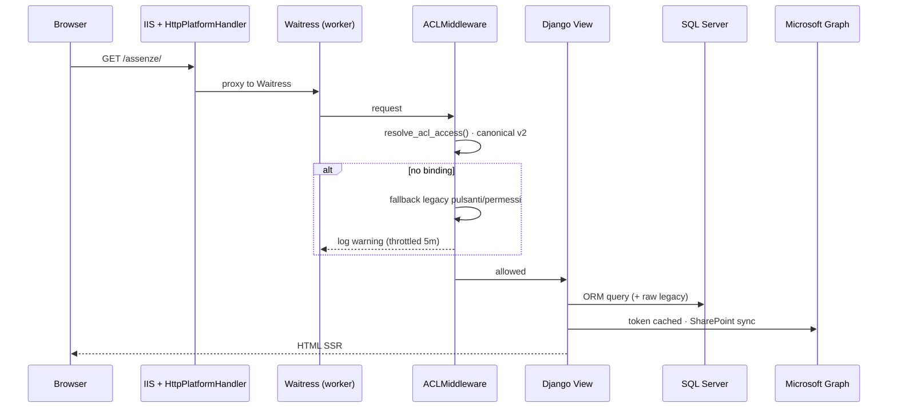
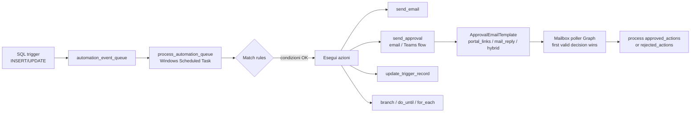
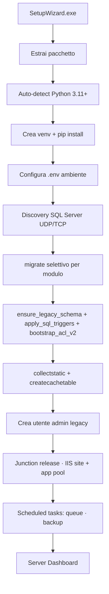

<div align="center">


# NOVICROM HUB

**Il portale interno unificato di Costruzioni Novicrom SRL**
*Workflow · Operations · Sicurezza · Automazioni · Governance*


[Start here](doc/START_HERE.md) · [Manuale tecnico GitHub](doc/README.md) · [Architettura](doc/ARCHITETTURA_TARGET_E_DISMISSIONE_LEGACY.md) · [Testing](doc/TESTING.md) · [Deploy IIS](deployment/README_DEPLOY_IIS_WINDOWS.md) · [ACL v2](doc/ACL_V2_PERMISSION_GUIDE.md)

</div>

---

## 📖 Indice

1. [Cos'è NOVICROM HUB](#-cosè-novicrom-hub)
2. [Anteprima UI](#-anteprima-ui)
3. [Architettura](#-architettura)
4. [Catalogo moduli](#-catalogo-moduli)
5. [Governance & sicurezza (ACL v2)](#-governance--sicurezza-acl-v2)
6. [Automazioni](#-automazioni)
7. [Integrazioni Microsoft 365](#-integrazioni-microsoft-365)
8. [Stack tecnico](#-stack-tecnico)
9. [Quick start](#-quick-start)
10. [Deployment](#-deployment-su-windows-server--iis)
11. [Comandi utili](#-comandi-utili)
12. [Documentazione](#-documentazione-collegata)

---

## 🎯 Cos'è NOVICROM HUB

NOVICROM HUB è il **portale intranet aziendale** di Costruzioni Novicrom SRL: una
piattaforma Django 5.2 che consolida in un unico ambiente **workflow HR**,
**gestione asset**, **compliance sicurezza**, **automazioni aziendali** e
**governance ACL granulare**.

> 💡 I nomi storici (`Portale Novicrom`) restano nel repo solo come esempio di
> istanza o percorso di deploy. La baseline documentale corrente è **NOVICROM HUB**.

### Numeri chiave

| | |
|---|---|
| 🧩 **25 app Django custom** | raggruppate per area funzionale |
| 🔐 **ACL canonico v2** + fallback legacy | migrazione incrementale route-per-route |
| 🤖 **Designer automazioni visuale** | trigger SQL · approvazioni · queue processor |
| 📊 **Dashboard KPI personalizzabile** | widget drag&drop per utente |
| 🔌 **Integrazioni native** | Microsoft Graph · SharePoint · Outlook · LDAP/AD |
| ⚙️ **Setup wizard 14 step** | PyInstaller exe · discovery SQL · IIS config |

---

## 🖼️ Anteprima UI

<div align="center">


</div>

| Assets / Officina | Automazioni |
|:---:|:---:|
|  |  |

<div align="center">


*Pannello manutenzione `/assets/manutenzione/` — KPI strip, OdL urgenti, prossimi 7 giorni, azioni rapide.*

</div>

> Le anteprime sono SVG GitHub-friendly renderizzate direttamente nel browser.
> Per screenshot reali del portale in produzione vedi `/admin-portale/hub/guide/`
> una volta installato.

---

## 🏗️ Architettura


### Principi chiave

- **SSR puro** con Django templates — nessun framework JavaScript lato client
- **Tabelle operative potenziate globalmente**: sort, filtri per colonna, ricerca e preferenze utente sono applicati dal componente `fm-table-enhanced` alle tabelle dati del portale; `data-table-id` resta disponibile per configurazioni esplicite, le tabelle semplici vengono riconosciute automaticamente
- **Layer ACL doppio**: canonico v2 (policy-as-data) + fallback legacy per migrazione incrementale
- **Storage dual-mode**: SQLite in dev, SQL Server in test/prod con driver ODBC 18/17/13 auto-rilevato
- **Deploy Windows-first**: Waitress + HttpPlatformHandler + IIS, installer PyInstaller
- **Cache condivisa multi-worker**: `DatabaseCache` su SQL Server (token Graph, ACL, sessioni)
- **Audit trail fire-and-forget** su ogni operazione CRUD rilevante

### Flusso request tipico


```mermaid
sequenceDiagram
    participant U as Browser
    participant IIS as IIS + HttpPlatformHandler
    participant W as Waitress (worker)
    participant M as ACLMiddleware
    participant V as Django View
    participant DB as SQL Server
    participant G as Microsoft Graph

    U->>IIS: GET /assenze/
    IIS->>W: proxy to Waitress
    W->>M: request
    M->>M: resolve_acl_access() · canonical v2
    alt no binding
        M->>M: fallback legacy pulsanti/permessi
        M-->>W: log warning (throttled 5m)
    end
    M->>V: allowed
    V->>DB: ORM query (+ raw legacy)
    V->>G: token cached · SharePoint sync
    V-->>U: HTML SSR
```

---

## 🧩 Catalogo moduli


### Tutti i 25 moduli custom a colpo d'occhio

| # | App Django | Area | URL prefisso | Sintesi |
|---|---|---|---|---|
| 1 | [`core`](django_app/core/) | Core | — | Middleware ACL, navigation registry, auth backends, audit, notifiche, export, ricerca globale, legacy models |
| 1b | [`twofa`](django_app/twofa/) | Core | `/2fa/` | **2FA**: TOTP app authenticator e OTP email, policy per ruolo/rete interna, setup self-service con QR code, reset/toggle admin, pannello `/admin-portale/2fa/` |
| 2 | [`dashboard`](django_app/dashboard/) | Core | `/` | Home KPI personalizzabile per utente, widget, layout salvato |
| 2b | [`ai_assistant`](django_app/ai_assistant/) | Core | `/assistente-ai/` | Chatbot interno autenticato con console admin AI e backend Ollama/Open WebUI configurabile |
| 3 | [`admin_portale`](django_app/admin_portale/) | Core | `/admin-portale/` | Pannello admin custom: ACL canonico, diagnostica, mappa permessi, attività utente, branding |
| 4 | [`hub_tools`](django_app/hub_tools/) | Core | `/admin-portale/hub/` | Module Manager, DB Manager, Schema infografica, Homepage builder, Guide |
| 5 | [`setup_wizard`](django_app/setup_wizard/) | Core | `/setup/` | Wizard primo setup (anche via `SetupWizard.exe`) |
| 6 | [`monitoring`](django_app/monitoring/) | Core | `/monitoring/` | Monitoring interno, issue tracking, alert email, segnalazioni utente, monitor automazioni |
| 7 | [`anagrafica`](django_app/anagrafica/) | Operations | `/anagrafica/` | **Anagrafica HR**: dipendenti, anagrafica civile/aziendale con permesso dedicato, storico contrattuale + cambiamenti organizzativi, voci retributive, creazione dipendente come flusso onboarding, offboarding con pratica task/restituzioni e chiusura rapporto dalla scheda dipendente, rimessa in forza inversa, **pannello impostazioni unificato** (`/anagrafica/impostazioni/`) per cataloghi, permessi HR e associazione campi onboarding/offboarding, report/export |
| 7b | [`fornitori`](django_app/fornitori/) | Operations | `/fornitori/` | **Anagrafica Fornitori** (modulo e permessi ACL separati da Anagrafica HR): dashboard KPI spesa/ordini/asset, lista filtrabile, scheda fornitore con documenti / ordini / valutazioni qualità / asset assegnati. I modelli restano in `anagrafica.models` per compatibilità con le FK storiche di assets |
| 8 | [`assets`](django_app/assets/) | Operations | `/assets/` | Inventario IT e produzione con tabelle operative comuni, work order, manutenzioni periodiche, calendario asset, planimetrie, licenze SW, export Excel, Outlook sync |
| 9 | [`attrezzature`](django_app/attrezzature/) | Operations | `/attrezzature/` | Gestione Attrezzatura: workflow attrezzi/P-N, import Excel legacy, azioni avanzamento/pronta produzione, link strutturato KICK-OFF |
| 10 | [`tasks`](django_app/tasks/) | Operations | `/tasks/` | Portfolio **KICK-OFF** progetti, attività, Gantt con drag spostamento/resize, timeline eventi leggibile, incontri avanzamento, VRF (MOD.073), blocco progressivo, flag impatto sicurezza |
| 11 | [`planimetria`](django_app/planimetria/) | Operations | `/planimetria/` | Wrapper compat di assets per discoverability layout |
| 12 | [`assenze`](django_app/assenze/) | HR & Workflow | `/assenze/` | Richieste, gestione, calendario, certificazione presenza, sync SharePoint |
| 13 | [`anomalie`](django_app/anomalie/) | HR & Workflow | `/anomalie/` `/anomalie-menu` | Segnalazione e gestione anomalie produzione |
| 14 | [`tickets`](django_app/tickets/) | HR & Workflow | `/tickets/` | Ticket interni con interventi, fermo macchina, ticket ricorrenti |
| 15 | [`timbri`](django_app/timbri/) | HR & Workflow | `/timbri/` | Report timbrature da DB legacy, registro, immagini badge |
| 16 | [`notizie`](django_app/notizie/) | HR & Workflow | `/notizie/` | Bacheca con audience, allegati, letture tracked |
| 17 | [`dpi`](django_app/dpi/) | Sicurezza | `/dpi/` | Dispositivi Protezione Individuale: catalogo gerarchico, richieste, approvazione, consegna firmata, report conformita, reminder scadenze |
| 18 | [`diario_preposto`](django_app/diario_preposto/) | Sicurezza | `/diario-preposto/` | Diario preposto sicurezza con segnalazioni, allegati privati e ispezioni periodiche |
| 19 | [`rilevazione_incidenti`](django_app/rilevazione_incidenti/) | Sicurezza | `/rilevazione-incidenti/` | Unsafe conditions, near miss, incidenti, KPI sicurezza e heatmap planimetria |
| 20 | [`procedure_refresh`](django_app/procedure_refresh/) | Sicurezza | `/procedure-refresh/` | Presa visione procedure MT/MTSI, campagne, matrice formazione, quiz e export CSV |
| 21 | [`rentri`](django_app/rentri/) | Sicurezza | `/rentri/` | Tracciabilità rifiuti (normativa RENTRI) |
| 22 | [`automazioni`](django_app/automazioni/) | Automation | `/automazioni/` | Designer visuale, trigger SQL, queue processor, approvazioni email/Teams, import Power Automate |

> Tutte le app sono disabilitabili dal **Module Manager** in `/admin-portale/hub/moduli/` e selezionabili in fase di setup dal wizard (step 11/14).
> `anagrafica` e `fornitori` sono separati anche nel catalogo permessi: HR usa il modulo `anagrafica`, Fornitori usa il modulo ACL `fornitori` con route `fornitori:*`.
> Il tier di selezione è: **system** (obbligatori: core, anagrafica, dashboard, hub_tools), **standard** (pre-selezionati), **optional** (disattivati di default, per futuro licensing).

### Dettaglio per area funzionale

#### 🧭 Core Platform

<details open>
<summary><b>1. <code>core</code> — fondamenta del portale</b></summary>

L'app trasversale che fa funzionare tutto il resto. Contiene middleware, resolver ACL, legacy models, auth backends, audit trail e context processors.

- **ACL middleware** con resolver canonico v2 + fallback legacy, logging throttled delle decisioni
- **Navigation registry** (`NavigationItem`, `NavigationRoleAccess`, `UserNavigationOverride`) con visibilita derivata dai permission code canonici e fallback legacy solo per voci ancora non mappate
- **Fallback navigazione legacy** con deduplica visuale per modulo, cosi i restore/import non duplicano in sidebar le azioni `pulsanti` dello stesso modulo
- **Restore navigazione controllato** con `restore_navigation_registry`: dry-run di default, backup snapshot in apply e ripristino solo di categorie/menu/fallback ruoli da `fixtures/nav_acl_snapshot.json`
- **4 auth backend in cascata**: `AxesStandaloneBackend` → `SQLServerLegacyBackend` → `LDAPBackend` → `ModelBackend`
- **Audit trail** fire-and-forget via `core.audit.log_action()` su tabella `AuditLog`
- **Centro notifiche** unificato con campanella, badge, pannello HTMX, popup live in-app via polling leggero e sorgenti scadenze asset/DPI/SLA ticket
- **Export riusabile CSV/XLSX** con `core.exporting.ExportMixin` e helper per liste filtrate
- **Legacy models managed** su SQL Server: `Ruolo`, `UtenteLegacy`, `AnagraficaDipendente`, `Pulsante`, `Permesso`
- **Impersonation** admin → utente con middleware dedicato e session key
- **23 modelli Django** (Profile, AuditLog, SiteConfig, Notifica, Checklist*, OptioneConfig, ecc.)
- **Ricerca globale** Ctrl+K su 7 sorgenti (dipendenti, asset, ticket, progetti, task, procedure, DPI), con modulo e preview risultato
</details>

<details open>
<summary><b>2. <code>dashboard</code> — home KPI personalizzabile</b></summary>

Workspace personale dell'utente autenticato. Widget multi-modulo con layout salvato per utente.

- **Widget KPI cross-modulo** (assenze in attesa, ticket aperti, scadenze asset, anomalie…)
- **Drag & drop** dei widget con persistenza `UserDashboardConfig`
- **Template iniziale globale** definibile dagli admin + ripristino rapido
- **Shell viewport-aware** a tutta altezza, no bande vuote in fondo al viewport
- Route legacy `/scheda-dipendente` mantenuto come alias compat
</details>

<details open>
<summary><b>2b. <code>ai_assistant</code> — chatbot interno via Ollama</b></summary>

Superficie minima ed estendibile per chat AI locale, servita da Django e protetta da autenticazione.

- Endpoint `/assistente-ai/` con UI chat ridisegnata: bubble con avatar, indicatore di caricamento animato, effetto typewriter sulle risposte, fonti RAG/live come chip colorati (verdi = dati live `tool:*`, blu = documentazione), domande suggerite contestuali dopo ogni risposta, pannello di personalizzazione stile risposta (operativo/sintetico/dettagliato) con limiti espliciti su cosa l'AI puo' o non puo' fare, contatore caratteri con avviso visivo e scorciatoia `Ctrl+Enter` per inviare. L'API JSON `/assistente-ai/api/chat/` restituisce ora anche `suggested_questions` e accetta preferenze sanificate che non modificano ACL, privacy o tool abilitati.
- Console **Admin Portale -> Gestione AI** (`/admin-portale/ai/`) per provider, runtime, stato componenti, knowledge base RAG e FAQ curate; la Config SRV (`/admin-portale/ldap/`) mantiene la card rapida di configurazione
- Backend Ollama/Open WebUI configurabile dalla console admin oppure via `.env`: `OLLAMA_BASE_URL`, `OLLAMA_CHAT_MODEL`, timeout, temperatura e limiti prompt/storico
- Provider selezionabile: Ollama diretto (`OLLAMA_API_PROVIDER=ollama`, URL tipico `http://host:11434`) oppure Open WebUI (`OLLAMA_API_PROVIDER=openwebui`, URL tipico `http://host:3000`, `OPENWEBUI_API_KEY` da Settings -> Account)
- Se il test Open WebUI restituisce HTTP 401/403, rigenerare la API key in Open WebUI e incollarla nella console: la key salvata non viene mostrata e un nuovo valore la sostituisce.
- La console admin include test connessione a `/api/version` + `/api/tags` per Ollama diretto oppure `/api/models` per Open WebUI
- Se `/api/version` risponde ma `/api/tags` non restituisce JSON valido, la connessione Ollama resta considerata riuscita: il portale avvisa solo che non ha potuto verificare automaticamente il catalogo modelli.
- Per modelli grandi o non gia' caricati in memoria, usare un timeout chat piu' ampio (`OLLAMA_REQUEST_TIMEOUT_SECONDS=180` o fino a 300 dalla console admin) per evitare 502 durante il primo avvio del modello.
- RAG documentale locale configurabile dalla console admin (`OLLAMA_RAG_ENABLED=1`) sui percorsi allowlist `OLLAMA_RAG_SOURCE_PATHS` (default `README.md,docs/ai`): il portale recupera i passaggi rilevanti e li passa a Ollama con fonti citabili
- Tool runtime autorizzati tramite registry estendibile: la chat puo' agganciare piccoli provider server-side per ogni dominio, sempre filtrati dai permessi dell'utente. Gia' disponibili: catalogo moduli visibili in navigazione, Assenze per domande come "chi e' assente domani/oggi?", Ticket per riepiloghi personali o di gestione IT/MAN (aperti, urgenti, risolti), KICK-OFF/Tasks per progetti, attivita' aperte, scadenze, assegnazioni e ritardi visibili, Assets per asset assegnati/visibili, scadenze, OdL, verifiche e stato operativo, DPI per richieste/consegne/scadenze con separazione utente/gestore, Anomalie per riepiloghi autorizzati di segnalazioni aperte/in carico, Procedure Refresh per campagne/prese visione/quiz autorizzati, Notizie pubblicate visibili all'utente, Sicurezza per soli KPI aggregati di Diario Preposto/Rilevazione Incidenti e Anagrafica HR read-only per superuser/admin legacy o ruoli autorizzati (`AnagraficaHRPermission`) con campi aziendali minimi, consenso privacy e ratei ferie/permessi residui in forma sintetica: classifiche o ricerca nominativa, solo ore/periodo e conversione giorni su base 7.5 ore quando richiesta. Il router cross-dominio riconosce domande operative come "cosa devo fare oggi?", consulta i tool pertinenti in ordine di priorita' (sicurezza/compliance, scadenze, ticket urgenti, task in ritardo), applica limiti globali di righe/caratteri e registra audit metadata-only per ogni tool eseguito, autorizzato, negato o non disponibile. I tool passano all'LLM solo campi sintetici consentiti e mai motivazioni, descrizioni complete, note interne, seriali, firme, allegati, path file, URL SharePoint, hash, risposte quiz, dati HR riservati (CF/IBAN/dati sanitari/retributivi/privati/documenti), dettagli cedolino o budget.
- La console **Gestione AI -> Tool live** mostra il catalogo runtime per dominio, stato abilitato/disabilitato, indicatori di chiamate/errori/latenza/contesto, audit filtrabile per tool/esito/periodo, test admin metadata-only con utente simulato e pulsante per svuotare la cache RAG/runtime. Il test non mostra il contenuto live del contesto, solo fonti, tool attivati, scope e conteggi.
- La console **Gestione AI -> Governance** (Fase 5) permette di revisionare la privacy di ogni tool runtime: stato (Da revisionare / Approvato / Uso limitato / Bloccato), campi ammessi/vietati, retention personalizzata, note interne non trasmesse al modello e tracciatura revisore/data. La policy di retention default e' 90 giorni per l'audit AI metadata-only. Il documento [docs/ai/13_AI_GOVERNANCE.md](docs/ai/13_AI_GOVERNANCE.md) contiene la matrice campi per modulo, le policy di retention e il runbook operativo (API key Open WebUI, diagnostica Ollama, ciclo di vita tool).
- Piano di estensione tool live in [docs/ai/12_AI_RUNTIME_TOOLS_TODOLIST.md](docs/ai/12_AI_RUNTIME_TOOLS_TODOLIST.md): checklist per aggiungere nuovi domini con ACL e audit metadata-only; Timbri/Presenze resta rimandato a revisione privacy HR dedicata.
- Apprendimento controllato: gli admin possono salvare dalla chat o dalla console admin una coppia domanda/risposta nella FAQ AI, poi indicizzata dal RAG senza salvare automaticamente le conversazioni
- Le richieste partono dal server Django verso Ollama; il browser non parla direttamente con la workstation
- Audit trail solo su metadati tecnici (modello, lunghezze, latenza, errori), senza salvare prompt o risposte
</details>

<details open>
<summary><b>3. <code>admin_portale</code> — pannello admin custom</b></summary>

Sostituisce il Django admin nativo con un pannello ritagliato sulle operazioni reali del portale.

- **Gestione accessi** semplici canonico-first con toggle per modulo su `RolePermissionGrant`
- **ACL canonico** con 5 tab (Permission, Binding, Role grant, User override, Nav override)
- **ACL route coverage** report con stati e export CSV
- **ACL diagnostica** combinata legacy + canonical con una sola decisione finale chiara e trace completo (CLI equivalente: `python manage.py acl_diagnose --user <email|alias|id> --path </route/>`)
- **Avviso "ACL canonico"** nella pagina permessi legacy: i moduli con binding canonico attivo sono marcati e segnalano che i permessi legacy lì sono ignorati a runtime (linkano ad ACL canonico/diagnostica)
- **Mappa permessi/navigazione** visuale con drill-down cliccabile e toggle live dei grant
- **Navigation Builder** con vista tabellare + **vista drag&drop orizzontale** per sezione
- **Vista attività utente** (`/admin-portale/attivita-utenti/`) sugli ultimi 30 giorni da `AuditLog`, con filtri utente/modulo/testo e export CSV/XLSX
- **Export audit/notifiche**: audit log, attività utente e centro notifiche mantengono i filtri GET negli export CSV/XLSX
- **LDAP settings** + sync/import utenti AD con service account effettivo; nei deploy TEST/PROD salva sul `config/.env` persistente, non sul `.env` della release attiva
- **Branding portale** (favicon, logo, login banner, pagina login personalizzabile)
- **Module Manager** integrato per abilitazione moduli runtime
- **Automazioni admin**: impostazioni runtime, queue list, log mailbox, convertitore Power Automate
- **Eliminazione massiva utenti** (`/admin-portale/utenti/`): pulsante "Elimina selezionati" nella toolbar con confirm JS sul numero righe; per ciascun ID chiama `_delegate_legacy_user_with_dependencies` (release asset, pulizia override/dashboard/profilo Django, unlink anagrafica), salta l'utente corrente, aggrega contatori `deleted`/`errors`/`skipped_self` e registra nell'audit log
- **Crea Release** (`/admin-portale/crea-release/`) con package zip, riavvio IIS TEST/PROD automatico via task schedulato elevato `\PortaleNovicrom\IISRestart_TEST/PROD` e terminale web con preset Django/ACL sull'ambiente selezionato
</details>

<details open>
<summary><b>4. <code>hub_tools</code> — hub strumenti interni admin</b></summary>

Collezione di tool sotto `/admin-portale/hub/` protetti da `@legacy_admin_required`.

- **Module Manager** — abilita/disabilita moduli visibili, configura redirect post-login
- **Database Manager** — statistiche tabelle, backup, pulizia log/sessioni, ottimizzazione, ripristino. Engine rilevato automaticamente (SQLite dev / SQL Server prod)
- **DB Schema infografica** — mappa visuale di tutti i modelli Django con campi, tipi, relazioni FK/1:1/M:M
- **Homepage Builder** — editor visuale layout home per ruolo
- **Setup Wizard Hub** — rilancia il wizard di configurazione (14 step) sul `.env` corrente, normalizzando i booleani `True`/`False` e `1`/`0`; la sezione Microsoft Graph / SharePoint centralizza anche URL libreria asset, root consentita, drive/item ID e feature flag dei link pubblici QR asset.
- **Guide** — catalogo auto-indicizzato di documenti (HTML/PDF/MD) da `tools/`, `doc/`, `deployment/`, con dedup per formato
- **Categorie moduli / branding portale** — raggruppa la navigazione e personalizza nome, loghi upload/URL, favicon e colori globali della shell
</details>

<details open>
<summary><b>5. <code>setup_wizard</code> — wizard primo setup</b></summary>

Wizard Django 12 step raggiungibile su `/setup/`, usato quando `SETUP_COMPLETED=0`. Esiste anche come **installer standalone `SetupWizard.exe`** (14 step) per deploy Windows Server.

- Configurazione `SiteConfig`, `.env`, credenziali admin
- Wizard exe: discovery SQL Server (UDP broadcast + TCP scan + SSRP)
- Selezione moduli **tier-based** (system/standard/optional)
- Migrate selettivo per modulo scelto, con copertura di tutte le app dotate di migration (`anomalie`, `monitoring`, `planimetria` incluse)
- Runtime Python 3.11+ rilevato e validato prima della creazione del virtualenv
- `collectstatic` isolato dai bootstrap ACL runtime, così non apre cache/DB prima di copiare gli asset
- Preflight SQL Server: il database configurato viene creato/verificato prima delle migration; con `DB_TRUST_CERT=True` anche `sqlcmd` usa `-C` e, se serve, fallback ODBC con `TrustServerCertificate=yes`. In sviluppo locale, `DB_ENCRYPT=0` consente di disattivare `Encrypt` per istanze SQLEXPRESS legacy/non compatibili TLS, lasciandolo vuoto nei deploy normali.
- Il wizard web interno preserva `DB_TRUST_CERT` quando si modifica solo LDAP/SMTP, evitando che ODBC Driver 18 perda `TrustServerCertificate=yes` su ambienti con certificato SQL non trusted
- Trigger automazioni SQL idempotenti: `apply_sql_triggers` crea la queue e salta i trigger la cui tabella sorgente legacy/opzionale non esiste nel DB corrente; gli script assenze sono self-guarded anche se lanciati direttamente
- Fail-fast: se venv/pip/migrate/collectstatic falliscono, release **non** attivata
- FinishPage mostra banner rosso "Installazione Incompleta" con countdown 60s
- Server Dashboard integrato con start/stop/restart IIS, reset password live e terminale TEST/PROD con preset Django/ACL
- Server Dashboard — pannello **Servizi Windows**: elenca i servizi rilevanti per l'hosting (IIS `W3SVC`/`WAS`/`AppHostSvc`, SQL Server `MSSQL*`/`SQLAgent*`/`SQLBrowser`/`SQLWriter`) con stato (in servizio / arrestato / avvio / arresto / in pausa) e tipo di avvio (automatico / manuale / disattivato); gestione inline Avvia/Ferma/Riavvia e cambio tipo di avvio, attiva solo se il setup gira come Amministratore
- **Release Manager** (`--mode release`) con quattro operazioni: **Crea Release** (`.zip` completo da DEV), **Promuovi Release** (deploy `.zip` su TEST/PROD) e il flusso **Hotfix** a due fasi — **Crea Hotfix** (`--mode hotfix-create`, rileva i file modificati via git e li impacchetta in un `hotfix-*.zip` leggero) e **Applica Hotfix** (`--mode hotfix-apply`, estrae il pacchetto hotfix sul release attivo `current\`, esegue eventuali management command e ricicla IIS, senza nuova release)
</details>

<details open>
<summary><b>6. <code>monitoring</code> — osservabilità interna</b></summary>

Superficie di monitoring del portale, issue tracking interno e segnalazioni utenti.

- **Issue tracking** interno per bug segnalati dagli utenti
- **Alert email** su eventi di sistema configurabili
- **Monitor automazioni** con health card della queue
- **Segnalazioni utente** dirette all'admin
- **Liveness/readiness probe** runtime (`/healthz`, `/readyz`) con check su DB, cache, Graph, LDAP, SMTP e queue automazioni; risultato memoizzato in cache, IP allowlist via `HEALTHZ_ALLOWED_IPS`. Riusabili da `validate_deployment --with-integration` per coerenza tra deploy validation e runtime
- CSS dedicato in `static/monitoring/css/monitoring.css` verificato in `collectstatic`
</details>

---

#### 🏭 Operations

<details open>
<summary><b>7. <code>anagrafica</code> — dipendenti e HR</b></summary>

Anagrafica master HR del portale, integrata con Active Directory e tabelle legacy SQL Server. Gestione strutturata HR con livelli di visibilità differenziati. **L'anagrafica fornitori è ora un modulo dedicato — vedere `fornitori` qui sotto.**

- **Bridge pattern**: `DipendenteAnagraficaCivile` e `DipendenteAnagraficaAziendale` referenziano la tabella legacy `anagrafica_dipendenti` tramite `legacy_anagrafica_id` — nessuna modifica alle tabelle legacy
- **Anagrafica civile** (admin): dati nascita/genere, **provincia di nascita** (sigla), **nazionalità**, residenza completa, domicilio, titolo di studio, contatti privati, patente — inline editabile dalla scheda dipendente
- **Figli a carico** (`FiglioACarico`): flag "Figli a carico" + elenco figli con data di nascita (età calcolata automaticamente); la quantità (`numero_figli`) è derivata dai record registrati e il flag si riallinea al salvataggio. Sia nella scheda dipendente sia nel wizard di creazione la sezione figli ha un pulsante **"+ Aggiungi figlio"** per aggiungere righe dinamicamente ed è **abilitata solo quando il flag "Figli a carico" è spuntato**
- **Anagrafica aziendale** (admin): area, ruolo aziendale, **badge** (indicizzato), **data assunzione corrente** e **data cessazione**, taglie DPI, contatti aziendali, consenso privacy — inline editabile. Il contratto/livello CCNL è ora gestito dallo storico contrattuale.
- **Import massivo da Excel HR** via `python manage.py import_dipendenti_xlsx <file.xlsx>` con flag `--dry-run`, `--update-existing`, `--limit N`, `--sheet <nome>`, `--verbose-errors`. Matching idempotente prioritizzato su codice fiscale → email aziendale → nome+cognome; normalizzazione automatica di IBAN, telefoni, date, taglie, genere, rapporto di lavoro (Dipendente→`INDETERMINATO`, Somministrato→`SOMMINISTRAZIONE`), titolo di studio. Ogni riga in transazione atomica isolata → un singolo errore non blocca l'import. Report finale con conteggi e primi 50 errori per riga.
- **Import storico retributivo da Excel** via `python manage.py import_retribuzioni <file.xlsx>` con flag `--dry-run`, `--foglio <nome>`, `--user-id N`, `--verbose`. File con colonne `tax_code | nome | pay_item | value | date`: crea una `ImportazioneRetributiva` per mese di competenza, popola le `VoceRetributiva` classificate, risolve `legacy_anagrafica_id` per codice fiscale con fallback nome, e rileva le variazioni di importo rispetto all'ultima importazione precedente.
- **Dati riservati HR** (permesso `AnagraficaHRPermission` singleton): codice fiscale, IBAN (display mascherato), dati bancari, categorie protette/disabilità con percentuale — visibili solo agli utenti autorizzati
- **Foto dipendente** (dato personale, storage privato): caricabile dall'anagrafica civile in creazione o dalla scheda dipendente; usata come avatar nella lista `/anagrafica/dipendenti/` e nella testata scheda, con fallback grigio neutro se assente. Il file è salvato in `ANAGRAFICA_PRIVATE_ROOT=media_private/` (`PrivateAnagraficaStorage`, fuori webroot, cifrabile at-rest) e **non** è esposto su URL pubblico `/media/`: viene servito inline dalla view protetta `anagrafica:foto_dipendente` (`/anagrafica/dipendenti/<legacy_id>/foto`, richiede autenticazione).
- **Username unico dipendente/account**: lo username del dipendente (`aliasusername`) è l'unica fonte di verità e si modifica solo dalla scheda dipendente (campo Username). Il salvataggio normalizza il valore e lo propaga automaticamente, in transazione, anche all'account portale Django collegato; nell'admin utenti il campo username è di sola lettura. Riallineamento degli account esistenti via `python manage.py reconcile_usernames` (dry-run di default, `--apply` per applicare, `--legacy-id N` per un singolo dipendente).
- **`AnagraficaHRPermission`** configurabile dal pannello impostazioni o da admin Django: TUTTI / ADMIN / RUOLI ACL specifici
- **Storico cambiamenti organizzativi** (`DipendenteCambiamentoOrganizzativo`, gated admin): log automatico dei cambi di mansione, reparto, area e ruolo aziendale generato da hook nelle view di modifica (`dipendente_mansione_set`, nuova `dipendente_reparto_set`, `dipendente_anagrafica_aziendale_save`). Card timeline nella scheda dipendente con filtro per tipo, badge colorato e autore+timestamp. Admin Django read-only
- **Storico contrattuale CCNL** (`StoricoContratto`, gated HR): periodi `data_inizio`/`data_fine` con tipologia contratto, livello (cataloghi `TipologiaContratto` e `LivelloContrattuale`), qualifica professionale, CCNL. Import CSV massivo `/anagrafica/contratti/` (formato `Codice fiscale;Data Inizio;Data Fine;Tipo di contratto;Qualifica;Livello;CCNL;Descrizione livello`, encoding auto-detect) + CRUD manuale con auto-chiusura del record "in corso" quando ne inizia uno nuovo
- **Voci retributive** (`VoceRetributiva`, gated HR): card "💰 Voci retributive" nella scheda dipendente con classificazione automatica fissi/variabili/totali/altri. **Import CSV mensile** dallo studio paghe (`/anagrafica/retribuzioni/`, admin-only) con rilevamento automatico variazioni rispetto al mese precedente. **Storico retributivo a pivot** su `/anagrafica/dipendenti/<id>/retribuzioni/`: tabella mesi × voci in stile Excel, righe raggruppate per anno (collassabili — anno corrente e precedente espansi di default), colonne ordinate per categoria (Fissi → Variabili → Altri → Totali), celle con variazione rispetto al mese precedente evidenziate in azzurro/verde, header e prima colonna sticky. **Export Excel** del pivot via pulsante "↓ Esporta Excel" (`/anagrafica/dipendenti/<id>/retribuzioni/export.xlsx`) — `.xlsx` con stesso layout, freeze su prima riga/colonna, formato valuta italiano e highlight delle variazioni. **Data-entry manuale** (HR/admin): pulsante "+ Voce manuale" per inserire singole voci; modifica/eliminazione via click sulla cella manuale (bordo viola, icona ✎) che apre una modale di edit. Le voci manuali (flag `manuale=True`) fanno override delle voci CSV con stesso `pay_item_key` nello stesso mese
- **Pannello impostazioni unico** su `/anagrafica/impostazioni/` con tab verticali per gestire cataloghi, permessi e workflow del modulo: Mansioni, **Reparti** (catalogo con caporeparto assegnato dalla lista dipendenti — modello legacy `AreaAziendale` mantenuto per compatibilità schema/URL), Ruoli aziendali, Ruoli operativi sicurezza, Qualifiche professionali, **Livelli contrattuali CCNL** (A1, B3...DIR - `LivelloContrattuale`), **Tipologie contratto** (`TipologiaContratto`), documenti/navigazione, Permessi e **Onboarding / Offboarding**. Quest'ultimo tab associa i campi reali del form `+ Nuovo dipendente` alla lista operativa onboarding/offboarding; le voci Offboarding attive generano task automatici nelle pratiche di uscita. Le URL standalone (`/anagrafica/mansioni/`, `/anagrafica/aree/`, ...) restano funzionanti come scorciatoie dirette.
- **Creazione dipendente / onboarding** su `/anagrafica/dipendenti/nuovo/` con form a 4 sezioni collassabili e macro-aree titolate; cascade create legacy → civile → aziendale in transazione. Il campo **Reparto** è un dropdown sul catalogo `Reparto` (non più testo libero): alla creazione **area aziendale e caporeparto vengono assegnati automaticamente** dal reparto scelto (`_sync_aziendale_from_reparto`), e la sezione "Anagrafica civile" include la gestione dei **figli a carico** (flag + righe con "+ Aggiungi figlio"). La sezione "Contratto e inquadramento" alla creazione crea contestualmente il primo `StoricoContratto` (tipologia, livello CCNL, ccnl, qualifica, date inizio/fine) se compilata; eventuali passaggi di altri reparti verranno agganciati a questo flusso, non a una sezione onboarding separata.
- **Offboarding / Rimetti in forza** dalla scheda dipendente (`/anagrafica/dipendenti/<id>/`): gli admin avviano una pratica con motivo, un'unica data uscita e task di restituzione/chiusura (HR, IT, responsabile, DPI, amministrazione). Il dipendente resta in forza finche la pratica non viene chiusa; la chiusura e consentita solo quando tutti i task sono completati o marcati come eccezione e, solo allora, valorizza `data_cessazione`, disattiva il record legacy e scollega l'account portale. Il tasto "Rimetti in forza" rimuove la data cessazione, riattiva il record legacy e ricollega automaticamente l'account portale quando e disponibile l'ID pre-offboarding o viene trovato un account univoco tramite email, alias o nome/cognome.
- **Report dipendenti** `/anagrafica/dipendenti/report/` con filtri avanzati (area, contratto, consenso privacy, categoria protetta) e export CSV (esclusi campi HR sensibili per sicurezza)
- **Ordinamento e avatar lista dipendenti**: `/anagrafica/dipendenti/` viene ordinata all'accesso per dipendente A-Z (`cognome nome`) prima della paginazione; ogni riga mostra la foto caricata oppure un avatar grigio neutro se assente.
- **Lista dipendenti** `/anagrafica/dipendenti/` con filtri server-side (nome, reparto, area, **tipo contratto popolato dal catalogo `TipologiaContratto`** non piu hardcoded) e tabella potenziata da `fm-table-enhanced`: sort, filtri per colonna, ricerca globale, gestione colonne e preferenze utente persistite.
- **Ordinamento/filtro per colonna** disponibile globalmente sulle tabelle dati del portale: le tabelle con `data-table-id` usano la configurazione esplicita, quelle semplici vengono riconosciute automaticamente; colonne data e numeriche sono inferite quando possibile, mentre colonne azioni, tabelle tecniche, stampe e matrici vengono escluse.
- **Ratei Ferie / ROL / Ex-Festivita** (`SaldoCedolino`, gated HR): vista aggregata `/anagrafica/ratei/` con filtri per mensilita, dipendenti e reparti; export XLSX `/anagrafica/ratei/export/` che conserva i filtri correnti e genera header a gruppi Ferie/ROL/Ex-Festivita con freeze pane.
- **Retribuzioni — Vista globale** (`VoceRetributiva`, gated HR): pagina pivot `/anagrafica/retribuzioni/globale/` con una riga per ogni combinazione dipendente+mese e una colonna per ogni `pay_item` raggruppata per categoria (Fissi/Variabili/Totali/Altro). Filtri per dipendente (multi-select con ricerca), reparto (multi), livello contrattuale (multi), sesso e mensilita; le voci manuali HR fanno override sul CSV con badge "M". Export XLSX `/anagrafica/retribuzioni/globale/export.xlsx` che conserva i filtri correnti, con header a due righe categoria/voce e colonne fisse Dipendente/Periodo/Reparto/Livello/Sesso.
- **Ruoli operativi** aggiuntivi assegnabili dalla scheda dipendente (preposto, RSPP, squadra antincendio, ecc.)
- **Qualifiche** con scadenze, stato in-scadenza (60gg) e storico per dipendente
- **Visite mediche** (`TipoVisitaMedica`, `VisitaMedica`, gated `AnagraficaVisiteMedichePermission`): catalogo tipologie con `durata_mesi` e M2M verso `RuoloOperativo` (la visita è obbligatoria per il dipendente se ha almeno un ruolo collegato). Registrazione visita con esito (idoneo/idoneo con prescrizioni/non idoneo) e referto allegato opzionale (storage privato). La `data_scadenza` è calcolata in `save()` come `data_svolgimento + durata_mesi` (helper Python-only `_add_months`, nessuna dipendenza esterna). Servizio `services/visite.stato_visite(legacy_id)` produce gli stati `mancante`/`valida`/`in_scadenza`/`scaduta`. Management command `send_visite_expiry_reminders --days 60` per il digest email + notifica al dipendente. Default permesso: solo superuser + admin legacy (dato sanitario).
- **DPI consegnati all'ingresso**: nel form di creazione dipendente, dopo la scelta dei ruoli operativi, HTMX propone le categorie DPI `obbligatoria_mansionario=True`; HR conferma e il salvataggio crea `RichiestaDPI`+`ConsegnaDPI` (firma differita) e archivia un PDF cumulativo nello spazio documenti del dipendente. Servizi: `services/dpi_ingresso.crea_consegne_iniziali`, `archivia_pdf_cumulativo`. Endpoint HTMX: `anagrafica:htmx_dpi_iniziali`.
- **Spazio documenti dipendente** (`DocumentoDipendente`, storage privato `PrivateAnagraficaStorage` in `ANAGRAFICA_PRIVATE_ROOT=media_private/`): card "📄 Documenti" con tipi `DPI_CONSEGNA`/`VISITA_MEDICA_REFERTO`/`ALTRO`. Download solo via view protetta `anagrafica:documento_download` con ACL e audit; i referti visite mediche richiedono il permesso visite. **Nessun documento dipendente è esposto su URL pubblico.**
- **PDF modulo consegna DPI** (`dpi/pdf.py::render_modulo_consegna_dpi`): generato automaticamente alla registrazione di una consegna in `dpi/views.py::consegna_richiesta` e archiviato come `DocumentoDipendente`. Idempotente: una nuova consegna re-genera/sovrascrive. Firma `data:image/png;base64,…` decodificata e incorporata nel PDF.
- **Stats dashboard dipendente** con layout drag&drop salvato per utente
- **Sync LDAP/AD** con `sync_ldap_users`, paging configurabile, credenziali service account su `config/.env`
- **Fallback email** automatico `email_notifica` → `email` per notifiche legacy
</details>

<details open>
<summary><b>7b. <code>fornitori</code> — anagrafica fornitori (modulo dedicato)</b></summary>

Modulo dedicato all'anagrafica fornitori, scorporato da `anagrafica` per separare nettamente la gestione HR da quella commerciale/operativa. URL prefix `/fornitori/` con namespace `fornitori:*`; nel catalogo permessi admin usa il modulo `fornitori` separato da `anagrafica` e binding ACL v2 compatibili con i permessi legacy `legacy.fornitori.*`.

- **Dashboard** `/fornitori/` con hero verde, KPI (attivi/inattivi/spesa totale/ordini/asset assegnati), ultimi fornitori e top 5 spesa per categoria con barre orizzontali
- **Lista filtrabile** `/fornitori/elenco/` con ricerca per ragione sociale/P.IVA/città, filtro categoria, filtro stato attivo, paginazione
- **Scheda fornitore** `/fornitori/<id>/` con anagrafica completa, **documenti** allegati (PDF/Office/immagini, validazione MIME+estensione, 15MB max), **ordini** con stato e importo (somma in spesa totale), **valutazioni qualità** (qualità/puntualità/comunicazione su 5 stelle, media calcolata), **asset assegnati** (collegamento al modulo `assets`)
- **CRUD** completo `+nuovo` / modifica / toggle attivo, con form Django `FornitoreForm` (ragione sociale, P.IVA, codice fiscale, indirizzo, contatti, PEC, website, categoria)
- **Compatibilità DB**: i modelli `Fornitore`, `FornitoreDocumento`, `FornitoreOrdine`, `FornitoreValutazione`, `FornitoreAsset` restano fisicamente in `anagrafica.models` (tabelle `anagrafica_fornitore*` invariate) perché referenziati da ForeignKey storiche in `assets.models` (`PeriodicVerification.supplier`, `WorkOrder.supplier`, `AssistanceContract.supplier`). La separazione è quindi a livello di app Django (URL/views/forms/templates/ACL), non di schema database
</details>

<details open>
<summary><b>8. <code>assets</code> — inventario e manutenzioni</b></summary>

Modulo più ricco del portale per gestione patrimonio aziendale: macchinari, IT, infrastruttura, software.

- **35+ modelli**: Asset, AssetCategory, AssetITDetails, WorkMachine, WorkOrder, WorkOrderAttachment/Log/Checklist, WorkOrderChecklist, MaintenanceChecklistStep, PeriodicVerification, MaintenanceRule, MaintenanceRuleAssetOverride, MaintenanceInterventionTemplate, AssetMeter, AssetMeterHistory, AssetMaintenanceRuleState, SoftwareLicense, AssetEndpoint, PlantLayout/Area/Marker, AssetDocument, AssetLabelTemplate…
- **Tipi asset**: PC, Portatile, Server, VM, Firewall, Stampante, Dispositivo, Fonia, CNC, Macchina di lavoro, Carroponte, Videosorveglianza, Altro
- **Numero interno asset** (`internal_number`): campo dedicato al codice fisico/matricola in uso in azienda, visibile come sottotitolo nelle liste (`#TAG · N.xxx`) e nell'header dettaglio. Include la ricerca rapida in lista asset, dispositivi, scadenzario e autocomplete ticket
- **Pagina manutenzione unica a tab** su `/assets/manutenzione/`: consolida le tre vecchie dashboard (Hub · Scadenzario · To-do) in un'unica pagina con KPI strip condivisa e due tab. **Da fare** (`?tab=da_fare`): OdL in ritardo/recenti, scadenze e verifiche urgenti/imminenti, macchine in scadenza, ticket MAN, prossimi 7 giorni, azioni rapide e statistiche mese, con filtri reparto/manutentore. **Scadenzario** (`?tab=scadenzario`): sotto-tab Verifiche · Scadenze amministrative · Contratti (chip asset, filtro scope, pill stato). Le vecchie URL `/manutenzione/scadenzario/` e `/manutenzione/todo/` rimandano qui via redirect 301 con la tab pre-selezionata. La sidebar ha un nodo unico **Manutenzione** con sottovoci Da fare · Scadenzario · Impostazioni
- **Assegnazione manutentore preventiva** (`WorkOrder.assigned_to`): campo dedicato al tecnico preassegnato; la todo list filtra per utente, non-admin vede solo i propri
- **Checklist da template** (`MaintenanceChecklistStep`): step pre-compilati per ogni `MaintenanceInterventionTemplate`, copiati automaticamente come `WorkOrderChecklist` alla creazione di un OdL da regola
- **Inventari asset** su `/assets/lista/`, `/assets/dispositivi/` e `/assets/work-machines/` con tabelle operative allineate sulle colonne comuni **Asset, Stato, Categoria, Responsabile, Collocazione, Produttore, Modello, Seriale, Aggiornato**. I dati specialistici (IP/VLAN, capability macchina, foto, manutenzioni, campi dinamici e note tecniche) restano nella scheda del singolo asset, così le liste rimangono confrontabili e leggere
- **Inventario IT** su `/assets/dispositivi/` — tabella filtrabile per tipo (Server, PC, Rete, TVCC, Fonia), stato, reparto
- **Inventario produzione** su `/assets/work-machines/` — tabella con badge disponibilità (Libera/Occupata/Manutenzione), filtro per tipo (CNC/Carroponti/Macchine Utensili), export Excel
- **Inventario** canonico su `/assets/lista/` con ripristino automatico link filtrati legacy
- **Dashboard e categorie**: i chip categoria della dashboard aprono l'inventario canonico con filtro `asset_category=<id>`; eventuali link storici `category=<id>` vengono reindirizzati al filtro corretto.
- **Categorie asset gerarchiche** e **campi dinamici** configurabili dalla tab `Categorie asset` di `/assets/impostazioni/`; la tab mostra impatto operativo, contatori, preview degli asset collegati in popup e azione rapida per pubblicare la categoria nel menu laterale come lista filtrata. Il catalogo CSV/XLSX puo creare categorie padre (`famiglia`) e sottocategorie (`sottocategoria`) con `import_assets_catalog` (per i file XLSX vengono elaborati tutti i fogli; `produttore`/`modello` finiscono nei campi dedicati, le altre colonne non standard in `extra_columns`)
- **Specifiche tecniche pulite per categoria**: nella scheda asset la card `Specifiche tecniche` mostra solo campi valorizzati, includendo le caratteristiche specifiche della categoria e nascondendo righe vuote/placeholder (`N/D`, `-`); i booleani reali `False` restano visibili come `No`.
- **Categoria Antincendio** seedabile con management command `seed_assets_antincendio`: crea/aggiorna `AssetCategory(code="antincendio")`, campi dinamici e preset "Prova antincendio", senza introdurre nuovi tipi asset o file migration dedicati
- **Assegnazione asset guidata**: nei form asset/macchine l'assegnatario puo essere scelto da anagrafica dipendenti con ricerca oppure come reparto intero; reparto e collocazione vengono precompilati e restano modificabili.
- **Etichette QR asset**: il PDF `/assets/view/<id>/qr-label/` genera di default un QR verso la route pubblica tokenizzata `/assets/public/<token>/` quando esiste un link pubblico SharePoint read-only (`sharepoint_public_url`) generato via Graph; in assenza del link pubblico non usa piu l'URL SharePoint interno e resta il fallback alla scheda asset, mentre `?target=detail` forza ancora la scheda. Se `SITE_URL` e configurato (es. `https://hub.cnovicrom.local`), le route QR usano questa base canonica anche dietro IIS/Waitress, evitando link `http` generati da request interne. Feature flag e root/drive consentiti dei link pubblici sono gestibili dalla tab configurazione di `/assets/impostazioni/` e dal pannello centrale `/admin-portale/hub/setup-wizard/#sec-graph`.
- **Documenti asset + SharePoint**: le macchine di lavoro supportano upload multipli per Specifiche/Manuali/Interventi anche dalla card Documenti del dettaglio asset; prima del caricamento l'utente sceglie se lasciare i nuovi file solo in locale nel portale oppure sincronizzarli su SharePoint via Graph. I file vengono validati, salvati come `AssetDocument` e serviti tramite download autenticato `/assets/documenti/<id>/download/` quando resta solo la copia locale. La cartella SharePoint puo essere lasciata in modalita automatica con percorso root amministrabile (default `ASSET CN`) e struttura `<root>/<tag asset>` con le tre sottocartelle distinte `manuali`, `specifiche`, `interventi` predisposte automaticamente, con preview nel form; se non esistono vengono create via Graph. Oltre alle tre di base, admin/gestori asset possono aggiungere **cartelle documento extra per `AssetCategory`** dalla card Documenti della scheda asset (modello `AssetCategoryDocumentFolder`): una cartella vale per tutti gli asset della categoria, non e rinominabile (slug stabile) e si puo disattivare con soft-delete solo se non contiene documenti. Le cartelle asset salvano anche `drive_id`/`item_id` per consentire, con feature flag esplicito, la creazione di link pubblici Graph `anonymous/view` solo sotto la root consentita tramite `assets_ensure_public_share_links`. Le cartelle asset e ogni file caricato su SharePoint ricevono colonne metadato per l'indicizzazione (`AssetTag`, `AssetCategoria`, `AssetSottocategoria`, `AssetProduttore`, `AssetModello`, `AssetMatricola`, `AssetStato`, `AssetReparto`, `AssetTipoDocumento`), create automaticamente nella libreria se mancanti. Dalla card Documenti ogni file portale ha un pulsante **cestino** che ne elimina il record, la copia locale e — se sincronizzata — anche la copia su SharePoint. Sono supportati anche i file `.msg` (messaggi Outlook) e l'**upload di un'intera cartella** (pulsante "Carica cartella", input `webkitdirectory`): su SharePoint viene mantenuta la struttura relativa della cartella selezionata e delle sottocartelle dentro la categoria attiva, i file caricati da cartella conservano il **nome originale** (i file singoli mantengono invece il nome univoco anti-sovrascrittura) e nella card Documenti vengono mostrati **raggruppati per cartella di origine** (campo `AssetDocument.relative_folder`); i file di sistema vengono ignorati. Il **sync inverso** SharePoint → portale è gestito dal management command `sync_asset_documents_from_sharepoint [--asset <tag>] [--dry-run]` (schedulabile): percorre **ricorsivamente** le sottocartelle di `manuali`/`specifiche`/`interventi`, importa come riferimento i file aggiunti direttamente su SharePoint (anche annidati, conservando la cartella di origine in `relative_folder`), rimuove dal portale quelli cancellati su SharePoint e aggiorna i link modificati, senza toccare i documenti solo-locali. Il command `assets_ensure_sharepoint_metadata [--asset <tag>] [--dry-run|--apply]` esegue il **backfill delle colonne metadato** sulle cartelle asset `ASSET CN/<tag>` (e relative sottocartelle) già esistenti, create prima del supporto ai metadati. Guide operative: `docs/assets/SHAREPOINT_UPLOAD_REVIEW.md`, `docs/assets/SHAREPOINT_CARTELLE_ASSET_GUIDE.md`
- **Work Order** (ordini di lavoro) con origin (PERIODIC/MANUAL/TICKET), executed_by, reference_batch, notes, allegati, log cronologico, fornitori associati
- **Manutenzione periodica** come categoria della manutenzione (`/assets/manutenzione/verifiche/`), redirect legacy preservato. La pagina supporta **toggle Griglia / Elenco** (default griglia, persistenza in `localStorage`) per gestire molti piani senza scroll infinito. Per ogni piano (es. "Cambio olio") mostra lo **storico esecuzioni** filtrato per asset selezionato e finestra temporale (12/24 mesi/tutto), con pulsante inline **+ Registra esecuzione**: il form è multi-asset (tutti gli asset del piano pre-selezionati con checkbox "Seleziona / deseleziona tutti") e crea un OdL preventivo chiuso per ogni asset selezionato in un'unica transazione, aggiornando last/next date del piano. Il form supporta **upload allegati** (verbali, report, foto) salvati come `WorkOrderAttachment`. Lo stesso storico (ultimi 12 mesi) compare nella card *Manutenzione periodica* del dettaglio asset
- **Pattern unificato esecuzioni** (manutenzione periodica, regole giorni-base, scadenze amministrative): ogni superficie espone un form inline (data, durata, costo €, note/risoluzione, **allegati multipli**) per registrare il completamento. Verifiche e regole creano un `WorkOrder` chiuso con costo per le estrazioni KPI e gli allegati salvati come `WorkOrderAttachment` (visibili dal workorder e dall'asset); le scadenze creano un record `AssetAdministrativeDeadlineCompletion` con allegati propri salvati come `AssetAdministrativeDeadlineCompletionAttachment` (campo file `completion_files`, stessi limiti MIME/estensioni dei documenti asset, path logico `assets_admin_deadlines/<asset_tag>/<completion_id>/`, storage privato `ASSETS_PRIVATE_ROOT` e download autenticato da `/assets/scadenze/allegati/<id>/download/`; migrazione operativa file legacy: `manage.py migrate_admin_deadline_attachments_private --apply --delete-source`) e — opzionalmente — rinnovano la `due_date`. I widget dashboard "Scadenze scadute"/"Scadenze 30gg" linkano direttamente alla pagina scadenze con il form di completamento già aperto sulla riga (`?focus_deadline=<id>`)
- **Audit log download** allegati sensibili (non loggati path fisici, contenuto file, token o segreti)
- **Scadenzario unificato** su `/assets/manutenzione/prossime/`: oltre alle regole manutenzione giorni-base, la pagina elenca anche le **verifiche periodiche pianificate** (sezione dedicata sopra lo scadenzario regole) con stato `Scaduta / In scadenza / Pianificata`, filtri condivisi (asset, status, ricerca) e link diretti al piano. I KPI di sintesi sommano regole + verifiche periodiche
- **Planimetrie** con marker posizionabili, aree, officine, TVCC; dai form asset/macchine e' disponibile una spunta per creare subito il marker sulla planimetria attiva.
- **Calendario asset** su `/assets/calendario/` — vista mensile (FullCalendar) + Gantt (frappe-gantt) con filtri macchina/reparto
- **Licenze software** (software, antivirus, Office) assegnabili ad asset o dipendenti su `/assets/licenze/`
- **Sync Outlook** via Graph per scadenze manutenzioni/contratti/verifiche (tracking anti-duplicati)
- **Dashboard KPI personalizzabile** con 12 widget (scadenze, OdL, verifiche, ripartizioni) e drag&drop
- **KPI per famiglia asset** nella dashboard assets: filtro `family=<AssetCategory.id>`, card per asset/stati/OdL/ticket MAN/ore fermo e box Antincendio basato sulla categoria `antincendio`
- **Logo modulo** personalizzabile dalla tab Configurazione
- **Etichette asset** con template stampabili
- **Registro manutenzione unificato** su dettaglio asset: unisce WorkOrder (interventi esterni) e ticket MAN (manutenzioni straordinarie interne con `include_in_maintenance_register=True`) in un unico elenco ordinato per data, con badge distinti per sorgente, tecnico/fornitore appropriato e stati localizzati (PATCH 21E)
- **Generazione massiva WorkOrder** da regola/categoria: service `generate_workorders_for_rule(rule, user=None)` crea un WorkOrder per ogni asset della categoria con `reference_batch` comune non vuoto, `origin=PERIODIC`, `kind=PREVENTIVE` e prevenzione duplicati nello stesso batch (PATCH 21A-FINAL)
- **Test completi registro manutenzione**: 10 test dedicati per creazione WorkOrder manuale, registro manutenzione asset, generazione massiva, `reference_batch`, verifica cross-asset, upload allegati rapportino, visibilita allegati, registro unificato PERIODIC/MANUAL/TICKET, esclusione ticket IT e ticket MAN con flag (PATCH 21A-FINAL)
- **Piano ammodernamento manutenzione** (P1–P3 completato):
  - **Checklist OdL** (`/assets/workorders/<id>/checklist/`): step-by-step spuntabili con toggle HTMX e audit `done_at`/`done_by`. Modello `WorkOrderChecklist`
  - **Segnalazione rapida operatore** (`/assets/segnala/`): form semplificato per aprire un ticket MAN con asset precompilato da QR code
  - **Landing mobile QR code** (`/assets/qr/<asset_tag>/`): pagina mobile-first scansionabile da QR fisico su macchina — stato, OdL aperti, ultima manutenzione, CTA segnalazione
  - **Contatori macchine** (`AssetMeter`): tracciamento ore/km/cicli per asset con storico aggiornamenti. Aggiornamento rapido HTMX dalla scheda asset e dalla dashboard officina. Il command `generate_scheduled_workorders` usa i contatori come trigger per le regole `HOURS/KM/CYCLES`
  - **Report costi per asset**: sezione "Analisi costi" nella scheda asset — costo mese/trimestre/anno, breakdown per tipo intervento con progress bar, delta YoY, costi scadenze amministrative incluse
  - **Vista to-do manutenzione**: OdL aperti, scadenze imminenti, verifiche periodiche, macchine utensili e ticket MAN con filtro reparto — ora è la tab **Da fare** della pagina manutenzione unica (`/assets/manutenzione/?tab=da_fare`); `/assets/manutenzione/todo/` resta come redirect. Ogni intervento aperto ha azioni inline: **Prendi in carico** (assegna l'OdL all'utente corrente senza chiuderlo — `assets:wo_claim`) e **Chiudi ›** (link diretto alla pagina di chiusura). La tab **Scadenzario** mostra empty-state guidati con CTA quando una sezione (verifiche/scadenze/contratti) è vuota, e le pagine "Gestione completa" condividono l'estetica del hub (card/KPI uniformati)
  - **Consolidamento `PeriodicVerification` → `MaintenanceRule`**: campo `is_legacy` + management command `migrate_periodic_to_rules` per migrazione guidata con `--dry-run`/`--apply`
  - **Command schedulabile** `generate_scheduled_workorders`: genera OdL preventivi automaticamente da `MaintenanceRule` attive (DAYS/HOURS/KM/CYCLES), idempotente, con `--dry-run`/`--category`/`--limit`

</details>

<details open>
<summary><b>9. <code>tasks</code> — branding KICK-OFF</b></summary>

Portfolio gestione progetti con workflow documento **VRF** (MOD.073). Presentato agli utenti come "KICK-OFF".

- **Modelli operativi KICK-OFF**: Project, Task/SubTask, commenti, allegati, VRF, ruoli/accessi, `KickoffMeeting`, `MeetingIssue`, `MeetingRoom` + singleton `TaskImpostazioni`
- **Kickoff = progetto** con numerazione automatica `KICK-OFF <progressivo>`
- **Identità univoca** su `part_number + revisione + versione` — riuso automatico, niente duplicati
- **Timeline eventi attività**: il dettaglio task mostra una storia operativa leggibile (stato, date, assegnatari, subtask, allegati) con payload tecnico ancora consultabile in disclosure audit
- **Gantt KICK-OFF**: drag al centro della barra per spostare inizio/fine insieme; drag sui bordi per allungare o accorciare solo inizio/fine mantenendo separata la durata dallo shift date
- **VRF upload workflow**: dopo creazione kickoff, redirect a `/tasks/projects/<id>/vrf/` per caricare il MOD.073 Excel
- **Parsing automatico** celle fisse del .xlsx (B3=P/N, I3=Descrizione, P3=Esp, O2=Preventivo, P2=Versione, B4=Cliente) con anteprima
- **Blocco progressivo VRF**: warning dopo `vrf_reminder_days` (default 7g), **bloccante** dopo `vrf_blocking_days` (default 30g) — guardati da `task_create` e `task_edit`
- **Stati VRF**: `PENDING` / `UPLOADED` / `NOT_REQUIRED` con badge colorato nel portfolio
- **Copia kickoff** con due varianti: "Copia kickoff e VRF" e "Copia kickoff e VRF tranne P/N" (svuota cella B3 del workbook)
- **Incontri di avanzamento**: ogni kickoff ha incontri numerati con agenda strutturata, partecipanti portale/esterni, sale riunioni configurabili, sync Outlook e tracker problemi. I problemi non risolti vengono riportati automaticamente nell'ordine del giorno dell'incontro successivo e possono essere chiusi/riaperti dal verbale.
- **Impostazioni** tab `Configurazione`, `Riepilogo`, `Ruoli operativi`, `Accessi`, `Promemoria`, `Record`, `Log attivita`; legacy `/tasks/gestione/` → redirect a `Riepilogo`
- **Ruoli e accessi kickoff configurabili**: catalogo ruoli estendibile, matrice utenti x ruolo, regole accesso per ruolo e override singolo utente decidono chi vede tutto, chi modifica solo i task assegnati e chi modifica tutto
- **Tipi attivita con ruolo dedicato**: ogni tipo task puo essere associato a un singolo ruolo operativo custom, usato dalle regole accesso per mostrare/modificare solo i task di quel tipo
- **Import Excel/catalogo** massivo per bulk creation: `import_assets_excel` per inventory IT multi-foglio e `import_assets_catalog <file> --dry-run|--commit` per CSV/XLSX normalizzati famiglia/sottocategoria
- **Tipo bene unificato alla categoria**: il form asset non ha piu il campo "Tipo bene" separato; `asset_type` e derivato automaticamente dalla `Categoria asset`. Il command `realign_asset_types [--dry-run] [--skip-categories] [--include-classified]` riallinea `asset_type` degli asset esistenti a partire dalla categoria, ri-deducendo opzionalmente `base_asset_type` delle categorie dal nome
- **Pagina "Dispositivi IT"** limitata ai soli tipi IT (PC, portatili, server, VM, firewall/rete, stampanti, fonia, TVCC, dispositivi generici): gli asset "Altro" (impianto/non-IT) non vi compaiono piu
- **Navigazione per categoria**: la sidebar asset ha un gruppo richiudibile per ogni categoria radice e sottocategorie chiuse di default; il ramo attivo si apre automaticamente e ogni voce apre l'inventario filtrato per sottoalbero (categoria + discendenti). Il command `sync_sidebar_categories` rigenera la sidebar dopo modifiche alle categorie nell'admin
- **Flag safety_impact**: campo boolean su Project per identificare progetti con impatto sulla sicurezza, esposto nel form Nuovo kickoff e mostrato come badge nelle viste portfolio, Gantt/dettaglio e task collegate solo quando attivo
</details>

<details open>
<summary><b>10. <code>planimetria</code> — wrapper compatibile</b></summary>

App "ponte" con `models.py` vuoto. Mantenuta solo per **discoverability** e retrocompat delle URL storiche — tutta la logica vive in `assets`.

- Nessuna tabella propria
- Reindirizza a `/assets/` con filtri appropriati
</details>

---

#### 🗓️ HR & Workflow

<details open>
<summary><b>11. <code>assenze</code> — ferie, permessi, malattie</b></summary>

Modulo unificato per richieste di assenza su tabella legacy SQL Server `assenze`.

- **1 modello Django**: `CertificazionePresenza` (+ tabelle legacy managed)
- **Workflow completo**: richiesta → approvazione capo reparto → notifica → calendario
- **Calendario** con vista mensile/settimanale e colori per tipo
- **Certificazione presenza** come tipo applicativo dedicato (persistita come `Altro` con metadato interno)
- **Sync bidirezionale** con lista SharePoint via Graph API; il pull automatico su pagine operative e' attivo di default (`ASSENZE_SYNC_ON_PAGE_LOAD=1`) e resta throttled dall'intervallo `ASSENZE_SP_PULL_INTERVAL_SECONDS`
- **Capo reparto** nella richiesta letto dai Reparti di Anagrafica HR, con default sul caporeparto effettivo del dipendente e fallback compatibile verso `capi_reparto`
- **Inserimento "per conto di"**: Caporeparto e Amministrazione possono creare richieste per altri dipendenti; il Caporeparto è ristretto ai dipendenti del **proprio reparto** (assegnazione da Anagrafica HR, con fallback per area), l'Amministrazione vede tutti. Lo scope è applicato sia nel form sia in fase di submit/API
- **Regole orario richiesta**: data inizio/fine predefinite sul giorno corrente; permesso nello stesso giorno; ferie a giornata intera `00:00-23:59`
- **Tipo assenza canonico** `Flessibilità` (allineamento da legacy `Infortunio` via management command idempotente)
- **Timestamp approvazione** salvato in `assenze.approvazione_datetime` quando il CAR approva una richiesta ferie/permessi
- **Export CSV** tracciato in AuditLog (`export_csv`)
- **URL canonico**: menu, nuova richiesta, gestione personale, calendario, certificazione, impostazioni
</details>

<details open>
<summary><b>12. <code>anomalie</code> — segnalazioni produzione</b></summary>

Segnalazione e gestione anomalie rilevate in produzione dagli operatori.

- **Segnalazione rapida** con launcher dedicato `/anomalie-menu` (compat ACL con permessi operativi)
- **Range/lista S/N = una sola anomalia**: range (`LCN0001→LCN0010`) e liste (seriali separati da virgola) generano un'unica anomalia con seriale composito `LCN0001-LCN0010 (10 pezzi)` / `LCN0001, LCN0005 (2 pezzi)`, con anteprima live del conteggio pezzi
- **Check live seriali** (warning non bloccanti): coerenza della linea seriale (prefisso/lunghezza del primo S/N) e duplicati contro le anomalie aperte dell'OP via `GET /api/anomalie/seriali-op`
- **Gestione** su `/gestione-anomalie` con workflow di presa in carico e chiusura
- **Statistiche & estrazioni** su `/gestione-anomalie/statistiche`: strip **KPI** (totale, aperte, chiuse %, in attesa, con RDC, segnalate cliente, pezzi recuperati, giorni medi di gestione), tabelle **per avanzamento / per mese / top OP**, **ricerca dettaglio paginata** (`GET /api/anomalie/ricerca`, 25/pagina, pill stato/RDC/segnalazione) ed **export CSV** filtrato. Filtri condivisi (helper `_statistiche_where`): periodo, avanzamento, nominativo OP, stato (aperte/chiuse), RDC sì/no, segnalazione cliente sì/no, ricerca testuale (seriale/descrizione/OP/note/RDC)
- **Impostazioni** su `/gestione-anomalie/configurazione` con tab `Ruoli operativi` (sola lettura: catalogo + assegnazioni dall'Anagrafica) e `Accessi`
- **Mail action senza login** (`/gestione-anomalie/mail-action/<token>/`): il capocommessa/CAR riceve un'email con il riepilogo di **tutte le anomalie aperte** dell'OP e un link personalizzato che apre la pagina senza login — il token (`secrets.token_urlsafe(32)`) è l'unica autorizzazione. La form mostra i pannelli di aggiornamento per-riga (azione `aggiorna_avanzamento`: il CC/CAR decide il da farsi su ciascuna anomalia). Modelli `AnomaliaMailActionToken` (scadenza configurabile, monouso per azioni dispositive, traccia IP/user-agent all'uso) e `AnomaliaActionLog` (log con sorgente `mail_action`/`portal`/`system`). Azioni: `prendi_in_carico` · `approva` · `respingi` · `richiedi_modifica` · `chiudi` · `aggiorna_avanzamento` (monouso) + `visualizza` (sola lettura, token riusabile). URL esente da `ACLMiddleware`/`SessionIdleTimeoutMiddleware` via `MIDDLEWARE_EXEMPT_PREFIXES`.
- **Notifica mail SEMPRE automatica a ogni salvataggio**: ogni salvataggio anomalia (`POST /api/anomalie/salva`, sia INSERT che UPDATE, da `/gestione-anomalie` e dalla **Nuova Segnalazione**) accoda l'OP nella coda di **debounce** (`register_pending_update` → modello `AnomaliaPendingNotification`); il task django-q2 `run_anomalie_pending_notifications` (command `flush_anomalie_notifications`) invia **una sola mail riepilogativa** a segnalante + CC/CAR + lista fissa quando l'OP è fermo da ~5 min, evitando spam su salvataggi ravvicinati. **Non serve più alcun pulsante dedicato**: la pagina di gestione ha un **unico pulsante "Salva"** (la notifica è implicita) e la Nuova Segnalazione notifica in modo uniforme da tutti i pulsanti di salvataggio. L'endpoint legacy `POST /api/anomalie/notifica-op` (`api_notifica_op`, regola AU51 `au51-anomalia-creata-mail-action-op` via `run_rule`) resta disponibile e gestibile da `/automazioni/regole/`, ma **non è più chiamato dal frontend** (evita la doppia mail). Service riusabile `send_anomalie_action_email()` + command `test_mail_action` per test e2e
- **Mail di conferma post-salvataggio**: il riepilogo HTML (`send_anomalie_update_confirmation`) va a operatore segnalante + CC/CAR + lista fissa configurabile (config liste `conferma_aggiornamenti`). I destinatari CC/CAR sono risolti da `_resolve_op_recipients` sui campi OP: il **capocommessa** è risolto sia che `ordini_produzione.capocomessa` contenga il solo cognome sia "Nome Cognome" completo (match fullname con fallback su cognome)
- **Sezione RDC/segnalazione in risalto**: se l'aggiornamento contiene anomalie da **aprire RDC** o da **segnalare a cliente**, la mail di conferma le mostra in cima in un riquadro evidenziato e viene inviata anche al **destinatario dedicato** (config liste `rdc_segnalazione`, email per riga); le anomalie non-RDC restano nel flusso normale ("Altre modifiche") verso segnalante/CC/CAR/`conferma_aggiornamenti`
- **Toggle nel form mail-action**: "Aprire RDC?" e "Segnalare a cliente?" replicano le regole Power Apps della pagina web (prima opzione avanzamento dinamica, "Chiudere automatico" calcolato, "Segnalare" disabilita l'avanzamento). Default avanzamento alla creazione: **"In attesa"**. Il form dà **risalto allo stato superficie** (badge dedicato estratto dalla descrizione), colora la pill di avanzamento per stato e mostra badge RDC/Cliente in tempo reale sui toggle
- **Promemoria & escalation "OP da controllare"**: sistema a due livelli per le anomalie non gestite (aperte e ancora in stato «In attesa»). (1) **Promemoria in dashboard** a capocommessa/CAR via `core.Notifica` tipo `anomalia_da_gestire` (badge + centro notifiche esistenti), idempotente, evidenziato "in ritardo" oltre soglia. (2) **Resoconto email aggregato** (`send_escalation_resoconto`, template `anomalie_escalation_resoconto.html`, tabella OP/PN/anomalie/ore/CC-CAR) a CC/CAR + lista supervisori (config liste `escalation_supervisori`), inviato **alle 06:00 di ogni giorno lavorativo** all'ora impostata. (3) **Configurabile da UI** (sezione "Promemoria & escalation" in `/gestione-anomalie/configurazione`): on/off, soglia ore (default 24), ora invio, destinatari — chiavi `SiteConfig` via `anomalie/escalation_config.py`, default **off**. Task django-q2 `run_anomalie_escalation` (schedule orario, filtra giorno/ora) + command `run_anomalie_escalation --dry-run/--force-email`. L'OP esce dal set appena il CC/CAR aggiorna l'avanzamento
- **Ruoli operativi da Anagrafica**: il catalogo e le assegnazioni utente↔ruolo provengono dalla fonte unica `anagrafica.RuoloOperativo`/`DipendenteRuoloOperativo` (helper condiviso `core/operational_roles.py`); il modulo non gestisce più ruoli locali, solo le regole di accesso per-ruolo
- **Accessi granulari**: ACL pagina come prima barriera, poi regole modulo per Capocommessa/CAR (ruoli di sistema risolti dai campi OP), ruoli operativi Anagrafica, ruoli aziendali legacy (`ruoli.id`/`utenti.ruolo_id`) e override singolo utente
- **Modifica in carico**: `EDIT_ASSIGNED` permette di modificare solo gli OP dove l'utente compare come Capocommessa o CAR/Incaricato; `EDIT_ALL` abilita la modifica globale
- **API gate** `/api/anomalie/` protetta da ACL canonico
- **Export CSV** tracciato in AuditLog
- **ACL**: il launcher resta accessibile ai ruoli con almeno un permesso operativo (`anomalie_aperte` o `inserimento_anomalie`) anche senza grant del contenitore
</details>

<details open>
<summary><b>13. <code>tickets</code> — ticket interni IT/manutenzione</b></summary>

Sistema ticket per richieste interne con capabilities analitiche avanzate.

- **7 modelli**: Ticket, TicketCommento, TicketAllegato, TicketImpostazioni, CategoriaTicket, TicketStatoLog, TicketIntervento
- **Campi analitici**: componente guasto, causa radice, tipo fermo, ore fermo macchina, data presa in carico, data primo intervento, risolto_da
- **Ticket ricorrenti** con FK `ticket_origine` per tracciare serie di problemi correlati
- **Interventi tecnici** come sessioni di lavoro multiple sullo stesso ticket
- **Log cambio stato** completo con timestamp, autore, motivazione
- **Categorie ticket** configurabili con SLA
- **Upload allegati hardening** con validazione MIME reale (non solo estensione)
- **Download autenticato** via view Django (non da `/media/tickets/` diretto)
- **Audit log download** allegati sensibili (non loggati path fisici, contenuto file, token o segreti)
- **Integrazione registro manutenzione asset**: i ticket MAN con flag `include_in_maintenance_register=True` e asset collegato compaiono nel registro manutenzione dell'asset come interventi straordinari (PATCH 21E)
</details>

<details open>
<summary><b>14. <code>timbri</code> — report timbrature</b></summary>

Lettura e reporting timbrature dal sistema di rilevazione presenze esterno.

- **5 modelli**: OperatoreTimbri, RegistroTimbro, RegistroTimbroImmagine, TimbriImportIssue, TimbriUserPermOverride
- **Report** per periodo, operatore, reparto
- **UI rinnovata** (PATCH UX): KPI card con striscia accent-teal, avatar dipendente a gradient teal, tabella operatori con toggle chevron e contatori colorati, hero operatore con **foto profilo da anagrafica** e dropdown "Report", card record orizzontale a due colonne con immagini fisse 96×72px, storico con sfondo distinto e chevron animato, dark mode via CSS vars, responsive fino a 560px
- **Index con preview espansa**: layout card a 3 colonne (TIMBRO / FIRMA / SIGLA) con thumbnail 130px, bottoni inline **Copia** (clipboard) e **Scarica** (PNG via `?download=1`) gated per permesso. Ricerca live con debounce 280ms su `q` e `reparto`
- **Permessi copia/download** ACL v2 (`timbri_copy`, `timbri_download`) con **override per-utente** (`TimbriUserPermOverride`, `granted` boolean) che vince sul ruolo: badge "Forzato ON"/"Forzato OFF" nella tab Permessi delle impostazioni. La view `serve_timbri_image` distingue inline (richiede `timbri_view`) da download forzato (richiede `timbri_download`), audit separato per ogni accesso
- **Impostazioni** semplificate: tab **Permessi** (toggle per ruolo/azione + override per utente), tab **Operazioni** (export CSV, reset tabella), tab **Log audit** (filtro per azione, badge colorati, ultimi 200 entry). La configurazione SharePoint/Graph è stata spostata fuori dalla pagina impostazioni del modulo
- **Import da SharePoint** (lista "Registro timbri") via Microsoft Graph dal pulsante "Importa da SharePoint" in `/timbri/impostazioni/?tab=import`: idempotente (dedup per `sharepoint_item_id`), non sovrascrive i record modificati nel portale e aggancia solo i dipendenti presenti in anagrafica (gli altri finiscono in `TimbriImportIssue`). Richiede `GRAPH_SITE_ID` e `GRAPH_LIST_ID_TIMBRI` nel `.env`. Import alternativo da CSV con `manage.py import_timbri_csv` o `manage.py import_timbri_da_share [--tutti]` (`--tutti` rimuove il filtro CNO per importare anche RICEVUTO/RIESAME/MESSA IN LAVORO).
- **Import immagini timbro** (pulsante "Importa immagini (da libreria)"): gli allegati di lista SharePoint non sono scaricabili in app-only (Graph non li espone, REST `_api/web` rifiuta i token app-only, ACS ritirato). Workaround: un flow **Power Automate** copia gli allegati nella document library `Documenti/TimbriImport` (nome `{sharepoint_item_id}__<nome>.png`), che Graph legge col token app-only; l'import li aggancia ai record in ordine alle varianti TIMBRO/FIRMA/SIGLA. Env opzionali `GRAPH_DRIVE_ID_TIMBRI_IMPORT` e `GRAPH_FOLDER_TIMBRI_IMPORT`.
- **Immagini badge** associate a ogni timbratura per verifica (storage privato `TIMBRI_PRIVATE_ROOT` sovrascrivibile da `.env`, cifrate at rest)
- **Registro** con correzione manuale auditata
</details>

<details open>
<summary><b>15. <code>notizie</code> — bacheca comunicazioni aziendali</b></summary>

Sistema di comunicazione top-down con target per ruolo/reparto.

- **4 modelli**: Notizia, NotiziaAudience, NotiziaAllegato, NotiziaLettura
- **Audience targeting** per ruolo/reparto/utente specifico
- **Allegati** multipli
- **Tracking letture** per misurare engagement
- **KPI dashboard** apertura per notizia
- **ACL bootstrap automatico** degli endpoint API all'avvio
</details>

---

#### 🦺 Sicurezza & Compliance

<details open>
<summary><b>16. <code>dpi</code> — Dispositivi Protezione Individuale</b></summary>

Ciclo completo DPI dal magazzino alla consegna firmata al dipendente.

- **8 modelli**: CategoriaDPI (con immagine, vita utile e flag obbligatorio mansionario), TipoDPI (sottocategoria), ModelloDPI (codice, produttore, immagine, vita utile override), TagliaDPI (valore taglia), DPIImpostazioni (singleton), RichiestaDPI, ConsegnaDPI (1:1 con firma PNG base64), RichiestaDPICommento
- **Gerarchia DPI**: Categoria → Tipo → Modello → Taglia gestibile da `/dpi/impostazioni/`, con immagine modello e attivazione/disattivazione record
- **Richieste** con **card-picker grafico** per la categoria e selezione opzionale di tipo/modello/taglia; resta supportata la richiesta con sola categoria
- **Numerazione univoca** `DPI-YYYY-NNNN`
- **Stati workflow**: creata → approvata → consegnata → rifiutata/annullata
- **Approvazione** da parte del responsabile sicurezza con commenti
- **Consegna** con firma dipendente via canvas HTML5, data e ricevuta firmata
- **Vita utile** DPI tracciata per categoria/modello: il modello, se valorizzato, sovrascrive la vita utile categoria nel calcolo della scadenza consegna; lista e dettaglio mostrano il semaforo scadenza
- **Report conformita** per dipendente su `/dpi/report-conformita/`, con filtro categorie obbligatorie e stato OK/scaduto/mancante
- **Reminder scadenze** schedulabile con `python manage.py send_dpi_expiry_reminders --dry-run`
- **Storico** completo per dipendente con export PDF
- **KPI dashboard** su consumi, costi, scadenze imminenti
</details>

<details open>
<summary><b>17. <code>diario_preposto</code> — diario sicurezza</b></summary>

Registro obbligatorio delle verifiche del preposto sicurezza.

- **3 modelli**: SegnalazionePreposto, SegnalazioneAllegato, DiarioPrepostoImpostazioni
- **Segnalazioni** con categorizzazione (comportamento, infrastruttura, DPI, procedura)
- **Allegati multipli** (foto, documenti) con upload hardening e **storage privato** (`DIARIO_PREPOSTO_PRIVATE_ROOT`) servito solo via download autenticato `/diario-preposto/allegato/<id>/download/` (no esposizione `/media/` pubblico)
- **Ispezioni periodiche** in `/diario-preposto/ispezioni/` con template `ChecklistVoce`, registrazioni `ChecklistEsecuzione`/`ChecklistRisposta`, area/macchina/voce e frequenza configurabile nelle impostazioni
- **Autorizzazioni scrittura** in `/diario-preposto/impostazioni/` (solo admin legacy): chi può creare/modificare/eliminare segnalazioni si seleziona con un widget di ricerca dipendenti (autocomplete su nome/username/email aziendale, API `api_cerca_utenti`); match robusto su username Django/`aliasusername`/email aziendale. Elenco vuoto = aperto a tutti gli autenticati; admin legacy sempre abilitati
- **Export Excel** testato con filtri correnti (ricerca, preposto) e colonne complete (codice, data, titolo, descrizione, preposto, chi segnala, creato da, numero allegati, `created_at`, `updated_at`)
- **Export PDF** per singola segnalazione con layout professionale
- **Follow-up** con azioni correttive e verifica efficacia
- **Firma** preposto e controfirma responsabile
- **Report** per audit ispettivo esterno
- **ACL bootstrap automatico** all'avvio app
</details>

<details open>
<summary><b>18. <code>rilevazione_incidenti</code> — incidenti e unsafe conditions</b></summary>

Segnalazione e tracciamento incidenti/mancati incidenti con **SharePoint** come fonte di verità.

- **2 modelli**: RilevazioneIncidente (cache locale), SicurezzaImpostazioni
- **CRUD via Graph API** sulla lista SharePoint configurata
- **Cache locale** Django per performance e query offline
- **Tipi normalizzati**: `incidente`, `near_miss`, `unsafe_condition`, con filtri e KPI separati rispetto alle etichette legacy SharePoint
- **Workflow** apertura → analisi → azioni correttive → verifica → chiusura
- **Allegati** salvati su SharePoint (foto scena, medicazioni, referti)
- **KPI sicurezza**: TRIR, giorni senza infortuni, headcount anagrafica e trend mensile pubblicati anche nel dashboard hub
- **Heatmap planimetria** in `/rilevazione-incidenti/heatmap/` con FK opzionale ad area layout e overlay SVG dei punti incidente
- **Statistiche** per reparto, causa, gravità e categoria evento
</details>

<details open>
<summary><b>19. <code>procedure_refresh</code> — presa visione procedure</b></summary>

Campagne di aggiornamento procedure MT/MTSI con tracking letture obbligatorio.

- **8 modelli**: ProcedureDocument, ProcedureRevision, ProcedureCampaign, ProcedureCampaignDocument, ProcedureAssignment, ProcedureReadEvent, ProcedureQuiz, ProcedureQuizAttempt
- **Anagrafica procedure** con codice univoco, tipo MT/MTSI/ALTRO
- **Revisioni** con sorgente SharePoint o file server, validazione URL/path
- **Campagne** con stati draft → published → closed → archived
- **Assegnazioni** per utente Django con stati assigned → opened → read_confirmed (o overdue/cancelled)
- **Tracking aperture**: `open_count`, `first_opened_at`, `last_opened_at`, IP, user agent
- **Log eventi**: opened, confirmed, reminder_sent, reassigned, exported
- **Matrice formazione** in `/procedure-refresh/admin/report/matrice/` con completamento per reparto e export CSV audit ISO
- **Quiz post-lettura** per revisione procedura, mostrato dopo la conferma e tracciato senza bloccare `read_confirmed`
- **Reminder automatici** via mail configurabili
- **Export CSV** per audit
- **Report** copertura per reparto/procedura
</details>

<details open>
<summary><b>20. <code>rentri</code> — tracciabilità rifiuti</b></summary>

Gestione registro rifiuti secondo normativa **RENTRI** (Registro Elettronico Nazionale Tracciabilità Rifiuti).

- **1 modello**: RegistroRifiuti
- **Movimenti** con codice CER, quantità, destinazione, formulario
- **Formulari** di identificazione rifiuto
- **Report periodico** per MUD e adempimenti
- **Audit log download** allegati sensibili (non loggati path fisici, contenuto file, token o segreti)
</details>

---

#### 🤖 Automazione

<details open>
<summary><b>21. <code>automazioni</code> — workflow engine visuale</b></summary>

Il modulo più complesso del portale: motore di automazione event-driven con designer visuale, approvazioni multi-canale e integrazione Power Automate.

- **10 modelli**: AutomationRule, AutomationCondition, AutomationAction, AutomationRunLog, AutomationActionLog, DashboardMetricValue, AutomationApproval, TeamsWebhookPreset, AutomationDeliveryEndpoint, AutomationCooldownGroup
- **Designer visuale** con builder classico + diagramma Power Automate-style
- **Trigger SQL Server** auto-generati (CREATE OR ALTER TRIGGER) con applicazione one-click dal portale
- **Queue** `automation_event_queue` persistente con processor command
- **Azioni disponibili**: `send_email`, `write_log`, `insert_record`, `update_record`, `update_trigger_record`, `split_assenza_giornaliera`, `send_approval`, `do_until`, `for_each`, `branch`, `count_branch`, `run_if`
- **Controllo flusso visuale**: pannelli guidati Se Vero/Se Falso, Corpo loop/Timeout, Azioni per ogni record
- **Routing per tipo con `branch` annidati**: una sola regola può instradare su rami diversi in base ai campi del record (es. package unico assenze: Ferie/Permesso/Flessibilità con sotto-ramo durata per le ferie lunghe). Una regola parte sempre e decide internamente — niente esclusione implicita fra regole. Nota: la condizione then/else del `branch` usa `condition_field/operator/value`, non `run_if` (che sull'azione branch è un gate di esecuzione)
- **Gruppi di esclusione con priorità e fallback (opt-in, non attivo di default)**: capacità del motore disponibile ma non usata dai pacchetti — regole con lo stesso `exclusion_group` che matchano lo stesso record si escludono a vicenda (parte solo la `priority` più alta; in errore si prova a cascata la successiva, le altre run-log `SKIPPED`). Con `exclusion_group` vuoto (default) il comportamento è quello storico. Configurabile da package JSON e admin
- **Approvazioni a catena**: `send_approval` annidabili nei rami approvato/rifiutato (doppia/tripla firma, max 3 livelli), validate ricorsivamente all'import
- **Operatori condizione temporali**: `days_from_now_lte/gte` (scadenze rispetto a oggi) e `days_span_gt/gte` (durata fra due campi data, es. "ferie > 10 giorni")
- **`count_branch`**: conta i record di una sorgente (filtro + finestra temporale) e dirama su soglia — esprime regole "N eventi in M giorni" (es. 3 ticket stesso asset in 90 giorni)
- **`cooldown_group` (debounce per gruppo)**: operatore condizione che evita notifiche multiple ravvicinate sulla stessa entità (es. 1 mail ogni 5 min per OP). Lettura pura (`namespace:minuti`, valore dal campo); il motore registra l'invio in `AutomationCooldownGroup` solo dopo l'esecuzione riuscita (no burn su fallimento). Namespace condivisibile fra regole (insert+update). Usato da AU51 (mail anomalie capocommessa)
- **Pacchetti regola pronti** (`automazioni/packages/*.automation_package.json`): 29 flussi importabili via designer (anomalie, approvazioni a catena, escalation, KPI, presidio scadenze, conversioni Power Automate), tutti draft+disattivi all'import
- **Arricchimento payload per sorgente**: tickets (nome/tag asset), assenze (email caporeparto/dipendente), anomalie (`modified_by_role` CC/CAR per notifiche filtrate per ruolo)
- **Approvazioni multi-canale**: email classica, webhook Teams legacy, **Teams chat Flow** (Power Automate), Entra Application Proxy one-click
- **Template email approvazioni** riutilizzabili con `portal_links` / `mail_reply` / `hybrid`
- **Mailbox poller Graph** (Microsoft 365 compatible, no Basic Auth): policy "first valid decision wins", dedup persistente, fail-closed sui mittenti
- **Import Power Automate** (`.zip`/`.json`) con analisi, remediation, preview, handoff a draft nel designer
- **Converter integrato** con selettore target table dal catalogo del portale
- **Test inline**: esegui regola con record reale (ultimi 20) o dati campione, output per azione
- **Pulsante "Ripeti" nel run log** (`/automazioni/run-log/<id>/`): apre la pagina test della regola con `payload_json` e `old_payload_json` del log originale già precompilati — analogo al "Resubmit" di Power Automate. Caricamento via `?from_log=<id>`, validato server-side
- **Picker valori smart** per condizioni: `allowed_values` registry + valori distinti DB
- **Queue admin** con azioni `Stoppa` / `Elimina`, card salute poller, timezone-aware
- **Schema drift difensivo**: UI resta funzionante anche se migration non ancora applicate (warning leggibili)
</details>

---

## 🔐 Governance & sicurezza (ACL v2)


### I 4 pilastri dell'ACL canonico

| Tabella | Scopo |
|---|---|
| `PermissionDefinition` | Catalogo permessi leggibili (`code`, `label`, `module`) |
| `RoutePermissionBinding` | Mappa `route_name` o `path_pattern` → `permission_code` |
| `RolePermissionGrant` | Grant per ruolo legacy → `permission_code` |
| `UserPermissionGrant` | Override positivo/negativo per singolo utente |

### Migrazione incrementale legacy → canonico

Il resolver decide route-per-route: se esiste un `RoutePermissionBinding` usa il
layer canonico, altrimenti scivola sul **fallback legacy** (`pulsanti` +
`permessi`). Questo consente di migrare modulo-per-modulo senza big-bang.

La navigazione segue la stessa logica: se una `NavigationItem` espone
`required_permission_code` oppure e' riconducibile a un binding canonico tramite
`route_name` / `url_path`, la visibilita viene derivata dai grant canonici.
`NavigationRoleAccess` resta solo come fallback compat per le voci ancora
unmapped. Gli override `UserNavigationOverride` sono hide-only: possono
nascondere una voce gia consentita, non mostrarne una negata.

Il report `/admin-portale/acl-route-coverage/` usa il binding canonico effettivo
(route o path piu specifico) e distingue le route protette da
`@legacy_admin_required` con il flag `Admin bypass`, senza contarle come
`missing_grant` del layer canonico.

```bash
# Diagnosi "perché X non accede a /route/?" (canonico vs fallback, con hint operativo)
python django_app/manage.py acl_diagnose --user a.astarita --path /tickets/
python django_app/manage.py acl_diagnose --role Manutenzione --route tickets:dashboard

# Audit delle route ancora in fallback
python django_app/manage.py acl_fallback_report --only-unbound --app assenze

# Bootstrap canonico di un'app (dry-run poi apply)
python django_app/manage.py bootstrap_acl_v2 --apps assenze --dry-run
python django_app/manage.py bootstrap_acl_v2 --apps assenze --import-legacy --apply

# Travaso grant legacy→canonico ANCHE sulle route già bindate (colma il buco di --import-legacy)
python django_app/manage.py acl_sync_legacy_grants --dry-run   # diff per ruolo, nessuna scrittura
python django_app/manage.py acl_sync_legacy_grants --apply

# Seed UAT completo (6 utenti, 3 ruoli, binding + grant + override)
python django_app/manage.py seed_acl_uat --reset
```

### Setting di governance

| Variabile `.env` | Effetto |
|---|---|
| `ACL_LOG_LEGACY_FALLBACK=1` | Warning throttled (5m/route) quando il resolver usa il fallback — utile per audit |
| `ACL_STRICT_CANONICAL=1` | Nega le route senza binding canonico anche se il legacy le consentirebbe — da attivare prima in test/UAT |

### Strumenti admin

- `/admin-portale/accessi/` — toggle modulo canonico-first (scrive `RolePermissionGrant`; legacy/nav restano diagnostici)
- `/admin-portale/acl-canonico/` — gestione permission code, binding, grant, override, nav override
- `/admin-portale/acl-route-coverage/` — stato di ogni route (`CANONICAL_BOUND` / `LEGACY_FALLBACK` / `UNBOUND` / `REDIRECT_ONLY`) + export CSV
- `/admin-portale/acl-diagnostica/` — diagnostica combinata con trace di ogni decisione
- `/admin-portale/mappa-permessi-navigazione/` — workflow visuale cliccabile route/menu/ruoli

---

## 🤖 Automazioni

Il modulo `automazioni` offre un **designer visuale** completo per creare
workflow event-driven senza scrivere codice:


```mermaid
graph LR
    A[SQL trigger<br/>INSERT/UPDATE] --> B[automation_event_queue]
    B --> C[process_automation_queue<br/>Windows Scheduled Task]
    C --> D{Match rules}
    D -->|condizioni OK| E[Esegui azioni]
    E --> F[send_email]
    E --> G[send_approval<br/>email / Teams flow]
    E --> H[update_trigger_record]
    E --> I[branch / do_until / for_each]
    G --> J[ApprovalEmailTemplate<br/>portal_links / mail_reply / hybrid]
    J --> K[Mailbox poller Graph<br/>first valid decision wins]
    K --> L[process approved_actions<br/>or rejected_actions]
```

### Capabilities

- 🎨 **Designer SSR visuale**: trigger, condizioni, azioni con editor inline
- 🔀 **Controllo flusso**: `branch`, `do_until`, `for_each`, `count_branch`, `run_if` con pannelli guidati
- 🔢 **Soglie "N eventi in M giorni"**: `count_branch` conta i record di una sorgente (filtro + finestra temporale) e dirama oltre soglia
- ⏱️ **Operatori temporali**: `days_from_now_lte/gte` (scadenze) e `days_span_gt/gte` (durate fra due date)
- 🔁 **Approvazioni a catena**: `send_approval` annidabili (doppia/tripla firma, max 3 livelli)
- 📦 **29 pacchetti regola pronti** (`automazioni/packages/`): import via designer, draft+disattivi, da configurare e attivare
- ✉️ **Approvazioni umane**: recapito via email · webhook Teams legacy · Teams chat Flow (Power Automate) · Entra Application Proxy
- 🔄 **Import Power Automate**: converter integrato `.zip`/`.json` con remediation e handoff a draft
- 🧪 **Test inline**: esegui regola con record reale o dati campione, visualizzando output per azione
- 📊 **Diagramma Power Automate-style**: visualizzazione verticale con rami approval/branch/loop
- 📮 **Mailbox poller via Graph**: autenticazione moderna compatibile Microsoft 365 con bloccato Basic Auth
- 📋 **Template email approvazioni** riutilizzabili con `portal_links`, `mail_reply`, `hybrid`
- 💚 **Queue health card**: stato task Windows, alert missing/stuck, timezone-aware

- **Assenze multi-giorno**: action dedicata `split_assenza_giornaliera` per creare righe giornaliere SQL Server derivate dai flow Power Automate

### Endpoint rapidi

- `/automazioni/regole/` — regole e designer
- `/automazioni/regole/converti-power-automate/` — converter Power Automate
- `/automazioni/canali-teams/` — webhook + flow endpoints
- `/automazioni/template-approvazioni/` — template email
- `/admin-portale/automazioni/impostazioni/` — mailbox tecnica, polling, quick links
- `/admin-portale/automazioni/queue/` — queue admin con azioni `Stoppa`/`Elimina`

---

## 🔌 Integrazioni Microsoft 365

| Integrazione | Uso | File chiave |
|---|---|---|
| **Microsoft Graph** | SharePoint sync (assenze, incidenti), Outlook Calendar (scadenze assets), Teams chat flow (approvazioni), mailbox polling | `core/graph_utils.py` (cache cross-process) |
| **LDAP / Active Directory** | Auth utenti con `LDAPBackend`, sync anagrafica, SSO SPNEGO opzionale | `core/accounts/backends.py`, `core/accounts/windows_sso.py` |
| **Entra Application Proxy** | Pubblicazione selettiva di `/approval-actions/*` per approvazioni fuori rete: GET mostra conferma, POST registra la decisione | `automazioni/approval_proxy_urls.py` |
| **SMTP** | Notifiche utente, approvazioni email, reminder procedure | `EMAIL_*` in `.env` |

### Sicurezza credenziali

Le credenziali sensibili (Graph secret, SMTP password, LDAP bind) vivono **solo**
in `django_app/.env` in sviluppo e in `ENV/config/.env` nei deploy TEST/PROD;
questi file non vanno mai committati. In deploy Django carica `config/.env`
prima del `.env` copiato nella release attiva, cosi un riavvio IIS applica i
salvataggi del pannello admin. Un pre-commit hook in `tools/git-hooks/` blocca
commit accidentali di `.env*`, chiavi private e pattern secret.

### Cifratura at rest & GDPR

| Area | Implementazione |
|---|---|
| **Cifratura at rest AES-256** | `EncryptedStorageMixin` (Fernet, libreria `cryptography` v44+) applicato a **tutti** gli storage privati: documenti dipendente, immagini timbri/firme, allegati ticket, Diario Preposto, scadenze asset. Formato disco: `b"NCENC1\n" + <Fernet token>`. File già presenti privi del magic prefix restituiti as-is (migrazione trasparente). Generazione chiave: `python -c "from cryptography.fernet import Fernet; print(Fernet.generate_key().decode())"`. Attivazione: `DOCUMENT_ENCRYPTION_KEY=<chiave>` in `config/.env` + `python manage.py encrypt_existing_documents --apply` una-tantum |
| **Retention documenti dipendente** | Campo `DocumentoDipendente.retention_until` (DateField indicizzato), valorizzato automaticamente in `save()` da `created_at + anni_retention` per tipo (default 10 anni: D.Lgs. 81/2008 + Art. 2220 c.c.). Command `cleanup_expired_documents [--apply] [--backfill] [--tipo] [--limit]` con triple-check: `retention_until < oggi` AND dipendente cessato AND `data_cessazione + anni_retention < oggi` |
| **Storage privati env-overridable** | Tutti i `*_PRIVATE_ROOT` (anagrafica, timbri, tickets, diario_preposto, assets) sono ora sovrascrivibili via env var: in produzione impostare su percorso locale al server con NTFS ACL ristrette all'app pool identity, mai su share SMB |
| **`media_private` infrastruttura standard** | Cartella aggiunta ai path standard di `Get-EnvPaths`; `setup-environment.ps1` la crea al primo setup; `configure-iis-site.ps1` assegna `Modify` all'AppPool senza creare virtual directory HTTP. Template `web.config` include `<location path="media_private">` con verbi `allowUnlisted="false"`, autenticazione anonima disabilitata e deny esplicito come difesa in profondità |

`ENV/config/.env` e' la sorgente persistente dell'ambiente. Non salvare modifiche
solo in `ENV/current/django_app/.env`: alla release successiva verrebbero perse.
Il Release Manager e `deployment/scripts/deploy-release.ps1` confrontano il
`.env` attivo con `config/.env` prima di copiare la configurazione nella nuova
release; se trovano chiavi divergenti fermano il deploy e mostrano solo i nomi
delle chiavi da allineare. La CLI puo forzare il vecchio comportamento solo con
`-AllowEnvDrift`.

I deploy Windows applicano anche `deployment/scripts/secure-env-acl.ps1`: i
file `.env` vengono protetti via NTFS per concedere accesso solo a SYSTEM,
Administrators locali e identita `IIS AppPool\PortaleNovicrom-ENV`. La copia
persistente `ENV/config/.env` resta modificabile dall'AppPool per i pannelli
admin, mentre le copie dentro le release sono solo leggibili.

La configurazione Graph/SharePoint condivisa, comprese le opzioni asset per QR
pubblici (`SHAREPOINT_ASSET_*`), si gestisce dal pannello centrale
`/admin-portale/hub/setup-wizard/#sec-graph`; la pagina impostazioni assets usa
le stesse chiavi `.env` come vista operativa di modulo.

```powershell
# Installa il pre-commit hook (una-tantum per sviluppatore)
powershell tools\install-git-hooks.ps1
```

---

## 🛠️ Stack tecnico

| Area | Tecnologia |
|---|---|
| Runtime | **Python 3.11+** |
| Framework | **Django 5.2.13** |
| WSGI produzione | **Waitress** via `HttpPlatformHandler` (IIS) |
| Database dev | **SQLite** |
| Database prod | **SQL Server** via `mssql-django` + `pyodbc 5.2` (driver 18/17/13) |
| Auth cascata | `AxesStandaloneBackend` → `SQLServerLegacyBackend` → `LDAPBackend` → `ModelBackend` |
| Frontend | **SSR** con Django templates, CSS custom, nessun framework JS |
| Localizzazione | `it-it`, TZ `Europe/Rome`; formati data canonici **`dd-mm-yyyy`** (date) e **`dd-mm-yyyy HH:mm`** (datetime) via `FORMAT_MODULE_PATH` → [`config/formats/it/formats.py`](django_app/config/formats/it/formats.py) |
| LLM locale | **Ollama** opzionale via HTTP API (`ai_assistant`, nessuna dipendenza Python aggiuntiva) |
| Cache | `DatabaseCache` su SQL Server (prod), `LocMemCache` (dev) |
| Background | Windows Scheduled Tasks (queue processor, mailbox poll, backup) |
| Osservabilità | `SafeTimedRotatingFileHandler` multi-process, SQL logging, audit DB |
| Hardening | `django-axes` rate-limit login, `axes` lockout template, upload MIME validation, CSRF, allowlist SQL, storage privato allegati sensibili, audit log download, `validate_deployment` check logs/secrets/deployment |

Dipendenze: [`django_app/requirements.in`](django_app/requirements.in) (sorgente) → [`django_app/requirements.txt`](django_app/requirements.txt) (generato da pip-compile)

---

## 🚀 Quick start

### 1. Clona e prepara l'ambiente

```powershell
git clone <repo-url> novicrom-hub
cd novicrom-hub
python -m venv .venv
.\.venv\Scripts\Activate.ps1

# Installa dipendenze (pip-sync allinea l'env esattamente ai .txt compilati)
pip install pip-tools
pip-sync django_app\requirements.txt django_app\requirements-dev.txt

# Installa pre-commit hook anti-leak (raccomandato)
powershell tools\install-git-hooks.ps1
```

> **Workflow dipendenze (pip-tools):** non modificare mai `requirements.txt` a mano.
> Edita `django_app/requirements.in` (dirette) o `django_app/requirements-dev.in` (dev),
> poi rigenera con `.\tools\update-deps.ps1 compile` e committa entrambi i file.
>
> | Comando | Effetto |
> | --- | --- |
> | `.\tools\update-deps.ps1 compile` | Rigenera entrambi i `.txt` dai `.in` |
> | `.\tools\update-deps.ps1 sync` | Installa/rimuove pacchetti per allinearsi ai `.txt` |
> | `.\tools\update-deps.ps1 upgrade` | Aggiorna tutto il possibile e rigenera i `.txt` |

### 2. Configura `.env`

```powershell
Copy-Item django_app\.env.example django_app\.env
```

Configurazione minima per sviluppo locale:

```env
DJANGO_SECRET_KEY=CHANGE_ME_use_secrets.token_urlsafe
DJANGO_DEBUG=1
DJANGO_ALLOWED_HOSTS=127.0.0.1,localhost
DB_ENGINE=sqlite
ACL_LOG_LEGACY_FALLBACK=1
OLLAMA_BASE_URL=http://127.0.0.1:11434
OLLAMA_API_PROVIDER=ollama
OLLAMA_CHAT_MODEL=llama3.1
OPENWEBUI_API_KEY=
OLLAMA_RAG_ENABLED=1
OLLAMA_RAG_SOURCE_PATHS=README.md,docs/ai
OLLAMA_RAG_MAX_DB_ENTRIES=200
```

### 3. Migra e avvia

```powershell
python django_app\manage.py migrate --settings=config.settings.dev
python django_app\manage.py createsuperuser --settings=config.settings.dev
python django_app\manage.py runserver --settings=config.settings.dev
```

In alternativa: `django_app\avvia_server.bat` (libera la porta 8000 e avvia).

Nota statici locali: `STATIC_URL` deve rimanere `/static/` e il processo di sviluppo deve vedere
`DJANGO_DEBUG=1`; se una variabile d'ambiente Windows imposta `DJANGO_DEBUG=False`, `runserver`
non serve CSS/SVG/HTMX e la UI appare senza stili.

### 4. URL principali in locale

| URL | Descrizione |
|---|---|
| http://127.0.0.1:8000/ | Dashboard personale |
| http://127.0.0.1:8000/assistente-ai/ | Assistente AI locale via Ollama |
| http://127.0.0.1:8000/admin-portale/ai/ | Gestione AI: provider, RAG e FAQ curate |
| http://127.0.0.1:8000/assenze/ | Modulo assenze unificato |
| http://127.0.0.1:8000/assets/ | Inventario e manutenzioni |
| http://127.0.0.1:8000/tickets/ | Ticket interni |
| http://127.0.0.1:8000/dpi/ | Dispositivi protezione individuale |
| http://127.0.0.1:8000/automazioni/regole/ | Designer automazioni |
| http://127.0.0.1:8000/admin-portale/ | Pannello admin custom |
| http://127.0.0.1:8000/admin-portale/hub/ | Hub strumenti (moduli, DB, schema, guide) |
| http://127.0.0.1:8000/admin-portale/acl-canonico/ | Gestione ACL v2 |

Lo schema DB consultabile dall'Hub Tools (`/admin-portale/hub/database/schema/`) e le versioni standalone `db_schema.html` / `tools/db_documentazione.html` sono generate dal registry Django aggiornato e includono app, modelli, campi e relazioni.

---

## 📦 Deployment su Windows Server + IIS

Il metodo **raccomandato** è [`SetupWizard.exe`](deployment/dist/SetupWizard.exe),
un installer PyInstaller che automatizza:


```mermaid
graph TD
    A[SetupWizard.exe] --> B[Estrai pacchetto]
    B --> C[Auto-detect Python 3.11+]
    C --> D[Crea venv + pip install]
    D --> E[Configura .env ambiente]
    E --> F[Discovery SQL Server UDP/TCP]
    F --> G[migrate selettivo per modulo]
    G --> H[ensure_legacy_schema + apply_sql_triggers + bootstrap_acl_v2]
    H --> I[collectstatic + createcachetable]
    I --> J[Crea utente admin legacy]
    J --> K[Junction release · IIS site + app pool]
    K --> L[Scheduled tasks: queue · backup]
    L --> M[Server Dashboard]
```

**Governance fail-fast**: se venv, pip, migrate, `ensure_legacy_schema` o collectstatic falliscono,
`FinishPage` mostra banner rosso "Installazione Incompleta" e la release
**non viene attivata** — IIS non punta a un ambiente rotto.

### Prerequisiti server

- **IIS** con modulo `HttpPlatformHandler`
- **SQL Server** (Express/Standard/Enterprise)
- **ODBC driver** SQL Server 18/17/13
- **Python 3.11+** (rilevato automaticamente)
- **Privilegi Administrator** (per configurare IIS)

### Deploy manuale (senza wizard)

```powershell
# Dalla release directory
python manage.py migrate --settings=config.settings.prod
python manage.py ensure_legacy_schema --settings=config.settings.prod
python manage.py apply_sql_triggers --settings=config.settings.prod
python manage.py collectstatic --noinput --settings=config.settings.prod
python manage.py createcachetable --settings=config.settings.prod
```

Guida completa: [`deployment/README_DEPLOY_IIS_WINDOWS.md`](deployment/README_DEPLOY_IIS_WINDOWS.md)

---

## ⚡ Comandi utili

```powershell
# Test (usa config.settings.test automaticamente)
python django_app\manage.py test

# Queue processor (one-shot, tipicamente via Task Scheduler)
python django_app\manage.py process_automation_queue

# Mailbox poller approvazioni (Graph)
python django_app\manage.py process_approval_mailbox

# Report scadenze visite mediche/contratti (schedulato lunedì 06:00 via django-q CRON)
# Attivazione e parametri (giorni, destinatari, categorie) si gestiscono dalla pagina
# Impostazioni automazioni → "Report scadenze" (SiteConfig); il command si auto-silenzia se disattivo.
python django_app\manage.py report_scadenze_settimanale --dry-run --forza   # test manuale
python django_app\manage.py setup_q_schedules            # registra/aggiorna gli schedule (queue, mailbox, scadenze)

# ACL v2 governance
python django_app\manage.py bootstrap_acl_v2 --dry-run
python django_app\manage.py acl_fallback_report --only-unbound
python django_app\manage.py acl_coverage_report --max-missing 216
python django_app\manage.py acl_diagnose --user a.astarita --path /tickets/
python django_app\manage.py acl_sync_legacy_grants --dry-run
python django_app\manage.py seed_acl_uat --reset

# Restore controllato del menu dalla fixture locale (dry-run, poi apply)
python django_app\manage.py restore_navigation_registry --settings=config.settings.prod
python django_app\manage.py restore_navigation_registry --apply --settings=config.settings.prod

# Rinomina massiva solo del nome asset: export template, dry-run, commit
python django_app\manage.py rename_asset_names --export-template asset_names.csv
python django_app\manage.py rename_asset_names asset_names.csv --dry-run
python django_app\manage.py rename_asset_names asset_names.csv --commit

# Release guard progressivo
python django_app\manage.py secret_hygiene_check
python django_app\manage.py validate_deployment --format json --settings=config.settings.test
# Validate + probe runtime delle integrazioni (DB, cache, Graph, LDAP, SMTP)
python django_app\manage.py validate_deployment --with-integration --settings=config.settings.test

# Validazione finale SEC-GUARD-02F
python django_app\manage.py check --settings=config.settings.test
python django_app\manage.py makemigrations --check --dry-run --settings=config.settings.test
python django_app\manage.py test assets.tests --settings=config.settings.test --verbosity 2
python django_app\manage.py test automazioni.tests --settings=config.settings.test --verbosity 2
python django_app\manage.py validate_deployment --settings=config.settings.test
# Stato atteso: assets.tests 159 OK, automazioni.tests 310 OK,
# validate_deployment OK=23 WARN=2 FAIL=4 (FAIL simulati/attesi nei test).

# Validazione SEC-HARDENING-03 (File Exposure, Upload Validation, Audit Logging, Deploy Hardening)
python django_app\manage.py test diario_preposto.tests --settings=config.settings.test --verbosity 2
python django_app\manage.py test rilevazione_incidenti.tests --settings=config.settings.test --verbosity 2
python django_app\manage.py test tickets.tests --settings=config.settings.test --verbosity 2
python django_app\manage.py test dpi.tests --settings=config.settings.test --verbosity 2
python django_app\manage.py test core.test_upload_mime --settings=config.settings.test --verbosity 2
python django_app\manage.py validate_deployment --settings=config.settings.test
# Stato atteso: diario_preposto.tests 11 OK, rilevazione_incidenti.tests 4 OK,
# tickets.tests 22 OK, dpi.tests 14 OK,
# validate_deployment OK=23 WARN=2 FAIL=4 (FAIL simulati/attesi nei test).
# Nota: prima del deploy reale eseguire validate_deployment sull'ambiente target
# e richiedere FAIL=0 (i test includono scenari FAIL simulati/attesi).

# Validazione PATCH21-VALIDATION (registro manutenzione, ticket MAN, KPI famiglia, Antincendio, DPI, Diario Preposto export)
python django_app\manage.py test assets.tests --settings=config.settings.test --verbosity 2
python django_app\manage.py test tickets.tests --settings=config.settings.test --verbosity 2
python django_app\manage.py test dpi.tests --settings=config.settings.test --verbosity 2
python django_app\manage.py test diario_preposto.tests --settings=config.settings.test --verbosity 2
python django_app\manage.py test rilevazione_incidenti.tests --settings=config.settings.test --verbosity 2
python django_app\manage.py test automazioni.tests --settings=config.settings.test --verbosity 2
# Stato atteso: assets.tests 159 OK, tickets.tests 22 OK, dpi.tests 14 OK,
# diario_preposto.tests 11 OK, rilevazione_incidenti.tests 4 OK, automazioni.tests 310 OK.
# Gap minore: Ticket.include_in_maintenance_register non modificabile dopo creazione.

# Patch 21 guard/audit locale
.\scripts\patch21_guard.ps1
.\scripts\patch21_audit.ps1
.\scripts\patch21_full_guard.ps1

# Deploy Guard (TEST/PROD) — orchestratore PowerShell fail-fast
# Esegue probe Django, check/migrate/validate_deployment, preview/apply allegati
# privati, restart App Pool e smoke HTTP. Report timestampato in .\deploy_reports\.
# I 3 script PowerShell sono in `scripts/deploy_*.ps1`.
# Esempio TEST:
powershell -ExecutionPolicy Bypass -File .\scripts\deploy_guard.ps1 `
    -Environment test -IisSiteName "PortaleNovicrom-Test" `
    -IisAppPool "PortaleNovicrom-Test" -RestartAppPool `
    -SmokeUrl "https://test-portale-novicrom.local"
# Esempio PROD:
powershell -ExecutionPolicy Bypass -File .\scripts\deploy_guard.ps1 `
    -Environment prod -IisSiteName "PortaleNovicrom" `
    -IisAppPool "PortaleNovicrom" -RestartAppPool `
    -SmokeUrl "https://portale-novicrom.local" -StrictWarnings
# Documentazione completa: docs/deploy/DEPLOY_GUARD.md

# Liveness/readiness (HTTP)
curl http://127.0.0.1:8000/healthz   # liveness — sempre 200 se Django risponde
curl http://127.0.0.1:8000/readyz    # readiness — JSON con status check, 503 se critical fail

# Contract test integrazioni esterne (livello A, offline)
python django_app\manage.py test core.contract_tests --settings=config.settings.test
# Livello B (live, opt-in — tocca Graph/LDAP/SMTP reali)
$env:RUN_LIVE_INTEGRATION_TESTS = "1"
python django_app\manage.py test core.contract_tests --tag live_integration --settings=config.settings.test
# Release guard con livello B incluso
.\tools\release_guard.ps1 -WithLive

# CI versionata
# .github/workflows/security-gate.yml esegue check, drift migration,
# validate_deployment, test sentinella security, pip-audit e release_guard.
# .github/dependabot.yml apre PR settimanali per pip e GitHub Actions.
# Nota: il workflow non usa `manage.py check --deploy` perche gira con
# config.settings.test e senza valori reali TLS/cookie/proxy di produzione;
# `validate_deployment` resta il gate bloccante compatibile CI.

# Backup
python django_app\manage.py backup_portale --include-media --retention 10

# Allineamento tipo_assenza legacy → canonico (idempotente)
python django_app\manage.py allinea_tipo_assenza_flessibilita

# Audit URL esposti
python django_app\manage.py show_urls
```

---

## 📚 Documentazione collegata

La raccolta interna in [`/admin-portale/hub/guide/`](django_app/hub_tools/) indicizza
automaticamente tutti i documenti supportati. Per consultazione da repo:

- 📚 [Manuale tecnico GitHub](doc/README.md) — indice canonico Markdown pensato per la lettura diretta su GitHub, con link relativi a governance, setup, deploy, test e ACL
- 📘 [Start here per persona](doc/START_HERE.md) — sviluppatore, admin, deployer, tester
- 🏛️ [Architettura target e dismissione legacy](doc/ARCHITETTURA_TARGET_E_DISMISSIONE_LEGACY.md)
- 🧪 [Testing, smoke e UAT](doc/TESTING.md)
- 🔐 [Guida ACL v2 (permission-code based)](doc/ACL_V2_PERMISSION_GUIDE.md)
- 📋 [Convenzione permission code](doc/ACL_V2_PERMISSION_CODE_CONVENTION.md)
- ✅ [Checklist UAT ACL v2](doc/ACL_V2_UAT_CHECKLIST.md)
- 🛠️ [Manuale admin navigazione e permessi](tools/MANUALE_ADMIN_NAVIGAZIONE_PERMESSI.md)
- 🚀 [Guida deployment IIS (manuale + troubleshooting)](deployment/README_DEPLOY_IIS_WINDOWS.md)
- 🎨 [Guida designer automazioni (HTML)](doc/GUIDA_AUTOMAZIONI_DESIGNER.html)
- 👥 [Guida gestione permessi (HTML/PDF)](doc/GUIDA_GESTIONE_PERMESSI.html)
- 🤝 [Guida Teams approvazioni (HTML)](doc/GUIDA_TEAMS_APPROVAZIONI.html)
- 🏭 [Note modulo assets](django_app/assets/README.md)

---

## 🤝 Modalità Shared Workspace / Agent Control

NOVICROM HUB supporta una modalità di lavoro su **cartella condivisa**, senza Git e senza GitHub.
Questa modalità è pensata per consentire a più persone o agenti AI di lavorare sulla stessa
istanza del progetto (es. cartella di rete o OneDrive condivisa) in modo coordinato e sicuro.

### Perché esiste questa modalità

In ambienti dove la sincronizzazione avviene tramite cartella condivisa (e non tramite Git),
le modifiche sono immediate e visibili a tutti. Senza coordinamento, due agenti possono
sovrascrivere lo stesso file o modificare aree critiche senza controllo.
Il protocollo Agent Control risolve questo con sessioni, lock, manifest e tracciamento file critici.

**File critici non vietati: file critici tracciati obbligatoriamente.**

### Come funziona

1. **Solo Brizio** avvia formalmente le sessioni tramite script PowerShell.
2. Lo script apre una sessione, apre VS Code con `--wait` e al termine chiude la sessione ed esegue diff.
3. La struttura `_AGENT_CONTROL/` contiene lo stato di sessione, i lock per area, l'elenco dei file critici e il changelog operativo degli agenti.

### Metodo raccomandato — apertura sessione Collega HR

```powershell
powershell -ExecutionPolicy Bypass -File .\scripts\open-agent-workspace.ps1 -Owner "Collega HR" -Agent "Claude" -Area "django_app/anagrafica"
```

In alternativa, doppio clic su `scripts\open-collega-hr-workspace.bat`.

### Comandi di gestione sessione

```powershell
# Status sessione corrente (include stale-session detection)
powershell -ExecutionPolicy Bypass -File .\scripts\agent-session.ps1 status

# Diff (confronta stato attuale con manifest baseline)
powershell -ExecutionPolicy Bypass -File .\scripts\agent-session.ps1 diff

# Chiusura normale di emergenza
powershell -ExecutionPolicy Bypass -File .\scripts\agent-session.ps1 end -Owner "Collega HR" -RunChecks -CheckDocs

# Chiusura forzata (sessione bloccata, VS Code chiuso)
powershell -ExecutionPolicy Bypass -File .\scripts\agent-session.ps1 force-end -Owner "Brizio" -Force

# Reset d'emergenza (ACTIVE_SESSION.md incoerente)
powershell -ExecutionPolicy Bypass -File .\scripts\agent-session.ps1 reset -Force
```

### Recupero sessione bloccata

Se `agent-session.ps1 status` mostra `| Stato | IN_CORSO |` ma VS Code è stato chiuso o la sessione non è più reale:

```powershell
cd "Y:\Portale Novicrom"
.\scripts\agent-session.ps1 force-end -Owner "Brizio" -Force
```

Il comando `status` segnala automaticamente sessioni stale (avvio > 8 ore: avviso rosso; > 2 ore: avviso giallo) ma non chiude mai automaticamente la sessione.

### Regole operative

- Non aprire VS Code direttamente: usare sempre il wrapper `open-agent-workspace.ps1`.
- A inizio chat leggere `session_checkpoint.md`: per `CHANGELOG.md` fermarsi alla prima voce gia' nota, per `_AGENT_CONTROL/AGENT_CHANGELOG.md` leggere solo le voci successive al checkpoint.
- Leggere `_AGENT_CONTROL/ACTIVE_SESSION.md` e `WORK_LOCKS.md` prima di qualsiasi modifica.
- I file critici (core, config, admin_portale, ACL, middleware) non sono vietati ma devono essere modificati solo se necessario e documentati obbligatoriamente in `_AGENT_CONTROL/AGENT_CHANGELOG.md`.
- `CRITICAL_CHANGE_REQUESTS.md` serve solo per modifiche dubbie, invasive o da verificare da parte di Brizio.
- Se la modifica riguarda ACL, middleware, settings, routing globale, autenticazione o navigazione globale, chiedere conferma verbale a Brizio prima di procedere.
- Aggiornare `_AGENT_CONTROL/AGENT_CHANGELOG.md` a fine sessione.
- Aggiornare `session_checkpoint.md` a fine sessione con le nuove voci viste o aggiunte.
- Aggiornare `README.md` e `CHANGELOG.md` se cambia il comportamento operativo.
- Brizio supervisiona la sessione tramite il wrapper `open-agent-workspace.ps1`.

### Perimetri

| Agente/Utente | Area consentita | Note |
| --- | --- | --- |
| Collega HR | `django_app/anagrafica/**` | Solo con sessione aperta da Brizio |
| Brizio | tutto | Autorizza modifiche critiche |

---

<div align="center">

**NOVICROM HUB** · Costruzioni Novicrom SRL · `v1.2.0`

*Repository ripulito per pubblicazione sicura: nessuna credenziale reale è inclusa.
I file `.example` sono template. Il pre-commit hook in `tools/git-hooks/` blocca
commit accidentali di `.env` e secret.*

</div>
