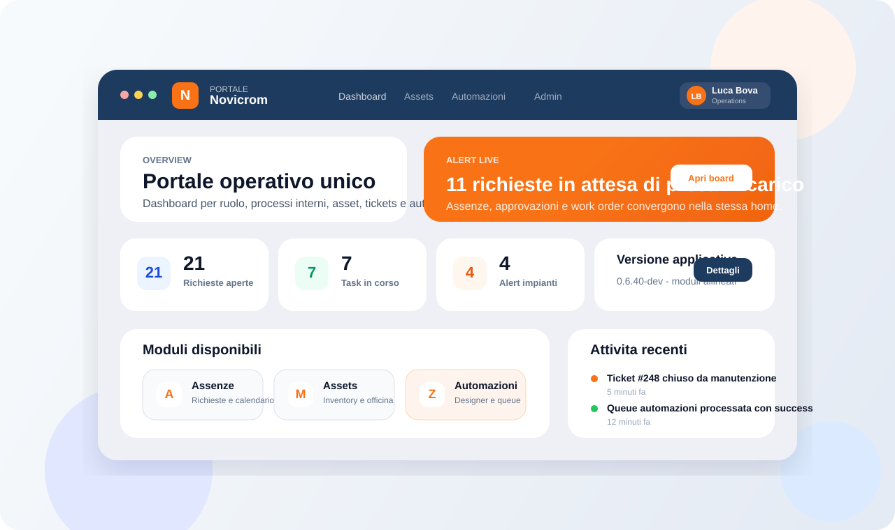
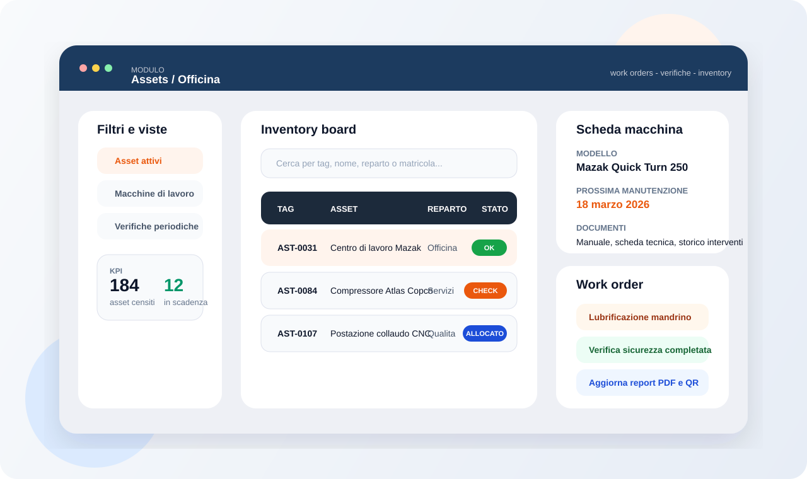
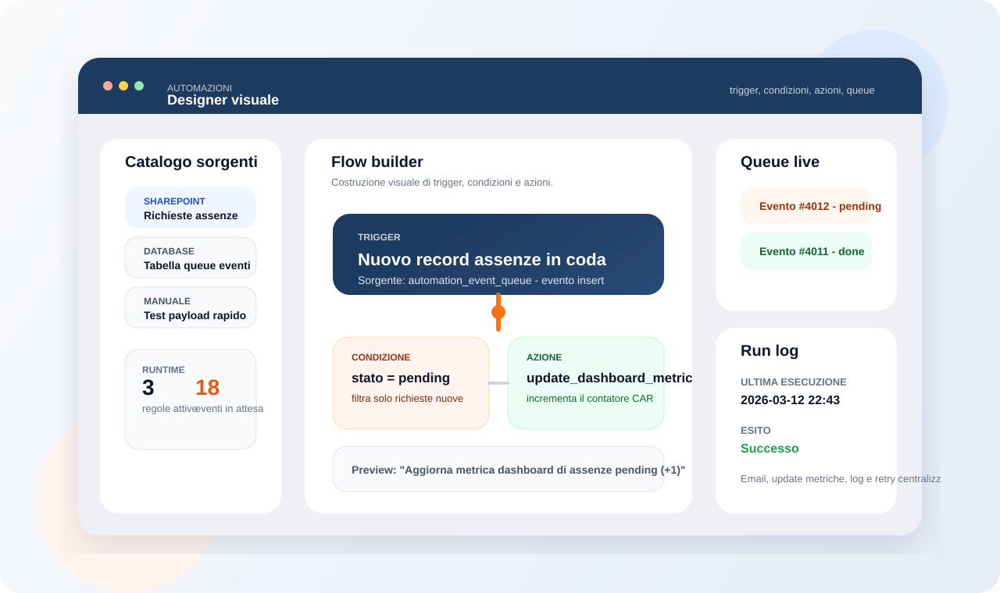
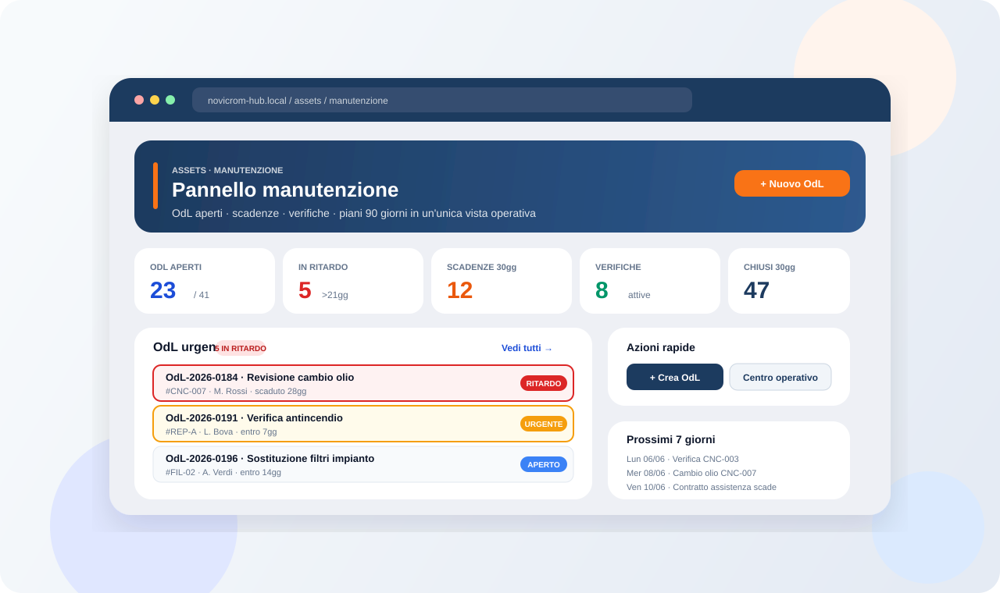
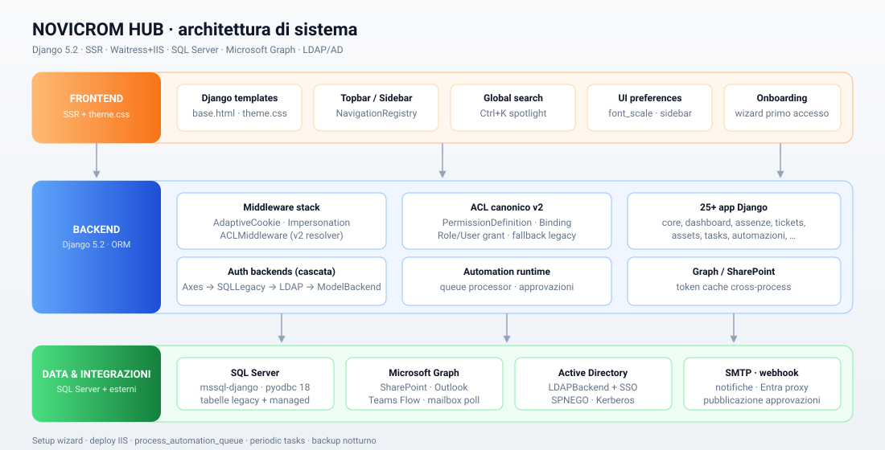
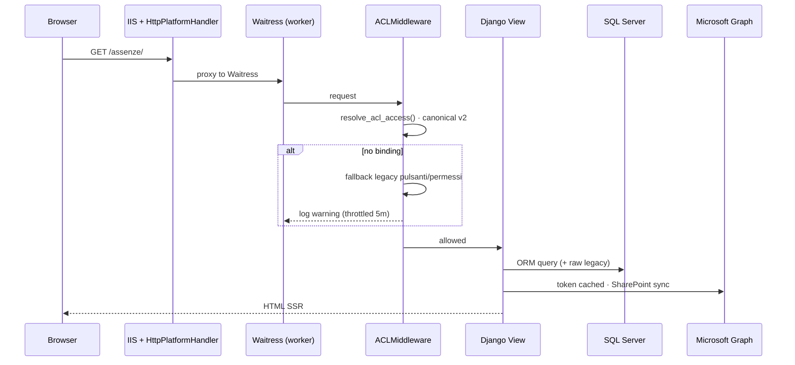
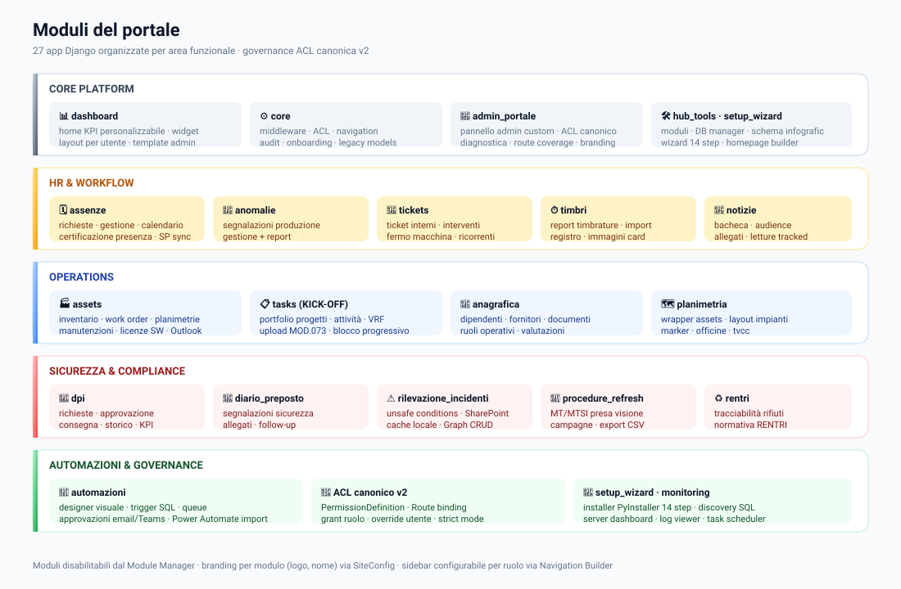
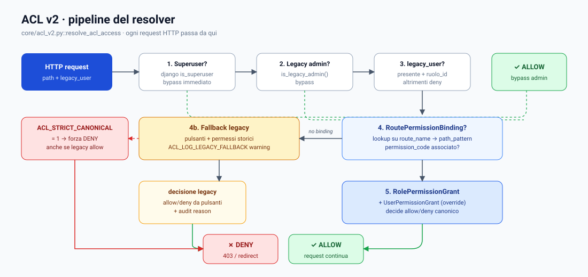
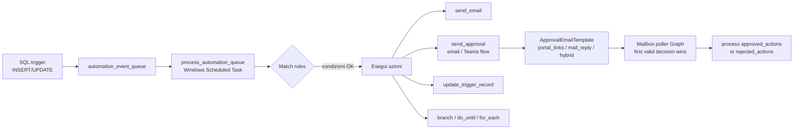
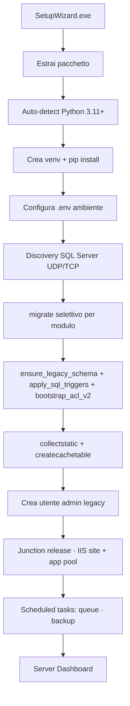

<div align="center">


# NOVICROM HUB

**Il portale interno unificato di Costruzioni Novicrom SRL**
*Workflow · Operations · Sicurezza · Automazioni · Governance*


[Start here](doc/START_HERE.md) · [Manuale tecnico GitHub](doc/README.md) · [Architettura](doc/ARCHITETTURA_TARGET_E_DISMISSIONE_LEGACY.md) · [Testing](doc/TESTING.md) · [Deploy IIS](deployment/README_DEPLOY_IIS_WINDOWS.md) · [ACL v2](doc/ACL_V2_PERMISSION_GUIDE.md)

</div>

---

## 📖 Indice

1. [Cos'è NOVICROM HUB](#-cosè-novicrom-hub)
2. [Anteprima UI](#-anteprima-ui)
3. [Architettura](#-architettura)
4. [Catalogo moduli](#-catalogo-moduli)
5. [Governance & sicurezza (ACL v2)](#-governance--sicurezza-acl-v2)
6. [Automazioni](#-automazioni)
7. [Integrazioni Microsoft 365](#-integrazioni-microsoft-365)
8. [Stack tecnico](#-stack-tecnico)
9. [Quick start](#-quick-start)
10. [Deployment](#-deployment-su-windows-server--iis)
11. [Comandi utili](#-comandi-utili)
12. [Documentazione](#-documentazione-collegata)

---

## 🎯 Cos'è NOVICROM HUB

NOVICROM HUB è il **portale intranet aziendale** di Costruzioni Novicrom SRL: una
piattaforma Django 5.2 che consolida in un unico ambiente **workflow HR**,
**gestione asset**, **compliance sicurezza**, **automazioni aziendali** e
**governance ACL granulare**.

> 💡 I nomi storici (`Portale Novicrom`) restano nel repo solo come esempio di
> istanza o percorso di deploy. La baseline documentale corrente è **NOVICROM HUB**.

### Numeri chiave

| | |
|---|---|
| 🧩 **28 app Django custom** | raggruppate per area funzionale |
| 🔐 **ACL canonico v2** + fallback legacy | migrazione incrementale route-per-route |
| 🤖 **Designer automazioni visuale** | trigger SQL · approvazioni · queue processor |
| 📊 **Dashboard KPI personalizzabile** | widget drag&drop per utente |
| 🔌 **Integrazioni native** | Microsoft Graph · SharePoint · Outlook · LDAP/AD |
| ⚙️ **Setup wizard 14 step** | PyInstaller exe · discovery SQL · IIS config |

---

## 🖼️ Anteprima UI

<div align="center">



</div>

| Assets / Officina | Automazioni |
|:---:|:---:|
|  |  |

<div align="center">



*Pannello manutenzione `/assets/manutenzione/` — priorita operative, OdL da gestire e agenda dei prossimi 7 giorni.*

</div>

> Le anteprime sono SVG GitHub-friendly renderizzate direttamente nel browser.
> Per screenshot reali del portale in produzione vedi `/admin-portale/hub/guide/`
> una volta installato.

---

## 🏗️ Architettura



### Principi chiave

- **SSR puro** con Django templates — nessun framework JavaScript lato client
- **Tabelle operative potenziate globalmente**: sort, filtri per colonna, ricerca e preferenze utente sono applicati dal componente `fm-table-enhanced` alle tabelle dati del portale; `data-table-id` resta disponibile per configurazioni esplicite, le tabelle semplici vengono riconosciute automaticamente
- **Layer ACL doppio**: canonico v2 (policy-as-data) + fallback legacy per migrazione incrementale
- **Storage dual-mode**: SQLite in dev, SQL Server in test/prod con driver ODBC 18/17/13 auto-rilevato
- **Deploy Windows-first**: Waitress + HttpPlatformHandler + IIS, installer PyInstaller
- **Cache condivisa multi-worker**: `DatabaseCache` su SQL Server (token Graph, ACL, sessioni)
- **Audit trail fire-and-forget** su ogni operazione CRUD rilevante

### Flusso request tipico


```mermaid
sequenceDiagram
    participant U as Browser
    participant IIS as IIS + HttpPlatformHandler
    participant W as Waitress (worker)
    participant M as ACLMiddleware
    participant V as Django View
    participant DB as SQL Server
    participant G as Microsoft Graph

    U->>IIS: GET /assenze/
    IIS->>W: proxy to Waitress
    W->>M: request
    M->>M: resolve_acl_access() · canonical v2
    alt no binding
        M->>M: fallback legacy pulsanti/permessi
        M-->>W: log warning (throttled 5m)
    end
    M->>V: allowed
    V->>DB: ORM query (+ raw legacy)
    V->>G: token cached · SharePoint sync
    V-->>U: HTML SSR
```

---

## 🧩 Catalogo moduli



### Tutti i 28 moduli custom a colpo d'occhio

| # | App Django | Area | URL prefisso | Sintesi |
|---|---|---|---|---|
| 1 | [`core`](django_app/core/) | Core | — (`/capa/`) | Middleware ACL, navigation registry, auth backends, audit, notifiche, export, ricerca globale, legacy models, **azioni CAPA** correttive/preventive trasversali · [scheda](docs/moduli/core.md) |
| 1b | [`twofa`](django_app/twofa/) | Core | `/2fa/` | **2FA**: TOTP app authenticator e OTP email, policy per ruolo/rete interna, setup self-service con QR code, reset/toggle admin, pannello `/admin-portale/2fa/` |
| 2 | [`dashboard`](django_app/dashboard/) | Core | `/` | Home "Bacheca" info-hub: News + **Documenti & Collegamenti** (gestibili da admin), KPI, "Cose da fare", launcher moduli · [scheda](docs/moduli/dashboard.md) |
| 2b | [`ai_assistant`](django_app/ai_assistant/) | Core | `/assistente-ai/` | Chatbot interno autenticato con console admin AI e backend Ollama/Open WebUI configurabile · [scheda](docs/moduli/ai_assistant.md) |
| 3 | [`admin_portale`](django_app/admin_portale/) | Core | `/admin-portale/` | Pannello admin custom: ACL canonico, diagnostica, mappa permessi, attivita utente, log notifiche, branding e template PDF · [scheda](docs/moduli/admin_portale.md) |
| 4 | [`hub_tools`](django_app/hub_tools/) | Core | `/admin-portale/hub/` | Module Manager, DB Manager, Schema infografica, Homepage builder, Guide · [scheda](docs/moduli/hub_tools.md) |
| 5 | [`setup_wizard`](django_app/setup_wizard/) | Core | `/setup/` | Wizard primo setup (anche via `SetupWizard.exe`) · [scheda](docs/moduli/setup_wizard.md) |
| 6 | [`monitoring`](django_app/monitoring/) | Core | `/monitoring/` | Monitoring interno, issue tracking, alert email, segnalazioni utente, monitor automazioni · [scheda](docs/moduli/monitoring.md) |
| 7 | [`anagrafica`](django_app/anagrafica/) | Operations | `/anagrafica/` | **Anagrafica HR**: dipendenti, storico contrattuale e organizzativo, onboarding/offboarding, formazione, visite mediche e referti, ruoli, organigramma, reportistica · [scheda](docs/moduli/anagrafica.md) |
| 7b | [`fornitori`](django_app/fornitori/) | Operations | `/fornitori/` | **Anagrafica Fornitori** (permessi separati da HR): KPI spesa/ordini/asset, scheda fornitore con documenti, ordini, valutazioni qualità e asset · [scheda](docs/moduli/fornitori.md) |
| 8 | [`assets`](django_app/assets/) | Operations | `/assets/` | Inventario IT e produzione, work order, manutenzioni periodiche e scadenzario, verifiche periodiche impianti, mappa officina, schede IT con dati SNMP/SOC · [scheda](docs/moduli/assets.md) |
| 9 | [`attrezzature`](django_app/attrezzature/) | Operations | `/attrezzature/` | Gestione Attrezzatura: workflow attrezzi/P-N, import Excel legacy, azioni avanzamento/pronta produzione, link strutturato KICK-OFF |
| 9b | [`gestione_carichi_macchina`](django_app/gestione_carichi_macchina/) | Operations | `/carichi-macchina/` | **Gestione Carichi Macchina**: pianificazione carichi (ex Excel) con matrice macchine×giorni e Gantt con drag-to-reschedule · [scheda](docs/moduli/gestione_carichi_macchina.md) |
| 9c | [`gestione_specifiche`](django_app/gestione_specifiche/) | Operations | `/gestione-specifiche/` | **Gestione Specifiche**: Flusso Specifiche + MOD.133 (ciclo di vita, flow-down requisiti, approvazione, distribuzione) per ISO 9001/EN 9100; Registro OFI `/ofi-registro/` (MOD.174) · [scheda](docs/moduli/gestione_specifiche.md) |
| 10 | [`tasks`](django_app/tasks/) | Operations | `/tasks/` | Portfolio **KICK-OFF**: progetti, attività, Gantt, timeline, incontri in due tempi con convocazione e minuta (AU52/AU53) · [scheda](docs/moduli/tasks.md) |
| 11 | [`planimetria`](django_app/planimetria/) | Operations | `/planimetria/` | Wrapper compat di assets per discoverability layout · [scheda](docs/moduli/planimetria.md) |
| 12 | [`assenze`](django_app/assenze/) | HR & Workflow | `/assenze/` | Richieste, gestione, calendario, certificazione presenza, **riconciliazione presenze↔assenze**, sync SharePoint · [scheda](docs/moduli/assenze.md) |
| 13 | [`anomalie`](django_app/anomalie/) | HR & Workflow | `/anomalie/` `/anomalie-menu` | Controllo dell'OP a blocchi di seriali: più anomalie per blocco con allegati, decisione del capocommessa, mail di esito · [scheda](docs/moduli/anomalie.md) |
| 14 | [`tickets`](django_app/tickets/) | HR & Workflow | `/tickets/` | Ticket interni con interventi, fermo macchina e ricorrenti; allegati da web e dal QR macchina con validazione del team gestore · [scheda](docs/moduli/tickets.md) |
| 15 | [`timbri`](django_app/timbri/) | HR & Workflow | `/timbri/` | Report timbrature da DB legacy, registro, immagini badge · [scheda](docs/moduli/timbri.md) |
| 16 | [`notizie`](django_app/notizie/) | HR & Workflow | `/notizie/` | Bacheca con audience, allegati, letture tracked · [scheda](docs/moduli/notizie.md) |
| 17 | [`dpi`](django_app/dpi/) | Sicurezza | `/dpi/` | Dispositivi Protezione Individuale: catalogo, richieste e approvazione, consegna firmata, sostituzioni, documenti, magazzino, reminder scadenze · [scheda](docs/moduli/dpi.md) |
| 18 | [`diario_preposto`](django_app/diario_preposto/) | Sicurezza | `/diario-preposto/` | Diario preposto sicurezza con segnalazioni, allegati privati e ispezioni periodiche · [scheda](docs/moduli/diario_preposto.md) |
| 19 | [`rilevazione_incidenti`](django_app/rilevazione_incidenti/) | Sicurezza | `/rilevazione-incidenti/` | Unsafe conditions, near miss, incidenti, KPI sicurezza e heatmap planimetria · [scheda](docs/moduli/rilevazione_incidenti.md) |
| 20 | [`procedure_refresh`](django_app/procedure_refresh/) | Sicurezza | `/procedure-refresh/` | Presa visione procedure MT/MTSI, campagne, scadenze e solleciti, sync SGI, matrice formazione ISO · [scheda](docs/moduli/procedure_refresh.md) |
| 21 | [`rentri`](django_app/rentri/) | Sicurezza | `/rentri/` | Tracciabilità rifiuti (normativa RENTRI): registro C/O/M/R, scadenzario adempimenti, **giacenze per CER** con semaforo deposito temporaneo · [scheda](docs/moduli/rentri.md) |
| 22 | [`automazioni`](django_app/automazioni/) | Automation | `/automazioni/` | Designer visuale, trigger SQL, queue processor, approvazioni email/Teams, flussi dei moduli, regole KICK-OFF (AU52-AU54) · [scheda](docs/moduli/automazioni.md) |
| 23 | [`suggestion_corner`](django_app/suggestion_corner/) | Operations | `/suggestion-corner/` | **Suggestion Corner** (SMS): segnalazioni e miglioramenti con ciclo PDCA, form pubblico anonimo, console di gestione · [scheda](docs/moduli/suggestion_corner.md) |
| 24 | [`schede_sicurezza`](django_app/schede_sicurezza/) | Sicurezza | `/schede-sicurezza/` | Schede dati di sicurezza (SDS) dei prodotti chimici: versioni, mansioni di rischio, QR pubblico, presa visione · [scheda](docs/moduli/schede_sicurezza.md) |
| 24b | [`report_conformita`](django_app/report_conformita/) | Qualità | `/report-conformita/` | **Report conformità** per audit ISO 9001, EN 9100, ISO 45001, ISO 27001: 16 report a video, PDF ed Excel, pacchetto riesame della direzione · [scheda](docs/moduli/report_conformita.md) |
| 24c | [`sistema_gestione`](django_app/sistema_gestione/) | Qualità | `/sistema-gestione/` | **Sistema di gestione**: SoA ISO/IEC 27001, threat intelligence, audit interni EN 9100 (MOD.034/035A/035B, rilievi su MOD.174), procedure aziendali · [scheda](docs/moduli/sistema_gestione.md) |
| 25 | [`contatori`](django_app/contatori/) | SOC IT - CN | `/contatori/` | **Centrale MFC & SNMP**: letture e consumabili delle MFC, fatture e riconciliazione, monitor SNMP di rete/UPS/sensori, profili e discovery · [scheda](docs/moduli/contatori.md) |
| 26 | [`security`](django_app/security/) | SOC IT - CN | `/soc/` | Security Center (SOC): Panoramica IT, alert, casi e ticket, eventi da mailbox Graph e parser, KPI, spiegazioni con AI locale · [scheda](docs/moduli/security.md) |
| 27 | [`checklist_operativa`](django_app/checklist_operativa/) | Sicurezza | `/checklist-operativa/` | **Checklist Operativa**: checklist di chiusura aziendale (ex Excel) con mansioni per reparto, responsabili e vice · [scheda](docs/moduli/checklist_operativa.md) |

> Tutte le app sono disabilitabili dal **Module Manager** in `/admin-portale/hub/moduli/` e selezionabili in fase di setup dal wizard (step 11/14).
> `anagrafica` e `fornitori` sono separati anche nel catalogo permessi: HR usa il modulo `anagrafica`, Fornitori usa il modulo ACL `fornitori` con route `fornitori:*`.
> Il tier di selezione è: **system** (obbligatori: core, anagrafica, dashboard, hub_tools), **standard** (pre-selezionati), **optional** (disattivati di default, per futuro licensing).

Il dettaglio di ogni modulo (funzioni, comandi, note di rilascio) è nella sua scheda in [`docs/moduli/`](docs/moduli/).

---

## 🔐 Governance & sicurezza (ACL v2)



### I pilastri dell'ACL canonico

| Tabella | Scopo |
|---|---|
| `PermissionDefinition` | Catalogo permessi leggibili (`code`, `label`, `module`) |
| `RoutePermissionBinding` | Mappa `route_name` o `path_pattern` → `permission_code` |
| `RolePermissionGrant` | Grant per ruolo legacy → `permission_code` |
| `UserPermissionGrant` | Override positivo/negativo per singolo utente |
| `AccessGroup` + `AccessGroupMembership` | **Gruppi ad appartenenza multipla**: una persona può stare in più gruppi, `priority` dice quale pesa di più |
| `GroupPermissionGrant` | Grant per gruppo → `permission_code` |

### Dove si concede: un solo pannello

**`/admin-portale/accessi/`** e' l'unico posto che scrive permessi, e scrive solo
il layer canonico. Matrice **soggetto x permessi**: il soggetto e' un **gruppo**
(con la sua priorita' e i suoi membri, gestiti nella stessa pagina) oppure un
ruolo; le righe sono i permessi canonici per modulo, e ognuna dice se governa una
**pagina** o una **sezione** dentro una pagina.

Dentro ogni modulo i permessi sono divisi in due scomparti, ciascuno con il suo
contatore e i suoi «Accendi/Spegni»: **Configurazione e amministrazione** (azione
`manage`, oppure risorsa di amministrazione — impostazioni, acl, permessi, ruoli,
utenti, gruppi, catalogo, setup, wizard) e **Operativo** (tutto il resto, compreso
cio' che crea, modifica o approva: usare il modulo non e' configurarlo). E' una
divisione di *presentazione* (`core.permission_taxonomy.nature_for_code`): non
nasconde nulla, non cambia i totali e non sposta di un millimetro la decisione
ACL, che resta in `core.acl_v2`.

Dentro ciascuno scomparto, i permessi sono raccolti per **sottomodulo**
(risorsa del codice canonico o prefisso della view legacy). Ogni sottomodulo si
apre separatamente, mostra i propri conteggi e ha comandi Accendi/Spegni locali.
Il filtro cerca anche il nome del sottomodulo; ogni permesso resta modificabile
singolarmente e viene salvato con il pulsante finale.

**Livelli d'accesso preimpostati**: ogni modulo ha un selettore *Livello* (e ce
n'e' uno «su tutti i moduli») che accende in un colpo l'insieme di permessi
corrispondente — **Nessun accesso**, **Solo lettura**, **Lettura e modifica**,
**Operativo completo** (con le approvazioni), **Amministratore del modulo**
(tutto, impostazioni comprese). E' una **macro di selezione**: muove gli
interruttori e basta — si salva sempre col pulsante in fondo, e a database
finisce sempre un grant per singolo permesso, mai un "livello". Appena si
ritocca un interruttore a mano il selettore torna a **Personalizzato**.

Ogni riga dichiara la sua **capacita'** accanto al codice (Lettura · Modifica ·
Approvazione · Amministrazione · **Non classificato**), perche' e' su quella che
i livelli ragionano e deve essere leggibile, non implicita. La capacita' si
ricava in `core.permission_taxonomy.capability_for_code` da: una tabella di
decisioni esplicite prese leggendo la rotta governata; la natura
*configurazione*; l'azione canonica (`view`/`create`/.../`manage`); infine i
token del nome per i code legacy (`legacy.assets.asset_create` → modifica), dove
**il verbo batte il sostantivo** (`api_cerca_utenti` e' una ricerca, non
amministrazione) e fra piu' segnali vince il piu' alto.

La regola portante e' **fail-closed**: un permesso che non si riesce a leggere
resta *Non classificato* e lo accende **solo** «Amministratore del modulo» —
mai «Solo lettura». Due terzi del catalogo sono code legacy importati come
`legacy.<modulo>.<nome_view>`, e leggerli come letture perche' non finiscono in
`create` significherebbe che «Solo lettura» concede cancellazioni.

E c'e' un secondo passaggio, in `core/acl_capability.py`: 184 permessi non sono
legati a una rotta ma a un **prefisso di URL** (`match_strategy='prefix'`), e
governano tutto il sottoalbero tranne dove esiste un binding piu' specifico.
Per ognuno si enumerano le rotte del progetto, si chiede al resolver vero chi le
copre, e la capacita' viene **alzata** (mai abbassata) a quella delle rotte che
gli ricadono sotto. E' cosi' che `legacy.assets.view_assets` (prefisso `/assets`)
smette di essere «lettura»: copre anche `assets:maintenance_impostazioni`.

L'audit e' un comando di sola lettura, eseguibile anche in produzione:

```powershell
python django_app\manage.py acl_capability_report
python django_app\manage.py acl_capability_report --only-unclassified
python django_app\manage.py acl_capability_report --format json
```

Mostra quanti permessi accende ciascun livello, quali sono stati alzati dal
sottoalbero (con le rotte che l'hanno causato) e quali restano non classificati.
Sul catalogo di dev del 17/09/2026: 847 permessi, 512 lettura, 145 modifica, 3
approvazione, 184 amministrazione, **3 non classificati**, 10 alzati dal
sottoalbero.

Non esiste un livello «solo i propri record»: ACL v2 decide **allow/deny sulla
rotta**, mentre lo scope per record (`own` / `reparto`) e' codice dentro le
singole view. Un livello che lo promettesse mentirebbe.

Un gruppo **concede**: togliere una spunta cancella la riga invece di scrivere un
diniego, cosi' un gruppo non toglie mai ai suoi membri cio' che il ruolo gia' da'.
Per negare a una singola persona c'e' l'override utente.

*Gestione Accessi* (permessi legacy) e *Accessi Semplificati* (grant per modulo
intero) restano consultabili ma **non salvano piu'**: erano la ragione per cui la
stessa spunta poteva funzionare o no a seconda della pagina.

### Chi decide: `core.acl_resolver`

Tutte le decisioni passano da `resolve_permission_decision()`
([`django_app/core/acl_resolver.py`](django_app/core/acl_resolver.py)), unica
sede della regola. Precedenza:

**superuser → admin legacy → override utente → gruppi → ruolo → compat legacy → diniego**

Fra i gruppi vince la `priority` più alta e, a parità, il **diniego**: l'esito non
dipende dall'ordine in cui i gruppi sono stati creati. Vale ovunque la stessa
distinzione: **l'assenza di riga è silenzio, `enabled=False` è un no esplicito** —
il fallback legacy interviene solo dove il canonico tace davvero.
`evaluate_permission_code_access`, `resolve_acl_access` e la visibilità del menu
sono traduttori di questo esito, non implementazioni parallele.

### Migrazione incrementale legacy → canonico

Il resolver decide route-per-route: se esiste un `RoutePermissionBinding` usa il
layer canonico, altrimenti scivola sul **fallback legacy** (`pulsanti` +
`permessi`). Questo consente di migrare modulo-per-modulo senza big-bang.

La navigazione segue la stessa logica: se una `NavigationItem` espone
`required_permission_code` oppure e' riconducibile a un binding canonico tramite
`route_name` / `url_path`, la visibilita viene derivata dai grant canonici.
`NavigationRoleAccess` resta solo come fallback compat per le voci ancora
unmapped. Gli override `UserNavigationOverride` sono hide-only: possono
nascondere una voce gia consentita, non mostrarne una negata.

### Gate delle pagine amministrative

Fuori da `admin_portale` i pannelli dei moduli usano
`legacy_admin_or_acl_required(modulo, azione)`: superuser e admin legacy passano
come prima, ma la concessione dal pannello Accessi conta davvero.
`legacy_admin_required`, che i permessi non li legge, resta solo in
`admin_portale` - riservato per scelta, non per dimenticanza, e
`core/test_acl_gate_coverage.py` verifica che la divisione regga nel tempo.

### Permessi di sezione (gate in-view, senza route binding)

Alcune sezioni non sono una rotta a sé ma un **blocco dentro una pagina** (i dati
HR riservati nella scheda dipendente, le visite mediche, la formazione, i blocchi
di gestione). Per queste il permesso canonico esiste ed è concedibile per ruolo da
`/admin-portale/acl-canonico/`, ma **non ha un `RoutePermissionBinding`**: il
controllo resta dentro la view. È deliberato — con `ACL_STRICT_CANONICAL=True` un
binding di route negherebbe l'intera pagina a chi non ha il grant, invece di
limitarsi a nascondere la sezione.

Permessi canonici dell'anagrafica:

| Permission code | Cosa apre |
|---|---|
| `anagrafica.hr.view` | Dati HR riservati (IBAN, codice fiscale, contratti, retribuzioni) |
| `anagrafica.visite.view` | Visite mediche e idoneità (dato sanitario) |
| `anagrafica.visite.delete` | Elimina una visita errata con motivazione obbligatoria e audit |
| `anagrafica.formazione.view` / `.manage` | Formazione: consultazione / gestione catalogo |
| `anagrafica.scheda.manage` | Sezioni di gestione della scheda dipendente e cataloghi anagrafica |
| `anagrafica.statistiche.view` | Widget statistiche della scheda dipendente (ticket, anomalie, assenze, DPI) |

Nella dashboard `/anagrafica/visite-mediche/`, la colonna "Azioni" apre la scheda
della visita; "Elimina" appare solo con `anagrafica.visite.delete`. La conferma
richiede una nota (massimo 1000 caratteri); audit, scollegamento dei referti e
cancellazione sono atomici. I referti restano nel fascicolo del dipendente.
La rotta di eliminazione ha un binding ACL dedicato; i grant non admin sono spenti
per default e si assegnano in `/admin-portale/acl-canonico/`.
La scheda di gestione del referto (`/anagrafica/visite-mediche/referti/<doc_id>/gestione/`)
usa gli stessi permessi: lettura con il gate sanitario, eliminazione del documento con
`anagrafica.visite.delete` e motivazione obbligatoria. Ogni operazione sul referto e ogni
apertura del file finiscono nell'audit agganciate al record.
Nello scadenziario visite una visita più recente della stessa **categoria** del tipo
(es. «Visita medica» annuale/quinquennale) supera le precedenti. Per i casi restanti,
«Segna come superata» (`POST /anagrafica/visite-mediche/<id>/superata/`, gate sanitario,
motivo obbligatorio, audit) toglie la visita dallo scadenziario senza cancellarla dal
libretto; si annulla con «Ripristina nello scadenziario».
Le visite dei dipendenti cessati (`data_cessazione` valorizzata) escono da scadenziario,
KPI, export e digest: restano nel libretto e tornano con «Rimetti in forza».

I permessi di sezione sono **additivi**: superuser e admin legacy passano come prima, e i grant nascono
spenti per tutti gli altri ruoli — dati personali e sanitari si concedono
esplicitamente, mai per default.

### Cancelli in-view: `request_has_permission_code`

Non tutto è una rotta: certe decisioni sono **dentro** una view (un pulsante di
eliminazione, una sezione della pagina, un'API di supporto). Per queste si usa
`core.acl_v2.request_has_permission_code(request, code)`, che affianca il
cancello storico invece di sostituirlo — `evaluate_permission_code_access`
contiene già il bypass superuser/admin legacy, quindi l'helper **concede e non
toglie mai** un accesso già esistente, ed è fail-closed se la valutazione solleva.

Per questi permessi **non** si registra un `RoutePermissionBinding`: con
`ACL_STRICT_CANONICAL=True` un binding negherebbe l'intera rotta a chi non ha il
grant, invece di limitare la singola azione.

⚠️ Un cancello scritto come `is_superuser or is_legacy_admin(...)` **non è
governabile dal modulo permessi**: `is_legacy_admin` è vero solo per i ruoli il
cui nome è in `PORTAL_ADMIN_ROLE_NAMES` (default `{"admin"}`, non valorizzato).
Se un ruolo va abilitato da UI, serve un permission code.

Permessi di gestione di modulo cablati con questo helper:

| Permission code | Gate | Cosa apre |
|---|---|---|
| `attrezzature.attrezzature.delete` | `_can_delete_attrezzature` | Eliminazione attrezzature |
| `diario_preposto.impostazioni.manage` | `_can_manage_settings` | Impostazioni Diario Preposto |
| `ai_assistant.knowledge.manage` | (view knowledge) | Gestione knowledge base AI |
| `dpi.gestione.manage` | `_is_gestore` | Richieste/consegne/storico/impostazioni DPI |
| `rentri.registro.manage` | `_can_manage_rentri` | Scrittura sul registro RENTRI |
| `rilevazione_incidenti.impostazioni.manage` | `_can_manage_settings` | Impostazioni Rilevazione Incidenti |
| `anomalie.configurazione.manage` | `_can_manage_anomalie_config` | Configurazione anomalie (campi, notifiche, sync) |
| `tickets.impostazioni.manage` | `_can_manage_settings` | Impostazioni tickets (tipi, ACL, SharePoint, import) |
| `checklist_operativa.configurazione.manage` | `_can_configure` | Configurazione mansioni/eventi + riepilogo storico Checklist Operativa |

Restano correttamente **admin-only** (nessun permission code, è l'intento) le
utility genuinamente amministrative: impersonation, reset onboarding, gestione
account.

Il report `/admin-portale/acl-route-coverage/` usa il binding canonico effettivo
(route o path piu specifico) e distingue le route protette da
`@legacy_admin_required` con il flag `Admin bypass`, senza contarle come
`missing_grant` del layer canonico.

```bash
# Diagnosi "perché X non accede a /route/?" (canonico vs fallback, con hint operativo)
python django_app/manage.py acl_diagnose --user a.astarita --path /tickets/
python django_app/manage.py acl_diagnose --role Manutenzione --route tickets:dashboard

# Audit delle route ancora in fallback
python django_app/manage.py acl_fallback_report --only-unbound --app assenze

# Bonifica binding: riattiva i binding per-route conservando gli accessi esistenti
# (dry-run di default; --apply scrive, --backup-dir salva le tabelle prima)
python django_app/manage.py acl_cleanup --report bonifica.json
python django_app/manage.py acl_cleanup --apply --backup-dir C:	empcl-backup
# opt-in: riallinea i grant canonici alle spunte legacy che non avevano effetto
python django_app/manage.py acl_cleanup --apply --sync-legacy

# Bootstrap canonico di un'app (dry-run poi apply)
python django_app/manage.py bootstrap_acl_v2 --apps assenze --dry-run
python django_app/manage.py bootstrap_acl_v2 --apps assenze --import-legacy --apply

# Travaso grant legacy→canonico ANCHE sulle route già bindate (colma il buco di --import-legacy)
python django_app/manage.py acl_sync_legacy_grants --dry-run   # diff per ruolo, nessuna scrittura
python django_app/manage.py acl_sync_legacy_grants --apply

# Seed UAT completo (6 utenti, 3 ruoli, binding + grant + override)
python django_app/manage.py seed_acl_uat --reset
```

### Setting di governance

| Variabile `.env` | Effetto |
|---|---|
| `ACL_LOG_LEGACY_FALLBACK=1` | Warning throttled (5m/route) quando il resolver usa il fallback — utile per audit |
| `ACL_STRICT_CANONICAL=1` | Nega le route senza binding canonico anche se il legacy le consentirebbe — da attivare prima in test/UAT |

### Strumenti admin

- `/admin-portale/accessi/` — toggle modulo canonico-first (scrive `RolePermissionGrant`; legacy/nav restano diagnostici)
- `/admin-portale/acl-canonico/` — gestione permission code, binding, grant, override, nav override (Role Grant raggruppato in gerarchia **area → modulo → risorsa**, con filtro per **origine** Canonico/Legacy/API)
- `/admin-portale/acl-route-coverage/` — stato di ogni route (`CANONICAL_BOUND` / `LEGACY_FALLBACK` / `UNBOUND` / `REDIRECT_ONLY`) + export CSV
- `/admin-portale/acl-diagnostica/` — diagnostica combinata con trace di ogni decisione
- `/admin-portale/mappa-permessi-navigazione/` — workflow visuale cliccabile route/menu/ruoli

---

## 🤖 Automazioni

Il modulo `automazioni` offre un **designer visuale** completo per creare
workflow event-driven senza scrivere codice:


```mermaid
graph LR
    A[SQL trigger<br/>INSERT/UPDATE] --> B[automation_event_queue]
    B --> C[process_automation_queue<br/>Windows Scheduled Task]
    C --> D{Match rules}
    D -->|condizioni OK| E[Esegui azioni]
    E --> F[send_email]
    E --> G[send_approval<br/>email / Teams flow]
    E --> H[update_trigger_record]
    E --> I[branch / do_until / for_each]
    G --> J[ApprovalEmailTemplate<br/>portal_links / mail_reply / hybrid]
    J --> K[Mailbox poller Graph<br/>first valid decision wins]
    K --> L[process approved_actions<br/>or rejected_actions]
```

### Capabilities

- 🎨 **Designer SSR visuale**: trigger, condizioni, azioni con editor inline
- 🔀 **Controllo flusso**: `branch`, `do_until`, `for_each`, `count_branch`, `run_if` con pannelli guidati
- 🔢 **Soglie "N eventi in M giorni"**: `count_branch` conta i record di una sorgente (filtro + finestra temporale) e dirama oltre soglia
- ⏱️ **Operatori temporali**: `days_from_now_lte/gte` (scadenze) e `days_span_gt/gte` (durate fra due date)
- 🔁 **Approvazioni a catena**: `send_approval` annidabili (doppia/tripla firma, max 3 livelli)
- 📦 **39 pacchetti regola pronti** (`automazioni/packages/`): import via designer, draft+disattivi, da configurare e attivare
- ✉️ **Approvazioni umane**: recapito via email · webhook Teams legacy · Teams chat Flow (Power Automate) · Entra Application Proxy
- 🔄 **Import Power Automate**: converter integrato `.zip`/`.json` con remediation e handoff a draft
- 🧪 **Test inline**: esegui regola con record reale o dati campione, visualizzando output per azione
- 📊 **Diagramma Power Automate-style**: visualizzazione verticale con rami approval/branch/loop
- 📮 **Mailbox poller via Graph**: autenticazione moderna compatibile Microsoft 365 con bloccato Basic Auth
- 📋 **Template email approvazioni** riutilizzabili con `portal_links`, `mail_reply`, `hybrid`
- 💚 **Queue health card**: stato task Windows, alert missing/stuck, timezone-aware

- **Assenze multi-giorno**: action dedicata `split_assenza_giornaliera` per creare righe giornaliere SQL Server derivate dai flow Power Automate

### Endpoint rapidi

- `/automazioni/regole/` — regole e designer
- `/automazioni/regole/converti-power-automate/` — converter Power Automate
- `/automazioni/canali-teams/` — webhook + flow endpoints
- `/automazioni/template-approvazioni/` — template email
- `/admin-portale/automazioni/impostazioni/` — mailbox tecnica, polling, quick links
- `/admin-portale/automazioni/queue/` — queue admin con azioni `Stoppa`/`Elimina`
- `/admin-portale/automazioni/notifiche-sistema/` — catalogo di sola lettura delle email scatenate da un evento nel codice (view/comando manuale), fuori dal motore regole e dai task pianificati (`automazioni/event_notifications.py`)

---

## 🔌 Integrazioni Microsoft 365

| Integrazione | Uso | File chiave |
|---|---|---|
| **Microsoft Graph** | SharePoint sync (assenze, incidenti), Outlook Calendar (scadenze assets), Teams chat flow (approvazioni), mailbox polling | `core/graph_utils.py` (cache cross-process) |
| **LDAP / Active Directory** | Auth utenti con `LDAPBackend`, sync anagrafica, SSO SPNEGO opzionale | `core/accounts/backends.py`, `core/accounts/windows_sso.py` |
| **Entra Application Proxy** | Pubblicazione selettiva di `/approval-actions/*` per approvazioni fuori rete: GET mostra conferma, POST registra la decisione | `automazioni/approval_proxy_urls.py` |
| **SMTP** | Notifiche utente, approvazioni email, reminder procedure | `EMAIL_*` in `.env` |

### Sicurezza credenziali

Le credenziali sensibili (Graph secret, SMTP password, LDAP bind) vivono **solo**
in `django_app/.env` in sviluppo e in `ENV/config/.env` nei deploy TEST/PROD;
questi file non vanno mai committati. In deploy Django carica `config/.env`
prima del `.env` copiato nella release attiva, cosi un riavvio IIS applica i
salvataggi del pannello admin. Un pre-commit hook in `tools/git-hooks/` blocca
commit accidentali di `.env*`, chiavi private e pattern secret.

### Cifratura at rest & GDPR

| Area | Implementazione |
|---|---|
| **Cifratura at rest AES-256** | `EncryptedStorageMixin` (Fernet, libreria `cryptography` v44+) applicato a **tutti** gli storage privati: documenti dipendente, immagini timbri/firme, allegati ticket, Diario Preposto, scadenze asset. Formato disco: `b"NCENC1\n" + <Fernet token>`. File già presenti privi del magic prefix restituiti as-is (migrazione trasparente). Generazione chiave: `python -c "from cryptography.fernet import Fernet; print(Fernet.generate_key().decode())"`. Attivazione: `DOCUMENT_ENCRYPTION_KEY=<chiave>` in `config/.env` + `python manage.py encrypt_existing_documents --apply` una-tantum |
| **Retention documenti dipendente** | Campo `DocumentoDipendente.retention_until` (DateField indicizzato), valorizzato automaticamente in `save()` da `created_at + anni_retention` per tipo (default 10 anni: D.Lgs. 81/2008 + Art. 2220 c.c.). Command `cleanup_expired_documents [--apply] [--backfill] [--tipo] [--limit]` con triple-check: `retention_until < oggi` AND dipendente cessato AND `data_cessazione + anni_retention < oggi` |
| **Storage privati env-overridable** | Tutti i `*_PRIVATE_ROOT` (anagrafica, timbri, tickets, diario_preposto, assets) sono ora sovrascrivibili via env var: in produzione impostare su percorso locale al server con NTFS ACL ristrette all'app pool identity, mai su share SMB |
| **`media_private` infrastruttura standard** | Cartella aggiunta ai path standard di `Get-EnvPaths`; `setup-environment.ps1` la crea al primo setup; `configure-iis-site.ps1` assegna `Modify` all'AppPool senza creare virtual directory HTTP. **`deploy-release.ps1` (step 5b) riapplica `IIS_IUSRS:(M)`+`IUSR:(M)` ereditari a ogni deploy** (l'app vi *scrive* allegati anomalie/documenti: senza `Modify` l'upload allegati fallisce con 500). Template `web.config` include `<location path="media_private">` con verbi `allowUnlisted="false"`, autenticazione anonima disabilitata e deny esplicito come difesa in profondità |

`ENV/config/.env` e' la sorgente persistente dell'ambiente. Non salvare modifiche
solo in `ENV/current/django_app/.env`: alla release successiva verrebbero perse.
Il Release Manager e `deployment/scripts/deploy-release.ps1` confrontano il
`.env` attivo con `config/.env` prima di copiare la configurazione nella nuova
release; se trovano chiavi divergenti fermano il deploy e mostrano solo i nomi
delle chiavi da allineare. La CLI puo forzare il vecchio comportamento solo con
`-AllowEnvDrift`.

I deploy Windows applicano anche `deployment/scripts/secure-env-acl.ps1`: i
file `.env` vengono protetti via NTFS per concedere accesso solo a SYSTEM,
Administrators locali e identita `IIS AppPool\PortaleNovicrom-ENV`. La copia
persistente `ENV/config/.env` resta modificabile dall'AppPool per i pannelli
admin, mentre le copie dentro le release sono solo leggibili.

La configurazione Graph/SharePoint condivisa (assenze, incidenti, timbri,
automazioni) si gestisce dal pannello centrale
`/admin-portale/hub/setup-wizard/#sec-graph`. Il modulo assets non usa piu
SharePoint: il suo archivio documenti e interamente locale.

```powershell
# Installa il pre-commit hook (una-tantum per sviluppatore)
powershell tools\install-git-hooks.ps1
```

---

## 🛠️ Stack tecnico

| Area | Tecnologia |
|---|---|
| Runtime | **Python 3.11+** |
| Framework | **Django 5.2.13** |
| WSGI produzione | **Waitress** via `HttpPlatformHandler` (IIS) |
| Database dev | **SQLite** |
| Database prod | **SQL Server** via `mssql-django` + `pyodbc 5.2` (driver 18/17/13) |
| Auth cascata | `AxesStandaloneBackend` → `SQLServerLegacyBackend` → `LDAPBackend` → `ModelBackend` |
| Frontend | **SSR** con Django templates, CSS custom, nessun framework JS |
| Localizzazione | `it-it`, TZ `Europe/Rome`; formati data canonici **`dd-mm-yyyy`** (date) e **`dd-mm-yyyy HH:mm`** (datetime) via `FORMAT_MODULE_PATH` → [`config/formats/it/formats.py`](django_app/config/formats/it/formats.py) |
| LLM locale | **Ollama** opzionale via HTTP API (`ai_assistant`, nessuna dipendenza Python aggiuntiva) |
| Cache | `DatabaseCache` su SQL Server (prod), `LocMemCache` (dev) |
| Background | Windows Scheduled Tasks (queue processor, mailbox poll, backup) |
| Osservabilità | `SafeTimedRotatingFileHandler` multi-process, SQL logging, audit DB |
| Hardening | `django-axes` rate-limit login, `axes` lockout template, upload MIME validation, CSRF, allowlist SQL, storage privato allegati sensibili, audit log download, `validate_deployment` check logs/secrets/deployment |

Dipendenze: [`django_app/requirements.in`](django_app/requirements.in) (sorgente) → [`django_app/requirements.txt`](django_app/requirements.txt) (generato da pip-compile)

---

## 🚀 Quick start

### 1. Clona e prepara l'ambiente

```powershell
git clone <repo-url> novicrom-hub
cd novicrom-hub
python -m venv .venv
.\.venv\Scripts\Activate.ps1

# Installa dipendenze (pip-sync allinea l'env esattamente ai .txt compilati)
pip install pip-tools
pip-sync django_app\requirements.txt django_app\requirements-dev.txt

# Installa pre-commit hook anti-leak (raccomandato)
powershell tools\install-git-hooks.ps1
```

> **Workflow dipendenze (pip-tools):** non modificare mai `requirements.txt` a mano.
> Edita `django_app/requirements.in` (dirette) o `django_app/requirements-dev.in` (dev),
> poi rigenera con `.\tools\update-deps.ps1 compile` e committa entrambi i file.
>
> | Comando | Effetto |
> | --- | --- |
> | `.\tools\update-deps.ps1 compile` | Rigenera entrambi i `.txt` dai `.in` |
> | `.\tools\update-deps.ps1 sync` | Installa/rimuove pacchetti per allinearsi ai `.txt` |
> | `.\tools\update-deps.ps1 upgrade` | Aggiorna tutto il possibile e rigenera i `.txt` |

### 2. Configura `.env`

```powershell
Copy-Item django_app\.env.example django_app\.env
```

Configurazione minima per sviluppo locale:

```env
DJANGO_SECRET_KEY=CHANGE_ME_use_secrets.token_urlsafe
DJANGO_DEBUG=1
DJANGO_ALLOWED_HOSTS=127.0.0.1,localhost
DB_ENGINE=sqlite
ACL_LOG_LEGACY_FALLBACK=1
OLLAMA_BASE_URL=http://127.0.0.1:11434
OLLAMA_API_PROVIDER=ollama
OLLAMA_CHAT_MODEL=qwen2.5:14b-instruct
OPENWEBUI_API_KEY=
OLLAMA_RAG_ENABLED=1
OLLAMA_RAG_SOURCE_PATHS=README.md,docs/ai
OLLAMA_RAG_MAX_DB_ENTRIES=200
```

### 3. Migra e avvia

```powershell
python django_app\manage.py migrate --settings=config.settings.dev
python django_app\manage.py createsuperuser --settings=config.settings.dev
python django_app\manage.py runserver --settings=config.settings.dev
```

In alternativa: `django_app\avvia_server.bat` (libera la porta 8000 e avvia).

Nota statici locali: `STATIC_URL` deve rimanere `/static/` e il processo di sviluppo deve vedere
`DJANGO_DEBUG=1`; se una variabile d'ambiente Windows imposta `DJANGO_DEBUG=False`, `runserver`
non serve CSS/SVG/HTMX e la UI appare senza stili.

### 4. URL principali in locale

| URL | Descrizione |
|---|---|
| http://127.0.0.1:8000/ | Dashboard personale |
| http://127.0.0.1:8000/assistente-ai/ | Assistente AI locale via Ollama |
| http://127.0.0.1:8000/admin-portale/ai/ | Gestione AI: provider, RAG e FAQ curate |
| http://127.0.0.1:8000/assenze/ | Modulo assenze unificato |
| http://127.0.0.1:8000/assets/ | Inventario e manutenzioni |
| http://127.0.0.1:8000/tickets/ | Ticket interni |
| http://127.0.0.1:8000/dpi/ | Dispositivi protezione individuale |
| http://127.0.0.1:8000/schede-sicurezza/ | Schede di sicurezza prodotti chimici (SDS) |
| http://127.0.0.1:8000/report-conformita/ | Report conformità ISO 9001 / EN 9100 / ISO 45001 / ISO 27001 |
| http://127.0.0.1:8000/sistema-gestione/ | Sistema di gestione: SoA ISO 27001 (MOD.165), threat intelligence |
| http://127.0.0.1:8000/automazioni/regole/ | Designer automazioni |
| http://127.0.0.1:8000/admin-portale/ | Pannello admin custom |
| http://127.0.0.1:8000/admin-portale/hub/ | Hub strumenti (moduli, DB, schema, guide) |
| http://127.0.0.1:8000/admin-portale/acl-canonico/ | Gestione ACL v2 |

Lo schema DB consultabile dall'Hub Tools (`/admin-portale/hub/database/schema/`) e le versioni standalone `db_schema.html` / `tools/db_documentazione.html` sono generate dal registry Django aggiornato e includono app, modelli, campi e relazioni.

---

## 📦 Deployment su Windows Server + IIS

Il metodo **raccomandato** è [`SetupWizard.exe`](deployment/dist/SetupWizard.exe),
un installer PyInstaller che automatizza:


```mermaid
graph TD
    A[SetupWizard.exe] --> B[Estrai pacchetto]
    B --> C[Auto-detect Python 3.11+]
    C --> D[Crea venv + pip install]
    D --> E[Configura .env ambiente]
    E --> F[Discovery SQL Server UDP/TCP]
    F --> G[migrate selettivo per modulo]
    G --> H[ensure_legacy_schema + apply_sql_triggers + bootstrap_acl_v2]
    H --> I[collectstatic + createcachetable]
    I --> J[Crea utente admin legacy]
    J --> K[Junction release · IIS site + app pool]
    K --> L[Scheduled tasks: queue · backup]
    L --> M[Server Dashboard]
```

**Governance fail-fast**: se venv, pip, migrate, `ensure_legacy_schema` o collectstatic falliscono,
`FinishPage` mostra banner rosso "Installazione Incompleta" e la release
**non viene attivata** — IIS non punta a un ambiente rotto.

### Worker qcluster e watchdog

La console qcluster precompila ora il nome completo DOMINIO\utente risolto dal SID esportato del task, evitando la proposta ambigua del nome breve. Dopo la sostituzione della console occorre riaprirla e ripetere 2 e 9 per ricostruire i controlli di sessione.
Nota account watchdog: l'installer confronta i SID Windows esportati dal task, anche quando Windows mostra solo il nome breve. Nella console indicare le credenziali come `DOMINIO\utente`.
**Deploy guidato qcluster:** disponibili la [console PowerShell a menu](deployment/README_QCLUSTER_CONSOLE.md)
con avanzamento, interruzione agli errori e recupero separato, e la
[guida PDF in sei pagine](deployment/docs/Guida_deploy_qcluster.pdf).
Percorso ordinario: prepara con menu 2, distribuisci dal wizard abituale, completa con menu 9.

**Sorveglianza automazioni:** il [watchdog qcluster](docs/QCLUSTER_WATCHDOG.md)
controlla il worker ogni minuto da Task Scheduler, rileva gli arresti anche a
coda vuota, registra allarmi ed email agli amministratori e tenta il riavvio
dei task fermi con limiti e verifica dei processi residui. Include pausa di
manutenzione e segnalazione del watchdog inattivo. Richiede migrazione
Automazioni 0027 e installazione esplicita sul server.

### Prerequisiti server

- **IIS** con modulo `HttpPlatformHandler`
- **SQL Server** (Express/Standard/Enterprise)
- **ODBC driver** SQL Server 18/17/13
- **Python 3.11+** (rilevato automaticamente)
- **Privilegi Administrator** (per configurare IIS)

### Deploy manuale (senza wizard)

```powershell
# Dalla release directory
python manage.py migrate --settings=config.settings.prod
python manage.py ensure_legacy_schema --settings=config.settings.prod
python manage.py apply_sql_triggers --settings=config.settings.prod
python manage.py collectstatic --noinput --settings=config.settings.prod
python manage.py createcachetable --settings=config.settings.prod
```

Guida completa: [`deployment/README_DEPLOY_IIS_WINDOWS.md`](deployment/README_DEPLOY_IIS_WINDOWS.md)

### Creazione del pacchetto di release

`deployment\scripts\package-release.ps1` esporta il **branch di release** (`release/prod` di default, `-Branch` per cambiarlo), **non** la cartella di lavoro: il codice non committato non finisce mai in un pacchetto.

Il percorso obbligatorio di integrazione è **feature → main → release/prod**: prima integrare e verificare in `main`, poi promuovere `main` nella release. Non integrare feature direttamente in `release/prod`.

Un **pre-flight** lo rende esplicito invece di lasciarlo scoprire al deploy:

- **working tree sporco** → `exit 1`, con la lista dei file che *non sono in nessun commit* e quindi non finiranno nel pacchetto;
- **commit assenti dal branch di export** (`git rev-list --count release/prod..HEAD`) → `exit 1`, elencandoli: esistono, ma il pacchetto non li conterrà;
- `-FromWorkingTree` richiede `-Force` (emergenza, non scorciatoia); `-Force` bypassa entrambi i controlli.

Ogni pacchetto contiene un **`BUILD_INFO.json`** alla radice (commit e branch effettivamente esportati, data, autore, `source: branch | working-tree`, `delta_vs_export_branch`). Il portale lo legge a runtime e ne mostra il contenuto in **Centrale di comando** (`/admin-portale/monitoring/status/`), con banner rosso se il pacchetto non corrisponde a un commit pulito. In sviluppo (`DEBUG=True`) un badge in alto a destra tiene sotto gli occhi i file non committati e i commit non ancora in `release/prod`.

---

## 🔍 Diagnosi in sola lettura sul DB di produzione

Il database di sviluppo è una **copia locale**: quello che ci si legge non dice cosa c'è in produzione. Per interrogare il DB di prod dalla macchina di sviluppo senza poterlo modificare esiste il profilo `config.settings.prod_readonly`.

```powershell
# 1. login SQL di sola lettura, una volta sola sul server (utenza sysadmin)
#    docs\prod_readonly_login.sql  -> ruolo db_datareader + DENY sulle scritture

# 2. configurazione locale (il file e' ignorato da git: non committarlo)
copy docs\env.prod_readonly.example .env.prod_readonly
#    compilare PRODRO_DB_HOST / PRODRO_DB_NAME / PRODRO_DB_USER / PRODRO_DB_PASSWORD

# 3. uso: qualsiasi comando di sola lettura
python django_app\manage.py import_assenze_xlsx assenze.xlsx --dry-run --settings=config.settings.prod_readonly
python django_app\manage.py acl_diagnose --user nome.cognome --path /assenze/ --settings=config.settings.prod_readonly
```

Il profilo è **solo da CLI** (non serve un sito) e protegge su due livelli: il grant `db_datareader` sul server — la barriera autorevole — e, lato client, `config/readonly_guard.py`, che rifiuta DML/DDL prima che la query parta e vieta le migrazioni. Se manca la configurazione il profilo si ferma subito indicando il file atteso. Percorso alternativo del file con la variabile `PROD_READONLY_ENV_FILE`.

Restano fuori da questo profilo, per scelta, tutte le scritture: import veri, `migrate`, deploy. Quelli si lanciano sul server.

---

## ⚡ Comandi utili

```powershell
# Test (usa config.settings.test automaticamente)
python django_app\manage.py test

# Queue processor (one-shot, tipicamente via Task Scheduler)
python django_app\manage.py process_automation_queue

# Mailbox poller approvazioni (Graph)
python django_app\manage.py process_approval_mailbox

# Report scadenze visite mediche/contratti/qualifiche (schedulato lunedì 06:00 via django-q CRON)
# Attivazione e parametri (giorni, destinatari, categorie: visite, contratti, qualifiche) si gestiscono
# dalla pagina Impostazioni automazioni → "Report scadenze" (SiteConfig); il command si auto-silenzia se disattivo.
python django_app\manage.py report_scadenze_settimanale --dry-run --forza   # test manuale
python django_app\manage.py setup_q_schedules            # registra/aggiorna gli schedule (queue, mailbox, scadenze)

# ACL v2 governance
python django_app\manage.py bootstrap_acl_v2 --dry-run
python django_app\manage.py acl_fallback_report --only-unbound
python django_app\manage.py acl_coverage_report --max-missing 222
python django_app\manage.py acl_diagnose --user a.astarita --path /tickets/
python django_app\manage.py acl_sync_legacy_grants --dry-run
python django_app\manage.py seed_acl_uat --reset

# Restore controllato del menu dalla fixture locale (dry-run, poi apply)
python django_app\manage.py restore_navigation_registry --settings=config.settings.prod
python django_app\manage.py restore_navigation_registry --apply --settings=config.settings.prod

# Rinomina massiva solo del nome asset: export template, dry-run, commit
python django_app\manage.py rename_asset_names --export-template asset_names.csv
python django_app\manage.py rename_asset_names asset_names.csv --dry-run
python django_app\manage.py rename_asset_names asset_names.csv --commit

# Dipendenti con reparto legacy "orfano" (valore cancellato dal catalogo Reparto): report, poi rimappatura guidata
python django_app\manage.py report_reparti_orfani
python django_app\manage.py report_reparti_orfani --reassign "CNC5G=CNC"                       # anteprima dry-run
python django_app\manage.py report_reparti_orfani --reassign "CNC5G=CNC" --apply --eseguito-da admin

# Aggancio dell'area aziendale (la FK usata dai report per reparto) partendo dall'etichetta di testo
python django_app\manage.py aggancia_area_da_testo                          # anteprima, non scrive
python django_app\manage.py aggancia_area_da_testo --reparto "AGG/MONT"     # anteprima di un solo reparto
python django_app\manage.py aggancia_area_da_testo --applica --crea-aree

# Release guard progressivo
python django_app\manage.py secret_hygiene_check
python django_app\manage.py validate_deployment --format json --settings=config.settings.test
# Validate + probe runtime delle integrazioni (DB, cache, Graph, LDAP, SMTP)
python django_app\manage.py validate_deployment --with-integration --settings=config.settings.test
# Migrazioni allineate ai modelli (da lanciare dopo ogni merge)
python django_app\manage.py makemigrations --check --dry-run --settings=config.settings.test

# Deploy Guard (TEST/PROD) — orchestratore PowerShell fail-fast
# Esegue probe Django, check/migrate/validate_deployment, preview/apply allegati
# privati, restart App Pool e smoke HTTP. Report timestampato in .\deploy_reports\.
# I 3 script PowerShell sono in `scripts/deploy_*.ps1`.
# Esempio TEST:
powershell -ExecutionPolicy Bypass -File .\scripts\deploy_guard.ps1 `
    -Environment test -IisSiteName "PortaleNovicrom-Test" `
    -IisAppPool "PortaleNovicrom-Test" -RestartAppPool `
    -SmokeUrl "https://test-portale-novicrom.local"
# Esempio PROD:
powershell -ExecutionPolicy Bypass -File .\scripts\deploy_guard.ps1 `
    -Environment prod -IisSiteName "PortaleNovicrom" `
    -IisAppPool "PortaleNovicrom" -RestartAppPool `
    -SmokeUrl "https://portale-novicrom.local" -StrictWarnings
# Documentazione completa: docs/deploy/DEPLOY_GUARD.md

# Liveness/readiness (HTTP)
curl http://127.0.0.1:8000/healthz   # liveness — sempre 200 se Django risponde
curl http://127.0.0.1:8000/readyz    # readiness — JSON con status check, 503 se critical fail

# Contract test integrazioni esterne (livello A, offline)
python django_app\manage.py test core.contract_tests --settings=config.settings.test
# Livello B (live, opt-in — tocca Graph/LDAP/SMTP reali)
$env:RUN_LIVE_INTEGRATION_TESTS = "1"
python django_app\manage.py test core.contract_tests --tag live_integration --settings=config.settings.test
# Release guard con livello B incluso
.\tools\release_guard.ps1 -WithLive

# CI versionata
# .github/workflows/security-gate.yml esegue check, drift migration,
# validate_deployment, test sentinella security, pip-audit e release_guard.
# .github/dependabot.yml apre PR settimanali per pip e GitHub Actions.
# Nota: il workflow non usa `manage.py check --deploy` perche gira con
# config.settings.test e senza valori reali TLS/cookie/proxy di produzione;
# `validate_deployment` resta il gate bloccante compatibile CI.

# Backup
python django_app\manage.py backup_portale --include-media --retention 10

# Allineamento tipo_assenza legacy → canonico (idempotente)
python django_app\manage.py allinea_tipo_assenza_flessibilita

# Audit URL esposti
python django_app\manage.py show_urls
```

---

## 📚 Documentazione collegata

La raccolta interna in [`/admin-portale/hub/guide/`](django_app/hub_tools/) indicizza
automaticamente tutti i documenti supportati. Per consultazione da repo:

- 📚 [Manuale tecnico GitHub](doc/README.md) — indice canonico Markdown pensato per la lettura diretta su GitHub, con link relativi a governance, setup, deploy, test e ACL
- 📘 [Start here per persona](doc/START_HERE.md) — sviluppatore, admin, deployer, tester
- 🏛️ [Architettura target e dismissione legacy](doc/ARCHITETTURA_TARGET_E_DISMISSIONE_LEGACY.md)
- 🧪 [Testing, smoke e UAT](doc/TESTING.md)
- 🔐 [Guida ACL v2 (permission-code based)](doc/ACL_V2_PERMISSION_GUIDE.md)
- 📋 [Convenzione permission code](doc/ACL_V2_PERMISSION_CODE_CONVENTION.md)
- ✅ [Checklist UAT ACL v2](doc/ACL_V2_UAT_CHECKLIST.md)
- 🛠️ [Manuale admin navigazione e permessi](tools/MANUALE_ADMIN_NAVIGAZIONE_PERMESSI.md)
- 🚀 [Guida deployment IIS (manuale + troubleshooting)](deployment/README_DEPLOY_IIS_WINDOWS.md)
- 🎨 [Guida designer automazioni (HTML)](doc/GUIDA_AUTOMAZIONI_DESIGNER.html)
- 👥 [Guida gestione permessi (HTML/PDF)](doc/GUIDA_GESTIONE_PERMESSI.html)
- 🤝 [Guida Teams approvazioni (HTML)](doc/GUIDA_TEAMS_APPROVAZIONI.html)
- 🏭 [Note modulo assets](django_app/assets/README.md)
- 🧩 [Schede dei moduli](docs/moduli/) — dettaglio funzionale di ogni app
- 🗂️ [Changelog fino alla 1.4.0](docs/changelog/CHANGELOG_fino_1.4.0.md) — versioni archiviate

---

## 🤝 Modalità Shared Workspace / Agent Control

NOVICROM HUB supporta una modalità di lavoro su **cartella condivisa**, senza Git e senza GitHub.
Questa modalità è pensata per consentire a più persone o agenti AI di lavorare sulla stessa
istanza del progetto (es. cartella di rete o OneDrive condivisa) in modo coordinato e sicuro.

### Perché esiste questa modalità

In ambienti dove la sincronizzazione avviene tramite cartella condivisa (e non tramite Git),
le modifiche sono immediate e visibili a tutti. Senza coordinamento, due agenti possono
sovrascrivere lo stesso file o modificare aree critiche senza controllo.
Il protocollo Agent Control risolve questo con sessioni, lock, manifest e tracciamento file critici.

**File critici non vietati: file critici tracciati obbligatoriamente.**

### Come funziona

1. **Solo Brizio** avvia formalmente le sessioni tramite script PowerShell.
2. Lo script apre una sessione, apre VS Code con `--wait` e al termine chiude la sessione ed esegue diff.
3. La struttura `_AGENT_CONTROL/` contiene lo stato di sessione, i lock per area, l'elenco dei file critici e il changelog operativo degli agenti.

### Metodo raccomandato — apertura sessione Collega HR

```powershell
powershell -ExecutionPolicy Bypass -File .\scripts\open-agent-workspace.ps1 -Owner "Collega HR" -Agent "Claude" -Area "django_app/anagrafica"
```

In alternativa, doppio clic su `scripts\open-collega-hr-workspace.bat`.

### Comandi di gestione sessione

```powershell
# Status sessione corrente (include stale-session detection)
powershell -ExecutionPolicy Bypass -File .\scripts\agent-session.ps1 status

# Diff (confronta stato attuale con manifest baseline)
powershell -ExecutionPolicy Bypass -File .\scripts\agent-session.ps1 diff

# Chiusura normale di emergenza
powershell -ExecutionPolicy Bypass -File .\scripts\agent-session.ps1 end -Owner "Collega HR" -RunChecks -CheckDocs

# Chiusura forzata (sessione bloccata, VS Code chiuso)
powershell -ExecutionPolicy Bypass -File .\scripts\agent-session.ps1 force-end -Owner "Brizio" -Force

# Reset d'emergenza (ACTIVE_SESSION.md incoerente)
powershell -ExecutionPolicy Bypass -File .\scripts\agent-session.ps1 reset -Force
```

### Recupero sessione bloccata

Se `agent-session.ps1 status` mostra `| Stato | IN_CORSO |` ma VS Code è stato chiuso o la sessione non è più reale:

```powershell
cd "Y:\Portale Novicrom"
.\scripts\agent-session.ps1 force-end -Owner "Brizio" -Force
```

Il comando `status` segnala automaticamente sessioni stale (avvio > 8 ore: avviso rosso; > 2 ore: avviso giallo) ma non chiude mai automaticamente la sessione.

### Regole operative

- Non aprire VS Code direttamente: usare sempre il wrapper `open-agent-workspace.ps1`.
- A inizio chat leggere `session_checkpoint.md`: per `CHANGELOG.md` fermarsi alla prima voce gia' nota, per `_AGENT_CONTROL/AGENT_CHANGELOG.md` leggere solo le voci successive al checkpoint.
- Leggere `_AGENT_CONTROL/ACTIVE_SESSION.md` e `WORK_LOCKS.md` prima di qualsiasi modifica.
- I file critici (core, config, admin_portale, ACL, middleware) non sono vietati ma devono essere modificati solo se necessario e documentati obbligatoriamente in `_AGENT_CONTROL/AGENT_CHANGELOG.md`.
- `CRITICAL_CHANGE_REQUESTS.md` serve solo per modifiche dubbie, invasive o da verificare da parte di Brizio.
- Se la modifica riguarda ACL, middleware, settings, routing globale, autenticazione o navigazione globale, chiedere conferma verbale a Brizio prima di procedere.
- Aggiornare `_AGENT_CONTROL/AGENT_CHANGELOG.md` a fine sessione.
- Aggiornare `session_checkpoint.md` a fine sessione con le nuove voci viste o aggiunte.
- Aggiornare `README.md` e `CHANGELOG.md` se cambia il comportamento operativo.
- Brizio supervisiona la sessione tramite il wrapper `open-agent-workspace.ps1`.

### Perimetri

| Agente/Utente | Area consentita | Note |
| --- | --- | --- |
| Collega HR | `django_app/anagrafica/**` | Solo con sessione aperta da Brizio |
| Brizio | tutto | Autorizza modifiche critiche |

---

<div align="center">

**NOVICROM HUB** · Costruzioni Novicrom SRL

*Repository ripulito per pubblicazione sicura: nessuna credenziale reale è inclusa.
I file `.example` sono template. Il pre-commit hook in `tools/git-hooks/` blocca
commit accidentali di `.env` e secret.*

</div>
