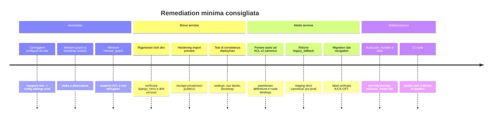

# Audit tecnico del repository brividich/CRM-Brizio

## Sintesi esecutiva

L’audit statico del branch `main` mostra un repository Django già orientato a uno stack preciso e moderno per il contesto Windows aziendale: Django 5.2 LTS, SQL Server tramite `mssql-django`, `pyodbc`, deploy IIS con HttpPlatformHandler e `waitress`, più un set di script PowerShell abbastanza maturo per packaging e rilascio. In parallelo, però, emergono alcuni drift strutturali che oggi valgono più del “singolo bug”: configurazione TEST incoerente fra IIS e deploy, bootstrap ACL eseguiti in `AppConfig.ready()` senza guard rail dichiarati dalla stessa documentazione del progetto, migrazione ACL v2 incompleta nel modulo `tasks`, disallineamenti di navigazione/branding e una governance qualità che dispone di molti script ma non sembra imporre i test automatici come gate bloccante. fileciteturn80file0L1-L1 fileciteturn86file0L1-L1 fileciteturn58file0L1-L1 fileciteturn74file0L1-L1 fileciteturn73file0L1-L1 citeturn3search4turn4search6turn3search3

Il quadro complessivo è quindi questo: **base tecnica buona, ma con debito di coerenza operativa**. Il rischio principale non è tanto “Django 5.2 rompe tutto” — anzi, il backend SQL scelto dichiara supporto a Django 5.2 — quanto il fatto che il progetto conviva con **più verità operative**: permessi legacy e canonical ACL v2, navigazione registry e bootstrap legacy, documentazione e script che talvolta indicano baseline diverse, e boundary cross-app volutamente laschi fra `tasks` e `attrezzature`. Questo rende il sistema fragile soprattutto in deploy, audit permessi e manutenzione evolutiva. fileciteturn44file0L1-L1 fileciteturn90file0L1-L1 fileciteturn75file0L1-L1 fileciteturn77file0L1-L1 fileciteturn93file0L1-L1 fileciteturn74file0L1-L1

Assunzione esplicita dell’audit: **non ho eseguito test, migration, `check`, `makemigrations --check`, script PowerShell né deploy reali**; le conclusioni seguono da ispezione statica dei file e dai controlli concettuali richiesti. Laddove servirebbe una prova runtime, lo segnalo come limite e lo trasformo in quality gate da eseguire. fileciteturn73file0L1-L1 fileciteturn74file0L1-L1

## Perimetro e file ispezionati

I file ispezionati direttamente nel repository, e usati per questo report, sono i seguenti.

| Area | Percorsi ispezionati |
|---|---|
| Root e documentazione | `README.md`, `MIGRATION_MAP.md`, `SECRET_HYGIENE.md`, `.env.example`, `config.ini.example`, `docs/ai/06_TESTING_AND_QUALITY_GATES.md`, `docs/ai/03_BACKEND_MODULES.md`, `docs/attrezzature/GESTIONE_ATTREZZATURA.md` |
| Dipendenze | `django_app/requirements.in`, `django_app/requirements.txt`, `django_app/requirements-dev.txt` |
| Settings e routing | `django_app/config/settings/base.py`, `django_app/config/settings/dev.py`, `django_app/config/settings/test.py`, `django_app/config/settings/prod.py`, `django_app/config/urls.py` |
| Core ACL / navigation | `django_app/core/middleware.py`, `django_app/core/models.py`, `django_app/core/module_registry.py`, `django_app/core/test_acl_v2.py`, `django_app/core/management/commands/secret_hygiene_check.py`, `django_app/core/management/commands/deduplicate_nav.py`, `tools/release_guard.ps1` |
| App `attrezzature` | `django_app/attrezzature/apps.py`, `django_app/attrezzature/acl_bootstrap.py`, `django_app/attrezzature/models.py`, `django_app/attrezzature/forms.py`, `django_app/attrezzature/views.py`, `django_app/attrezzature/urls.py`, `django_app/attrezzature/services/excel_import.py`, `django_app/attrezzature/services/workflow.py`, `django_app/attrezzature/services/kickoff_integration.py`, `django_app/attrezzature/migrations/0001_initial.py`, `django_app/attrezzature/management/commands/create_attrezzature_nav.py`, `django_app/attrezzature/tests.py` |
| App `tasks` | `django_app/tasks/apps.py`, `django_app/tasks/acl_bootstrap.py`, `django_app/tasks/models.py`, `django_app/tasks/views.py`, `django_app/tasks/urls.py`, `django_app/tasks/migrations/0001_initial.py`, `django_app/tasks/migrations/0009_rename_nav_vrf_kick_off.py`, `django_app/tasks/migrations/0012_project_kickoff_number.py`, `django_app/tasks/tests.py` |
| Deployment Windows/IIS | `deployment/README_DEPLOY_IIS_WINDOWS.md`, `deployment/scripts/setup-environment.ps1`, `deployment/scripts/configure-iis-site.ps1`, `deployment/scripts/deploy-release.ps1`, `deployment/config/web.config.httpplatform.template` |

Questa lista corrisponde al perimetro reale dell’analisi. Per ogni area ho privilegiato file “source of truth” o comunque decisivi per i temi richiesti: modelli, migrazioni, ACL, navigation, testing, requirements e deploy. fileciteturn80file0L1-L1 fileciteturn81file0L1-L1 fileciteturn86file0L1-L1 fileciteturn44file0L1-L1 fileciteturn90file0L1-L1 fileciteturn58file0L1-L1

## Criticità prioritarie

La tabella seguente riassume i problemi più importanti, ordinati per impatto pratico.

| Severità | Problema | Dove | Perché conta | Fix sintetico |
|---|---|---|---|---|
| **Critica** | **Drift tra profilo TEST IIS e profilo TEST di deploy** | `deployment/scripts/configure-iis-site.ps1`, `deployment/scripts/deploy-release.ps1`, `deployment/README_DEPLOY_IIS_WINDOWS.md` | Lo script IIS scrive `DJANGO_SETTINGS_MODULE=config.settings.test` per l’ambiente `test`, mentre deploy e documentazione dicono che TEST su IIS deve usare `config.settings.prod`. Rischio: sito TEST che gira con SQLite / security flags non-prod / comportamento diverso da quanto deployato. | Mappare esplicitamente `test -> config.settings.prod` anche in `configure-iis-site.ps1`, rigenerare `web.config`, aggiungere test di consistenza su script e docs. |
| **Alta** | **Bootstrap ACL runtime in `AppConfig.ready()` senza skip guard** | `django_app/attrezzature/apps.py`, `django_app/tasks/apps.py`, `docs/ai/06_TESTING_AND_QUALITY_GATES.md` | La stessa documentazione del repo chiede che i bootstrap runtime evitino DB/cache durante `collectstatic`, `migrate`, `check`, `test`; le due app invece chiamano bootstrap in `ready()` e silenziano ogni eccezione. | Introdurre `should_skip_runtime_bootstrap()` o equivalente, loggare gli errori, non fare `except: pass/return`. |
| **Alta** | **Migrazione ACL v2 incompleta e pattern misto nel modulo `tasks`** | `django_app/tasks/acl_bootstrap.py`, `django_app/tasks/views.py`, `django_app/core/middleware.py`, `django_app/attrezzature/acl_bootstrap.py` | `attrezzature` ha mapping canonical ACL v2 con permission code e route bindings; `tasks` resta principalmente su pulsanti legacy + decorator/view-level checks. Risultato: governance ACL eterogenea e più difficile da auditare. | Portare `tasks` allo stesso schema canonical di `attrezzature`, ridurre il fallback legacy, misurare e abbassare la baseline ACL mancante. |
| **Alta** | **Drift di navigazione e branding fra `Task`, `VRF - Kick Off`, `KICK-OFF`** | `django_app/core/module_registry.py`, `django_app/tasks/apps.py`, `django_app/tasks/migrations/0009_rename_nav_vrf_kick_off.py`, `django_app/core/management/commands/deduplicate_nav.py` | Il registry modulo parla ancora di `Task`, la migration dati rinomina la voce nav a `VRF - Kick Off`, l’app si presenta come `KICK-OFF`, e nel repo esiste persino un comando per deduplicare voci di navigazione. | Allineare una sola nomenclatura utente, aggiungere migration dati/nav coerente, rendere il registry il riferimento unico. |
| **Alta** | **Lock dev incompleto rispetto al runtime: `django_htmx` presente nel runtime, non visibile nel lock dev** | `django_app/config/settings/base.py`, `django_app/requirements.txt`, `django_app/requirements-dev.txt` | `INSTALLED_APPS` e `MIDDLEWARE` referenziano `django_htmx`, il runtime lock lo contiene, il lock dev ispezionato no. Questo può rompere ambienti locali/CI che installano solo `requirements-dev.txt`. | Rigenerare il lock dev partendo dalla source of truth, verificare import pulito di `django_htmx` in test e pre-commit. |
| **Media-Alta** | **`release_guard` non allineato alla documentazione e non esegue i test** | `tools/release_guard.ps1`, `docs/ai/06_TESTING_AND_QUALITY_GATES.md`, `deployment/README_DEPLOY_IIS_WINDOWS.md` | La docs parla di baseline ACL 216; lo script usa 222. Inoltre il guard esegue check, hygiene, bootstrap ACL e validate_deployment, ma non `manage.py test`. Esistono test, ma non risultano gate bloccante. | Allineare baseline e inserire test/makemigrations/check come gate formali. |
| **Media** | **Boundary `tasks` ↔ `attrezzature` robusto architettonicamente ma con verità duplicate** | `docs/attrezzature/GESTIONE_ATTREZZATURA.md`, `django_app/attrezzature/models.py`, `django_app/tasks/models.py`, `django_app/attrezzature/services/kickoff_integration.py` | È esplicitamente scelto di non usare FK cross-app e di usare riferimenti esterni stringa. Il confine è chiaro, ma aumenta il rischio di drift fra `Project.part_number`, `Attrezzatura.part_number`, alias in `AttrezzaturaPartNumber` e `AttrezzaturaTask.part_number`. | Tenere il boundary, ma aggiungere verifiche applicative/migration dati su normalizzazione e coerenza dei P/N. |
| **Media** | **Upload preview import in storage pubblico** | `django_app/attrezzature/views.py`, `django_app/config/settings/base.py`, `deployment/config/web.config.httpplatform.template` | La preview dell’import salva temporaneamente il file in `default_storage`; su questo stack `default_storage` è filesystem standard e `/media/` è servito anonimamente da IIS. Il rischio è mitigato dal token UUID, ma il principio è debole. | Spostare la preview in storage privato o temp dir non web-exposed. |

Queste criticità non si escludono a vicenda; anzi, si rafforzano. Il denominatore comune è la **coerenza di superficie**: ciò che il repository dichiara come standard interno non è sempre ciò che il codice effettivamente fa in runtime/deploy. fileciteturn63file0L1-L1 fileciteturn65file0L1-L1 fileciteturn58file0L1-L1 fileciteturn88file0L1-L1 fileciteturn89file0L1-L1 fileciteturn73file0L1-L1 fileciteturn90file0L1-L1 fileciteturn44file0L1-L1 fileciteturn75file0L1-L1 fileciteturn78file0L1-L1 fileciteturn77file0L1-L1 fileciteturn86file0L1-L1 fileciteturn80file0L1-L1 fileciteturn81file0L1-L1 fileciteturn39file0L1-L1 fileciteturn64file0L1-L1

## Analisi tecnica per area

### ACL, navigazione e middleware

La parte ACL è il punto più delicato. In `attrezzature` c’è un impianto già “v2” molto più evoluto: permission code canonici, route bindings, navigation item esplicito, grant di ruolo, bridge con il modulo `tasks` per l’azione embedded. In `tasks`, invece, il bootstrap ispezionato resta su pulsanti legacy (`tasks_view`, `tasks_create`, `tasks_edit`, `tasks_comment`, `tasks_admin`, `tasks_projects`) senza il corrispettivo blocco canonico equivalente. Questo conferma che il progetto sta vivendo una migrazione ACL **ibrida**: non sbagliata in sé, ma ancora incompleta e difficile da governare in modo uniforme. fileciteturn44file0L1-L1 fileciteturn90file0L1-L1

Il middleware ACL mostra inoltre tre rischi operativi da tenere distinti. Il primo è intenzionale ma da presidiare: esistono percorsi condivisi o esenti (`/health`, `/version`, `/login`, `/admin/`, `/setup/`, `/admin-portale/hub/`, vari endpoint approval token-based) che bypassano l’ACL middleware. Il secondo è più critico: se `LEGACY_AUTH_ENABLED` fosse disattivato in un ambiente sbagliato, l’ACL middleware smetterebbe di applicare la logica legacy/canonical e lascerebbe passare l’utente autenticato dopo onboarding. Il terzo è di governance: il middleware prevede `legacy_fallback` e addirittura uno strict mode, segno che molte route dipendono ancora da binding legacy o mancanti. Questo è coerente con la baseline ACL dichiarata nei documenti e nello script di guard, ma espone superfici che un audit applicativo dovrebbe ridurre nel tempo, non considerare stabili. fileciteturn84file0L1-L1 fileciteturn86file0L1-L1 fileciteturn73file0L1-L1 fileciteturn74file0L1-L1

Sul fronte navigazione, il repository mostra un drift concreto. Il registry modulo centrale etichetta ancora `tasks` come `Task`, con route namespace `tasks` e navigation code `tasks`; la migration `0009_rename_nav_vrf_kick_off.py` aggiorna il `NavigationItem` con label `VRF - Kick Off`; l’`AppConfig` del modulo espone `verbose_name = "KICK-OFF"`; la documentazione backend dice esplicitamente che il branding utente del modulo è `KICK-OFF`, mentre `VRF` è solo il documento. Il fatto che esista un comando `deduplicate_nav` per eliminare voci duplicate in `NavigationItem` suggerisce che la navigazione abbia già sofferto di incoerenze o duplicazioni in DB. È un odore architetturale chiaro: oggi c’è più di una fonte di verità per il naming di navigazione. fileciteturn75file0L1-L1 fileciteturn78file0L1-L1 fileciteturn89file0L1-L1 fileciteturn94file0L1-L1 fileciteturn77file0L1-L1

### Integrità dati, modelli, on_delete e boundary cross-app

Il design dati di `attrezzature` è concettualmente solido: `Attrezzatura` è la source of truth di stato e readiness; `AttrezzaturaTask` è l’esecuzione operativa; l’integrazione con `tasks` evita FK dirette e usa `external_kickoff_id` / `external_kickoff_activity_id` come stringhe plain, mantenendo un boundary architetturale pulito. Questo riduce l’accoppiamento forte fra app. Il rovescio della medaglia è che la consistenza cross-app non è demandata al database ma alla logica applicativa, quindi il progetto ha bisogno di test e check più rigorosi sulla normalizzazione del `part_number` e sull’allineamento dei riferimenti esterni. fileciteturn93file0L1-L1 fileciteturn34file0L1-L1 fileciteturn30file0L1-L1 fileciteturn46file0L1-L1 fileciteturn47file0L1-L1

Sul piano degli `on_delete`, il pattern emerso è coerente e ragionevole: **figli storici o strutturali** del dominio tendono a usare `CASCADE` verso il parent di business, mentre i riferimenti agli utenti usano prevalentemente `SET_NULL`. Questo è un buon compromesso per non perdere lo storico applicativo quando un account viene disattivato o rimosso. La parte più delicata non è dunque l’`on_delete`, ma piuttosto la **duplicazione semantica del P/N**: `Attrezzatura.part_number`, alias in `AttrezzaturaPartNumber`, `AttrezzaturaTask.part_number`, `Project.part_number`, e in più il naming utente “Particolare” che nella pipeline Excel viene giustamente mappato a `part_number`. La mappatura è documentata e testata, quindi non è un bug; il rischio è che la coerenza resti affidata solo a convenzioni e servizi applicativi, senza un vincolo applicativo/migration dati che la rinforzi. fileciteturn34file0L1-L1 fileciteturn30file0L1-L1 fileciteturn43file0L1-L1 fileciteturn46file0L1-L1 fileciteturn93file0L1-L1

Sul parser import legacy, il lavoro è buono e prudente. La documentazione stabilisce chiaramente che `Particolare = part_number`, che gli OG non guidano business logic, e che il matching non deve usare `codice` da solo. I test confermano casi importanti: mapping di `Particolare`, preservazione del payload OG, gestione di date Excel, warning su match ambigui, e soprattutto il fatto che un `codice` duplicato con `part_number` diverso non sovrascrive il record esistente ma crea un secondo record. Questo è conservativo e adatto a un contesto legacy, ma produce volutamente **duplicati leciti**; se il business non li vuole più nel nuovo assetto, servirà una scelta esplicita di policy e relativa migration dati, non basta “pulire il codice”. fileciteturn93file0L1-L1 fileciteturn31file0L1-L1 fileciteturn46file0L1-L1

Per i controlli statici richiesti su migrazioni mancanti, campi incoerenti e naming mismatch, la conclusione è prudente. **Non ho evidenza statica sufficiente per affermare che manchino migration Django**: le app ispezionate hanno migration presenti e i modelli chiave risultano coperti da file iniziali e incrementali. Però vedo drift che dovrebbero tradursi in **almeno una migration dati/navigation** e in **check formali da eseguire** (`makemigrations --check`, `showmigrations`, `check`). Sul naming mismatch, `Particolare -> part_number` è intenzionale e documentato; il vero problema non è quel mapping, ma il fatto che nella UI/branding convivano `Task`, `VRF - Kick Off` e `KICK-OFF`, mentre negli status e nel modello dominano codici inglesi come `TODO`, `IN_PROGRESS`, `DONE`. Per utenti italiani questo è un tema di consistenza UX e auditabilità, più che di runtime error. fileciteturn34file0L1-L1 fileciteturn30file0L1-L1 fileciteturn78file0L1-L1 fileciteturn94file0L1-L1 fileciteturn73file0L1-L1

### Deployment Windows, IIS, SQL Server, requirements e segreti

Il progetto è chiaramente pensato per Windows Server + IIS + SQL Server. La guida di deploy e i template lo mostrano in modo esplicito: `waitress` gira dietro HttpPlatformHandler, gli static e media sono serviti da IIS, i deploy usano un virtualenv condiviso per ambiente, e lo script `deploy-release.ps1` riallinea automaticamente il driver ODBC SQL Server alla migliore versione installata sul server. In più, `base.py` contiene anche una patch difensiva per far riconoscere a `mssql-django` una major version SQL Server 17 come compatibile col profilo 2022. In altre parole: la compatibilità con SQL Server/IIS non è improvvisata, ma è anche **molto custom**. Questo aumenta la potenza operativa e al tempo stesso la fragilità se i componenti non restano perfettamente allineati. fileciteturn58file0L1-L1 fileciteturn63file0L1-L1 fileciteturn64file0L1-L1 fileciteturn65file0L1-L1 fileciteturn86file0L1-L1 citeturn3search3turn4search6

Il problema più forte in quest’area è l’incoerenza di configurazione TEST. La guida di deploy e lo script `deploy-release.ps1` dicono chiaramente che, nei flussi IIS/deploy, l’ambiente `test` usa comunque `config.settings.prod`; lo script `configure-iis-site.ps1`, però, costruisce `DJANGO_SETTINGS_MODULE` con `config.settings.$Environment`, quindi per `test` scrive `config.settings.test` dentro il `web.config`. Siccome `config.settings.test` forza SQLite, disattiva redirect SSL e usa cache/email lightweight, il sito TEST sotto IIS può trovarsi a eseguire un profilo diverso da quello usato in deploy/migrate. Questo, per me, è il bug operativo più importante emerso nell’audit. fileciteturn58file0L1-L1 fileciteturn60file0L1-L1 fileciteturn63file0L1-L1 fileciteturn65file0L1-L1

Anche i requirements meritano attenzione. Il runtime lock è su Django `5.2.11`, `django-q2 1.9.0`, `django-axes 7.1.0`, `mssql-django 1.6`, `pyodbc 5.3.0`, `waitress 3.0.2`; il dev lock è invece su Django `5.2.13` e include tooling come `pytest`, `pytest-django`, `pytest-cov`, `ruff`, `pre-commit`. Quindi esiste già un **drift di patch-level** tra runtime e dev. Inoltre, nei file ispezionati ho visto `django_htmx` usato in `INSTALLED_APPS` e `MIDDLEWARE`, incluso in `requirements.txt`, ma non nel `requirements-dev.txt` ispezionato: questo è un campanello d’allarme per ambienti locali o CI che installino solo il lock dev. Sul piano della piattaforma, Django 5.2 è una release LTS e `mssql-django 1.6` dichiara supporto a Django 5.2; quindi il rischio non è di incompatibilità ufficiale dello stack, ma di **incoerenza del lock e del bootstrap locale**. fileciteturn80file0L1-L1 fileciteturn81file0L1-L1 fileciteturn82file0L1-L1 fileciteturn86file0L1-L1 citeturn3search4turn4search6turn4search0turn4search3

Sui segreti, la situazione è meno allarmante di quanto ci si potrebbe aspettare. I file di esempio `.env.example` e `config.ini.example` usano placeholder puliti (`CHANGE_ME`, `example.local`, `<GRAPH_* >`), e il progetto include persino un comando `secret_hygiene_check` dedicato a cercare path sensibili, token e assegnazioni ad alta confidenza. Non posso però certificare “repo pulito” senza eseguirlo su checkout reale: il massimo che posso dire è che **nei file ispezionati non ho visto credenziali esplicite**, mentre restano alcuni riferimenti interni non segreti ma sensibili sul piano informativo, come commenti o note con domini/contesto aziendale. La raccomandazione è perciò di trattare `secret_hygiene_check` come gate obbligatorio di build, non come utilità opzionale. fileciteturn49file0L1-L1 fileciteturn51file0L1-L1 fileciteturn54file0L1-L1 fileciteturn55file0L1-L1 fileciteturn82file0L1-L1

## Patch minime consigliate

### File da toccare o da patchare

| File | Tipo intervento | Motivo |
|---|---|---|
| `deployment/scripts/configure-iis-site.ps1` | **Patch immediata** | Correggere il mapping `test -> config.settings.prod`. |
| `deployment/config/web.config.httpplatform.template` | **Verifica / possibile patch** | Allineare commenti e placeholder al comportamento reale; evitare drift documentale. |
| `django_app/tasks/apps.py` | **Patch immediata** | Evitare bootstrap ACL durante comandi non runtime. |
| `django_app/attrezzature/apps.py` | **Patch immediata** | Stesso problema di `tasks/apps.py`. |
| `django_app/tasks/acl_bootstrap.py` | **Refactor prioritario** | Portare il modulo verso canonical ACL v2 completo. |
| `django_app/core/module_registry.py` | **Patch prioritario** | Allineare label/nav codes/branding del modulo `tasks`. |
| `django_app/attrezzature/views.py` | **Patch di hardening** | Spostare file preview import fuori da storage pubblico. |
| `tools/release_guard.ps1` | **Patch prioritario** | Allineare baseline ACL alla documentazione e aggiungere esecuzione test/makemigrations. |
| `django_app/requirements-dev.txt` | **Rigenerazione lock** | Allineare dipendenze dev al runtime e verificare `django_htmx`. |
| `django_app/tasks/migrations/` | **Nuova migration dati** | Normalizzare definitivamente label/navigation del modulo KICK-OFF. |

### Diff minimo per il profilo TEST sotto IIS

```diff
--- a/deployment/scripts/configure-iis-site.ps1
+++ b/deployment/scripts/configure-iis-site.ps1
@@
-    $content = $content -replace "%%SETTINGS_MOD%%", "config.settings.$Environment"
+    $settingsMap = @{
+        "test" = "config.settings.prod"
+        "prod" = "config.settings.prod"
+    }
+    $content = $content -replace "%%SETTINGS_MOD%%", $settingsMap[$Environment]
```

Questa è la patch più urgente perché elimina il principale drift tra documentazione, deploy e runtime IIS. fileciteturn58file0L1-L1 fileciteturn63file0L1-L1 fileciteturn65file0L1-L1

### Diff minimo per evitare bootstrap runtime pericolosi

```diff
--- a/django_app/tasks/apps.py
+++ b/django_app/tasks/apps.py
@@
 from django.apps import AppConfig

 class TasksConfig(AppConfig):
@@
     def ready(self):
         try:
+            from core.runtime_bootstrap import should_skip_runtime_bootstrap
+            if should_skip_runtime_bootstrap():
+                return
             from .acl_bootstrap import bootstrap_tasks_acl_endpoints
-
             bootstrap_tasks_acl_endpoints()
-        except Exception:
-            return
+        except Exception as exc:
+            import logging
+            logging.getLogger(__name__).warning(
+                "Bootstrap ACL tasks saltato o fallito: %s", exc
+            )
```

Stesso identico pattern per `django_app/attrezzature/apps.py`. Il punto non è solo “loggare meglio”; è evitare che `ready()` tocchi DB/cache durante `collectstatic`, `check`, `migrate`, `createcachetable` o `test`, come chiede esplicitamente la documentazione del progetto. fileciteturn88file0L1-L1 fileciteturn89file0L1-L1 fileciteturn73file0L1-L1

### Patch minima per la preview import fuori da `/media/`

```diff
--- a/django_app/attrezzature/views.py
+++ b/django_app/attrezzature/views.py
@@
-import uuid
+import os
+import tempfile
+import uuid
@@
-    storage_path = f"attrezzature_import_preview/{token}_{upload.name}"
-    saved_path = default_storage.save(storage_path, ContentFile(upload.read()))
-    with default_storage.open(saved_path, "rb") as fh:
+    suffix = os.path.splitext(upload.name)[1] or ".xlsx"
+    tmp = tempfile.NamedTemporaryFile(prefix=f"attrezzature_{token}_", suffix=suffix, delete=False)
+    try:
+        tmp.write(upload.read())
+        tmp.flush()
+        saved_path = tmp.name
+    finally:
+        tmp.close()
+    with open(saved_path, "rb") as fh:
         preview = excel_import.build_import_preview(fh, filename=upload.name, user=request.user)
@@
-    if not path or not default_storage.exists(path):
+    if not path or not os.path.exists(path):
@@
-    with default_storage.open(path, "rb") as fh:
+    with open(path, "rb") as fh:
         result = excel_import.confirm_import(fh, filename=name, user=request.user)
@@
-        default_storage.delete(path)
+        os.unlink(path)
```

Questa variante è volutamente semplice: per la preview il file non deve vivere in storage pubblico, perché non è un asset applicativo e non richiede URL esterno. fileciteturn39file0L1-L1 fileciteturn86file0L1-L1 fileciteturn64file0L1-L1

### Pattern ACL e navigazione attuale rispetto a quello raccomandato

| Area | Pattern attuale | Pattern raccomandato |
|---|---|---|
| Bootstrap modulo `tasks` | Pulsanti legacy con bootstrap in `ready()` | PermissionDefinition + RoutePermissionBinding + grants + skip-guard in `ready()` |
| Bootstrap modulo `attrezzature` | Già quasi canonico ACL v2, ma bootstrap in `ready()` senza guard | Mantenere l’impianto v2, aggiungere skip-guard e logging |
| Middleware ACL | Shared/exempt paths ampi, fallback legacy ancora attivo | Ridurre le eccezioni, misurare fallback residuo, abilitare strict in staging |
| Navigation label `tasks` | `Task` / `VRF - Kick Off` / `KICK-OFF` convivono | Una sola label utente: `KICK-OFF`; `VRF` resta il documento |
| Boundary `tasks` ↔ `attrezzature` | Nessuna FK cross-app, refs esterne stringa | Mantenere il confine ma con più normalizzazione e check su `part_number` |
| Quality gate | Script PowerShell + docs, test non chiaramente bloccanti | Gate unico che esegue `test`, `check`, `makemigrations --check`, ACL e deploy validation |

Il repository ha già i pezzi per arrivare al pattern raccomandato; il vero lavoro è **allinearli** e togliere le ambiguità residue. fileciteturn44file0L1-L1 fileciteturn90file0L1-L1 fileciteturn84file0L1-L1 fileciteturn75file0L1-L1 fileciteturn78file0L1-L1 fileciteturn93file0L1-L1 fileciteturn73file0L1-L1

## Migrazioni, test da aggiungere e quality gates

### Migrazioni richieste o altamente consigliate

Le **migrazioni sicuramente opportune** che emergono dall’audit non sono tante, ma sono importanti. La prima è una **migration dati/navigation** per portare definitivamente il modulo `tasks` a una sola etichetta utente (`KICK-OFF`) e verificare una sola voce `NavigationItem` coerente, invece del mix `Task` / `VRF - Kick Off` / `KICK-OFF`. La seconda, opzionale ma consigliabile, è una migration o un comando dati per controllare la qualità dei `part_number` normalizzati e rilevare collisioni/alias duplicati fra `Attrezzatura.part_number`, `AttrezzaturaPartNumber` e dati `Project`. Per le migration schema pure non ho prova statica di un buco immediato; qui servono `makemigrations --check` e `showmigrations` eseguiti davvero. fileciteturn78file0L1-L1 fileciteturn75file0L1-L1 fileciteturn93file0L1-L1 fileciteturn34file0L1-L1 fileciteturn30file0L1-L1

### Test da aggiungere subito

I test già presenti sono buoni e coprono aree importanti: import Excel, boundary KICK-OFF/attrezzature, route base, bootstrap ACL `attrezzature`, much of `tasks`, e integrazione ACL v2 core. Tuttavia mancano alcuni casi “di sistema” che oggi sono quelli più rischiosi. I test prioritari che aggiungerei sono questi:

| Test da aggiungere | File target suggerito | Perché |
|---|---|---|
| TEST env IIS usa sempre `config.settings.prod` | test PowerShell o integration test su template generation | Copre il drift più grave emerso nel deploy |
| `AppConfig.ready()` salta bootstrap nei comandi non runtime | `django_app/tasks/tests.py`, `django_app/attrezzature/tests.py` | Previene regressioni in deploy/check/test |
| `requirements-dev` importa `django_htmx` e avvia settings base | smoke test ambiente dev | Evita errori locali e CI per dipendenza mancante |
| Coerenza tra `module_registry`, `NavigationItem` e label utente | `core/tests.py` o test nuovi nav/branding | Elimina drift nominativo e duplicati |
| Preview import non salvata in area pubblica | `attrezzature/tests.py` | Hardening security sul legacy Excel import |
| ACL canonical coverage su route `tasks:*` | `core/test_acl_v2.py` o test modulo `tasks` | Fa avanzare davvero la migrazione ACL v2 |

Questi test sono più importanti di nuovi test “di singola view”, perché coprono i punti dove oggi vedo il maggior rischio di regressione trasversale. fileciteturn46file0L1-L1 fileciteturn47file0L1-L1 fileciteturn48file0L1-L1

### Quality gate da eseguire

I comandi che consiglierei di mettere in un gate unico — locale e poi in CI — sono questi:

```bash
python django_app/manage.py check --settings=config.settings.test
python django_app/manage.py test --settings=config.settings.test
python django_app/manage.py makemigrations --check --dry-run
python django_app/manage.py showmigrations --settings=config.settings.test --list
python django_app/manage.py secret_hygiene_check
python django_app/manage.py bootstrap_acl_v2 --dry-run --settings=config.settings.dev
python django_app/manage.py acl_coverage_report --max-missing 216
python django_app/manage.py acl_coverage_report --format json
python django_app/manage.py validate_deployment --format json --settings=config.settings.test
ruff check django_app
pre-commit run --all-files
powershell -ExecutionPolicy Bypass -File .\tools\release_guard.ps1 -AclMaxMissing 216
```

Il punto più importante qui non è inventare nuovi comandi, ma **unificare quelli già presenti** in documentazione e script: oggi il progetto ha già molti guardrail, ma non tutti sono allineati e non tutti risultano obbligatori. In particolare, renderei bloccanti `test`, `makemigrations --check` e la baseline ACL coerente. fileciteturn73file0L1-L1 fileciteturn74file0L1-L1 fileciteturn58file0L1-L1 fileciteturn81file0L1-L1

## Timeline di remediation e limiti dell’audit

### Timeline suggerita



### Limiti e domande aperte

Questo report è forte sulle incoerenze statiche e sulle superfici di rischio, ma ha limiti naturali. Non ho eseguito il codice, quindi **non posso certificare** se oggi esistano migration mancanti, se `requirements-dev.txt` venga davvero usato da solo, se il sito TEST su IIS sia già corretto da una pratica operativa esterna agli script, o quale sia il livello di copertura reale dei test. Inoltre non ho prodotto un’affermazione forte sui branch di lavoro o su una eventuale CI GitHub, perché il report si basa sul materiale ispezionato nel branch `main` e sugli script/documenti visibili. Il seguito operativo corretto è quindi: applicare le patch immediate, poi far parlare i quality gate reali. fileciteturn73file0L1-L1 fileciteturn74file0L1-L1 fileciteturn58file0L1-L1 fileciteturn63file0L1-L1 fileciteturn65file0L1-L1